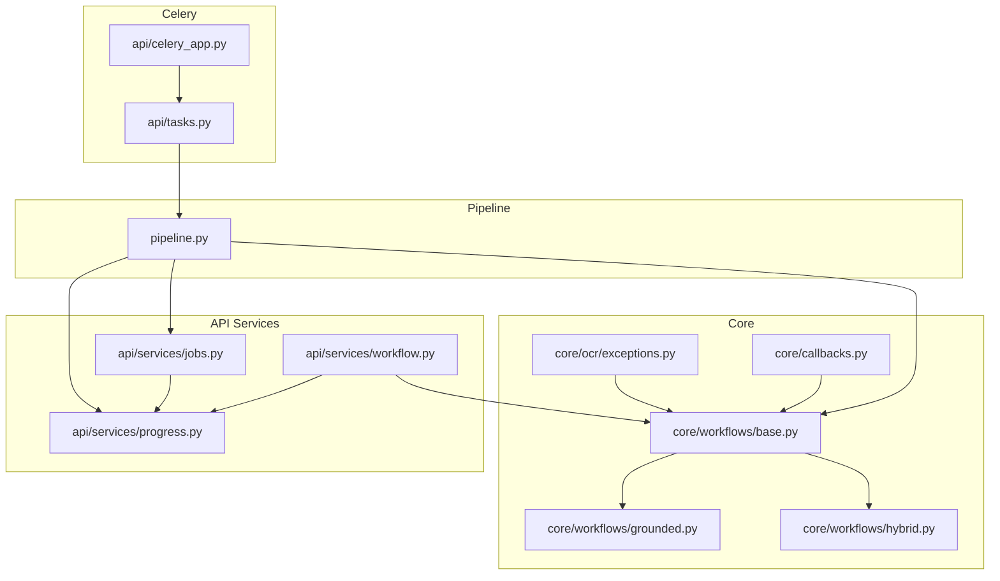
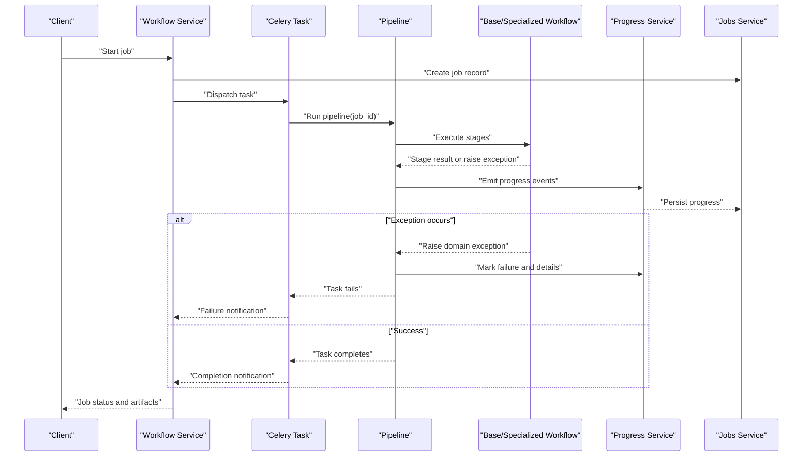
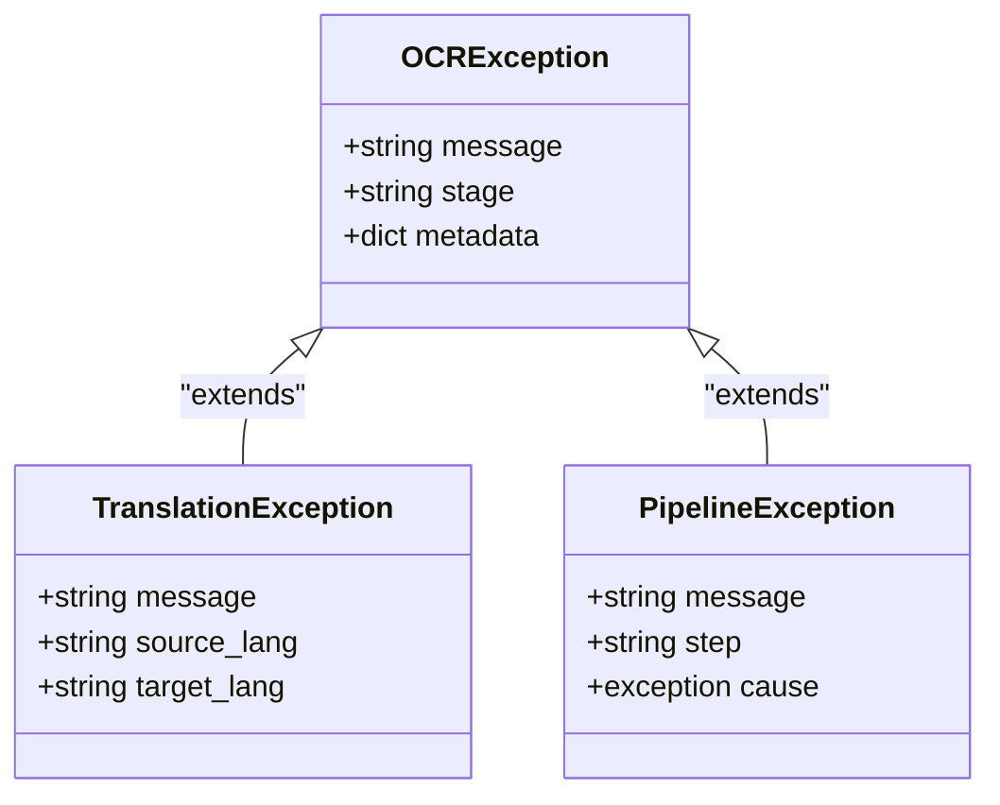
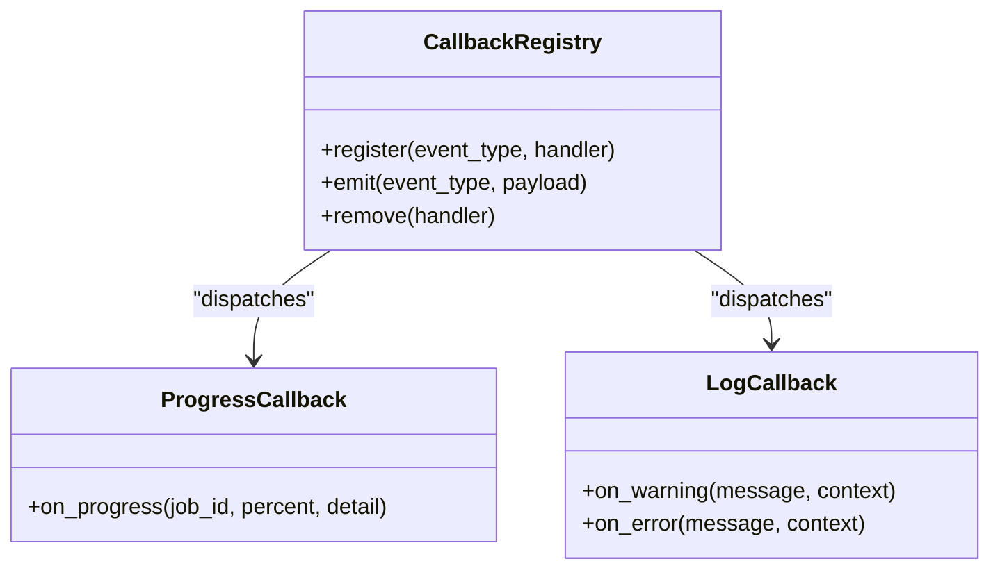
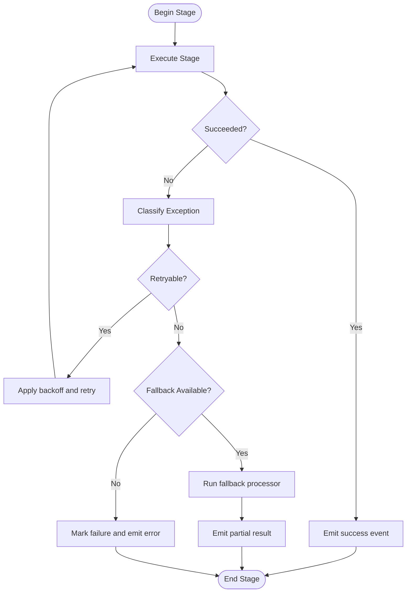
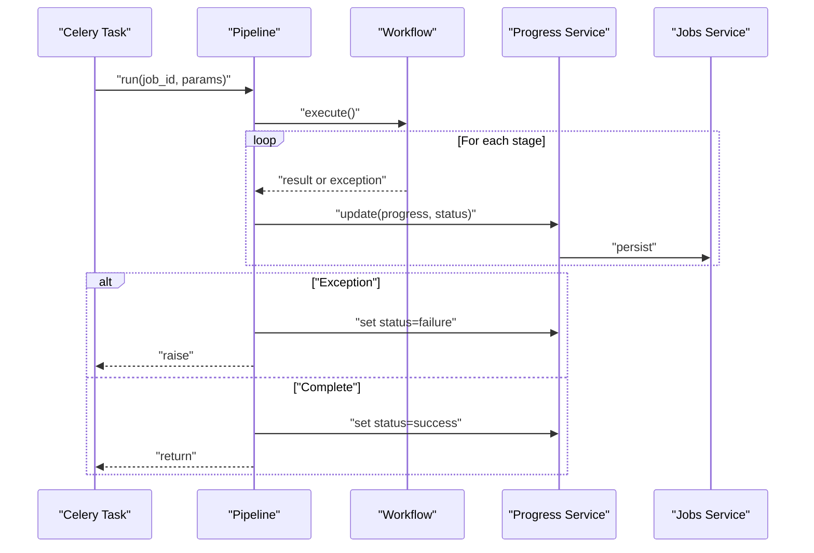
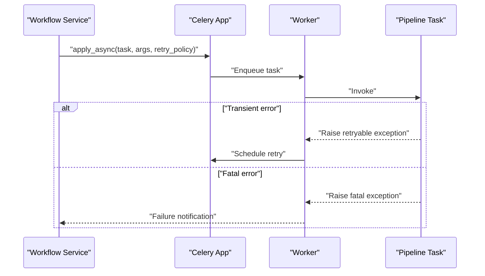
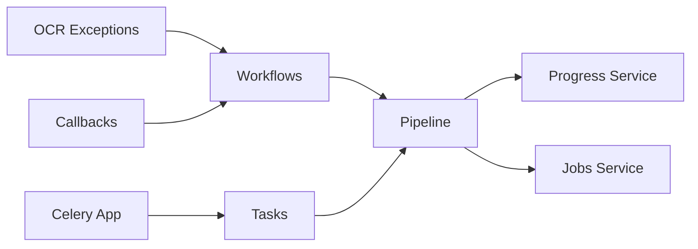

# Error Handling and Recovery

<cite>
**Referenced Files in This Document**
- [exceptions.py](file://src/local_deepl/core/ocr/exceptions.py)
- [callbacks.py](file://src/local_deepl/core/callbacks.py)
- [pipeline.py](file://src/local_deepl/pipeline.py)
- [tasks.py](file://src/local_deepl/api/tasks.py)
- [celery_app.py](file://src/local_deepl/api/celery_app.py)
- [progress.py](file://src/local_deepl/api/services/progress.py)
- [jobs.py](file://src/local_deepl/api/services/jobs.py)
- [workflow.py](file://src/local_deepl/api/services/workflow.py)
- [base.py](file://src/local_deepl/core/workflows/base.py)
- [grounded.py](file://src/local_deepl/core/workflows/grounded.py)
- [hybrid.py](file://src/local_deepl/core/workflows/hybrid.py)
- [translation_callbacks.py](file://tests/test_translation_callbacks.py)
- [test_workflows_callback_decoupling.py](file://tests/test_workflows_callback_decoupling.py)
</cite>

## Table of Contents
1. [Introduction](#introduction)
2. [Project Structure](#project-structure)
3. [Core Components](#core-components)
4. [Architecture Overview](#architecture-overview)
5. [Detailed Component Analysis](#detailed-component-analysis)
6. [Dependency Analysis](#dependency-analysis)
7. [Performance Considerations](#performance-considerations)
8. [Troubleshooting Guide](#troubleshooting-guide)
9. [Conclusion](#conclusion)

## Introduction
This document explains the error handling and recovery mechanisms across the processing pipeline. It covers exception types, retry strategies, fallback processors, graceful degradation patterns, callback systems for monitoring and logging, progress tracking during failures, and recovery procedures for interrupted jobs. The goal is to help developers and operators understand how errors are raised, propagated, retried, and observed throughout the system.

## Project Structure
The error handling and recovery features span several layers:
- Core OCR exceptions and callbacks
- Pipeline orchestration and workflow execution
- API services for job management, progress reporting, and Celery task configuration
- Tests validating callback behavior and decoupling

**Diagram sources**
- [exceptions.py](file://src/local_deepl/core/ocr/exceptions.py)
- [callbacks.py](file://src/local_deepl/core/callbacks.py)
- [base.py](file://src/local_deepl/core/workflows/base.py)
- [grounded.py](file://src/local_deepl/core/workflows/grounded.py)
- [hybrid.py](file://src/local_deepl/core/workflows/hybrid.py)
- [pipeline.py](file://src/local_deepl/pipeline.py)
- [jobs.py](file://src/local_deepl/api/services/jobs.py)
- [progress.py](file://src/local_deepl/api/services/progress.py)
- [workflow.py](file://src/local_deepl/api/services/workflow.py)
- [celery_app.py](file://src/local_deepl/api/celery_app.py)
- [tasks.py](file://src/local_deepl/api/tasks.py)

**Section sources**
- [exceptions.py](file://src/local_deepl/core/ocr/exceptions.py)
- [callbacks.py](file://src/local_deepl/core/callbacks.py)
- [pipeline.py](file://src/local_deepl/pipeline.py)
- [tasks.py](file://src/local_deepl/api/tasks.py)
- [celery_app.py](file://src/local_deepl/api/celery_app.py)
- [progress.py](file://src/local_deepl/api/services/progress.py)
- [jobs.py](file://src/local_deepl/api/services/jobs.py)
- [workflow.py](file://src/local_deepl/api/services/workflow.py)
- [base.py](file://src/local_deepl/core/workflows/base.py)
- [grounded.py](file://src/local_deepl/core/workflows/grounded.py)
- [hybrid.py](file://src/local_deepl/core/workflows/hybrid.py)

## Core Components
- Exception taxonomy: Domain-specific exceptions for OCR and translation stages enable precise error classification and targeted retries or fallbacks.
- Callbacks: Event-driven hooks allow observers to track progress, log diagnostics, and react to failures without coupling to core logic.
- Workflows: Base and specialized workflows encapsulate stage execution, error propagation, and optional fallback paths.
- Pipeline: Orchestrates end-to-end processing, integrates with Celery tasks, and coordinates job state and progress updates.
- API services: Provide job lifecycle management, progress aggregation, and workflow invocation with robust error handling.
- Celery integration: Centralized app configuration and task wiring support retries and failure notifications.

**Section sources**
- [exceptions.py](file://src/local_deepl/core/ocr/exceptions.py)
- [callbacks.py](file://src/local_deepl/core/callbacks.py)
- [base.py](file://src/local_deepl/core/workflows/base.py)
- [pipeline.py](file://src/local_deepl/pipeline.py)
- [jobs.py](file://src/local_deepl/api/services/jobs.py)
- [progress.py](file://src/local_deepl/api/services/progress.py)
- [workflow.py](file://src/local_deepl/api/services/workflow.py)
- [celery_app.py](file://src/local_deepl/api/celery_app.py)
- [tasks.py](file://src/local_deepl/api/tasks.py)

## Architecture Overview
The pipeline executes a sequence of stages (preprocessing, OCR, grounding, translation, postprocessing). Errors can occur at any stage; they are captured by workflows, reported via callbacks, and surfaced through API services. Celery tasks wrap long-running operations, enabling retries and background progress updates.

**Diagram sources**
- [workflow.py](file://src/local_deepl/api/services/workflow.py)
- [tasks.py](file://src/local_deepl/api/tasks.py)
- [pipeline.py](file://src/local_deepl/pipeline.py)
- [base.py](file://src/local_deepl/core/workflows/base.py)
- [progress.py](file://src/local_deepl/api/services/progress.py)
- [jobs.py](file://src/local_deepl/api/services/jobs.py)

## Detailed Component Analysis

### Exception Types and Classification
- Purpose: Provide granular error categories for OCR, translation, and pipeline stages to guide retries and fallbacks.
- Behavior: Exceptions carry context such as stage name, input identifiers, and optional hints for recovery.
- Usage: Catch specific exceptions at workflow boundaries to decide whether to retry, skip, or degrade gracefully.

**Diagram sources**
- [exceptions.py](file://src/local_deepl/core/ocr/exceptions.py)

**Section sources**
- [exceptions.py](file://src/local_deepl/core/ocr/exceptions.py)

### Callback System for Monitoring and Logging
- Purpose: Decouple observability from core logic by emitting typed events for start, progress, warning, error, and completion.
- Contract: Implementers register handlers that receive event payloads; handlers must not block critical paths.
- Integration: Workflows and pipeline invoke callbacks around stage boundaries and on error transitions.

**Diagram sources**
- [callbacks.py](file://src/local_deepl/core/callbacks.py)

**Section sources**
- [callbacks.py](file://src/local_deepl/core/callbacks.py)
- [test_translation_callbacks.py](file://tests/test_translation_callbacks.py)
- [test_workflows_callback_decoupling.py](file://tests/test_workflows_callback_decoupling.py)

### Workflow Execution and Fallbacks
- Base workflow: Encapsulates stage sequencing, error propagation, and optional fallback selection based on exception type.
- Specialized workflows: Grounded and hybrid variants add domain-specific stages and fallback rules.
- Graceful degradation: On non-fatal errors, workflows may switch to a fallback processor or continue with reduced fidelity while preserving partial results.

**Diagram sources**
- [base.py](file://src/local_deepl/core/workflows/base.py)
- [grounded.py](file://src/local_deepl/core/workflows/grounded.py)
- [hybrid.py](file://src/local_deepl/core/workflows/hybrid.py)

**Section sources**
- [base.py](file://src/local_deepl/core/workflows/base.py)
- [grounded.py](file://src/local_deepl/core/workflows/grounded.py)
- [hybrid.py](file://src/local_deepl/core/workflows/hybrid.py)

### Pipeline Orchestration and Job State
- Responsibilities: Coordinate preprocessing, OCR, grounding, translation, and postprocessing; manage job state; persist progress; handle Celery task lifecycles.
- Error propagation: Catches workflow exceptions, records detailed error context, and emits failure events.
- Recovery: Supports resuming from checkpoints when available and marking jobs recoverable vs terminal.

**Diagram sources**
- [pipeline.py](file://src/local_deepl/pipeline.py)
- [progress.py](file://src/local_deepl/api/services/progress.py)
- [jobs.py](file://src/local_deepl/api/services/jobs.py)

**Section sources**
- [pipeline.py](file://src/local_deepl/pipeline.py)
- [progress.py](file://src/local_deepl/api/services/progress.py)
- [jobs.py](file://src/local_deepl/api/services/jobs.py)

### Celery Configuration and Task Retries
- App configuration: Centralized Celery app setup ensures consistent broker/backend settings and default behaviors.
- Task wiring: Long-running pipeline execution is wrapped in a Celery task to leverage built-in retries and worker isolation.
- Retry policy: Tasks can be configured with exponential backoff and max attempts; transient errors trigger automatic retries.

**Diagram sources**
- [celery_app.py](file://src/local_deepl/api/celery_app.py)
- [tasks.py](file://src/local_deepl/api/tasks.py)

**Section sources**
- [celery_app.py](file://src/local_deepl/api/celery_app.py)
- [tasks.py](file://src/local_deepl/api/tasks.py)

## Dependency Analysis
- Low coupling: Callbacks are registered separately from core workflows, allowing independent evolution of observability.
- Clear boundaries: Exceptions define contracts between stages; workflows catch and classify them to decide retry/fallback.
- External integrations: Celery provides reliable task scheduling and retries; API services coordinate persistence and user-facing status.

**Diagram sources**
- [exceptions.py](file://src/local_deepl/core/ocr/exceptions.py)
- [callbacks.py](file://src/local_deepl/core/callbacks.py)
- [base.py](file://src/local_deepl/core/workflows/base.py)
- [pipeline.py](file://src/local_deepl/pipeline.py)
- [progress.py](file://src/local_deepl/api/services/progress.py)
- [jobs.py](file://src/local_deepl/api/services/jobs.py)
- [celery_app.py](file://src/local_deepl/api/celery_app.py)
- [tasks.py](file://src/local_deepl/api/tasks.py)

**Section sources**
- [exceptions.py](file://src/local_deepl/core/ocr/exceptions.py)
- [callbacks.py](file://src/local_deepl/core/callbacks.py)
- [base.py](file://src/local_deepl/core/workflows/base.py)
- [pipeline.py](file://src/local_deepl/pipeline.py)
- [progress.py](file://src/local_deepl/api/services/progress.py)
- [jobs.py](file://src/local_deepl/api/services/jobs.py)
- [celery_app.py](file://src/local_deepl/api/celery_app.py)
- [tasks.py](file://src/local_deepl/api/tasks.py)

## Performance Considerations
- Avoid blocking callbacks: Keep handlers lightweight and asynchronous-friendly to prevent pipeline stalls.
- Tune retries: Use bounded retry counts and exponential backoff to mitigate cascading failures under load.
- Partial results: Favor graceful degradation that preserves intermediate outputs to reduce rework after transient errors.
- Progress granularity: Emit frequent but concise progress updates to improve responsiveness without excessive overhead.

[No sources needed since this section provides general guidance]

## Troubleshooting Guide
Common issues and resolutions:
- Transient network or service timeouts during OCR or translation:
  - Ensure retry policies are enabled and backoff is configured.
  - Check worker logs for retry attempts and adjust max retries if necessary.
- Non-retryable validation or parsing errors:
  - Inspect exception metadata for stage and input identifiers.
  - Validate inputs and consider fallback processors where supported.
- Missing or unregistered callbacks:
  - Verify callback registration before starting jobs.
  - Confirm handlers do not raise unhandled exceptions.
- Stalled or incomplete jobs:
  - Review persisted progress and job state for last successful checkpoint.
  - Resume from checkpoint if supported; otherwise, restart with degraded mode.

**Section sources**
- [exceptions.py](file://src/local_deepl/core/ocr/exceptions.py)
- [callbacks.py](file://src/local_deepl/core/callbacks.py)
- [pipeline.py](file://src/local_deepl/pipeline.py)
- [progress.py](file://src/local_deepl/api/services/progress.py)
- [jobs.py](file://src/local_deepl/api/services/jobs.py)
- [celery_app.py](file://src/local_deepl/api/celery_app.py)
- [tasks.py](file://src/local_deepl/api/tasks.py)

## Conclusion
The system employs a layered approach to error handling and recovery: well-defined exceptions, decoupled callbacks, resilient workflows with fallbacks, and Celery-backed retries. Together, these mechanisms provide robustness, observability, and graceful degradation across the entire processing pipeline.