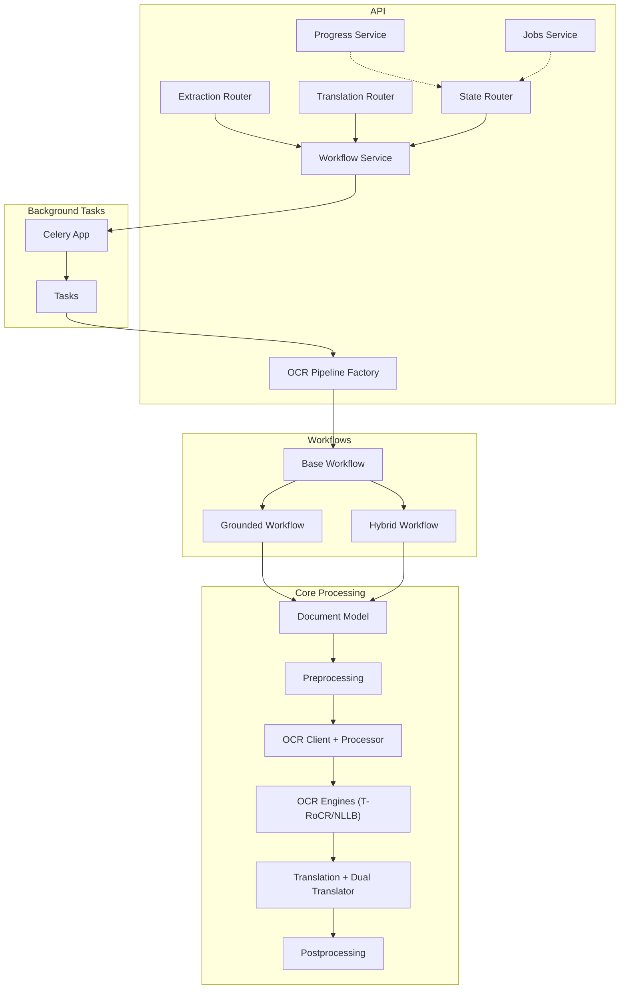
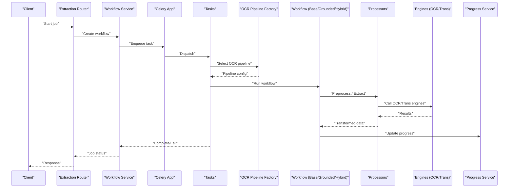
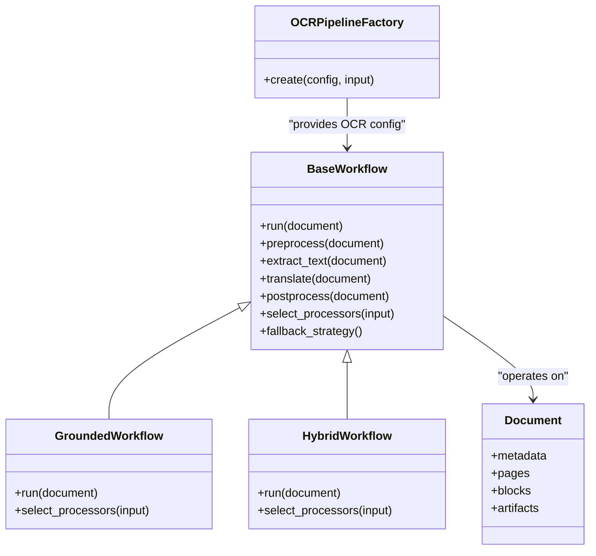
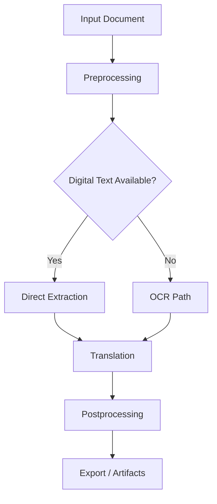
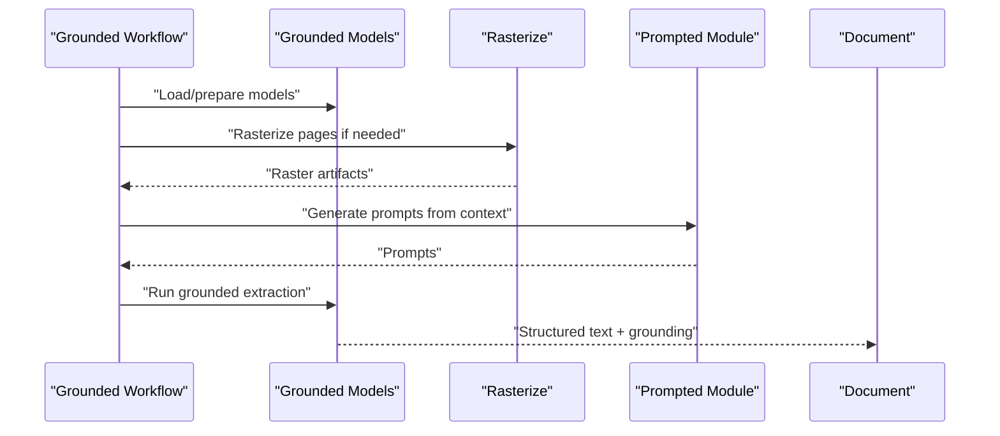
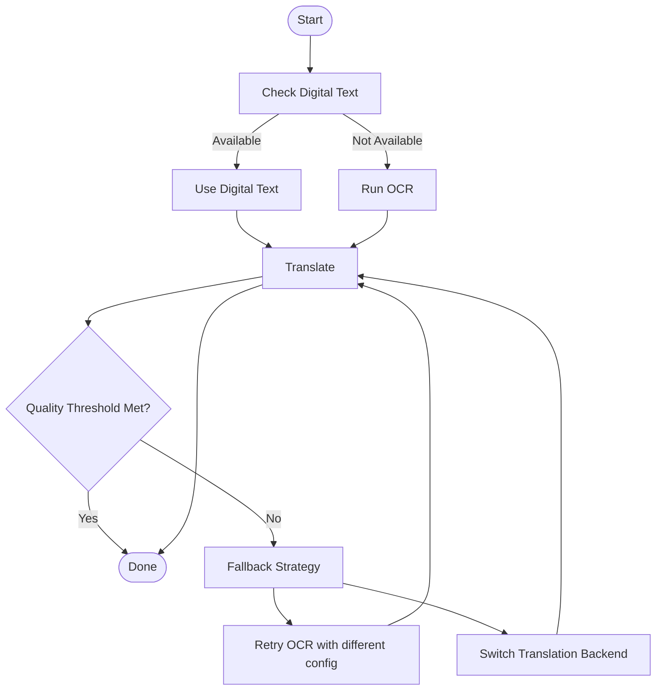
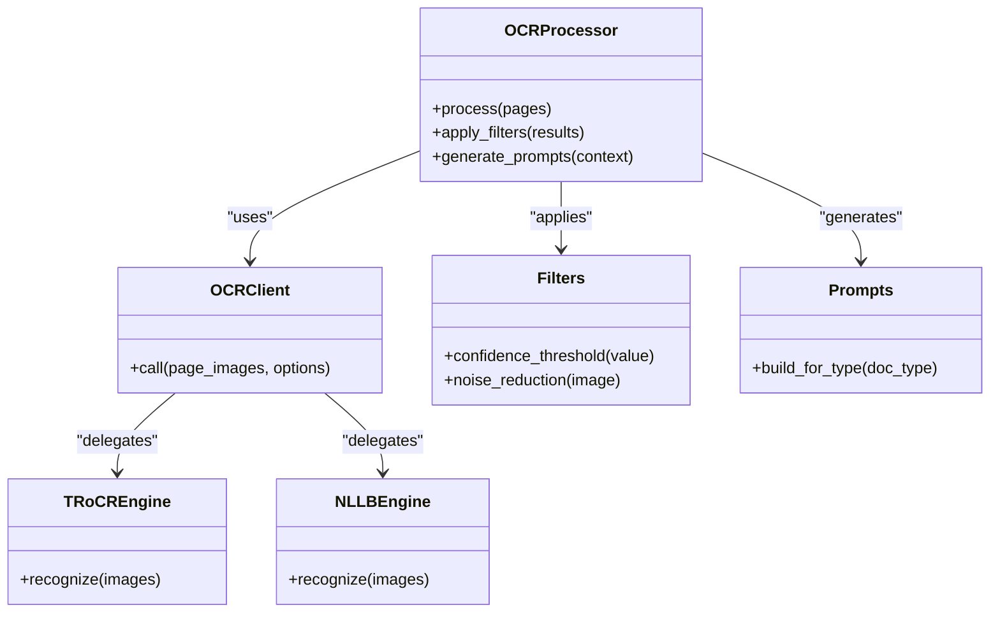
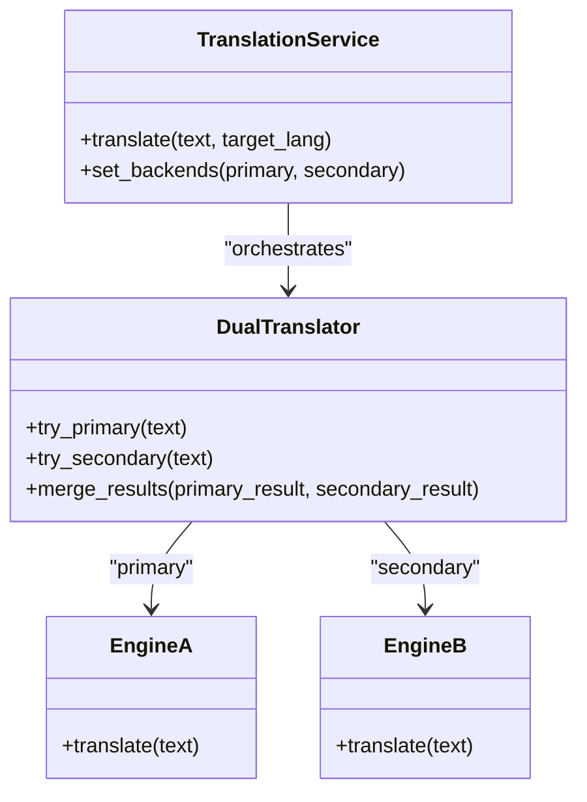
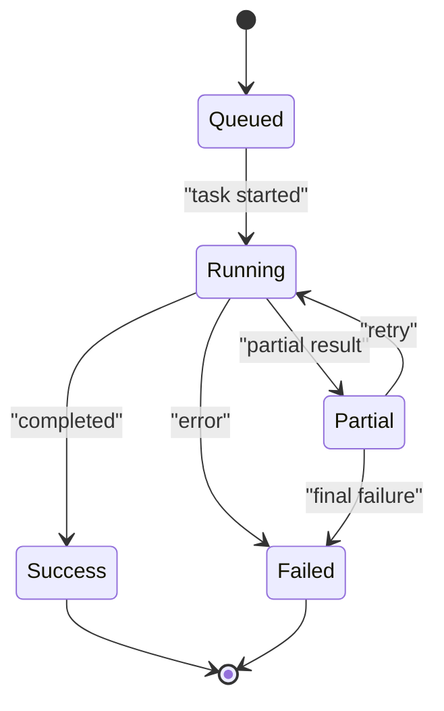
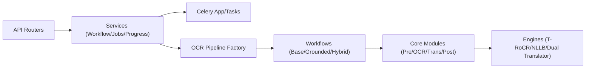

# Processing Pipeline Flow

<cite>
**Referenced Files in This Document**
- [pipeline.py](file://src/local_deepl/pipeline.py)
- [server.py](file://src/local_deepl/server.py)
- [tasks.py](file://src/local_deepl/api/tasks.py)
- [celery_app.py](file://src/local_deepl/api/celery_app.py)
- [workflow.py](file://src/local_deepl/api/services/workflow.py)
- [ocr_pipeline_factory.py](file://src/local_deepl/api/services/ocr_pipeline_factory.py)
- [base.py](file://src/local_deepl/core/workflows/base.py)
- [grounded.py](file://src/local_deepl/core/workflows/grounded.py)
- [hybrid.py](file://src/local_deepl/core/workflows/hybrid.py)
- [document.py](file://src/local_deepl/core/document.py)
- [processors.py](file://src/local_deepl/core/processors.py)
- [preprocessing.py](file://src/local_deepl/core/preprocessing.py)
- [postprocess.py](file://src/local_deepl/core/postprocess.py)
- [translation.py](file://src/local_deepl/core/translation.py)
- [dual_translator.py](file://src/local_deepl/core/dual_translator.py)
- [nllb_engine.py](file://src/local_deepl/core/nllb_engine.py)
- [trocr_engine.py](file://src/local_deepl/core/trocr_engine.py)
- [client.py](file://src/local_deepl/core/ocr/client.py)
- [processor.py](file://src/local_deepl/core/ocr/processor.py)
- [filters.py](file://src/local_deepl/core/ocr/filters.py)
- [prompts.py](file://src/local_deepl/core/ocr/prompts.py)
- [models.py](file://src/local_deepl/core/grounded/models.py)
- [rasterize.py](file://src/local_deepl/core/grounded/rasterize.py)
- [prompted.py](file://src/local_deepl/core/grounded/prompted.py)
- [progress.py](file://src/local_deepl/api/services/progress.py)
- [jobs.py](file://src/local_deepl/api/services/jobs.py)
- [extraction.py](file://src/local_deepl/api/routers/extraction.py)
- [translation_router.py](file://src/local_deepl/api/routers/translation.py)
- [state.py](file://src/local_deepl/api/routers/state.py)
</cite>

## Table of Contents
1. [Introduction](#introduction)
2. [Project Structure](#project-structure)
3. [Core Components](#core-components)
4. [Architecture Overview](#architecture-overview)
5. [Detailed Component Analysis](#detailed-component-analysis)
6. [Dependency Analysis](#dependency-analysis)
7. [Performance Considerations](#performance-considerations)
8. [Troubleshooting Guide](#troubleshooting-guide)
9. [Conclusion](#conclusion)

## Introduction
This document explains the end-to-end processing pipeline for documents, covering ingestion, OCR, text extraction, translation, and post-processing. It details how workflow orchestration selects processors, transforms data between stages, and manages state transitions with error recovery. It also covers grounded text extraction, hybrid processing strategies, fallback mechanisms, parallel execution, and resource management during intensive operations.

## Project Structure
The pipeline spans API entry points, background task orchestration, workflow definitions, and core processing modules:
- API layer exposes endpoints to start jobs, query progress, and retrieve results.
- Background tasks coordinate long-running work via a Celery app.
- Workflow base classes define common behavior; concrete workflows implement grounded and hybrid strategies.
- Core modules implement OCR engines, translation backends, preprocessing, and postprocessing.

**Diagram sources**
- [extraction.py](file://src/local_deepl/api/routers/extraction.py)
- [translation_router.py](file://src/local_deepl/api/routers/translation.py)
- [state.py](file://src/local_deepl/api/routers/state.py)
- [workflow.py](file://src/local_deepl/api/services/workflow.py)
- [ocr_pipeline_factory.py](file://src/local_deepl/api/services/ocr_pipeline_factory.py)
- [progress.py](file://src/local_deepl/api/services/progress.py)
- [jobs.py](file://src/local_deepl/api/services/jobs.py)
- [celery_app.py](file://src/local_deepl/api/celery_app.py)
- [tasks.py](file://src/local_deepl/api/tasks.py)
- [base.py](file://src/local_deepl/core/workflows/base.py)
- [grounded.py](file://src/local_deepl/core/workflows/grounded.py)
- [hybrid.py](file://src/local_deepl/core/workflows/hybrid.py)
- [document.py](file://src/local_deepl/core/document.py)
- [preprocessing.py](file://src/local_deepl/core/preprocessing.py)
- [client.py](file://src/local_deepl/core/ocr/client.py)
- [processor.py](file://src/local_deepl/core/ocr/processor.py)
- [trocr_engine.py](file://src/local_deepl/core/trocr_engine.py)
- [nllb_engine.py](file://src/local_deepl/core/nllb_engine.py)
- [translation.py](file://src/local_deepl/core/translation.py)
- [dual_translator.py](file://src/local_deepl/core/dual_translator.py)
- [postprocess.py](file://src/local_deepl/core/postprocess.py)

**Section sources**
- [server.py](file://src/local_deepl/server.py)
- [extraction.py](file://src/local_deepl/api/routers/extraction.py)
- [translation_router.py](file://src/local_deepl/api/routers/translation.py)
- [state.py](file://src/local_deepl/api/routers/state.py)
- [workflow.py](file://src/local_deepl/api/services/workflow.py)
- [ocr_pipeline_factory.py](file://src/local_deepl/api/services/ocr_pipeline_factory.py)
- [celery_app.py](file://src/local_deepl/api/celery_app.py)
- [tasks.py](file://src/local_deepl/api/tasks.py)
- [base.py](file://src/local_deepl/core/workflows/base.py)
- [grounded.py](file://src/local_deepl/core/workflows/grounded.py)
- [hybrid.py](file://src/local_deepl/core/workflows/hybrid.py)
- [document.py](file://src/local_deepl/core/document.py)
- [preprocessing.py](file://src/local_deepl/core/preprocessing.py)
- [client.py](file://src/local_deepl/core/ocr/client.py)
- [processor.py](file://src/local_deepl/core/ocr/processor.py)
- [trocr_engine.py](file://src/local_deepl/core/trocr_engine.py)
- [nllb_engine.py](file://src/local_deepl/core/nllb_engine.py)
- [translation.py](file://src/local_deepl/core/translation.py)
- [dual_translator.py](file://src/local_deepl/core/dual_translator.py)
- [postprocess.py](file://src/local_deepl/core/postprocess.py)

## Core Components
- Document model: central representation carrying metadata, pages, blocks, and intermediate artifacts across stages.
- Preprocessing: prepares inputs (e.g., image normalization, layout analysis) for OCR or direct text extraction.
- OCR subsystem: client abstraction, processor orchestration, filters, prompts, and engine integrations (T-RoCR, NLLB).
- Translation subsystem: unified translator interface, dual translator strategy, and backend engines.
- Postprocessing: dictionary lookups, formatting, alignment, and export helpers.
- Workflows: base orchestrator plus grounded and hybrid strategies that select processors and manage fallbacks.
- Orchestration services: workflow service, OCR pipeline factory, progress tracking, and job persistence.
- Background tasks: Celery-based execution for long-running steps.

**Section sources**
- [document.py](file://src/local_deepl/core/document.py)
- [preprocessing.py](file://src/local_deepl/core/preprocessing.py)
- [client.py](file://src/local_deepl/core/ocr/client.py)
- [processor.py](file://src/local_deepl/core/ocr/processor.py)
- [filters.py](file://src/local_deepl/core/ocr/filters.py)
- [prompts.py](file://src/local_deepl/core/ocr/prompts.py)
- [trocr_engine.py](file://src/local_deepl/core/trocr_engine.py)
- [nllb_engine.py](file://src/local_deepl/core/nllb_engine.py)
- [translation.py](file://src/local_deepl/core/translation.py)
- [dual_translator.py](file://src/local_deepl/core/dual_translator.py)
- [postprocess.py](file://src/local_deepl/core/postprocess.py)
- [base.py](file://src/local_deepl/core/workflows/base.py)
- [grounded.py](file://src/local_deepl/core/workflows/grounded.py)
- [hybrid.py](file://src/local_deepl/core/workflows/hybrid.py)
- [workflow.py](file://src/local_deepl/api/services/workflow.py)
- [ocr_pipeline_factory.py](file://src/local_deepl/api/services/ocr_pipeline_factory.py)
- [progress.py](file://src/local_deepl/api/services/progress.py)
- [jobs.py](file://src/local_deepl/api/services/jobs.py)
- [celery_app.py](file://src/local_deepl/api/celery_app.py)
- [tasks.py](file://src/local_deepl/api/tasks.py)

## Architecture Overview
The system follows a layered architecture:
- API layer routes requests to services.
- Services orchestrate workflows and track progress.
- Workflows encapsulate stage logic and selection rules.
- Core modules implement domain-specific processing.
- Celery executes heavy tasks asynchronously.

**Diagram sources**
- [extraction.py](file://src/local_deepl/api/routers/extraction.py)
- [workflow.py](file://src/local_deepl/api/services/workflow.py)
- [celery_app.py](file://src/local_deepl/api/celery_app.py)
- [tasks.py](file://src/local_deepl/api/tasks.py)
- [ocr_pipeline_factory.py](file://src/local_deepl/api/services/ocr_pipeline_factory.py)
- [base.py](file://src/local_deepl/core/workflows/base.py)
- [grounded.py](file://src/local_deepl/core/workflows/grounded.py)
- [hybrid.py](file://src/local_deepl/core/workflows/hybrid.py)
- [progress.py](file://src/local_deepl/api/services/progress.py)

## Detailed Component Analysis

### Workflow Orchestration and Processor Selection
- Base workflow defines lifecycle hooks and shared utilities for stages such as preprocessing, OCR, translation, and postprocessing.
- Concrete workflows implement selection logic:
  - Grounded workflow emphasizes structured, grounded extraction using models and rasterization aids.
  - Hybrid workflow combines multiple strategies (e.g., digital text path and OCR path) with fallbacks based on confidence or availability.
- The OCR pipeline factory chooses an OCR configuration based on input characteristics and runtime settings.

**Diagram sources**
- [base.py](file://src/local_deepl/core/workflows/base.py)
- [grounded.py](file://src/local_deepl/core/workflows/grounded.py)
- [hybrid.py](file://src/local_deepl/core/workflows/hybrid.py)
- [ocr_pipeline_factory.py](file://src/local_deepl/api/services/ocr_pipeline_factory.py)
- [document.py](file://src/local_deepl/core/document.py)

**Section sources**
- [base.py](file://src/local_deepl/core/workflows/base.py)
- [grounded.py](file://src/local_deepl/core/workflows/grounded.py)
- [hybrid.py](file://src/local_deepl/core/workflows/hybrid.py)
- [ocr_pipeline_factory.py](file://src/local_deepl/api/services/ocr_pipeline_factory.py)

### Data Transformation Across Stages
- Preprocessing normalizes images, extracts layout hints, and prepares page-level structures for downstream consumers.
- OCR stage converts visual content into machine-readable text, optionally producing bounding boxes and confidence scores.
- Translation stage applies language conversion using configured backends, preserving structure where possible.
- Postprocessing refines output by applying dictionaries, aligning segments, and preparing exports.

[No sources needed since this diagram shows conceptual workflow, not actual code structure]

**Section sources**
- [preprocessing.py](file://src/local_deepl/core/preprocessing.py)
- [client.py](file://src/local_deepl/core/ocr/client.py)
- [processor.py](file://src/local_deepl/core/ocr/processor.py)
- [translation.py](file://src/local_deepl/core/translation.py)
- [postprocess.py](file://src/local_deepl/core/postprocess.py)

### Grounded Text Extraction Pipeline
Grounded extraction leverages specialized models and rasterization to produce structured, verifiable text with grounding information.

**Diagram sources**
- [grounded.py](file://src/local_deepl/core/workflows/grounded.py)
- [models.py](file://src/local_deepl/core/grounded/models.py)
- [rasterize.py](file://src/local_deepl/core/grounded/rasterize.py)
- [prompted.py](file://src/local_deepl/core/grounded/prompted.py)
- [document.py](file://src/local_deepl/core/document.py)

**Section sources**
- [grounded.py](file://src/local_deepl/core/workflows/grounded.py)
- [models.py](file://src/local_deepl/core/grounded/models.py)
- [rasterize.py](file://src/local_deepl/core/grounded/rasterize.py)
- [prompted.py](file://src/local_deepl/core/grounded/prompted.py)

### Hybrid Processing Approaches and Fallbacks
Hybrid strategy attempts multiple paths:
- Prefer fast digital text extraction when available.
- Fall back to OCR when digital text is missing or low quality.
- Use translation backends in parallel or sequentially depending on performance and reliability signals.

[No sources needed since this diagram shows conceptual workflow, not actual code structure]

**Section sources**
- [hybrid.py](file://src/local_deepl/core/workflows/hybrid.py)
- [ocr_pipeline_factory.py](file://src/local_deepl/api/services/ocr_pipeline_factory.py)
- [dual_translator.py](file://src/local_deepl/core/dual_translator.py)

### OCR Subsystem: Client, Processor, Filters, Prompts, and Engines
- Client abstracts communication with OCR providers or local engines.
- Processor coordinates filtering, prompt generation, and engine invocation.
- Filters refine raw outputs (e.g., noise removal, confidence thresholds).
- Prompts tailor OCR behavior for specific document types.
- Engines include T-RoCR and NLLB-based approaches.

**Diagram sources**
- [client.py](file://src/local_deepl/core/ocr/client.py)
- [processor.py](file://src/local_deepl/core/ocr/processor.py)
- [filters.py](file://src/local_deepl/core/ocr/filters.py)
- [prompts.py](file://src/local_deepl/core/ocr/prompts.py)
- [trocr_engine.py](file://src/local_deepl/core/trocr_engine.py)
- [nllb_engine.py](file://src/local_deepl/core/nllb_engine.py)

**Section sources**
- [client.py](file://src/local_deepl/core/ocr/client.py)
- [processor.py](file://src/local_deepl/core/ocr/processor.py)
- [filters.py](file://src/local_deepl/core/ocr/filters.py)
- [prompts.py](file://src/local_deepl/core/ocr/prompts.py)
- [trocr_engine.py](file://src/local_deepl/core/trocr_engine.py)
- [nllb_engine.py](file://src/local_deepl/core/nllb_engine.py)

### Translation Subsystem: Unified Interface and Dual Translator
- Translation module provides a consistent API over multiple backends.
- Dual translator coordinates primary and secondary engines, enabling fallback and load balancing.
- Engines may be local or remote, selected at runtime.

**Diagram sources**
- [translation.py](file://src/local_deepl/core/translation.py)
- [dual_translator.py](file://src/local_deepl/core/dual_translator.py)

**Section sources**
- [translation.py](file://src/local_deepl/core/translation.py)
- [dual_translator.py](file://src/local_deepl/core/dual_translator.py)

### State Management and Progress Tracking
- Jobs service persists job metadata and lifecycle states.
- Progress service emits incremental updates consumed by state routers and clients.
- State router exposes current status and history.

**Diagram sources**
- [jobs.py](file://src/local_deepl/api/services/jobs.py)
- [progress.py](file://src/local_deepl/api/services/progress.py)
- [state.py](file://src/local_deepl/api/routers/state.py)

**Section sources**
- [jobs.py](file://src/local_deepl/api/services/jobs.py)
- [progress.py](file://src/local_deepl/api/services/progress.py)
- [state.py](file://src/local_deepl/api/routers/state.py)

## Dependency Analysis
Key dependency relationships:
- API routers depend on services for orchestration and persistence.
- Services depend on workflow factories and Celery tasks.
- Workflows depend on core processing modules and engines.
- OCR and translation engines are pluggable through interfaces.

**Diagram sources**
- [extraction.py](file://src/local_deepl/api/routers/extraction.py)
- [translation_router.py](file://src/local_deepl/api/routers/translation.py)
- [state.py](file://src/local_deepl/api/routers/state.py)
- [workflow.py](file://src/local_deepl/api/services/workflow.py)
- [jobs.py](file://src/local_deepl/api/services/jobs.py)
- [progress.py](file://src/local_deepl/api/services/progress.py)
- [ocr_pipeline_factory.py](file://src/local_deepl/api/services/ocr_pipeline_factory.py)
- [base.py](file://src/local_deepl/core/workflows/base.py)
- [grounded.py](file://src/local_deepl/core/workflows/grounded.py)
- [hybrid.py](file://src/local_deepl/core/workflows/hybrid.py)
- [preprocessing.py](file://src/local_deepl/core/preprocessing.py)
- [client.py](file://src/local_deepl/core/ocr/client.py)
- [processor.py](file://src/local_deepl/core/ocr/processor.py)
- [trocr_engine.py](file://src/local_deepl/core/trocr_engine.py)
- [nllb_engine.py](file://src/local_deepl/core/nllb_engine.py)
- [translation.py](file://src/local_deepl/core/translation.py)
- [dual_translator.py](file://src/local_deepl/core/dual_translator.py)
- [postprocess.py](file://src/local_deepl/core/postprocess.py)

**Section sources**
- [extraction.py](file://src/local_deepl/api/routers/extraction.py)
- [translation_router.py](file://src/local_deepl/api/routers/translation.py)
- [state.py](file://src/local_deepl/api/routers/state.py)
- [workflow.py](file://src/local_deepl/api/services/workflow.py)
- [jobs.py](file://src/local_deepl/api/services/jobs.py)
- [progress.py](file://src/local_deepl/api/services/progress.py)
- [ocr_pipeline_factory.py](file://src/local_deepl/api/services/ocr_pipeline_factory.py)
- [base.py](file://src/local_deepl/core/workflows/base.py)
- [grounded.py](file://src/local_deepl/core/workflows/grounded.py)
- [hybrid.py](file://src/local_deepl/core/workflows/hybrid.py)
- [preprocessing.py](file://src/local_deepl/core/preprocessing.py)
- [client.py](file://src/local_deepl/core/ocr/client.py)
- [processor.py](file://src/local_deepl/core/ocr/processor.py)
- [trocr_engine.py](file://src/local_deepl/core/trocr_engine.py)
- [nllb_engine.py](file://src/local_deepl/core/nllb_engine.py)
- [translation.py](file://src/local_deepl/core/translation.py)
- [dual_translator.py](file://src/local_deepl/core/dual_translator.py)
- [postprocess.py](file://src/local_deepl/core/postprocess.py)

## Performance Considerations
- Parallelism:
  - Use Celery workers to run OCR and translation tasks concurrently.
  - Within workflows, consider parallelizing per-page OCR and translation where safe.
- Resource management:
  - Configure batch sizes for OCR and translation to balance throughput and memory usage.
  - Reuse model instances and connection pools for engines.
- Caching:
  - Cache OCR results and translations keyed by content fingerprints to avoid recomputation.
- Backpressure:
  - Apply rate limiting and queue depth controls to prevent worker saturation.
- Monitoring:
  - Emit granular progress events to detect bottlenecks early.

[No sources needed since this section provides general guidance]

## Troubleshooting Guide
Common issues and recovery paths:
- OCR failures:
  - Inspect engine logs and retry with alternative configurations via the OCR pipeline factory.
  - Validate input images and preprocessing parameters.
- Translation errors:
  - Switch to secondary backend using the dual translator.
  - Verify language codes and token limits.
- Job stalls:
  - Check Celery worker health and queue depths.
  - Review progress events for stuck stages.
- Partial results:
  - Enable retries for transient failures and merge partial outputs carefully.

**Section sources**
- [ocr_pipeline_factory.py](file://src/local_deepl/api/services/ocr_pipeline_factory.py)
- [dual_translator.py](file://src/local_deepl/core/dual_translator.py)
- [celery_app.py](file://src/local_deepl/api/celery_app.py)
- [progress.py](file://src/local_deepl/api/services/progress.py)
- [jobs.py](file://src/local_deepl/api/services/jobs.py)

## Conclusion
The pipeline integrates robust orchestration, flexible processor selection, and resilient fallbacks to handle diverse document types. Grounded and hybrid workflows provide complementary strengths, while Celery-backed tasks ensure scalability. Proper monitoring, caching, and resource tuning are essential for high-throughput, reliable operation.