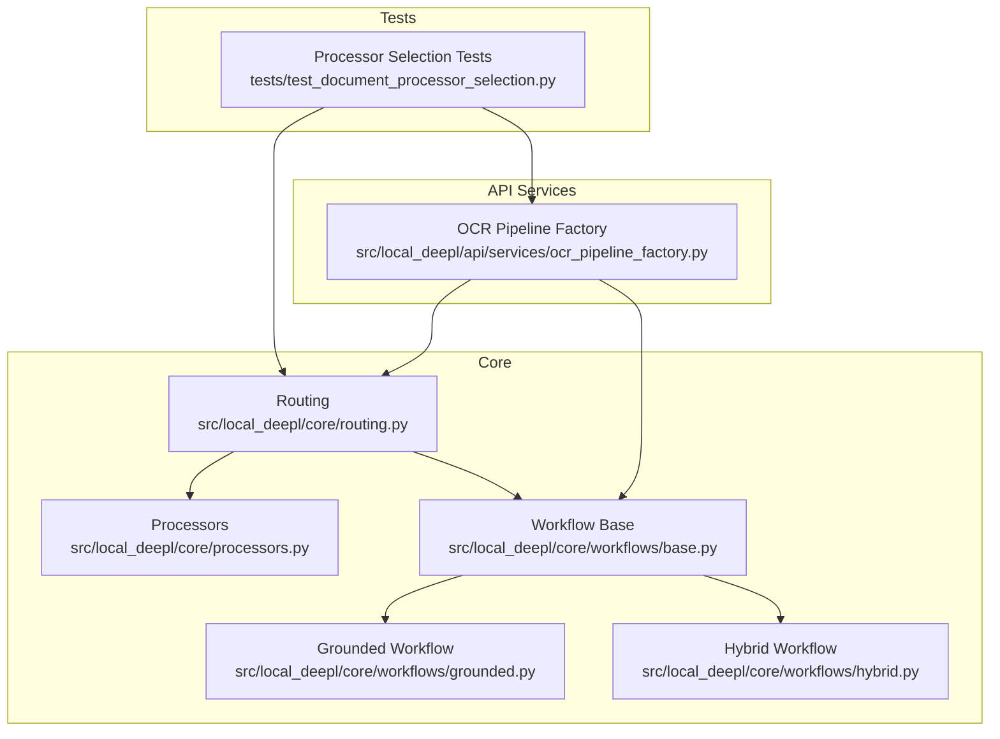
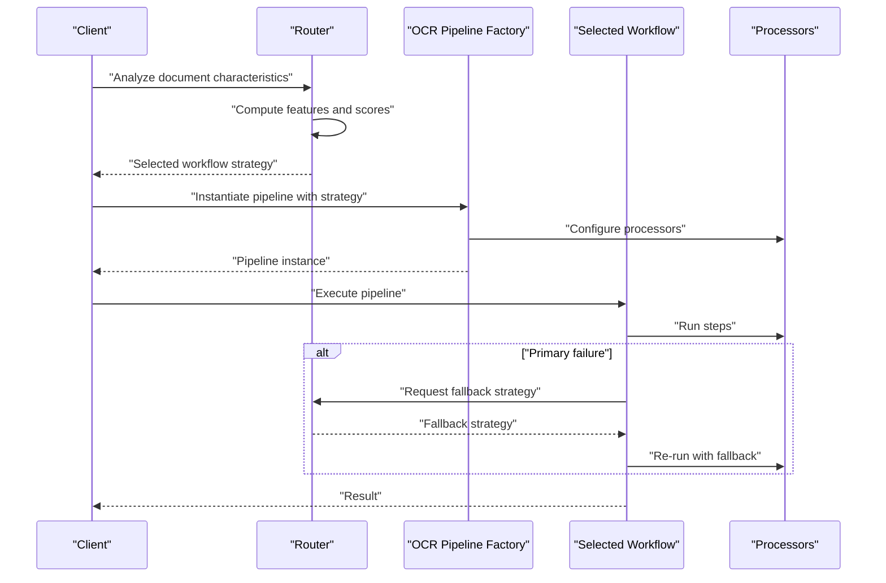
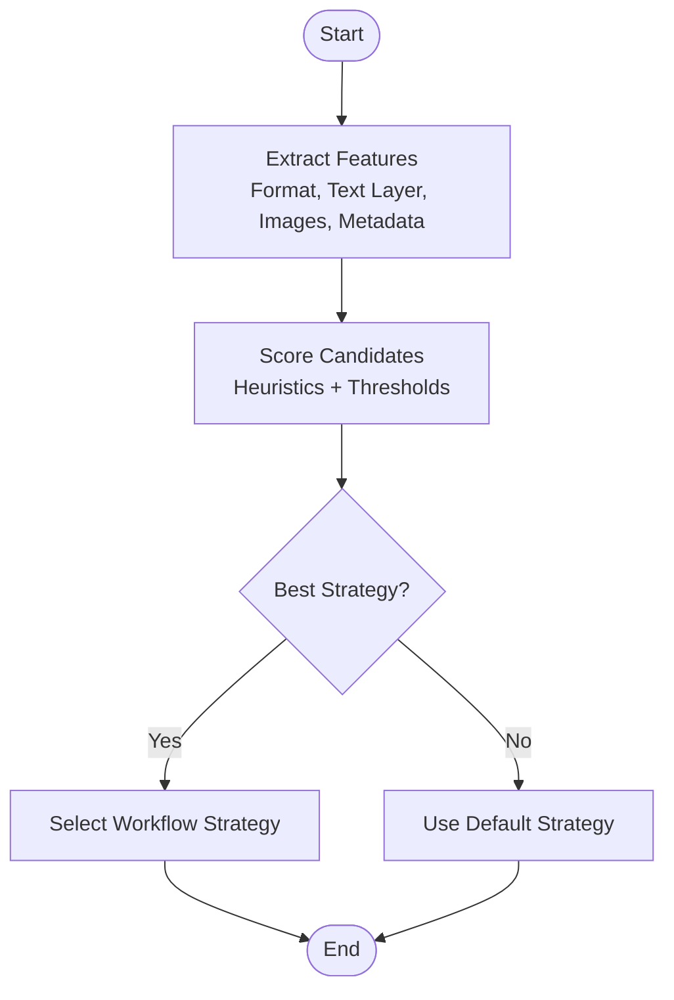
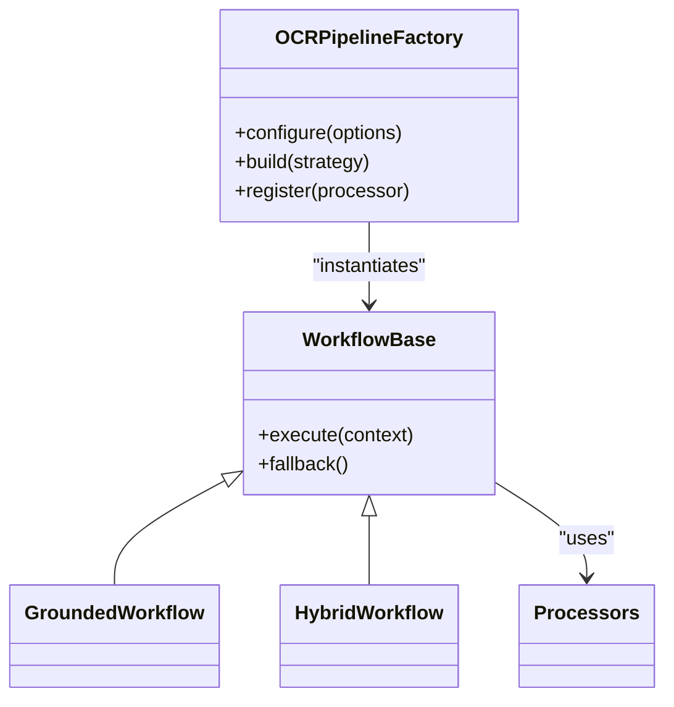
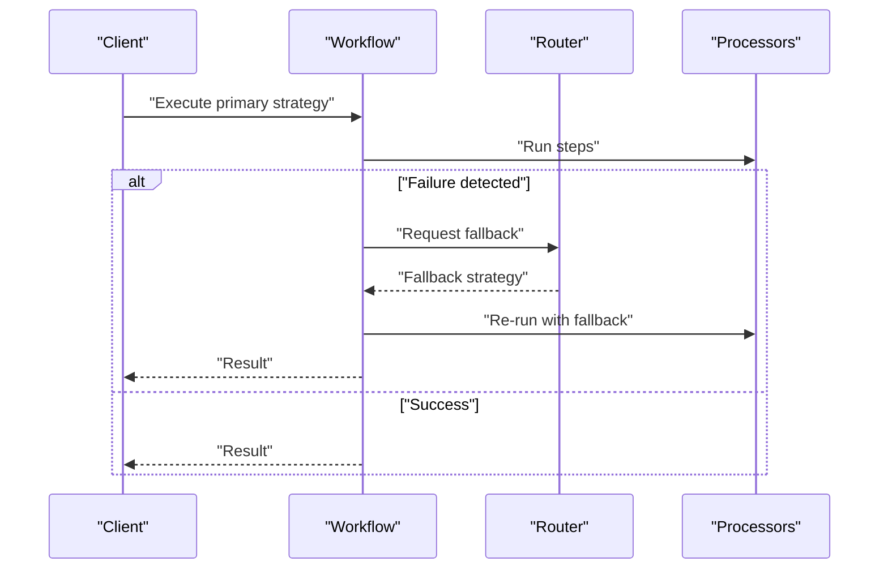
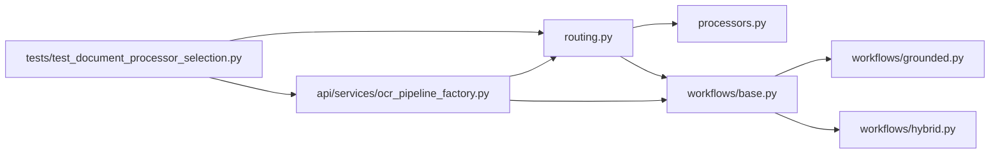

# Processor Selection Logic

<cite>
**Referenced Files in This Document**
- [routing.py](file://src/local_deepl/core/routing.py)
- [processors.py](file://src/local_deepl/core/processors.py)
- [base.py](file://src/local_deepl/core/workflows/base.py)
- [grounded.py](file://src/local_deepl/core/workflows/grounded.py)
- [hybrid.py](file://src/local_deepl/core/workflows/hybrid.py)
- [ocr_pipeline_factory.py](file://src/local_deepl/api/services/ocr_pipeline_factory.py)
- [test_document_processor_selection.py](file://tests/test_document_processor_selection.py)
</cite>

## Table of Contents
1. [Introduction](#introduction)
2. [Project Structure](#project-structure)
3. [Core Components](#core-components)
4. [Architecture Overview](#architecture-overview)
5. [Detailed Component Analysis](#detailed-component-analysis)
6. [Dependency Analysis](#dependency-analysis)
7. [Performance Considerations](#performance-considerations)
8. [Troubleshooting Guide](#troubleshooting-guide)
9. [Conclusion](#conclusion)
10. [Appendices](#appendices)

## Introduction
This document explains the intelligent processor selection system that analyzes document characteristics to determine the optimal processing pipeline. It covers routing logic, factory patterns for processor instantiation, and fallback mechanisms when primary processors fail. It also provides configuration examples for custom processor registration and selection criteria tuning.

## Project Structure
The processor selection logic spans core modules (document analysis, routing, workflow orchestration) and API services (pipeline factory). Tests validate behavior and edge cases.

**Diagram sources**
- [routing.py:1-200](file://src/local_deepl/core/routing.py#L1-L200)
- [processors.py:1-200](file://src/local_deepl/core/processors.py#L1-L200)
- [base.py:1-200](file://src/local_deepl/core/workflows/base.py#L1-L200)
- [grounded.py:1-200](file://src/local_deepl/core/workflows/grounded.py#L1-L200)
- [hybrid.py:1-200](file://src/local_deepl/core/workflows/hybrid.py#L1-L200)
- [ocr_pipeline_factory.py:1-200](file://src/local_deepl/api/services/ocr_pipeline_factory.py#L1-L200)
- [test_document_processor_selection.py:1-200](file://tests/test_document_processor_selection.py#L1-L200)

**Section sources**
- [routing.py:1-200](file://src/local_deepl/core/routing.py#L1-L200)
- [processors.py:1-200](file://src/local_deepl/core/processors.py#L1-L200)
- [base.py:1-200](file://src/local_deepl/core/workflows/base.py#L1-L200)
- [grounded.py:1-200](file://src/local_deepl/core/workflows/grounded.py#L1-L200)
- [hybrid.py:1-200](file://src/local_deepl/core/workflows/hybrid.py#L1-L200)
- [ocr_pipeline_factory.py:1-200](file://src/local_deepl/api/services/ocr_pipeline_factory.py#L1-L200)
- [test_document_processor_selection.py:1-200](file://tests/test_document_processor_selection.py#L1-L200)

## Core Components
- Routing module: Analyzes document characteristics and selects a workflow or processor strategy.
- Processors module: Implements concrete processing strategies and utilities used by workflows.
- Workflows base: Defines common interfaces and shared logic for all workflows.
- Grounded workflow: Specialized path optimized for grounded extraction scenarios.
- Hybrid workflow: Combines multiple strategies to improve robustness.
- OCR pipeline factory: Instantiates and configures OCR-related pipelines based on runtime settings.
- Tests: Validate selection decisions, fallbacks, and configuration effects.

Key responsibilities:
- Characteristic detection (e.g., digital vs. scanned, image-only, mixed content).
- Strategy selection (which workflow to use).
- Pipeline instantiation via factory.
- Fallback handling when primary processors fail.

**Section sources**
- [routing.py:1-200](file://src/local_deepl/core/routing.py#L1-L200)
- [processors.py:1-200](file://src/local_deepl/core/processors.py#L1-L200)
- [base.py:1-200](file://src/local_deepl/core/workflows/base.py#L1-L200)
- [grounded.py:1-200](file://src/local_deepl/core/workflows/grounded.py#L1-L200)
- [hybrid.py:1-200](file://src/local_deepl/core/workflows/hybrid.py#L1-L200)
- [ocr_pipeline_factory.py:1-200](file://src/local_deepl/api/services/ocr_pipeline_factory.py#L1-L200)
- [test_document_processor_selection.py:1-200](file://tests/test_document_processor_selection.py#L1-L200)

## Architecture Overview
The selection system follows a layered approach:
- Input analysis: Extract features from the document (format, content type, presence of text layers, images).
- Routing decision: Choose a workflow (grounded, hybrid, or default) based on heuristics and thresholds.
- Pipeline instantiation: Use the factory to build an OCR pipeline with selected processors and options.
- Execution and fallback: Run the chosen pipeline; if it fails, fall back to alternative strategies.

**Diagram sources**
- [routing.py:1-200](file://src/local_deepl/core/routing.py#L1-L200)
- [ocr_pipeline_factory.py:1-200](file://src/local_deepl/api/services/ocr_pipeline_factory.py#L1-L200)
- [base.py:1-200](file://src/local_deepl/core/workflows/base.py#L1-L200)
- [grounded.py:1-200](file://src/local_deepl/core/workflows/grounded.py#L1-L200)
- [hybrid.py:1-200](file://src/local_deepl/core/workflows/hybrid.py#L1-L200)

## Detailed Component Analysis

### Routing Logic
The router evaluates document characteristics such as format, text layer presence, image density, and known metadata to score candidate workflows. It returns a strategy that guides pipeline construction and execution order.

**Diagram sources**
- [routing.py:1-200](file://src/local_deepl/core/routing.py#L1-L200)

**Section sources**
- [routing.py:1-200](file://src/local_deepl/core/routing.py#L1-L200)

### Processor Factories and Instantiation
The OCR pipeline factory builds pipelines according to the selected strategy. It configures processors, sets options, and wires them into a runnable pipeline. The factory supports pluggable processors and environment-driven configuration.

**Diagram sources**
- [ocr_pipeline_factory.py:1-200](file://src/local_deepl/api/services/ocr_pipeline_factory.py#L1-L200)
- [base.py:1-200](file://src/local_deepl/core/workflows/base.py#L1-L200)
- [grounded.py:1-200](file://src/local_deepl/core/workflows/grounded.py#L1-L200)
- [hybrid.py:1-200](file://src/local_deepl/core/workflows/hybrid.py#L1-L200)
- [processors.py:1-200](file://src/local_deepl/core/processors.py#L1-L200)

**Section sources**
- [ocr_pipeline_factory.py:1-200](file://src/local_deepl/api/services/ocr_pipeline_factory.py#L1-L200)
- [base.py:1-200](file://src/local_deepl/core/workflows/base.py#L1-L200)
- [grounded.py:1-200](file://src/local_deepl/core/workflows/grounded.py#L1-L200)
- [hybrid.py:1-200](file://src/local_deepl/core/workflows/hybrid.py#L1-L200)
- [processors.py:1-200](file://src/local_deepl/core/processors.py#L1-L200)

### Fallback Mechanisms
When the primary workflow fails (e.g., OCR errors, missing dependencies), the system falls back to alternative strategies. The base workflow encapsulates fallback logic, and the router can propose alternate strategies based on error context.

**Diagram sources**
- [base.py:1-200](file://src/local_deepl/core/workflows/base.py#L1-L200)
- [routing.py:1-200](file://src/local_deepl/core/routing.py#L1-L200)

**Section sources**
- [base.py:1-200](file://src/local_deepl/core/workflows/base.py#L1-L200)
- [routing.py:1-200](file://src/local_deepl/core/routing.py#L1-L200)

### Configuration Examples
Customization points include registering new processors, adjusting selection thresholds, and configuring pipeline options.

- Registering a custom processor:
  - Use the factory’s registration method to add a new processor implementation.
  - Ensure the processor implements the expected interface so workflows can invoke it.

- Tuning selection criteria:
  - Adjust feature weights or thresholds in the router to favor specific strategies under certain conditions.
  - Provide environment variables or configuration objects to control behavior at runtime.

- Example configuration keys (conceptual):
  - processor_registry: map of processor names to implementations
  - selection_thresholds: numeric thresholds influencing strategy choice
  - pipeline_options: flags controlling OCR behavior, language models, and post-processing

Note: Replace placeholders with actual values from your deployment configuration.

**Section sources**
- [ocr_pipeline_factory.py:1-200](file://src/local_deepl/api/services/ocr_pipeline_factory.py#L1-L200)
- [routing.py:1-200](file://src/local_deepl/core/routing.py#L1-L200)

## Dependency Analysis
The following diagram shows how components depend on each other during selection and execution.

**Diagram sources**
- [routing.py:1-200](file://src/local_deepl/core/routing.py#L1-L200)
- [processors.py:1-200](file://src/local_deepl/core/processors.py#L1-L200)
- [base.py:1-200](file://src/local_deepl/core/workflows/base.py#L1-L200)
- [grounded.py:1-200](file://src/local_deepl/core/workflows/grounded.py#L1-L200)
- [hybrid.py:1-200](file://src/local_deepl/core/workflows/hybrid.py#L1-L200)
- [ocr_pipeline_factory.py:1-200](file://src/local_deepl/api/services/ocr_pipeline_factory.py#L1-L200)
- [test_document_processor_selection.py:1-200](file://tests/test_document_processor_selection.py#L1-L200)

**Section sources**
- [routing.py:1-200](file://src/local_deepl/core/routing.py#L1-L200)
- [ocr_pipeline_factory.py:1-200](file://src/local_deepl/api/services/ocr_pipeline_factory.py#L1-L200)
- [test_document_processor_selection.py:1-200](file://tests/test_document_processor_selection.py#L1-L200)

## Performance Considerations
- Prefer early feature extraction to avoid unnecessary processing.
- Cache computed document characteristics where possible.
- Limit fallback attempts to prevent cascading failures.
- Configure OCR engines and language models to balance accuracy and latency.
- Use streaming or chunked processing for large documents.

[No sources needed since this section provides general guidance]

## Troubleshooting Guide
Common issues and resolutions:
- Primary processor failure:
  - Verify fallback is enabled and configured.
  - Check logs for specific error types and adjust thresholds accordingly.
- Custom processor not found:
  - Confirm registration via the factory before pipeline instantiation.
  - Validate interface compliance and dependency availability.
- Incorrect strategy selection:
  - Inspect feature extraction outputs and threshold values.
  - Tune selection criteria based on observed document distributions.

**Section sources**
- [base.py:1-200](file://src/local_deepl/core/workflows/base.py#L1-L200)
- [routing.py:1-200](file://src/local_deepl/core/routing.py#L1-L200)
- [ocr_pipeline_factory.py:1-200](file://src/local_deepl/api/services/ocr_pipeline_factory.py#L1-L200)
- [test_document_processor_selection.py:1-200](file://tests/test_document_processor_selection.py#L1-L200)

## Conclusion
The intelligent processor selection system combines feature-based routing, configurable factories, and robust fallbacks to deliver reliable document processing across diverse inputs. By tuning selection criteria and registering custom processors, teams can adapt the system to domain-specific needs while maintaining performance and resilience.

[No sources needed since this section summarizes without analyzing specific files]

## Appendices
- Glossary:
  - Strategy: A high-level plan (e.g., grounded, hybrid) guiding pipeline construction.
  - Fallback: An alternative strategy executed when the primary fails.
  - Feature: A measurable property of the document used for selection.

[No sources needed since this section provides general definitions]