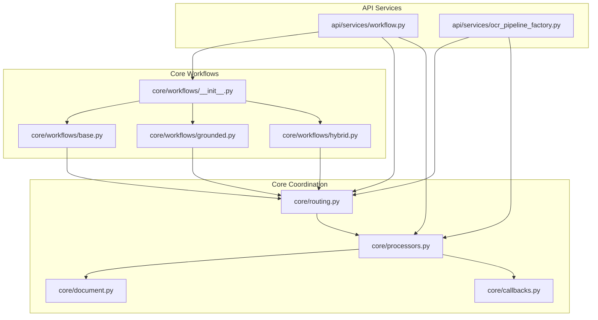
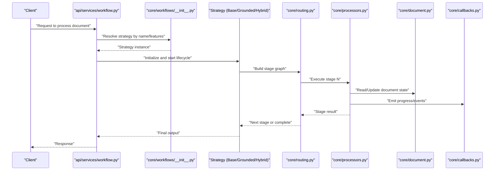
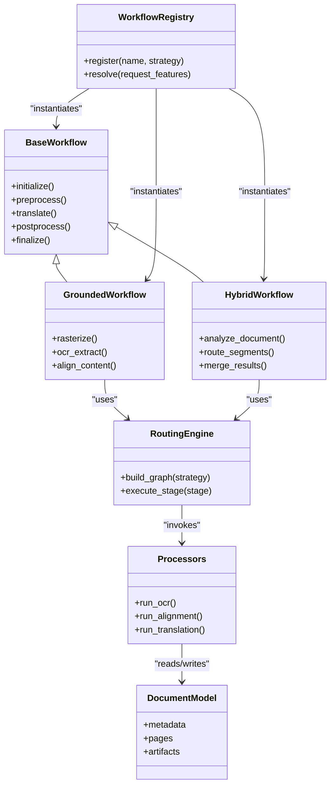
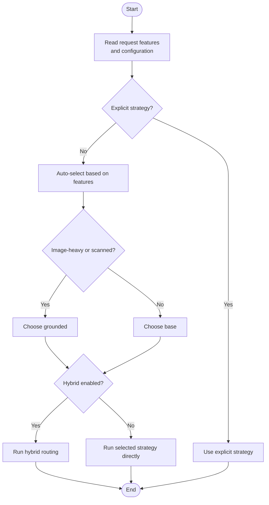

# Workflow Orchestration System

<cite>
**Referenced Files in This Document**
- [base.py](file://src/local_deepl/core/workflows/base.py)
- [grounded.py](file://src/local_deepl/core/workflows/grounded.py)
- [hybrid.py](file://src/local_deepl/core/workflows/hybrid.py)
- [__init__.py](file://src/local_deepl/core/workflows/__init__.py)
- [routing.py](file://src/local_deepl/core/routing.py)
- [processors.py](file://src/local_deepl/core/processors.py)
- [document.py](file://src/local_deepl/core/document.py)
- [callbacks.py](file://src/local_deepl/core/callbacks.py)
- [workflow.py](file://src/local_deepl/api/services/workflow.py)
- [ocr_pipeline_factory.py](file://src/local_deepl/api/services/ocr_pipeline_factory.py)
- [test_workflows_base.py](file://tests/test_workflows_base.py)
- [test_workflows_grounded.py](file://tests/test_workflows_grounded.py)
- [test_workflows_hybrid.py](file://tests/test_workflows_hybrid.py)
</cite>

## Table of Contents
1. [Introduction](#introduction)
2. [Project Structure](#project-structure)
3. [Core Components](#core-components)
4. [Architecture Overview](#architecture-overview)
5. [Detailed Component Analysis](#detailed-component-analysis)
6. [Dependency Analysis](#dependency-analysis)
7. [Performance Considerations](#performance-considerations)
8. [Troubleshooting Guide](#troubleshooting-guide)
9. [Conclusion](#conclusion)
10. [Appendices](#appendices)

## Introduction
This document explains the workflow orchestration system that selects and executes one of three strategies—base, grounded, or hybrid—to process documents. It covers lifecycle management, state coordination across processors, decision logic for strategy selection based on document characteristics and processing requirements, and patterns for integrating custom workflows. The goal is to make the system understandable for both technical and non-technical readers while providing precise references to implementation files.

## Project Structure
The workflow orchestration spans core modules and API services:
- Core workflow implementations live under src/local_deepl/core/workflows with a shared base class and concrete strategies.
- Routing and processor coordination are implemented in core routing and processors modules.
- API-level orchestration and factory wiring are provided by services under api/services.
- Tests validate behavior for each workflow type.

**Diagram sources**
- [workflow.py](file://src/local_deepl/api/services/workflow.py)
- [ocr_pipeline_factory.py](file://src/local_deepl/api/services/ocr_pipeline_factory.py)
- [__init__.py](file://src/local_deepl/core/workflows/__init__.py)
- [base.py](file://src/local_deepl/core/workflows/base.py)
- [grounded.py](file://src/local_deepl/core/workflows/grounded.py)
- [hybrid.py](file://src/local_deepl/core/workflows/hybrid.py)
- [routing.py](file://src/local_deepl/core/routing.py)
- [processors.py](file://src/local_deepl/core/processors.py)
- [document.py](file://src/local_deepl/core/document.py)
- [callbacks.py](file://src/local_deepl/core/callbacks.py)

**Section sources**
- [workflow.py](file://src/local_deepl/api/services/workflow.py)
- [ocr_pipeline_factory.py](file://src/local_deepl/api/services/ocr_pipeline_factory.py)
- [__init__.py](file://src/local_deepl/core/workflows/__init__.py)
- [base.py](file://src/local_deepl/core/workflows/base.py)
- [grounded.py](file://src/local_deepl/core/workflows/grounded.py)
- [hybrid.py](file://src/local_deepl/core/workflows/hybrid.py)
- [routing.py](file://src/local_deepl/core/routing.py)
- [processors.py](file://src/local_deepl/core/processors.py)
- [document.py](file://src/local_deepl/core/document.py)
- [callbacks.py](file://src/local_deepl/core/callbacks.py)

## Core Components
- Base workflow: Defines the common lifecycle, state transitions, and hooks used by all strategies.
- Grounded workflow: Adds grounding steps (e.g., OCR rasterization and alignment) before translation.
- Hybrid workflow: Combines base and grounded paths conditionally based on document characteristics.
- Workflow registry: Centralizes strategy registration and lookup.
- Routing and processors: Coordinate stage execution and pass state between components.
- API service: Exposes orchestration endpoints and integrates with factories.

Key responsibilities:
- Strategy selection: Decide which workflow to run based on document features and configuration.
- Lifecycle control: Initialize, execute stages, handle errors, and finalize outputs.
- State propagation: Maintain consistent document state across processors.
- Extensibility: Provide clear extension points for custom strategies.

**Section sources**
- [base.py](file://src/local_deepl/core/workflows/base.py)
- [grounded.py](file://src/local_deepl/core/workflows/grounded.py)
- [hybrid.py](file://src/local_deepl/core/workflows/hybrid.py)
- [__init__.py](file://src/local_deepl/core/workflows/__init__.py)
- [routing.py](file://src/local_deepl/core/routing.py)
- [processors.py](file://src/local_deepl/core/processors.py)
- [workflow.py](file://src/local_deepl/api/services/workflow.py)

## Architecture Overview
The orchestration follows a layered architecture:
- API layer exposes endpoints and delegates to an orchestrator service.
- Orchestrator resolves the appropriate workflow strategy via the registry.
- Each strategy composes a sequence of processors defined by routing and processors.
- Shared document model carries state through the pipeline.
- Callbacks enable decoupled notifications and side effects.

**Diagram sources**
- [workflow.py](file://src/local_deepl/api/services/workflow.py)
- [__init__.py](file://src/local_deepl/core/workflows/__init__.py)
- [base.py](file://src/local_deepl/core/workflows/base.py)
- [grounded.py](file://src/local_deepl/core/workflows/grounded.py)
- [hybrid.py](file://src/local_deepl/core/workflows/hybrid.py)
- [routing.py](file://src/local_deepl/core/routing.py)
- [processors.py](file://src/local_deepl/core/processors.py)
- [document.py](file://src/local_deepl/core/document.py)
- [callbacks.py](file://src/local_deepl/core/callbacks.py)

## Detailed Component Analysis

### Base Workflow
Responsibilities:
- Define the canonical lifecycle phases (initialize, preprocess, translate, postprocess, finalize).
- Provide hooks for logging, metrics, and error handling.
- Manage shared state and ensure idempotent retries where applicable.

Lifecycle highlights:
- Initialization validates inputs and prepares resources.
- Preprocessing may include normalization and feature extraction.
- Translation invokes configured engines and updates document state.
- Postprocessing applies corrections and formatting.
- Finalization writes artifacts and emits completion callbacks.

Error handling:
- Wraps stage failures with context.
- Supports partial recovery when safe.
- Emits detailed diagnostics via callbacks.

**Section sources**
- [base.py](file://src/local_deepl/core/workflows/base.py)
- [callbacks.py](file://src/local_deepl/core/callbacks.py)

### Grounded Workflow
Responsibilities:
- Extend base lifecycle with grounding steps such as OCR rasterization and alignment.
- Ensure text fidelity by anchoring translations to visual evidence.
- Integrate OCR-specific processors and prompts.

Processing flow:
- Rasterize pages if needed.
- Run OCR to extract text and bounding boxes.
- Align extracted content with original structure.
- Proceed to translation using grounded context.

Integration points:
- Uses OCR client and filters from core OCR module.
- Leverages alignment utilities to maintain positional accuracy.

**Section sources**
- [grounded.py](file://src/local_deepl/core/workflows/grounded.py)
- [routing.py](file://src/local_deepl/core/routing.py)
- [processors.py](file://src/local_deepl/core/processors.py)

### Hybrid Workflow
Responsibilities:
- Dynamically choose between base and grounded paths per document or segment.
- Apply heuristics based on document characteristics (e.g., image density, presence of scanned pages).
- Preserve performance by avoiding unnecessary grounding when not beneficial.

Decision logic overview:
- Analyze document metadata and sample pages.
- Compute scores for grounding necessity.
- Route segments accordingly and merge results.

State coordination:
- Maintains separate states for base and grounded branches.
- Merges aligned outputs into a unified document model.

**Section sources**
- [hybrid.py](file://src/local_deepl/core/workflows/hybrid.py)
- [routing.py](file://src/local_deepl/core/routing.py)
- [document.py](file://src/local_deepl/core/document.py)

### Workflow Registry and Selection
Responsibilities:
- Register available strategies by name.
- Provide selection function that maps request attributes to a strategy.
- Support dynamic overrides via configuration.

Selection criteria:
- Explicit strategy name from request.
- Feature-based auto-selection (e.g., image-heavy documents).
- Configuration flags for default fallback.

Extensibility:
- New strategies can be registered without modifying existing code.
- Factory functions encapsulate instantiation and dependency injection.

**Section sources**
- [__init__.py](file://src/local_deepl/core/workflows/__init__.py)
- [routing.py](file://src/local_deepl/core/routing.py)
- [workflow.py](file://src/local_deepl/api/services/workflow.py)

### API Orchestration Service
Responsibilities:
- Accept processing requests and normalize parameters.
- Resolve strategy and invoke lifecycle.
- Stream progress via callbacks and return final artifacts.

Integration:
- Uses OCR pipeline factory to assemble OCR-dependent stages when required.
- Coordinates with job tracking and artifact storage.

**Section sources**
- [workflow.py](file://src/local_deepl/api/services/workflow.py)
- [ocr_pipeline_factory.py](file://src/local_deepl/api/services/ocr_pipeline_factory.py)

### Processor Coordination and Routing
Responsibilities:
- Build directed graphs of processing stages.
- Execute stages in order, respecting dependencies.
- Pass document state and intermediate artifacts between stages.

Routing rules:
- Conditional branching based on strategy and document features.
- Reusable stage definitions for OCR, alignment, translation, and export.

**Section sources**
- [routing.py](file://src/local_deepl/core/routing.py)
- [processors.py](file://src/local_deepl/core/processors.py)
- [document.py](file://src/local_deepl/core/document.py)

### Custom Workflow Implementation and Integration Patterns
Patterns:
- Implement a new strategy by subclassing the base workflow and overriding lifecycle hooks.
- Register the strategy in the registry with a unique name.
- Compose processors via routing to add or replace stages.
- Use callbacks to emit progress and diagnostics.

Integration examples:
- Add a pre-translation glossary step by inserting a processor in the preprocessing phase.
- Introduce a post-translation quality check by appending a validation stage.
- Swap OCR providers by configuring the OCR pipeline factory.

Validation:
- Unit tests demonstrate expected behaviors for base, grounded, and hybrid strategies.
- Integration tests verify end-to-end flows and artifact generation.

**Section sources**
- [base.py](file://src/local_deepl/core/workflows/base.py)
- [__init__.py](file://src/local_deepl/core/workflows/__init__.py)
- [routing.py](file://src/local_deepl/core/routing.py)
- [test_workflows_base.py](file://tests/test_workflows_base.py)
- [test_workflows_grounded.py](file://tests/test_workflows_grounded.py)
- [test_workflows_hybrid.py](file://tests/test_workflows_hybrid.py)

## Dependency Analysis
The following diagram shows key dependencies among orchestration components.

**Diagram sources**
- [base.py](file://src/local_deepl/core/workflows/base.py)
- [grounded.py](file://src/local_deepl/core/workflows/grounded.py)
- [hybrid.py](file://src/local_deepl/core/workflows/hybrid.py)
- [__init__.py](file://src/local_deepl/core/workflows/__init__.py)
- [routing.py](file://src/local_deepl/core/routing.py)
- [processors.py](file://src/local_deepl/core/processors.py)
- [document.py](file://src/local_deepl/core/document.py)

**Section sources**
- [base.py](file://src/local_deepl/core/workflows/base.py)
- [grounded.py](file://src/local_deepl/core/workflows/grounded.py)
- [hybrid.py](file://src/local_deepl/core/workflows/hybrid.py)
- [__init__.py](file://src/local_deepl/core/workflows/__init__.py)
- [routing.py](file://src/local_deepl/core/routing.py)
- [processors.py](file://src/local_deepl/core/processors.py)
- [document.py](file://src/local_deepl/core/document.py)

## Performance Considerations
- Prefer base workflow for text-native documents to avoid OCR overhead.
- Use grounded workflow only when visual fidelity is critical or OCR is necessary.
- Hybrid workflow should threshold decisions to minimize expensive operations.
- Cache OCR results and intermediate artifacts to reduce recomputation.
- Parallelize independent stages where safe (e.g., page-level OCR).
- Stream progress updates to improve responsiveness during long runs.

[No sources needed since this section provides general guidance]

## Troubleshooting Guide
Common issues and resolutions:
- Strategy resolution failures: Verify registry entries and request features; ensure correct naming and availability.
- OCR pipeline misconfiguration: Check provider settings and credentials; confirm rasterization options.
- Alignment mismatches: Validate bounding box formats and coordinate systems; review alignment thresholds.
- Incomplete artifacts: Inspect callback logs and stage outputs; confirm finalization steps executed successfully.
- Performance regressions: Profile stage durations; consider disabling optional steps or enabling caching.

Diagnostic aids:
- Enable verbose callbacks for stage-level events.
- Export intermediate artifacts for inspection.
- Use test fixtures to reproduce issues deterministically.

**Section sources**
- [callbacks.py](file://src/local_deepl/core/callbacks.py)
- [test_workflows_base.py](file://tests/test_workflows_base.py)
- [test_workflows_grounded.py](file://tests/test_workflows_grounded.py)
- [test_workflows_hybrid.py](file://tests/test_workflows_hybrid.py)

## Conclusion
The workflow orchestration system provides a flexible, extensible framework for processing documents through base, grounded, and hybrid strategies. By centralizing lifecycle management, state propagation, and strategy selection, it enables robust integration of OCR, alignment, and translation components. The design supports customization through clear extension points and encourages best practices for performance and reliability.

[No sources needed since this section summarizes without analyzing specific files]

## Appendices

### Decision Logic Flowchart
A conceptual flow for selecting a workflow based on document characteristics and configuration.

[No sources needed since this diagram shows conceptual workflow, not actual code structure]