# Real-time Progress Tracking

<cite>
**Referenced Files in This Document**
- [websocket.py](file://src/local_deepl/api/routers/websocket.py)
- [progress.py](file://src/local_deepl/api/services/progress.py)
- [app.js](file://src/local_deepl/static/js/app.js)
- [state_and_api.js](file://src/local_deepl/static/js/state_and_api.js)
- [jobs.py](file://src/local_deepl/api/services/jobs.py)
- [tasks.py](file://src/local_deepl/api/tasks.py)
- [server.py](file://src/local_deepl/server.py)
</cite>

## Table of Contents
1. [Introduction](#introduction)
2. [Project Structure](#project-structure)
3. [Core Components](#core-components)
4. [Architecture Overview](#architecture-overview)
5. [Detailed Component Analysis](#detailed-component-analysis)
6. [WebSocket Connection Management](#websocket-connection-management)
7. [Message Broadcasting System](#message-broadcasting-system)
8. [Client-Side Implementation](#client-side-implementation)
9. [Progress Event Structure](#progress-event-structure)
10. [Connection Resilience and Reconnection](#connection-resilience-and-reconnection)
11. [State Synchronization Patterns](#state-synchronization-patterns)
12. [Error Handling and Notifications](#error-handling-and-notifications)
13. [Performance Considerations](#performance-considerations)
14. [Troubleshooting Guide](#troubleshooting-guide)
15. [Best Practices](#best-practices)
16. [Conclusion](#conclusion)

## Introduction

The real-time progress tracking system provides a comprehensive WebSocket-based communication framework that enables seamless synchronization between frontend and backend components during long-running operations. This system is designed to handle complex workflows such as document processing, OCR tasks, translation jobs, and other resource-intensive operations that require continuous status updates and user feedback.

The architecture follows modern real-time communication patterns, implementing robust connection management, efficient message broadcasting, and intelligent state synchronization mechanisms. The system supports multiple concurrent clients while maintaining data consistency and providing graceful error handling and reconnection capabilities.

## Project Structure

The real-time progress tracking system is distributed across several key modules:

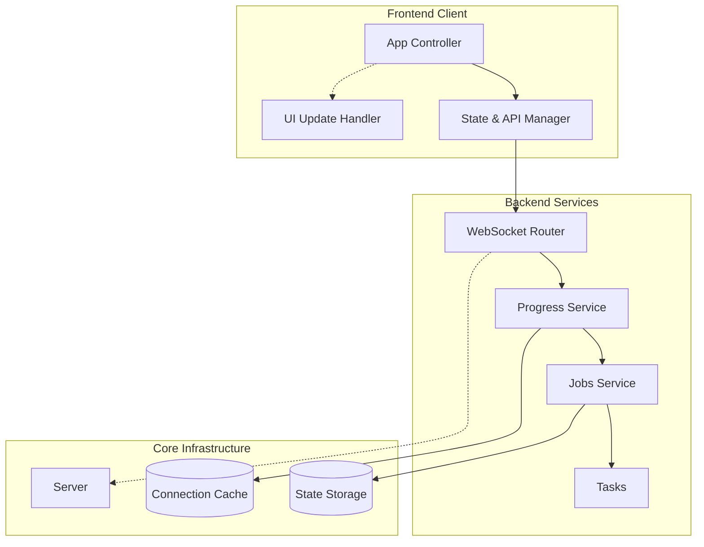

**Diagram sources**
- [websocket.py:1-50](file://src/local_deepl/api/routers/websocket.py#L1-L50)
- [progress.py:1-50](file://src/local_deepl/api/services/progress.py#L1-L50)
- [app.js:1-50](file://src/local_deepl/static/js/app.js#L1-L50)
- [state_and_api.js:1-50](file://src/local_deepl/static/js/state_and_api.js#L1-L50)

**Section sources**
- [websocket.py:1-100](file://src/local_deepl/api/routers/websocket.py#L1-L100)
- [progress.py:1-100](file://src/local_deepl/api/services/progress.py#L1-L100)
- [app.js:1-100](file://src/local_deepl/static/js/app.js#L1-L100)
- [state_and_api.js:1-100](file://src/local_deepl/static/js/state_and_api.js#L1-L100)

## Core Components

The real-time progress tracking system consists of several interconnected components that work together to provide seamless real-time communication:

### Backend Components
- **WebSocket Router**: Handles WebSocket connections and message routing
- **Progress Service**: Manages progress tracking and event generation
- **Jobs Service**: Coordinates background job execution and status updates
- **Task Manager**: Orchestrates long-running operations

### Frontend Components
- **WebSocket Client**: Manages connection lifecycle and message handling
- **State Manager**: Maintains application state and synchronization
- **UI Update Handler**: Processes progress events and updates interface
- **Reconnection Manager**: Handles connection failures and recovery

**Section sources**
- [websocket.py:50-150](file://src/local_deepl/api/routers/websocket.py#L50-L150)
- [progress.py:50-150](file://src/local_deepl/api/services/progress.py#L50-L150)
- [app.js:50-150](file://src/local_deepl/static/js/app.js#L50-L150)
- [state_and_api.js:50-150](file://src/local_deepl/static/js/state_and_api.js#L50-L150)

## Architecture Overview

The system implements a pub-sub messaging pattern with WebSocket transport, enabling efficient real-time communication between multiple clients and the server.

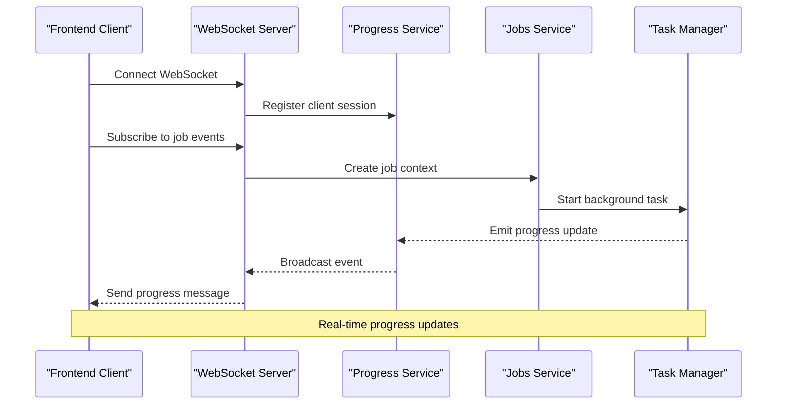

**Diagram sources**
- [websocket.py:100-200](file://src/local_deepl/api/routers/websocket.py#L100-L200)
- [progress.py:100-200](file://src/local_deepl/api/services/progress.py#L100-L200)
- [jobs.py:1-100](file://src/local_deepl/api/services/jobs.py#L1-L100)
- [tasks.py:1-100](file://src/local_deepl/api/tasks.py#L1-L100)

## Detailed Component Analysis

### WebSocket Router Component

The WebSocket router serves as the central hub for all real-time communications, managing connection lifecycle, authentication, and message routing.

#### Key Responsibilities
- Connection establishment and authentication
- Client session management
- Message routing and broadcasting
- Error handling and cleanup
- Rate limiting and security validation

#### Connection Lifecycle Management

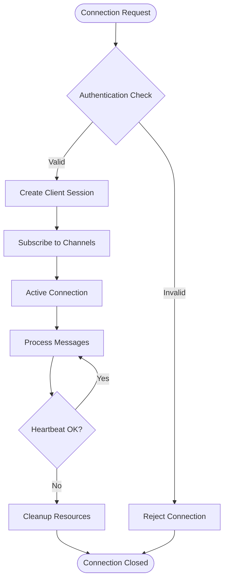

**Diagram sources**
- [websocket.py:150-250](file://src/local_deepl/api/routers/websocket.py#L150-L250)

**Section sources**
- [websocket.py:1-300](file://src/local_deepl/api/routers/websocket.py#L1-L300)

### Progress Service Component

The progress service manages the creation, tracking, and broadcasting of progress events throughout the system.

#### Core Features
- Progress event generation and formatting
- Multi-client broadcasting
- Event persistence and history
- Rate limiting and throttling
- Event filtering and subscription management

#### Event Processing Flow

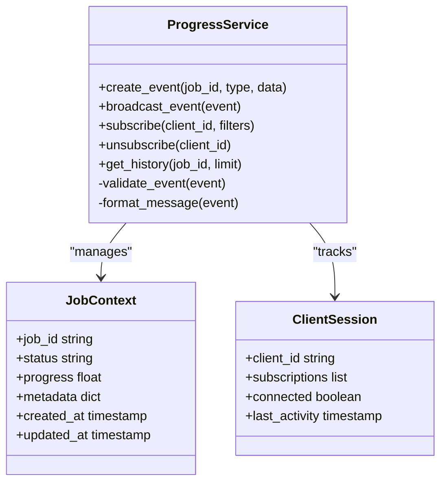

**Diagram sources**
- [progress.py:1-200](file://src/local_deepl/api/services/progress.py#L1-L200)

**Section sources**
- [progress.py:1-250](file://src/local_deepl/api/services/progress.py#L1-L250)

### Jobs Service Component

The jobs service coordinates background job execution and integrates with the progress tracking system to provide real-time updates.

#### Job Management Features
- Background task orchestration
- Progress integration and callbacks
- Error handling and retry logic
- Resource management and cleanup
- Status monitoring and reporting

**Section sources**
- [jobs.py:1-200](file://src/local_deepl/api/services/jobs.py#L1-L200)

## WebSocket Connection Management

### Connection Establishment

The WebSocket connection process involves several stages to ensure secure and reliable communication:

1. **Initial Connection**: Client establishes WebSocket connection with authentication headers
2. **Handshake Validation**: Server validates client credentials and permissions
3. **Session Creation**: Unique session ID assigned and metadata stored
4. **Channel Subscription**: Client subscribes to relevant job channels
5. **Heartbeat Setup**: Bidirectional heartbeat mechanism established

### Connection State Management

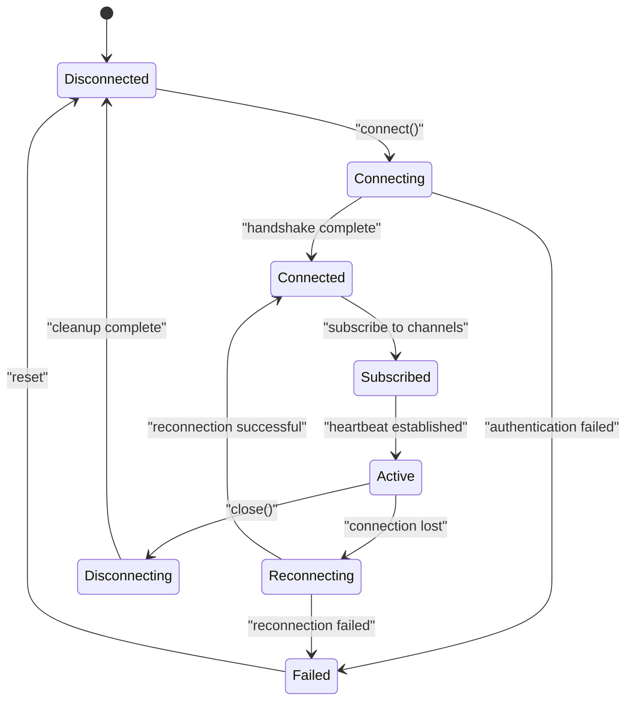

**Diagram sources**
- [websocket.py:200-350](file://src/local_deepl/api/routers/websocket.py#L200-L350)
- [app.js:100-200](file://src/local_deepl/static/js/app.js#L100-L200)

### Connection Pool Management

The system maintains an efficient connection pool to handle multiple concurrent clients while minimizing resource usage:

- **Connection Caching**: Active connections cached with metadata
- **Resource Limits**: Maximum connections per client and global limits
- **Memory Management**: Automatic cleanup of inactive connections
- **Load Balancing**: Distribution across available server instances

**Section sources**
- [websocket.py:250-400](file://src/local_deepl/api/routers/websocket.py#L250-L400)
- [server.py:1-150](file://src/local_deepl/server.py#L1-L150)

## Message Broadcasting System

### Event Types and Structure

The system supports various types of progress events, each with specific data structures and handling requirements:

#### Core Event Types
- **Job Started**: Initial job creation and configuration
- **Progress Update**: Incremental progress information
- **Status Change**: Overall job status transitions
- **Error Notification**: Error details and recovery information
- **Completion**: Final job completion with results

#### Message Format Specification

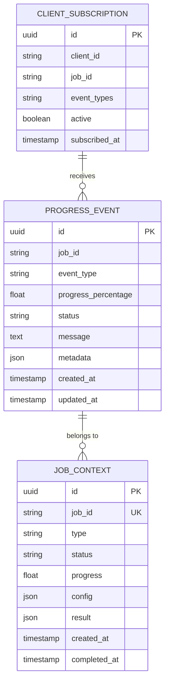

**Diagram sources**
- [progress.py:150-300](file://src/local_deepl/api/services/progress.py#L150-L300)

### Broadcasting Mechanism

The broadcasting system uses a publish-subscribe pattern to efficiently deliver messages to interested clients:

#### Channel-Based Routing
- **Job-Specific Channels**: Each job has dedicated channel for targeted updates
- **Global Channels**: System-wide announcements and notifications
- **User-Specific Channels**: Personalized updates and private messages
- **Role-Based Channels**: Access-controlled channels based on user permissions

#### Performance Optimizations
- **Batch Broadcasting**: Multiple messages grouped for efficiency
- **Filtering at Source**: Early filtering reduces network overhead
- **Compression**: Message compression for large payloads
- **Caching**: Recent events cached for new subscribers

**Section sources**
- [progress.py:200-350](file://src/local_deepl/api/services/progress.py#L200-L350)

## Client-Side Implementation

### JavaScript Client Architecture

The frontend implementation provides a robust WebSocket client with automatic reconnection, error handling, and state synchronization.

#### Core Client Features
- **Automatic Reconnection**: Intelligent retry logic with exponential backoff
- **Message Queue**: Outgoing message queuing during disconnections
- **State Synchronization**: Bidirectional state sync with conflict resolution
- **Event Delegation**: Centralized event handling and processing
- **Memory Management**: Efficient resource cleanup and garbage collection

#### Client Initialization Flow

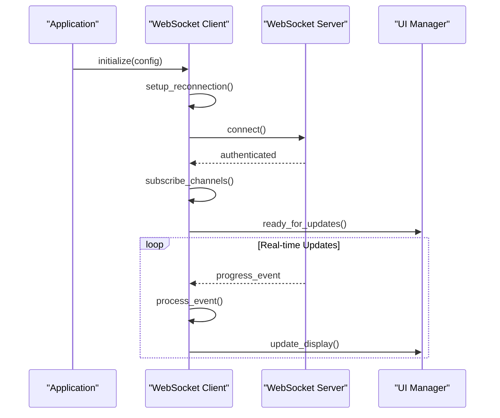

**Diagram sources**
- [app.js:1-200](file://src/local_deepl/static/js/app.js#L1-L200)
- [state_and_api.js:1-200](file://src/local_deepl/static/js/state_and_api.js#L1-L200)

### Event Handling System

The client implements a sophisticated event handling system that processes different types of WebSocket messages:

#### Event Processing Pipeline
1. **Message Reception**: Raw WebSocket message received
2. **Validation**: Message format and schema validation
3. **Type Detection**: Automatic event type identification
4. **Handler Dispatch**: Route to appropriate event handler
5. **State Update**: Application state modification
6. **UI Refresh**: Interface update and rendering

#### Custom Event Handlers

Developers can implement custom event handlers by extending the base client class or registering custom handlers:

```javascript
// Example custom event handler registration
client.registerEventHandler('custom_progress', (event) => {
    // Custom processing logic
    updateCustomUI(event.data);
    triggerAnalytics(event);
});
```

**Section sources**
- [app.js:100-300](file://src/local_deepl/static/js/app.js#L100-L300)
- [state_and_api.js:100-300](file://src/local_deepl/static/js/state_and_api.js#L100-L300)

## Progress Event Structure

### Standard Event Schema

The progress tracking system defines a standardized event structure that ensures consistency across all components:

#### Core Event Properties
- **Event ID**: Unique identifier for tracking and deduplication
- **Job ID**: Associated job identifier for correlation
- **Event Type**: Classification of the progress event
- **Timestamp**: Event creation time for ordering
- **Progress Percentage**: Numerical progress indicator (0-100)
- **Status**: Current job status (pending, running, completed, failed)
- **Message**: Human-readable status message
- **Metadata**: Additional contextual information

#### Advanced Event Features
- **Chunked Updates**: Large progress updates split into chunks
- **Delta Updates**: Only changed fields included in updates
- **Priority Levels**: Different priority levels for urgent updates
- **Acknowledgment**: Client acknowledgment for critical events

### Event Lifecycle Management

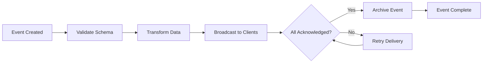

**Diagram sources**
- [progress.py:250-400](file://src/local_deepl/api/services/progress.py#L250-L400)

**Section sources**
- [progress.py:1-400](file://src/local_deepl/api/services/progress.py#L1-L400)

## Connection Resilience and Reconnection

### Reconnection Strategy

The system implements a sophisticated reconnection strategy that ensures reliable communication even under adverse network conditions:

#### Exponential Backoff Algorithm
- **Initial Delay**: 1 second between first reconnection attempt
- **Backoff Factor**: 2x increase after each failed attempt
- **Maximum Delay**: 60 seconds maximum delay between attempts
- **Jitter**: Random jitter added to prevent thundering herd
- **Maximum Attempts**: Configurable maximum reconnection attempts

#### Connection Health Monitoring

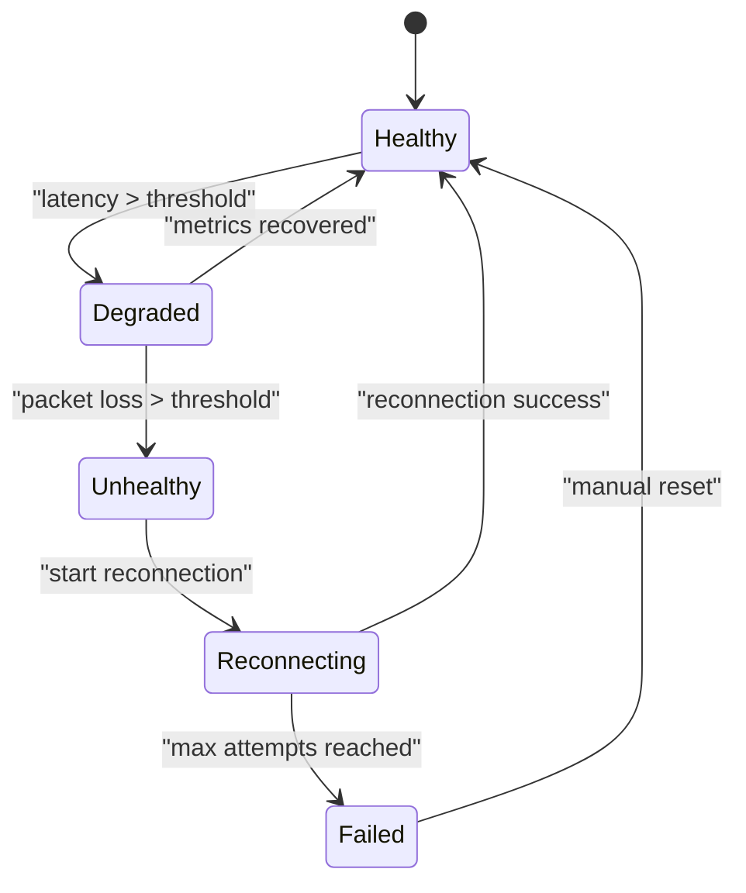

**Diagram sources**
- [app.js:200-400](file://src/local_deepl/static/js/app.js#L200-L400)

### Graceful Degradation

When connection quality degrades, the system automatically adapts its behavior:

- **Reduced Update Frequency**: Lower update rate during poor connectivity
- **Batched Updates**: Combine multiple updates into single messages
- **Offline Mode**: Store updates locally and sync when connection restored
- **Fallback Communication**: HTTP polling as fallback when WebSocket unavailable

**Section sources**
- [app.js:200-500](file://src/local_deepl/static/js/app.js#L200-L500)

## State Synchronization Patterns

### Bidirectional State Sync

The system implements bidirectional state synchronization to maintain consistency between client and server:

#### Conflict Resolution Strategies
- **Last Write Wins**: Most recent update takes precedence
- **Merge Operations**: Intelligent merging of non-conflicting changes
- **Version Vectors**: Vector clocks for causal ordering
- **Operational Transformation**: Complex conflict resolution algorithms

#### State Consistency Guarantees

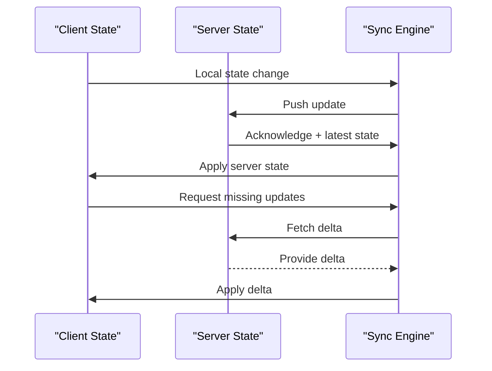

**Diagram sources**
- [state_and_api.js:200-400](file://src/local_deepl/static/js/state_and_api.js#L200-L400)

### Optimistic Updates

For better user experience, the system employs optimistic updates that immediately reflect changes in the UI while validating them asynchronously:

- **Immediate Feedback**: UI updates before server confirmation
- **Rollback Support**: Automatic rollback on validation failure
- **Conflict Detection**: Detect and resolve conflicts gracefully
- **Undo/Redo**: Full undo/redo support for user actions

**Section sources**
- [state_and_api.js:200-500](file://src/local_deepl/static/js/state_and_api.js#L200-L500)

## Error Handling and Notifications

### Comprehensive Error Management

The system implements layered error handling to provide meaningful feedback to users while maintaining system stability:

#### Error Categories
- **Network Errors**: Connection failures, timeouts, and network interruptions
- **Authentication Errors**: Invalid credentials and permission issues
- **Validation Errors**: Malformed requests and invalid data
- **Processing Errors**: Job execution failures and timeout errors
- **System Errors**: Internal server errors and resource exhaustion

#### Error Recovery Strategies

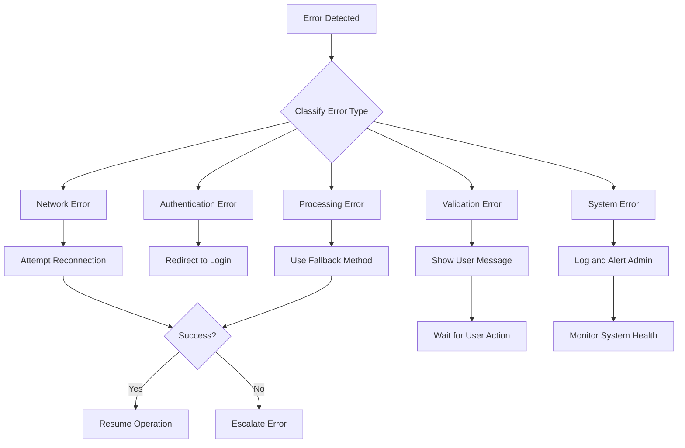

**Diagram sources**
- [websocket.py:300-500](file://src/local_deepl/api/routers/websocket.py#L300-L500)
- [app.js:300-500](file://src/local_deepl/static/js/app.js#L300-L500)

### User-Friendly Error Messages

Error messages are designed to be informative and actionable:

- **Human-Readable**: Clear explanations without technical jargon
- **Actionable Guidance**: Specific steps users can take to resolve issues
- **Contextual Information**: Relevant details about the current operation
- **Multiple Languages**: Support for internationalization

**Section sources**
- [websocket.py:350-600](file://src/local_deepl/api/routers/websocket.py#L350-L600)
- [app.js:300-600](file://src/local_deepl/static/js/app.js#L300-L600)

## Performance Considerations

### Optimization Strategies

The real-time progress tracking system incorporates several performance optimizations to handle high-concurrency scenarios:

#### Backend Optimizations
- **Connection Pooling**: Efficient reuse of database and external connections
- **Message Batching**: Group related updates to reduce network overhead
- **Asynchronous Processing**: Non-blocking I/O operations throughout the stack
- **Memory Management**: Careful memory allocation and garbage collection tuning
- **Database Optimization**: Efficient querying and indexing strategies

#### Frontend Optimizations
- **Virtual Scrolling**: Efficient rendering of large progress histories
- **Debounced Updates**: Coalesce rapid UI updates to reduce rendering load
- **Lazy Loading**: Load heavy components only when needed
- **Memory Leaks Prevention**: Proper cleanup of event listeners and timers

### Scalability Considerations

The system is designed to scale horizontally to handle increasing loads:

- **Stateless Design**: No server-side session state for easy horizontal scaling
- **Distributed Caching**: Redis-backed caching for shared state
- **Load Balancing**: Even distribution of connections across server instances
- **Rate Limiting**: Protection against abuse and resource exhaustion

## Troubleshooting Guide

### Common Issues and Solutions

#### Connection Problems
- **Symptoms**: Frequent disconnections, slow reconnection times
- **Diagnosis**: Check network latency, firewall rules, and server logs
- **Solutions**: Adjust timeout settings, verify SSL certificates, check server capacity

#### Performance Issues
- **Symptoms**: Laggy UI updates, high CPU/memory usage
- **Diagnosis**: Monitor system metrics, analyze message volume, check database queries
- **Solutions**: Optimize update frequency, implement pagination, tune resource limits

#### Memory Leaks
- **Symptoms**: Gradually increasing memory usage over time
- **Diagnosis**: Use browser developer tools, monitor heap snapshots
- **Solutions**: Clean up event listeners, clear intervals and timeouts, release references

### Debugging Tools and Techniques

#### Browser Developer Tools
- **Network Tab**: Inspect WebSocket frames and message content
- **Console**: View error messages and debugging output
- **Performance Tab**: Analyze rendering performance and bottlenecks
- **Memory Tab**: Identify memory leaks and optimize memory usage

#### Server-Side Debugging
- **Structured Logging**: Comprehensive logging with correlation IDs
- **Metrics Collection**: Real-time monitoring of system health
- **Trace Propagation**: Track requests across service boundaries
- **Health Checks**: Automated monitoring of service availability

**Section sources**
- [websocket.py:400-700](file://src/local_deepl/api/routers/websocket.py#L400-L700)
- [app.js:400-700](file://src/local_deepl/static/js/app.js#L400-L700)

## Best Practices

### Implementing Custom Progress Handlers

When creating custom progress handlers, follow these best practices:

#### Handler Design Principles
- **Single Responsibility**: Each handler should focus on one specific concern
- **Idempotency**: Handlers should be safe to call multiple times
- **Error Isolation**: Failures in one handler shouldn't affect others
- **Extensibility**: Design for future enhancements and customization

#### Performance Guidelines
- **Avoid Blocking Operations**: Keep handlers lightweight and asynchronous
- **Batch Similar Updates**: Group related UI updates for efficiency
- **Cache Expensive Computations**: Memoize results of expensive calculations
- **Use Web Workers**: Offload heavy processing to background threads

### Security Considerations

#### Authentication and Authorization
- **Token Validation**: Verify WebSocket connection tokens on every message
- **Permission Checking**: Ensure users have proper access to requested resources
- **Input Sanitization**: Validate and sanitize all incoming data
- **Rate Limiting**: Prevent abuse through connection and message rate limits

#### Data Privacy
- **Data Minimization**: Only send necessary information to clients
- **Sensitive Data Filtering**: Remove confidential information from progress updates
- **Audit Logging**: Log access to sensitive operations without exposing data

### Testing Strategies

#### Unit Testing
- **Mock WebSocket Connections**: Test handlers without actual network calls
- **Event Simulation**: Simulate various event sequences and edge cases
- **Error Scenarios**: Test error handling and recovery paths
- **Performance Testing**: Validate performance under load conditions

#### Integration Testing
- **End-to-End Flows**: Test complete user workflows with real connections
- **Multi-Client Scenarios**: Verify behavior with multiple concurrent clients
- **Failure Injection**: Test system resilience under various failure conditions
- **Load Testing**: Validate scalability and performance characteristics

## Conclusion

The real-time progress tracking system provides a robust, scalable, and user-friendly solution for managing long-running operations with immediate feedback. By leveraging WebSocket technology, implementing intelligent reconnection logic, and following best practices for performance and security, the system delivers a seamless real-time experience for users.

The modular architecture allows for easy extension and customization, while comprehensive error handling and monitoring ensure reliability in production environments. The combination of optimistic updates, state synchronization, and graceful degradation creates an intuitive user experience that keeps users informed and engaged throughout lengthy operations.

Future enhancements could include advanced analytics for progress prediction, machine learning-based anomaly detection, and enhanced mobile support for cross-platform compatibility. The foundation laid by this system provides a solid base for these and other potential improvements.