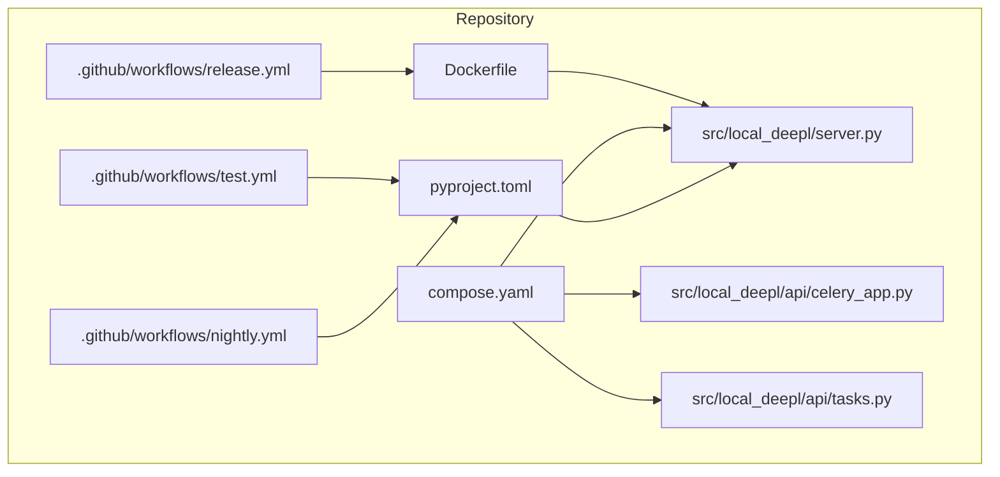
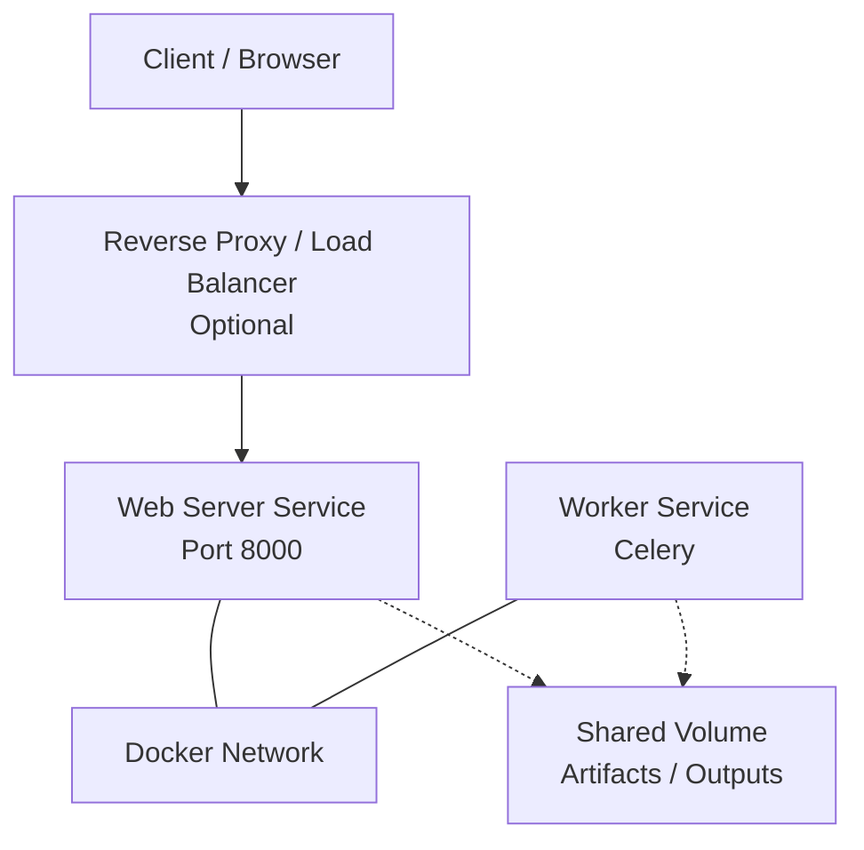
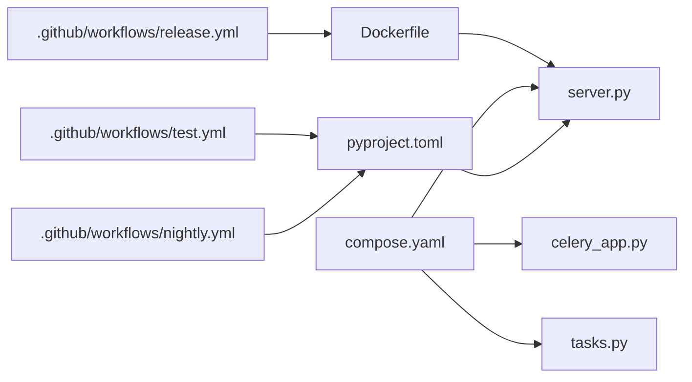
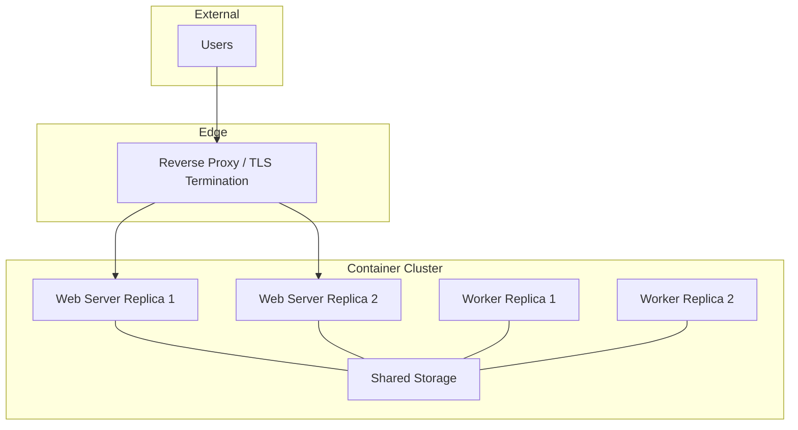

# Deployment Architecture

<cite>
**Referenced Files in This Document**
- [Dockerfile](file://Dockerfile)
- [compose.yaml](file://compose.yaml)
- [pyproject.toml](file://pyproject.toml)
- [.github/workflows/test.yml](file://.github/workflows/test.yml)
- [.github/workflows/nightly.yml](file://.github/workflows/nightly.yml)
- [.github/workflows/release.yml](file://.github/workflows/release.yml)
- [src/local_deepl/server.py](file://src/local_deepl/server.py)
- [src/local_deepl/api/celery_app.py](file://src/local_deepl/api/celery_app.py)
- [src/local_deepl/api/tasks.py](file://src/local_deepl/api/tasks.py)
</cite>

## Table of Contents
1. [Introduction](#introduction)
2. [Project Structure](#project-structure)
3. [Core Components](#core-components)
4. [Architecture Overview](#architecture-overview)
5. [Detailed Component Analysis](#detailed-component-analysis)
6. [Dependency Analysis](#dependency-analysis)
7. [Performance Considerations](#performance-considerations)
8. [Troubleshooting Guide](#troubleshooting-guide)
9. [Conclusion](#conclusion)
10. [Appendices](#appendices)

## Introduction
This document describes the deployment architecture for LocalDeepL with a focus on containerized operations using Docker and Docker Compose, CI/CD automation, environment configuration, production patterns, scaling considerations, and operational concerns such as monitoring and logging. It provides diagrams to illustrate service relationships and network communication, and it references concrete repository files where applicable.

## Project Structure
The repository includes:
- Container build definition for the application image
- A Docker Compose file for local orchestration
- Python project metadata and dependencies
- GitHub Actions workflows for testing, nightly jobs, and releases
- Application server entrypoint and background worker components

**Diagram sources**
- [Dockerfile](file://Dockerfile)
- [compose.yaml](file://compose.yaml)
- [pyproject.toml](file://pyproject.toml)
- [.github/workflows/test.yml](file://.github/workflows/test.yml)
- [.github/workflows/nightly.yml](file://.github/workflows/nightly.yml)
- [.github/workflows/release.yml](file://.github/workflows/release.yml)
- [src/local_deepl/server.py](file://src/local_deepl/server.py)
- [src/local_deepl/api/celery_app.py](file://src/local_deepl/api/celery_app.py)
- [src/local_deepl/api/tasks.py](file://src/local_deepl/api/tasks.py)

**Section sources**
- [Dockerfile](file://Dockerfile)
- [compose.yaml](file://compose.yaml)
- [pyproject.toml](file://pyproject.toml)
- [.github/workflows/test.yml](file://.github/workflows/test.yml)
- [.github/workflows/nightly.yml](file://.github/workflows/nightly.yml)
- [.github/workflows/release.yml](file://.github/workflows/release.yml)
- [src/local_deepl/server.py](file://src/local_deepl/server.py)
- [src/local_deepl/api/celery_app.py](file://src/local_deepl/api/celery_app.py)
- [src/local_deepl/api/tasks.py](file://src/local_deepl/api/tasks.py)

## Core Components
- Application Server: The main HTTP server process that exposes APIs and serves static assets.
- Background Worker: A Celery worker process configured via the application’s Celery app module and task definitions.
- Container Image: Built from the Dockerfile and used by both the server and worker services.
- Orchestration: Docker Compose defines how the server and worker run together, including networking and shared volumes.
- CI/CD: GitHub Actions workflows implement automated tests, nightly runs, and release packaging.

Key responsibilities:
- Server: Request handling, API routing, and serving UI/static content.
- Worker: Long-running or CPU-intensive tasks offloaded from the server.
- Compose: Service discovery, port exposure, volume mounts, and environment configuration.
- CI/CD: Linting, testing, artifact creation, and publishing artifacts/images.

**Section sources**
- [src/local_deepl/server.py](file://src/local_deepl/server.py)
- [src/local_deepl/api/celery_app.py](file://src/local_deepl/api/celery_app.py)
- [src/local_deepl/api/tasks.py](file://src/local_deepl/api/tasks.py)
- [compose.yaml](file://compose.yaml)
- [Dockerfile](file://Dockerfile)

## Architecture Overview
LocalDeepL deploys as two primary services within a single Docker network:
- Web server (HTTP API and static UI)
- Background worker (Celery-based processing)

Both services are built from the same container image and communicate over the internal Docker network. External clients access the web server via exposed ports. Shared storage can be mounted for artifacts and outputs.

[No sources needed since this diagram shows conceptual workflow, not actual code structure]

## Detailed Component Analysis

### Container Image and Build
- The Dockerfile defines the base runtime, installs Python dependencies, copies source code, and sets the default command to start the server.
- Dependencies and package metadata are declared in the Python project configuration.

Operational notes:
- Use multi-stage builds if external tools or heavy binaries are required.
- Pin dependency versions for reproducible images.
- Keep the image lean by removing unnecessary layers and caches.

**Section sources**
- [Dockerfile](file://Dockerfile)
- [pyproject.toml](file://pyproject.toml)

### Service Orchestration with Docker Compose
- The compose file defines at least two services: the web server and the worker.
- Networking is handled automatically by Docker; services discover each other by service name.
- Volumes can be attached for persistent artifacts and logs.
- Environment variables configure runtime behavior (e.g., feature flags, paths).

Scaling considerations:
- Scale the worker horizontally by increasing replicas to handle higher throughput.
- Ensure shared storage is accessible to all worker instances.
- Consider adding a reverse proxy or load balancer in front of multiple web server replicas.

**Section sources**
- [compose.yaml](file://compose.yaml)

### Application Server
- The server module initializes the HTTP server and registers routes and middleware.
- Static assets and UI templates are served alongside the API.
- Health checks and graceful shutdown hooks should be implemented for production readiness.

Production tips:
- Run behind a reverse proxy (e.g., Nginx/Traefik) for TLS termination and caching.
- Enable structured logging and expose metrics endpoints if available.
- Configure timeouts and concurrency limits appropriate for your workload.

**Section sources**
- [src/local_deepl/server.py](file://src/local_deepl/server.py)

### Background Worker (Celery)
- The Celery app module configures the worker runtime and broker/backend settings.
- Task definitions encapsulate long-running or CPU-bound work.
- Workers consume tasks published by the server or scheduled jobs.

Operational guidance:
- Tune concurrency based on CPU cores and memory.
- Monitor queue depth and task latency.
- Use separate queues for different priorities if needed.

**Section sources**
- [src/local_deepl/api/celery_app.py](file://src/local_deepl/api/celery_app.py)
- [src/local_deepl/api/tasks.py](file://src/local_deepl/api/tasks.py)

### CI/CD Pipeline Configuration
- Test workflow: Runs unit and integration tests on push/PR events.
- Nightly workflow: Executes extended or resource-heavy tests periodically.
- Release workflow: Builds artifacts or images and publishes them according to tags.

Best practices:
- Cache dependencies to speed up builds.
- Parallelize test suites across matrix configurations.
- Publish versioned artifacts and maintain changelogs.

**Section sources**
- [.github/workflows/test.yml](file://.github/workflows/test.yml)
- [.github/workflows/nightly.yml](file://.github/workflows/nightly.yml)
- [.github/workflows/release.yml](file://.github/workflows/release.yml)

### Infrastructure Requirements
- Compute: Sufficient CPU and RAM for model inference and OCR workloads.
- Storage: Persistent volume for artifacts, exports, and temporary files.
- Networking: Exposed port for the web server; internal network for service-to-service communication.
- Optional: Reverse proxy for TLS and load balancing; object storage for large artifacts.

Environment configuration:
- Use environment variables for secrets and runtime options.
- Separate development, staging, and production configurations.
- Validate required variables at startup and fail fast if missing.

**Section sources**
- [compose.yaml](file://compose.yaml)
- [Dockerfile](file://Dockerfile)

### Production Deployment Patterns
- Horizontal scaling:
  - Increase worker replicas to improve throughput.
  - Place multiple web server replicas behind a load balancer.
- High availability:
  - Use managed databases or durable backends if applicable.
  - Persist artifacts to shared storage.
- Security:
  - Enforce TLS at the edge.
  - Restrict network access and use secrets management.
- Observability:
  - Centralize logs and metrics.
  - Implement health checks and readiness probes.

[No sources needed since this section provides general guidance]

## Dependency Analysis
The following diagram maps key runtime dependencies between services and configuration files.

**Diagram sources**
- [Dockerfile](file://Dockerfile)
- [compose.yaml](file://compose.yaml)
- [pyproject.toml](file://pyproject.toml)
- [.github/workflows/test.yml](file://.github/workflows/test.yml)
- [.github/workflows/nightly.yml](file://.github/workflows/nightly.yml)
- [.github/workflows/release.yml](file://.github/workflows/release.yml)
- [src/local_deepl/server.py](file://src/local_deepl/server.py)
- [src/local_deepl/api/celery_app.py](file://src/local_deepl/api/celery_app.py)
- [src/local_deepl/api/tasks.py](file://src/local_deepl/api/tasks.py)

**Section sources**
- [Dockerfile](file://Dockerfile)
- [compose.yaml](file://compose.yaml)
- [pyproject.toml](file://pyproject.toml)
- [.github/workflows/test.yml](file://.github/workflows/test.yml)
- [.github/workflows/nightly.yml](file://.github/workflows/nightly.yml)
- [.github/workflows/release.yml](file://.github/workflows/release.yml)
- [src/local_deepl/server.py](file://src/local_deepl/server.py)
- [src/local_deepl/api/celery_app.py](file://src/local_deepl/api/celery_app.py)
- [src/local_deepl/api/tasks.py](file://src/local_deepl/api/tasks.py)

## Performance Considerations
- Concurrency:
  - Adjust worker concurrency to match available CPU cores.
  - Tune server workers/processes for request throughput.
- Resource Limits:
  - Set container CPU/memory limits to prevent noisy neighbors.
- I/O:
  - Use fast, shared storage for artifacts and outputs.
  - Stream large responses when possible.
- Caching:
  - Cache repeated computations or model artifacts in memory or disk.
- Backpressure:
  - Queue tasks asynchronously to avoid blocking requests.

[No sources needed since this section provides general guidance]

## Troubleshooting Guide
Common issues and remedies:
- Startup failures:
  - Verify environment variables and secrets are present.
  - Check container logs for initialization errors.
- Worker stalls:
  - Inspect queue depth and task execution logs.
  - Confirm broker/backend connectivity and credentials.
- Disk space exhaustion:
  - Monitor shared volume usage and rotate artifacts.
- Port conflicts:
  - Ensure the host port mapping is free and consistent.
- Scaling problems:
  - Validate that all replicas share the same configuration and storage.

Operational checks:
- Health endpoints and readiness probes.
- Structured log aggregation and alerting.
- Metrics collection for CPU, memory, queue length, and request latency.

[No sources needed since this section provides general guidance]

## Conclusion
LocalDeepL’s deployment architecture centers on a containerized web server and a Celery-based worker orchestrated via Docker Compose. CI/CD automates testing and releases, while production deployments benefit from horizontal scaling, shared storage, and robust observability. Following the recommendations above will help ensure reliable, scalable, and maintainable operations.

[No sources needed since this section summarizes without analyzing specific files]

## Appendices

### Example Deployment Topology

[No sources needed since this diagram shows conceptual workflow, not actual code structure]