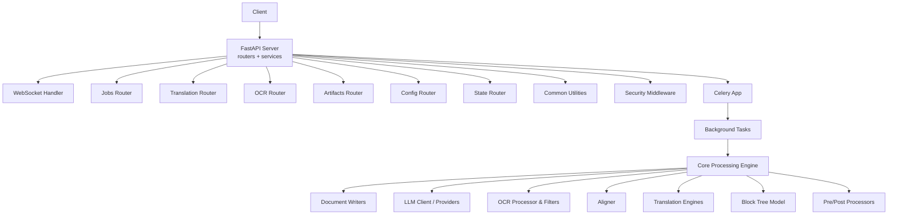
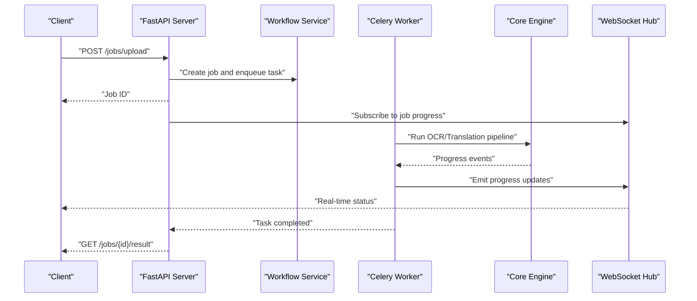
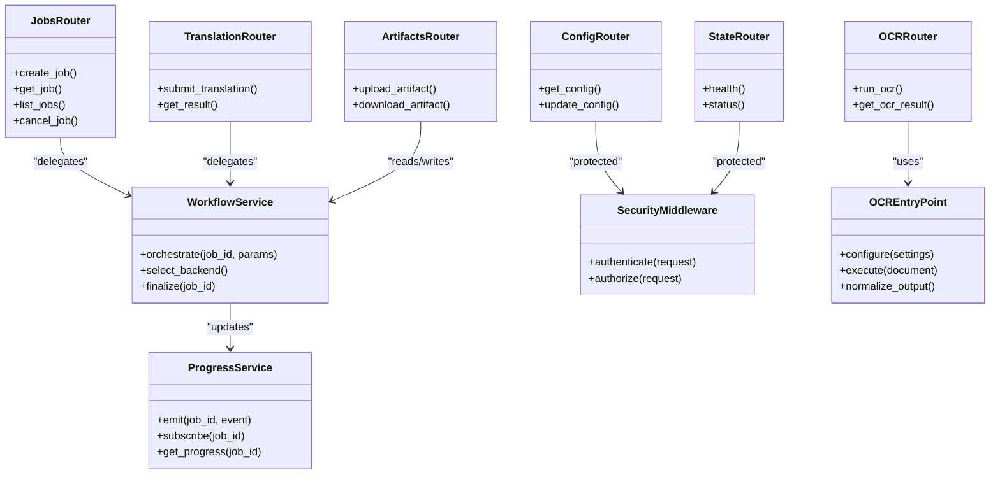
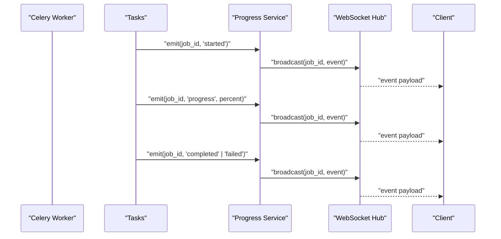
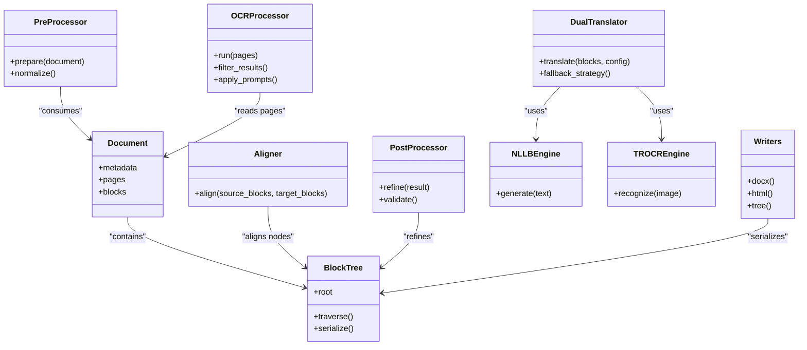
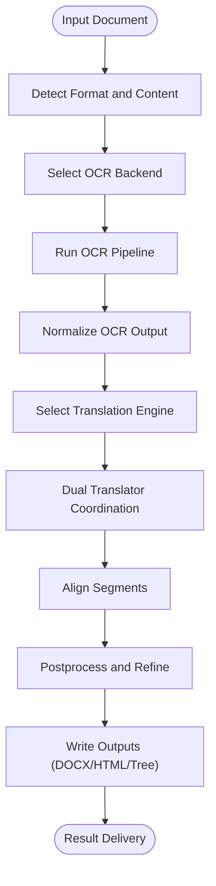
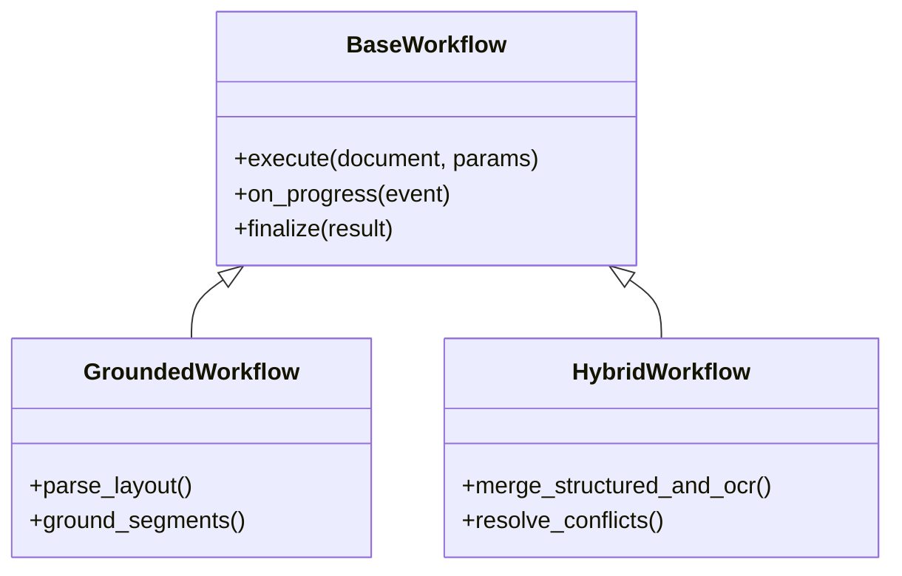
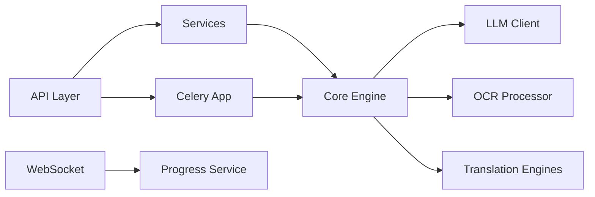
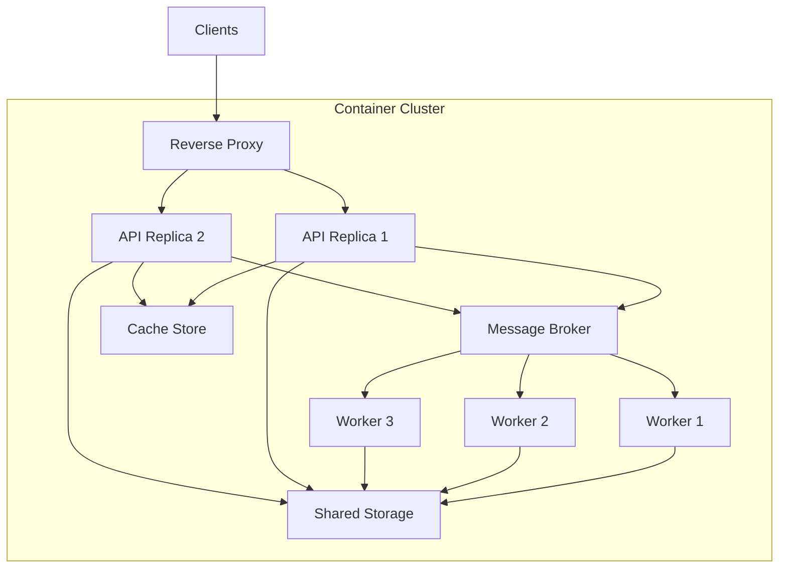

# System Architecture

<cite>
**Referenced Files in This Document**
- [server.py](file://src/local_deepl/server.py)
- [celery_app.py](file://src/local_deepl/api/celery_app.py)
- [tasks.py](file://src/local_deepl/api/tasks.py)
- [websocket.py](file://src/local_deepl/api/routers/websocket.py)
- [jobs.py](file://src/local_deepl/api/routers/jobs.py)
- [translation.py](file://src/local_deepl/api/routers/translation.py)
- [ocr.py](file://src/local_deepl/api/routers/ocr.py)
- [extraction.py](file://src/local_deepl/api/routers/extraction.py)
- [artifacts.py](file://src/local_deepl/api/routers/artifacts.py)
- [config.py](file://src/local_deepl/api/routers/config.py)
- [state.py](file://src/local_deepl/api/routers/state.py)
- [common.py](file://src/local_deepl/api/routers/common.py)
- [requests.py](file://src/local_deepl/api/schemas/requests.py)
- [workflow.py](file://src/local_deepl/api/services/workflow.py)
- [progress.py](file://src/local_deepl/api/services/progress.py)
- [security_middleware.py](file://src/local_deepl/api/services/security_middleware.py)
- [security_config.py](file://src/local_deepl/api/services/security_config.py)
- [ai.py](file://src/local_deepl/api/services/ai.py)
- [document_metadata.py](file://src/local_deepl/api/services/document_metadata.py)
- [document_exports.py](file://src/local_deepl/api/services/document_exports.py)
- [tree_artifact.py](file://src/local_deepl/api/services/tree_artifact.py)
- [ocr_pipeline_factory.py](file://src/local_deepl/api/services/ocr_pipeline_factory.py)
- [ocr_response.py](file://src/local_deepl/api/services/ocr_response.py)
- [ocr_settings.py](file://src/local_deepl/api/services/ocr_settings.py)
- [pipeline.py](file://src/local_deepl/pipeline.py)
- [core/__init__.py](file://src/local_deepl/core/__init__.py)
- [core/block_tree.py](file://src/local_deepl/core/block_tree.py)
- [core/document.py](file://src/local_deepl/core/document.py)
- [core/preprocessing.py](file://src/local_deepl/core/preprocessing.py)
- [core/postprocess.py](file://src/local_deepl/core/postprocess.py)
- [core/processors.py](file://src/local_deepl/core/processors.py)
- [core/aligner.py](file://src/local_deepl/core/aligner.py)
- [core/translation.py](file://src/local_deepl/core/translation.py)
- [core/dual_translator.py](file://src/local_deepl/core/dual_translator.py)
- [core/translation_config.py](file://src/local_deepl/core/translation_config.py)
- [core/llm_client.py](file://src/local_deepl/core/llm_client.py)
- [core/nllb_engine.py](file://src/local_deepl/core/nllb_engine.py)
- [core/trocr_engine.py](file://src/local_deepl/core/trocr_engine.py)
- [core/ocr/client.py](file://src/local_deepl/core/ocr/client.py)
- [core/ocr/processor.py](file://src/local_deepl/core/ocr/processor.py)
- [core/ocr/filters.py](file://src/local_deepl/core/ocr/filters.py)
- [core/ocr/prompts.py](file://src/local_deepl/core/ocr/prompts.py)
- [core/grounded/models.py](file://src/local_deepl/core/grounded/models.py)
- [core/grounded/parsers.py](file://src/local_deepl/core/grounded/parsers.py)
- [core/grounded/prompted.py](file://src/local_deepl/core/grounded/prompted.py)
- [core/grounded/rasterize.py](file://src/local_deepl/core/grounded/rasterize.py)
- [core/workflows/base.py](file://src/local_deepl/core/workflows/base.py)
- [core/workflows/grounded.py](file://src/local_deepl/core/workflows/grounded.py)
- [core/workflows/hybrid.py](file://src/local_deepl/core/workflows/hybrid.py)
- [core/docx_writer.py](file://src/local_deepl/core/docx_writer.py)
- [core/docx_tree_writer.py](file://src/local_deepl/core/docx_tree_writer.py)
- [core/html_writer.py](file://src/local_deepl/core/html_writer.py)
- [core/tree_export.py](file://src/local_deepl/core/tree_export.py)
- [compose.yaml](file://compose.yaml)
- [Dockerfile](file://Dockerfile)
- [pyproject.toml](file://pyproject.toml)
</cite>

## Table of Contents
1. [Introduction](#introduction)
2. [Project Structure](#project-structure)
3. [Core Components](#core-components)
4. [Architecture Overview](#architecture-overview)
5. [Detailed Component Analysis](#detailed-component-analysis)
6. [Dependency Analysis](#dependency-analysis)
7. [Performance Considerations](#performance-considerations)
8. [Deployment and Infrastructure](#deployment-and-infrastructure)
9. [Troubleshooting Guide](#troubleshooting-guide)
10. [Conclusion](#conclusion)

## Introduction
This document describes the system architecture of LocalDeepL, a local-first document translation and OCR platform. The system exposes a FastAPI-based HTTP API for uploads, job orchestration, and result retrieval; uses Celery workers to execute long-running processing tasks asynchronously; and provides WebSocket endpoints for real-time progress updates. A pluggable core engine supports multiple OCR backends (including TROCR and NLLB-based flows), structured block-tree representations, alignment, and translation with configurable engines. The design emphasizes modularity, scalability, and extensibility while keeping heavy workloads off the API process.

## Project Structure
At a high level:
- API layer (FastAPI routers and services) handles requests, validation, security, and orchestration.
- Background workers (Celery) perform CPU-intensive OCR, translation, and export steps.
- Core processing engine implements document parsing, preprocessing, OCR routing, translation, postprocessing, and output writers.
- Real-time communication is provided via WebSocket handlers that bridge task progress to clients.
- Configuration and security are centralized in dedicated service modules.

**Diagram sources**
- [server.py](file://src/local_deepl/server.py)
- [api/routers/websocket.py](file://src/local_deepl/api/routers/websocket.py)
- [api/routers/jobs.py](file://src/local_deepl/api/routers/jobs.py)
- [api/routers/translation.py](file://src/local_deepl/api/routers/translation.py)
- [api/routers/ocr.py](file://src/local_deepl/api/routers/ocr.py)
- [api/routers/artifacts.py](file://src/local_deepl/api/routers/artifacts.py)
- [api/routers/config.py](file://src/local_deepl/api/routers/config.py)
- [api/routers/state.py](file://src/local_deepl/api/routers/state.py)
- [api/routers/common.py](file://src/local_deepl/api/routers/common.py)
- [api/services/security_middleware.py](file://src/local_deepl/api/services/security_middleware.py)
- [api/celery_app.py](file://src/local_deepl/api/celery_app.py)
- [api/tasks.py](file://src/local_deepl/api/tasks.py)
- [core/block_tree.py](file://src/local_deepl/core/block_tree.py)
- [core/ocr/processor.py](file://src/local_deepl/core/ocr/processor.py)
- [core/ocr/filters.py](file://src/local_deepl/core/ocr/filters.py)
- [core/aligner.py](file://src/local_deepl/core/aligner.py)
- [core/translation.py](file://src/local_deepl/core/translation.py)
- [core/dual_translator.py](file://src/local_deepl/core/dual_translator.py)
- [core/llm_client.py](file://src/local_deepl/core/llm_client.py)
- [core/nllb_engine.py](file://src/local_deepl/core/nllb_engine.py)
- [core/trocr_engine.py](file://src/local_deepl/core/trocr_engine.py)
- [core/docx_writer.py](file://src/local_deepl/core/docx_writer.py)
- [core/docx_tree_writer.py](file://src/local_deepl/core/docx_tree_writer.py)
- [core/html_writer.py](file://src/local_deepl/core/html_writer.py)
- [core/tree_export.py](file://src/local_deepl/core/tree_export.py)

**Section sources**
- [server.py](file://src/local_deepl/server.py)
- [compose.yaml](file://compose.yaml)
- [Dockerfile](file://Dockerfile)
- [pyproject.toml](file://pyproject.toml)

## Core Components
- API Layer: FastAPI routers expose REST endpoints for jobs, translation, OCR, artifacts, configuration, and state. Services encapsulate business logic such as workflow orchestration, progress tracking, security, and metadata handling.
- Background Workers: Celery app and tasks define long-running jobs for OCR, translation, and exports. Progress is persisted and exposed via WebSocket.
- Core Engine: Implements document model, block tree representation, preprocessing/postprocessing, OCR pipeline factory, alignment, translation engines (NLLB/TROCR), and writers for DOCX/HTML/tree formats.
- Real-time Communication: WebSocket handler emits progress events tied to job IDs.
- Security: Middleware and configuration enforce authentication and authorization policies.

Key responsibilities by module:
- Routers: request validation, response formatting, and delegation to services.
- Services: workflow orchestration, artifact management, OCR settings, progress persistence, AI integration, and export utilities.
- Core: data models, algorithms, and integrations with external engines.

**Section sources**
- [api/routers/jobs.py](file://src/local_deepl/api/routers/jobs.py)
- [api/routers/translation.py](file://src/local_deepl/api/routers/translation.py)
- [api/routers/ocr.py](file://src/local_deepl/api/routers/ocr.py)
- [api/routers/artifacts.py](file://src/local_deepl/api/routers/artifacts.py)
- [api/routers/config.py](file://src/local_deepl/api/routers/config.py)
- [api/routers/state.py](file://src/local_deepl/api/routers/state.py)
- [api/services/workflow.py](file://src/local_deepl/api/services/workflow.py)
- [api/services/progress.py](file://src/local_deepl/api/services/progress.py)
- [api/services/security_middleware.py](file://src/local_deepl/api/services/security_middleware.py)
- [api/services/security_config.py](file://src/local_deepl/api/services/security_config.py)
- [api/services/ai.py](file://src/local_deepl/api/services/ai.py)
- [api/services/document_metadata.py](file://src/local_deepl/api/services/document_metadata.py)
- [api/services/document_exports.py](file://src/local_deepl/api/services/document_exports.py)
- [api/services/tree_artifact.py](file://src/local_deepl/api/services/tree_artifact.py)
- [api/services/ocr_pipeline_factory.py](file://src/local_deepl/api/services/ocr_pipeline_factory.py)
- [api/services/ocr_response.py](file://src/local_deepl/api/services/ocr_response.py)
- [api/services/ocr_settings.py](file://src/local_deepl/api/services/ocr_settings.py)
- [core/block_tree.py](file://src/local_deepl/core/block_tree.py)
- [core/document.py](file://src/local_deepl/core/document.py)
- [core/preprocessing.py](file://src/local_deepl/core/preprocessing.py)
- [core/postprocess.py](file://src/local_deepl/core/postprocess.py)
- [core/processors.py](file://src/local_deepl/core/processors.py)
- [core/aligner.py](file://src/local_deepl/core/aligner.py)
- [core/translation.py](file://src/local_deepl/core/translation.py)
- [core/dual_translator.py](file://src/local_deepl/core/dual_translator.py)
- [core/translation_config.py](file://src/local_deepl/core/translation_config.py)
- [core/llm_client.py](file://src/local_deepl/core/llm_client.py)
- [core/nllb_engine.py](file://src/local_deepl/core/nllb_engine.py)
- [core/trocr_engine.py](file://src/local_deepl/core/trocr_engine.py)
- [core/ocr/client.py](file://src/local_deepl/core/ocr/client.py)
- [core/ocr/processor.py](file://src/local_deepl/core/ocr/processor.py)
- [core/ocr/filters.py](file://src/local_deepl/core/ocr/filters.py)
- [core/ocr/prompts.py](file://src/local_deepl/core/ocr/prompts.py)
- [core/grounded/models.py](file://src/local_deepl/core/grounded/models.py)
- [core/grounded/parsers.py](file://src/local_deepl/core/grounded/parsers.py)
- [core/grounded/prompted.py](file://src/local_deepl/core/grounded/prompted.py)
- [core/grounded/rasterize.py](file://src/local_deepl/core/grounded/rasterize.py)
- [core/workflows/base.py](file://src/local_deepl/core/workflows/base.py)
- [core/workflows/grounded.py](file://src/local_deepl/core/workflows/grounded.py)
- [core/workflows/hybrid.py](file://src/local_deepl/core/workflows/hybrid.py)
- [core/docx_writer.py](file://src/local_deepl/core/docx_writer.py)
- [core/docx_tree_writer.py](file://src/local_deepl/core/docx_tree_writer.py)
- [core/html_writer.py](file://src/local_deepl/core/html_writer.py)
- [core/tree_export.py](file://src/local_deepl/core/tree_export.py)

## Architecture Overview
The system follows a microservices-like structure within a single application boundary:
- API server handles short-lived requests and delegates heavy work to Celery workers.
- Celery workers run background tasks that invoke the core processing engine.
- WebSocket connections provide live progress updates from workers to clients.
- Pluggable backends allow swapping OCR and translation engines without changing API contracts.

**Diagram sources**
- [api/routers/jobs.py](file://src/local_deepl/api/routers/jobs.py)
- [api/services/workflow.py](file://src/local_deepl/api/services/workflow.py)
- [api/celery_app.py](file://src/local_deepl/api/celery_app.py)
- [api/tasks.py](file://src/local_deepl/api/tasks.py)
- [api/routers/websocket.py](file://src/local_deepl/api/routers/websocket.py)
- [core/processors.py](file://src/local_deepl/core/processors.py)
- [core/translation.py](file://src/local_deepl/core/translation.py)
- [core/ocr/processor.py](file://src/local_deepl/core/ocr/processor.py)

## Detailed Component Analysis

### API Layer
- Routers:
  - Jobs: create, list, retrieve, cancel jobs; coordinate with Celery and progress store.
  - Translation: submit translation jobs and fetch results.
  - OCR: trigger OCR pipelines and return intermediate or final outputs.
  - Artifacts: manage generated artifacts (trees, exports).
  - Config/State: expose runtime configuration and health/state.
  - Common: shared schemas and helpers.
- Services:
  - Workflow: orchestrates end-to-end processing, selects backends, and manages lifecycle.
  - Progress: persists and retrieves progress events for jobs.
  - Security: middleware and config for auth/authz.
  - AI: integrates with LLM providers via client abstraction.
  - Document Metadata/Exports: read/write document metadata and produce exports.
  - Tree Artifact: serializes block trees for storage and transport.
  - OCR Pipeline Factory/Settings/Response: configure and normalize OCR outputs.

**Diagram sources**
- [api/routers/jobs.py](file://src/local_deepl/api/routers/jobs.py)
- [api/routers/translation.py](file://src/local_deepl/api/routers/translation.py)
- [api/routers/ocr.py](file://src/local_deepl/api/routers/ocr.py)
- [api/routers/artifacts.py](file://src/local_deepl/api/routers/artifacts.py)
- [api/routers/config.py](file://src/local_deepl/api/routers/config.py)
- [api/routers/state.py](file://src/local_deepl/api/routers/state.py)
- [api/services/workflow.py](file://src/local_deepl/api/services/workflow.py)
- [api/services/progress.py](file://src/local_deepl/api/services/progress.py)
- [api/services/security_middleware.py](file://src/local_deepl/api/services/security_middleware.py)
- [api/services/ocr_pipeline_factory.py](file://src/local_deepl/api/services/ocr_pipeline_factory.py)
- [api/services/ocr_response.py](file://src/local_deepl/api/services/ocr_response.py)
- [api/services/ocr_settings.py](file://src/local_deepl/api/services/ocr_settings.py)

**Section sources**
- [api/routers/jobs.py](file://src/local_deepl/api/routers/jobs.py)
- [api/routers/translation.py](file://src/local_deepl/api/routers/translation.py)
- [api/routers/ocr.py](file://src/local_deepl/api/routers/ocr.py)
- [api/routers/artifacts.py](file://src/local_deepl/api/routers/artifacts.py)
- [api/routers/config.py](file://src/local_deepl/api/routers/config.py)
- [api/routers/state.py](file://src/local_deepl/api/routers/state.py)
- [api/services/workflow.py](file://src/local_deepl/api/services/workflow.py)
- [api/services/progress.py](file://src/local_deepl/api/services/progress.py)
- [api/services/security_middleware.py](file://src/local_deepl/api/services/security_middleware.py)
- [api/services/ocr_pipeline_factory.py](file://src/local_deepl/api/services/ocr_pipeline_factory.py)
- [api/services/ocr_response.py](file://src/local_deepl/api/services/ocr_response.py)
- [api/services/ocr_settings.py](file://src/local_deepl/api/services/ocr_settings.py)

### Background Workers and Real-time Updates
- Celery App: initializes worker processes and queues.
- Tasks: defines long-running jobs for OCR, translation, and exports.
- WebSocket Handler: maintains connections per job and pushes progress events.

**Diagram sources**
- [api/celery_app.py](file://src/local_deepl/api/celery_app.py)
- [api/tasks.py](file://src/local_deepl/api/tasks.py)
- [api/services/progress.py](file://src/local_deepl/api/services/progress.py)
- [api/routers/websocket.py](file://src/local_deepl/api/routers/websocket.py)

**Section sources**
- [api/celery_app.py](file://src/local_deepl/api/celery_app.py)
- [api/tasks.py](file://src/local_deepl/api/tasks.py)
- [api/services/progress.py](file://src/local_deepl/api/services/progress.py)
- [api/routers/websocket.py](file://src/local_deepl/api/routers/websocket.py)

### Core Processing Engine
The core engine implements:
- Document model and block tree representation for structured content.
- Preprocessing and postprocessing stages.
- OCR processor with filters and prompts for robust text extraction.
- Alignment between source and translated segments.
- Translation engines (NLLB/TROCR) and dual translator coordination.
- Writers for DOCX, HTML, and tree exports.

**Diagram sources**
- [core/document.py](file://src/local_deepl/core/document.py)
- [core/block_tree.py](file://src/local_deepl/core/block_tree.py)
- [core/preprocessing.py](file://src/local_deepl/core/preprocessing.py)
- [core/postprocess.py](file://src/local_deepl/core/postprocess.py)
- [core/ocr/processor.py](file://src/local_deepl/core/ocr/processor.py)
- [core/ocr/filters.py](file://src/local_deepl/core/ocr/filters.py)
- [core/ocr/prompts.py](file://src/local_deepl/core/ocr/prompts.py)
- [core/aligner.py](file://src/local_deepl/core/aligner.py)
- [core/dual_translator.py](file://src/local_deepl/core/dual_translator.py)
- [core/nllb_engine.py](file://src/local_deepl/core/nllb_engine.py)
- [core/trocr_engine.py](file://src/local_deepl/core/trocr_engine.py)
- [core/docx_writer.py](file://src/local_deepl/core/docx_writer.py)
- [core/docx_tree_writer.py](file://src/local_deepl/core/docx_tree_writer.py)
- [core/html_writer.py](file://src/local_deepl/core/html_writer.py)
- [core/tree_export.py](file://src/local_deepl/core/tree_export.py)

**Section sources**
- [core/document.py](file://src/local_deepl/core/document.py)
- [core/block_tree.py](file://src/local_deepl/core/block_tree.py)
- [core/preprocessing.py](file://src/local_deepl/core/preprocessing.py)
- [core/postprocess.py](file://src/local_deepl/core/postprocess.py)
- [core/ocr/processor.py](file://src/local_deepl/core/ocr/processor.py)
- [core/ocr/filters.py](file://src/local_deepl/core/ocr/filters.py)
- [core/ocr/prompts.py](file://src/local_deepl/core/ocr/prompts.py)
- [core/aligner.py](file://src/local_deepl/core/aligner.py)
- [core/dual_translator.py](file://src/local_deepl/core/dual_translator.py)
- [core/nllb_engine.py](file://src/local_deepl/core/nllb_engine.py)
- [core/trocr_engine.py](file://src/local_deepl/core/trocr_engine.py)
- [core/docx_writer.py](file://src/local_deepl/core/docx_writer.py)
- [core/docx_tree_writer.py](file://src/local_deepl/core/docx_tree_writer.py)
- [core/html_writer.py](file://src/local_deepl/core/html_writer.py)
- [core/tree_export.py](file://src/local_deepl/core/tree_export.py)

### Pluggable OCR and Translation Backends
- OCR Pipeline Factory: selects and configures OCR processors based on input type and settings.
- OCR Response Normalizer: standardizes outputs across backends.
- Translation Config: centralizes engine selection and parameters.
- Dual Translator: coordinates fallback strategies and merges results.

**Diagram sources**
- [api/services/ocr_pipeline_factory.py](file://src/local_deepl/api/services/ocr_pipeline_factory.py)
- [api/services/ocr_response.py](file://src/local_deepl/api/services/ocr_response.py)
- [core/translation_config.py](file://src/local_deepl/core/translation_config.py)
- [core/dual_translator.py](file://src/local_deepl/core/dual_translator.py)
- [core/aligner.py](file://src/local_deepl/core/aligner.py)
- [core/postprocess.py](file://src/local_deepl/core/postprocess.py)
- [core/docx_writer.py](file://src/local_deepl/core/docx_writer.py)
- [core/html_writer.py](file://src/local_deepl/core/html_writer.py)
- [core/tree_export.py](file://src/local_deepl/core/tree_export.py)

**Section sources**
- [api/services/ocr_pipeline_factory.py](file://src/local_deepl/api/services/ocr_pipeline_factory.py)
- [api/services/ocr_response.py](file://src/local_deepl/api/services/ocr_response.py)
- [core/translation_config.py](file://src/local_deepl/core/translation_config.py)
- [core/dual_translator.py](file://src/local_deepl/core/dual_translator.py)
- [core/aligner.py](file://src/local_deepl/core/aligner.py)
- [core/postprocess.py](file://src/local_deepl/core/postprocess.py)
- [core/docx_writer.py](file://src/local_deepl/core/docx_writer.py)
- [core/html_writer.py](file://src/local_deepl/core/html_writer.py)
- [core/tree_export.py](file://src/local_deepl/core/tree_export.py)

### Workflows and Grounded Processing
- Base Workflow: abstracts common orchestration patterns.
- Grounded Workflow: leverages grounded models and parsers for precise layout-aware processing.
- Hybrid Workflow: combines OCR and structured inputs for improved accuracy.

**Diagram sources**
- [core/workflows/base.py](file://src/local_deepl/core/workflows/base.py)
- [core/workflows/grounded.py](file://src/local_deepl/core/workflows/grounded.py)
- [core/workflows/hybrid.py](file://src/local_deepl/core/workflows/hybrid.py)
- [core/grounded/models.py](file://src/local_deepl/core/grounded/models.py)
- [core/grounded/parsers.py](file://src/local_deepl/core/grounded/parsers.py)
- [core/grounded/prompted.py](file://src/local_deepl/core/grounded/prompted.py)
- [core/grounded/rasterize.py](file://src/local_deepl/core/grounded/rasterize.py)

**Section sources**
- [core/workflows/base.py](file://src/local_deepl/core/workflows/base.py)
- [core/workflows/grounded.py](file://src/local_deepl/core/workflows/grounded.py)
- [core/workflows/hybrid.py](file://src/local_deepl/core/workflows/hybrid.py)
- [core/grounded/models.py](file://src/local_deepl/core/grounded/models.py)
- [core/grounded/parsers.py](file://src/local_deepl/core/grounded/parsers.py)
- [core/grounded/prompted.py](file://src/local_deepl/core/grounded/prompted.py)
- [core/grounded/rasterize.py](file://src/local_deepl/core/grounded/rasterize.py)

## Dependency Analysis
High-level dependencies:
- API depends on services for business logic and on Celery for async execution.
- Services depend on core engine components for processing.
- Core depends on external engines (LLM, OCR) through client abstractions.
- WebSocket hub depends on progress service for event broadcasting.

**Diagram sources**
- [server.py](file://src/local_deepl/server.py)
- [api/services/workflow.py](file://src/local_deepl/api/services/workflow.py)
- [api/services/progress.py](file://src/local_deepl/api/services/progress.py)
- [api/celery_app.py](file://src/local_deepl/api/celery_app.py)
- [core/llm_client.py](file://src/local_deepl/core/llm_client.py)
- [core/ocr/processor.py](file://src/local_deepl/core/ocr/processor.py)
- [core/translation.py](file://src/local_deepl/core/translation.py)

**Section sources**
- [server.py](file://src/local_deepl/server.py)
- [api/services/workflow.py](file://src/local_deepl/api/services/workflow.py)
- [api/services/progress.py](file://src/local_deepl/api/services/progress.py)
- [api/celery_app.py](file://src/local_deepl/api/celery_app.py)
- [core/llm_client.py](file://src/local_deepl/core/llm_client.py)
- [core/ocr/processor.py](file://src/local_deepl/core/ocr/processor.py)
- [core/translation.py](file://src/local_deepl/core/translation.py)

## Performance Considerations
- Offload heavy tasks to Celery workers to keep API responsive.
- Use streaming WebSocket updates to avoid polling overhead.
- Prefer batched processing where possible (e.g., grouping blocks for translation).
- Cache reusable assets (models, dictionaries) in workers to reduce startup latency.
- Tune worker concurrency based on hardware resources and I/O characteristics.
- Monitor memory usage for large documents; consider chunking strategies in preprocessing.

[No sources needed since this section provides general guidance]

## Deployment and Infrastructure
- Containerization: Dockerfile defines the runtime environment and dependencies.
- Orchestration: compose.yaml specifies services (API, workers, optional broker/cache) and networking.
- Dependencies: pyproject.toml lists Python packages and entry points.

Recommended topology:
- One or more API replicas behind a reverse proxy.
- Multiple Celery worker instances scaled horizontally based on workload.
- Shared storage for artifacts and exports (persistent volumes).
- Optional message broker and cache for progress/events if not using in-process stores.

**Diagram sources**
- [compose.yaml](file://compose.yaml)
- [Dockerfile](file://Dockerfile)
- [pyproject.toml](file://pyproject.toml)

**Section sources**
- [compose.yaml](file://compose.yaml)
- [Dockerfile](file://Dockerfile)
- [pyproject.toml](file://pyproject.toml)

## Troubleshooting Guide
- Job stuck or no progress:
  - Verify Celery workers are running and connected to the broker.
  - Check progress service logs for emitted events.
  - Ensure WebSocket connections are established and subscribed to the correct job ID.
- Authentication failures:
  - Inspect security middleware configuration and credentials.
  - Validate token issuance and expiration policies.
- OCR/Translation errors:
  - Confirm backend availability and credentials.
  - Review error propagation from core engines and normalization layers.
- Resource exhaustion:
  - Monitor worker memory and CPU; adjust concurrency and chunk sizes.
  - Validate persistent storage capacity for artifacts and exports.

**Section sources**
- [api/services/security_middleware.py](file://src/local_deepl/api/services/security_middleware.py)
- [api/services/security_config.py](file://src/local_deepl/api/services/security_config.py)
- [api/services/progress.py](file://src/local_deepl/api/services/progress.py)
- [api/routers/websocket.py](file://src/local_deepl/api/routers/websocket.py)
- [api/tasks.py](file://src/local_deepl/api/tasks.py)
- [core/ocr/processor.py](file://src/local_deepl/core/ocr/processor.py)
- [core/translation.py](file://src/local_deepl/core/translation.py)

## Conclusion
LocalDeepL’s architecture separates concerns cleanly: an API layer for user interactions, Celery workers for heavy lifting, a pluggable core engine for OCR and translation, and WebSocket channels for real-time feedback. This design enables horizontal scaling of workers, flexible backend selection, and resilient operation under varying loads. By leveraging containerization and orchestration, the system can be deployed efficiently in diverse environments while maintaining performance and extensibility.