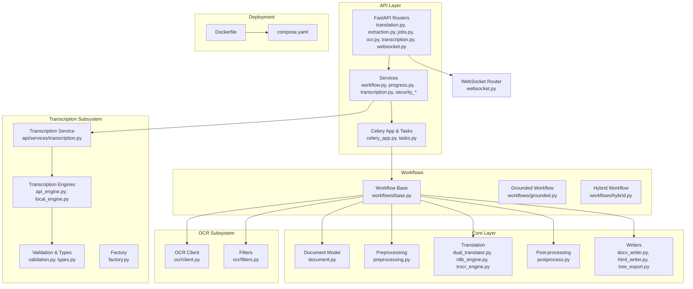
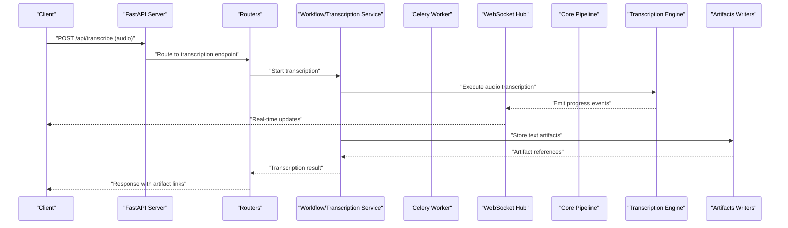
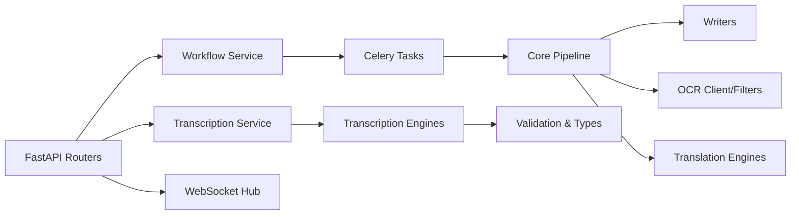

# System Overview

<cite>
**Referenced Files in This Document**
- [server.py](file://src/omniscribe/server.py)
- [celery_app.py](file://src/omniscribe/api/celery_app.py)
- [tasks.py](file://src/omniscribe/api/tasks.py)
- [websocket.py](file://src/omniscribe/api/routers/websocket.py)
- [translation.py](file://src/omniscribe/api/routers/translation.py)
- [extraction.py](file://src/omniscribe/api/routers/extraction.py)
- [jobs.py](file://src/omniscribe/api/routers/jobs.py)
- [ocr.py](file://src/omniscribe/api/routers/ocr.py)
- [transcription.py](file://src/omniscribe/api/routers/transcription.py)
- [workflow.py](file://src/omniscribe/api/services/workflow.py)
- [progress.py](file://src/omniscribe/api/services/progress.py)
- [pipeline.py](file://src/omniscribe/pipeline.py)
- [document.py](file://src/omniscribe/core/document.py)
- [preprocessing.py](file://src/omniscribe/core/preprocessing.py)
- [dual_translator.py](file://src/omniscribe/core/dual_translator.py)
- [postprocess.py](file://src/omniscribe/core/postprocess.py)
- [docx_writer.py](file://src/omniscribe/core/docx_writer.py)
- [html_writer.py](file://src/omniscribe/core/html_writer.py)
- [tree_export.py](file://src/omniscribe/core/tree_export.py)
- [grounded.py](file://src/omniscribe/core/workflows/grounded.py)
- [hybrid.py](file://src/omniscribe/core/workflows/hybrid.py)
- [base.py](file://src/omniscribe/core/workflows/base.py)
- [nllb_engine.py](file://src/omniscribe/core/nllb_engine.py)
- [trocr_engine.py](file://src/omniscribe/core/trocr_engine.py)
- [client.py](file://src/omniscribe/core/ocr/client.py)
- [filters.py](file://src/omniscribe/core/ocr/filters.py)
- [prompted.py](file://src/omniscribe/core/grounded/prompted.py)
- [rasterize.py](file://src/omniscribe/core/grounded/rasterize.py)
- [transcription_service.py](file://src/omniscribe/api/services/transcription.py)
- [transcription_types.py](file://src/omniscribe/core/transcription/types.py)
- [transcription_factory.py](file://src/omniscribe/core/transcription/factory.py)
- [transcription_api_engine.py](file://src/omniscribe/core/transcription/api_engine.py)
- [transcription_local_engine.py](file://src/omniscribe/core/transcription/local_engine.py)
- [transcription_validation.py](file://src/omniscribe/core/transcription/validation.py)
- [compose.yaml](file://compose.yaml)
- [Dockerfile](file://Dockerfile)
</cite>

## Update Summary
**Changes Made**
- Added comprehensive multimodal input support including audio file transcription alongside existing text document processing
- Integrated new transcription subsystem with API routers, services, and core engines for voice-to-text conversion
- Updated system architecture to handle both document and audio inputs through unified artifact storage
- Enhanced WebSocket communication to support real-time progress updates for transcription jobs
- Expanded supported input formats to include audio files (.mp3, .wav, .m4a, .flac, .ogg, .webm, etc.)

## Table of Contents
1. [Introduction](#introduction)
2. [Project Structure](#project-structure)
3. [Core Components](#core-components)
4. [Architecture Overview](#architecture-overview)
5. [Detailed Component Analysis](#detailed-component-analysis)
6. [Dependency Analysis](#dependency-analysis)
7. [Performance Considerations](#performance-considerations)
8. [Troubleshooting Guide](#troubleshooting-guide)
9. [Conclusion](#conclusion)
10. [Appendices](#appendices)

## Introduction
This section provides a high-level overview of Omniscribe's system architecture and design principles. The platform is now a **multimodal document intelligence service** that supports both traditional text documents (PDF, DOCX, images) and audio files for transcription. It exposes a FastAPI HTTP API, WebSocket endpoints for real-time progress updates, and Celery background workers to execute long-running tasks such as OCR, translation, and audio transcription.

Key goals:
- Provide a robust, scalable backend for multi-format document processing and audio transcription
- Enable real-time feedback via WebSockets for all job types
- Support pluggable OCR, translation, and transcription engines
- Maintain clear boundaries between API, orchestration, and core processing logic
- Handle diverse input modalities through unified artifact storage and processing pipelines

## Project Structure
The repository follows a layered structure with the Omniscribe package organization, now expanded to support multimodal inputs:
- API layer: FastAPI routers, services, schemas, and Celery integration under `src/omniscribe/api/`
- Core layer: Document models, preprocessing, processors, translation, post-processing, and writers under `src/omniscribe/core/`
- Transcription subsystem: Audio processing engines, validation, and type definitions under `src/omniscribe/core/transcription/`
- Workflows: Pluggable pipelines for grounded and hybrid processing strategies
- Utilities: Shared helpers for file handling, image processing, and providers
- Static assets: Frontend UI components served by the server

**Diagram sources**
- [server.py:1-246](file://src/omniscribe/server.py#L1-L246)
- [transcription.py:1-153](file://src/omniscribe/api/routers/transcription.py#L1-L153)
- [transcription_service.py:1-162](file://src/omniscribe/api/services/transcription.py#L1-L162)
- [transcription_factory.py:1-58](file://src/omniscribe/core/transcription/factory.py#L1-L58)
- [transcription_api_engine.py:1-142](file://src/omniscribe/core/transcription/api_engine.py#L1-L142)
- [transcription_local_engine.py:1-122](file://src/omniscribe/core/transcription/local_engine.py#L1-L122)
- [transcription_validation.py:1-96](file://src/omniscribe/core/transcription/validation.py#L1-L96)
- [transcription_types.py:1-90](file://src/omniscribe/core/transcription/types.py#L1-L90)

**Section sources**
- [server.py:1-246](file://src/omniscribe/server.py#L1-L246)
- [compose.yaml:1-120](file://compose.yaml#L1-L120)
- [Dockerfile:1-120](file://Dockerfile#L1-L120)

## Core Components
- **FastAPI Backend**: Exposes REST endpoints for translation, extraction, OCR, transcription, and job management; serves static frontend assets.
- **Celery Workers**: Execute long-running tasks asynchronously, including OCR, translation, and export operations.
- **WebSocket Service**: Provides real-time progress updates and event streaming to clients for all job types.
- **Multimodal Document Processing Pipeline**: Orchestrates preprocessing, OCR, translation, post-processing, and output generation across multiple formats including audio transcription.
- **Transcription Subsystem**: Dedicated component for audio file processing with support for both API-based and local transcription engines.
- **Workflows**: Encapsulate different strategies (grounded, hybrid) with shared base behavior and callbacks.
- **OCR Subsystem**: Integrates OCR client and filters for scanned/image inputs.
- **Writers**: Generate final artifacts in DOCX, HTML, and structured tree exports.

**Updated** Added comprehensive transcription capabilities for audio file processing alongside existing document processing features.

**Section sources**
- [translation.py:1-200](file://src/omniscribe/api/routers/translation.py#L1-L200)
- [extraction.py:1-200](file://src/omniscribe/api/routers/extraction.py#L1-L200)
- [jobs.py:1-200](file://src/omniscribe/api/routers/jobs.py#L1-L200)
- [ocr.py:1-200](file://src/omniscribe/api/routers/ocr.py#L1-L200)
- [transcription.py:1-153](file://src/omniscribe/api/routers/transcription.py#L1-L153)
- [websocket.py:1-150](file://src/omniscribe/api/routers/websocket.py#L1-L150)
- [celery_app.py:1-120](file://src/omniscribe/api/celery_app.py#L1-L120)
- [tasks.py:1-200](file://src/omniscribe/api/tasks.py#L1-L200)
- [workflow.py:1-200](file://src/omniscribe/api/services/workflow.py#L1-L200)
- [progress.py:1-120](file://src/omniscribe/api/services/progress.py#L1-L120)
- [pipeline.py:1-161](file://src/omniscribe/pipeline.py#L1-L161)
- [transcription_service.py:1-162](file://src/omniscribe/api/services/transcription.py#L1-L162)

## Architecture Overview
Omniscribe uses a decoupled architecture that now handles both document and audio inputs:
- **API Gateway**: FastAPI handles HTTP requests and routes them to appropriate services based on input type.
- **Orchestration Services**: Manage workflow execution, task submission, and progress tracking for all job types.
- **Background Workers**: Celery processes heavy tasks off the request path.
- **Core Pipeline**: Executes document processing steps with pluggable engines and writers.
- **Transcription Pipeline**: Dedicated flow for audio processing with engine selection and artifact storage.
- **Real-time Updates**: WebSockets push progress events to clients for all job types.

**Updated** Added transcription-specific flow showing how audio files are processed through dedicated transcription engines while maintaining consistency with existing document processing patterns.

**Diagram sources**
- [server.py:1-246](file://src/omniscribe/server.py#L1-L246)
- [transcription.py:1-153](file://src/omniscribe/api/routers/transcription.py#L1-L153)
- [transcription_service.py:1-162](file://src/omniscribe/api/services/transcription.py#L1-L162)
- [transcription_api_engine.py:1-142](file://src/omniscribe/core/transcription/api_engine.py#L1-L142)
- [transcription_local_engine.py:1-122](file://src/omniscribe/core/transcription/local_engine.py#L1-L122)

## Detailed Component Analysis

### FastAPI Backend
Responsibilities:
- Define REST endpoints for translation, extraction, OCR, transcription, and job management
- Serve static frontend assets
- Integrate middleware for security and configuration
- Route requests to appropriate services based on input type

Design principles:
- Clear separation between routers and services
- Request validation via Pydantic schemas
- Consistent error responses and status codes
- Unified authentication and authorization across all endpoints

Integration points:
- Calls workflow service to orchestrate document processing tasks
- Calls transcription service for audio processing
- Publishes progress events through WebSocket hub
- Returns artifact references after completion

**Updated** Added transcription router and endpoints for audio file processing alongside existing document processing endpoints.

**Section sources**
- [server.py:1-246](file://src/omniscribe/server.py#L1-L246)
- [translation.py:1-200](file://src/omniscribe/api/routers/translation.py#L1-L200)
- [extraction.py:1-200](file://src/omniscribe/api/routers/extraction.py#L1-L200)
- [jobs.py:1-200](file://src/omniscribe/api/routers/jobs.py#L1-L200)
- [ocr.py:1-200](file://src/omniscribe/api/routers/ocr.py#L1-L200)
- [transcription.py:1-153](file://src/omniscribe/api/routers/transcription.py#L1-L153)

### Transcription Subsystem
Responsibilities:
- Validate audio file formats and sizes
- Select appropriate transcription engines (API or local)
- Execute transcription with progress reporting
- Store results as artifacts for downstream processing
- Convert transcription results to canonical document format

Design principles:
- Engine abstraction for pluggable backends (OpenAI API, local Whisper)
- Configurable parameters and retry policies
- Progress reporting and error propagation
- Integration with existing artifact storage system

**New** Comprehensive transcription subsystem supporting both cloud-based and local audio processing engines.

**Section sources**
- [transcription_service.py:1-162](file://src/omniscribe/api/services/transcription.py#L1-L162)
- [transcription_factory.py:1-58](file://src/omniscribe/core/transcription/factory.py#L1-L58)
- [transcription_api_engine.py:1-142](file://src/omniscribe/core/transcription/api_engine.py#L1-L142)
- [transcription_local_engine.py:1-122](file://src/omniscribe/core/transcription/local_engine.py#L1-L122)
- [transcription_validation.py:1-96](file://src/omniscribe/core/transcription/validation.py#L1-L96)
- [transcription_types.py:1-90](file://src/omniscribe/core/transcription/types.py#L1-L90)

### Celery Background Workers
Responsibilities:
- Execute long-running tasks such as OCR, translation, and export
- Report progress back to the API via shared state or messaging
- Handle retries and failures gracefully

Design principles:
- Task decomposition into small, composable units
- Idempotent operations where possible
- Centralized task registry and routing

Integration points:
- Receives tasks from workflow service
- Invokes core pipeline stages
- Emits progress events consumed by WebSocket hub

**Section sources**
- [celery_app.py:1-120](file://src/omniscribe/api/celery_app.py#L1-L120)
- [tasks.py:1-200](file://src/omniscribe/api/tasks.py#L1-L200)
- [progress.py:1-120](file://src/omniscribe/api/services/progress.py#L1-L120)

### WebSocket Real-time Communication
Responsibilities:
- Maintain persistent connections for live progress updates
- Broadcast events to relevant clients based on job IDs
- Handle connection lifecycle and reconnection scenarios

Design principles:
- Event-driven updates with minimal payload size
- Decoupled from business logic via service abstractions
- Robust error handling and fallbacks

Integration points:
- Consumes progress events from pipeline and tasks
- Pushes updates to connected clients
- Supports subscription by job ID

**Section sources**
- [websocket.py:1-150](file://src/omniscribe/api/routers/websocket.py#L1-L150)
- [progress.py:1-120](file://src/omniscribe/api/services/progress.py#L1-L120)

### Multimodal Document Processing Pipeline
Responsibilities:
- Parse and normalize input documents (PDF, DOCX, images) and audio files
- Apply preprocessing, OCR, translation, and post-processing
- Generate outputs in multiple formats (DOCX, HTML, tree export)
- Handle transcription results as text artifacts for downstream processing

Design principles:
- Modular stages with clear interfaces
- Pluggable engines for OCR, translation, and transcription
- Callbacks for progress and side effects
- Unified artifact storage for all input types

Data flow patterns:
- Input normalization -> Preprocessing -> OCR (if needed) -> Translation -> Post-processing -> Export
- Audio input -> Validation -> Transcription -> Text artifact creation -> Downstream processing
- Each stage emits progress events and can be retried independently

**Updated** Enhanced to support audio input processing alongside existing document processing workflows.

**Section sources**
- [pipeline.py:1-161](file://src/omniscribe/pipeline.py#L1-L161)
- [document.py:1-146](file://src/omniscribe/core/document.py#L1-L146)
- [preprocessing.py:1-120](file://src/omniscribe/core/preprocessing.py#L1-L120)
- [dual_translator.py:1-120](file://src/omniscribe/core/dual_translator.py#L1-L120)
- [postprocess.py:1-120](file://src/omniscribe/core/postprocess.py#L1-L120)
- [docx_writer.py:1-120](file://src/omniscribe/core/docx_writer.py#L1-L120)
- [html_writer.py:1-120](file://src/omniscribe/core/html_writer.py#L1-L120)
- [tree_export.py:1-120](file://src/omniscribe/core/tree_export.py#L1-L120)

### Workflows: Grounded and Hybrid Strategies
Responsibilities:
- Encapsulate processing strategies with shared base behavior
- Provide hooks for LLM prompting and rasterization when needed
- Allow composition of OCR and translation steps

Design principles:
- Strategy pattern for interchangeable workflows
- Extensible via base class and callback mechanisms
- Clear separation between orchestration and engine calls

**Section sources**
- [base.py:1-120](file://src/omniscribe/core/workflows/base.py#L1-L120)
- [grounded.py:1-120](file://src/omniscribe/core/workflows/grounded.py#L1-L120)
- [hybrid.py:1-120](file://src/omniscribe/core/workflows/hybrid.py#L1-L120)
- [prompted.py:1-120](file://src/omniscribe/core/grounded/prompted.py#L1-L120)
- [rasterize.py:1-120](file://src/omniscribe/core/grounded/rasterize.py#L1-L120)

### OCR Subsystem
Responsibilities:
- Interface with OCR engines (e.g., Tesseract via client)
- Apply filters to improve recognition quality
- Return normalized text blocks aligned with document structure

Design principles:
- Abstraction over OCR providers
- Configurable filters and parameters
- Error isolation and fallbacks

**Section sources**
- [client.py:1-120](file://src/omniscribe/core/ocr/client.py#L1-L120)
- [filters.py:1-120](file://src/omniscribe/core/ocr/filters.py#L1-L120)
- [trocr_engine.py:1-120](file://src/omniscribe/core/trocr_engine.py#L1-L120)

### Translation Engines
Responsibilities:
- Provide translation capabilities using NLLB and other engines
- Support dual translation paths and fallbacks
- Integrate with glossaries and prompts when applicable

Design principles:
- Engine abstraction for pluggable backends
- Configurable parameters and retry policies
- Progress reporting and error propagation

**Section sources**
- [nllb_engine.py:1-120](file://src/omniscribe/core/nllb_engine.py#L1-L120)
- [dual_translator.py:1-120](file://src/omniscribe/core/dual_translator.py#L1-L120)

### Writers and Artifacts
Responsibilities:
- Generate final artifacts in DOCX, HTML, and structured tree formats
- Preserve document structure and metadata
- Support incremental writes and memory-efficient processing
- Handle both document and transcription-generated text artifacts

Design principles:
- Format-specific writer implementations
- Common interface for artifact creation
- Integration with progress reporting

**Updated** Enhanced to handle transcription-generated text artifacts alongside document artifacts.

**Section sources**
- [docx_writer.py:1-120](file://src/omniscribe/core/docx_writer.py#L1-L120)
- [html_writer.py:1-120](file://src/omniscribe/core/html_writer.py#L1-L120)
- [tree_export.py:1-120](file://src/omniscribe/core/tree_export.py#L1-L120)

## Dependency Analysis
High-level dependencies:
- API depends on services and routers
- Services depend on Celery tasks, workflow orchestrators, and transcription services
- Workflows depend on core pipeline components and engines
- Transcription subsystem depends on validation, factory, and engine implementations
- Writers are leaf components producing final artifacts

**Updated** Added transcription service and engine dependencies to show the new multimodal processing capabilities.

**Diagram sources**
- [server.py:1-246](file://src/omniscribe/server.py#L1-L246)
- [workflow.py:1-200](file://src/omniscribe/api/services/workflow.py#L1-L200)
- [transcription_service.py:1-162](file://src/omniscribe/api/services/transcription.py#L1-L162)
- [celery_app.py:1-120](file://src/omniscribe/api/celery_app.py#L1-L120)
- [tasks.py:1-200](file://src/omniscribe/api/tasks.py#L1-L200)
- [pipeline.py:1-161](file://src/omniscribe/pipeline.py#L1-L161)
- [transcription_factory.py:1-58](file://src/omniscribe/core/transcription/factory.py#L1-L58)
- [transcription_api_engine.py:1-142](file://src/omniscribe/core/transcription/api_engine.py#L1-L142)
- [transcription_local_engine.py:1-122](file://src/omniscribe/core/transcription/local_engine.py#L1-L122)
- [transcription_validation.py:1-96](file://src/omniscribe/core/transcription/validation.py#L1-L96)
- [transcription_types.py:1-90](file://src/omniscribe/core/transcription/types.py#L1-L90)

**Section sources**
- [server.py:1-246](file://src/omniscribe/server.py#L1-L246)
- [workflow.py:1-200](file://src/omniscribe/api/services/workflow.py#L1-L200)
- [transcription_service.py:1-162](file://src/omniscribe/api/services/transcription.py#L1-L162)
- [celery_app.py:1-120](file://src/omniscribe/api/celery_app.py#L1-L120)
- [tasks.py:1-200](file://src/omniscribe/api/tasks.py#L1-L200)
- [pipeline.py:1-161](file://src/omniscribe/pipeline.py#L1-L161)

## Performance Considerations
- Asynchronous processing: Offload heavy tasks to Celery workers to keep API responsive
- Streaming progress: Use WebSockets to provide immediate feedback without polling
- Memory efficiency: Process large documents in chunks and stream writes to disk
- Engine selection: Choose appropriate OCR, translation, and transcription engines based on workload characteristics
- Scaling: Deploy multiple Celery workers horizontally; use container orchestration for elasticity
- Audio processing optimization: Implement chunked audio processing for large files and efficient model loading for local transcription

**Updated** Added performance considerations specific to audio transcription processing.

## Troubleshooting Guide
Common issues and diagnostics:
- Task failures: Inspect Celery logs and task results; verify environment variables and model availability
- WebSocket disconnects: Check network stability and ensure proper reconnection logic on the client
- OCR errors: Validate image preprocessing and filter configurations; review OCR client logs
- Translation timeouts: Adjust engine parameters and consider fallback strategies
- Artifact generation: Confirm writer permissions and disk space; validate output format constraints
- Audio validation errors: Check supported file formats and MIME types; verify file size limits
- Transcription engine failures: Verify API keys and endpoints for cloud engines; check local model installation for offline processing

**Updated** Added troubleshooting guidance for audio transcription-specific issues.

**Section sources**
- [celery_app.py:1-120](file://src/omniscribe/api/celery_app.py#L1-L120)
- [tasks.py:1-200](file://src/omniscribe/api/tasks.py#L1-L200)
- [websocket.py:1-150](file://src/omniscribe/api/routers/websocket.py#L1-L150)
- [client.py:1-120](file://src/omniscribe/core/ocr/client.py#L1-L120)
- [filters.py:1-120](file://src/omniscribe/core/ocr/filters.py#L1-L120)
- [nllb_engine.py:1-120](file://src/omniscribe/core/nllb_engine.py#L1-L120)
- [transcription_validation.py:1-96](file://src/omniscribe/core/transcription/validation.py#L1-L96)
- [transcription_api_engine.py:1-142](file://src/omniscribe/core/transcription/api_engine.py#L1-L142)
- [transcription_local_engine.py:1-122](file://src/omniscribe/core/transcription/local_engine.py#L1-L122)
- [docx_writer.py:1-120](file://src/omniscribe/core/docx_writer.py#L1-L120)
- [html_writer.py:1-120](file://src/omniscribe/core/html_writer.py#L1-L120)
- [tree_export.py:1-120](file://src/omniscribe/core/tree_export.py#L1-L120)

## Conclusion
Omniscribe's architecture balances responsiveness, scalability, and extensibility while now supporting multimodal inputs. The FastAPI backend provides a clean API surface for both document and audio processing, Celery workers handle intensive processing, and WebSockets deliver real-time insights. The modular core pipeline and pluggable engines enable flexible processing across formats, languages, and input modalities. With a containerized deployment model and horizontal scaling options, the system is well-suited for both local development and production environments.

**Updated** Enhanced conclusion to reflect the addition of comprehensive audio transcription capabilities alongside existing document processing features.

## Appendices

### Deployment Model
- Containerization: Dockerfile defines the runtime environment and dependencies
- Orchestration: compose.yaml specifies services (API, workers, optional Redis/Broker)
- Environment configuration: Externalize secrets and model paths via environment variables
- Optional extras: Support for transcription-specific dependencies via optional installation

**Section sources**
- [Dockerfile:1-120](file://Dockerfile#L1-L120)
- [compose.yaml:1-120](file://compose.yaml#L1-L120)