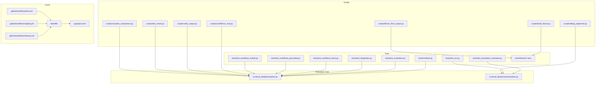
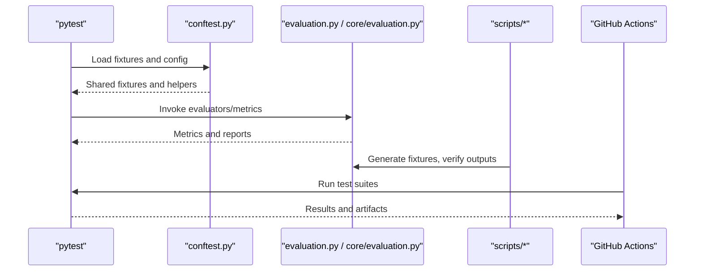
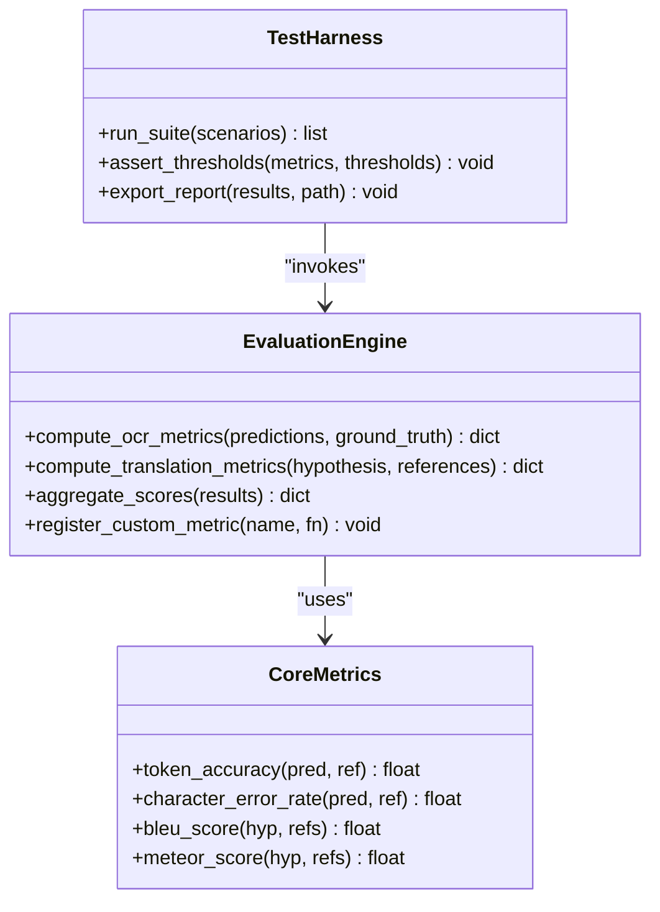
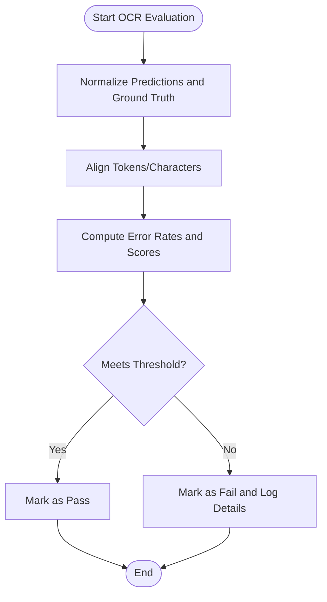
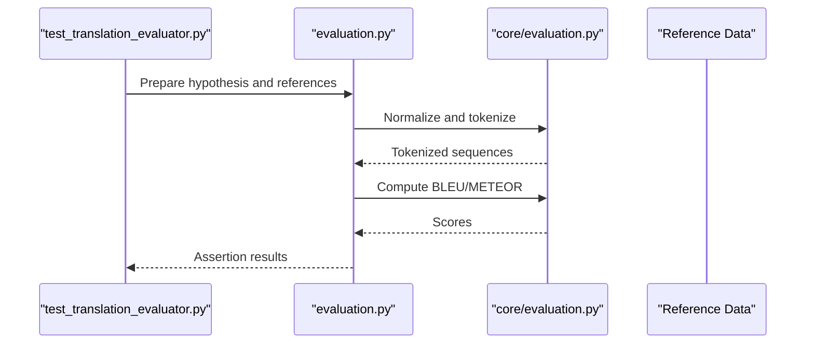
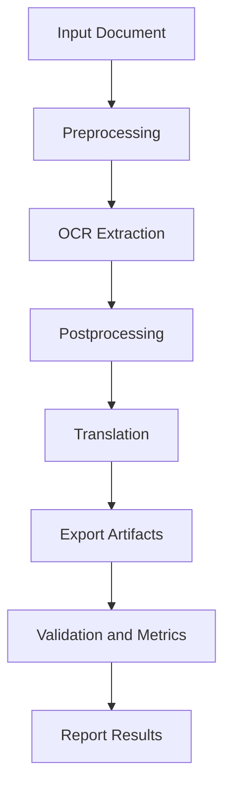
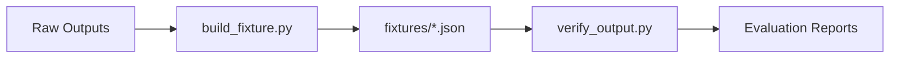
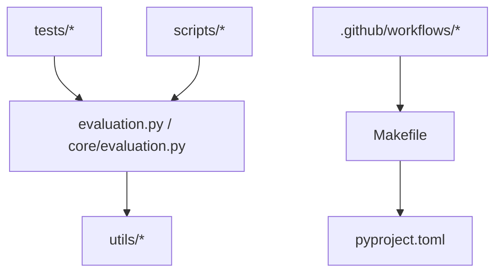

# Testing and Evaluation

<cite>
**Referenced Files in This Document**
- [conftest.py](file://tests/conftest.py)
- [test_evaluation.py](file://tests/test_evaluation.py)
- [evaluation.py](file://src/local_deepl/evaluation.py)
- [core_evaluation.py](file://src/local_deepl/core/evaluation.py)
- [test_translation_evaluator.py](file://tests/test_translation_evaluator.py)
- [test_ocr.py](file://tests/test_ocr.py)
- [test_integration.py](file://tests/test_integration.py)
- [test_workflows_base.py](file://tests/test_workflows_base.py)
- [test_workflows_grounded.py](file://tests/test_workflows_grounded.py)
- [test_workflows_hybrid.py](file://tests/test_workflows_hybrid.py)
- [scripts/confidence_eval.py](file://scripts/confidence_eval.py)
- [scripts/debug_alignment.py](file://scripts/debug_alignment.py)
- [scripts/build_fixture.py](file://scripts/build_fixture.py)
- [scripts/fixture_from_output.py](file://scripts/fixture_from_output.py)
- [scripts/verify_output.py](file://scripts/verify_output.py)
- [scripts/test_check.py](file://scripts/test_check.py)
- [scripts/visualize_comparison.py](file://scripts/visualize_comparison.py)
- [test.yml](file://.github/workflows/test.yml)
- [nightly.yml](file://.github/workflows/nightly.yml)
- [release.yml](file://.github/workflows/release.yml)
- [Makefile](file://Makefile)
- [pyproject.toml](file://pyproject.toml)
</cite>

## Table of Contents
1. [Introduction](#introduction)
2. [Project Structure](#project-structure)
3. [Core Components](#core-components)
4. [Architecture Overview](#architecture-overview)
5. [Detailed Component Analysis](#detailed-component-analysis)
6. [Dependency Analysis](#dependency-analysis)
7. [Performance Considerations](#performance-considerations)
8. [Troubleshooting Guide](#troubleshooting-guide)
9. [Conclusion](#conclusion)
10. [Appendices](#appendices)

## Introduction
This document explains LocalDeepL’s testing and evaluation framework with a focus on measuring OCR accuracy, translation quality, and overall system performance. It covers the testing strategy (unit, integration, end-to-end), how to write custom evaluators, set up test fixtures, run benchmarks, configure tests, mock external services, and integrate with CI/CD. It also clarifies how evaluation metrics relate to system optimization and provides guidance for extending the framework and addressing common challenges such as OCR measurement variability, translation quality assessment, and performance regression detection.

## Project Structure
The testing and evaluation surface spans several areas:
- Tests directory contains unit, integration, and workflow tests, plus fixtures for ground truth data.
- Core evaluation logic lives under src/local_deepl/evaluation.py and src/local_deepl/core/evaluation.py.
- Scripts provide utilities for building fixtures, evaluating confidence, debugging alignment, and verifying outputs.
- GitHub Actions workflows define CI pipelines for tests, nightly runs, and releases.
- Makefile and pyproject.toml centralize commands and dependencies.

**Diagram sources**
- [conftest.py](file://tests/conftest.py)
- [test_evaluation.py](file://tests/test_evaluation.py)
- [evaluation.py](file://src/local_deepl/evaluation.py)
- [core_evaluation.py](file://src/local_deepl/core/evaluation.py)
- [test_translation_evaluator.py](file://tests/test_translation_evaluator.py)
- [test_ocr.py](file://tests/test_ocr.py)
- [test_integration.py](file://tests/test_integration.py)
- [test_workflows_base.py](file://tests/test_workflows_base.py)
- [test_workflows_grounded.py](file://tests/test_workflows_grounded.py)
- [test_workflows_hybrid.py](file://tests/test_workflows_hybrid.py)
- [scripts/confidence_eval.py](file://scripts/confidence_eval.py)
- [scripts/debug_alignment.py](file://scripts/debug_alignment.py)
- [scripts/build_fixture.py](file://scripts/build_fixture.py)
- [scripts/fixture_from_output.py](file://scripts/fixture_from_output.py)
- [scripts/verify_output.py](file://scripts/verify_output.py)
- [scripts/test_check.py](file://scripts/test_check.py)
- [scripts/visualize_comparison.py](file://scripts/visualize_comparison.py)
- [test.yml](file://.github/workflows/test.yml)
- [nightly.yml](file://.github/workflows/nightly.yml)
- [release.yml](file://.github/workflows/release.yml)
- [Makefile](file://Makefile)
- [pyproject.toml](file://pyproject.toml)

**Section sources**
- [conftest.py](file://tests/conftest.py)
- [test_evaluation.py](file://tests/test_evaluation.py)
- [evaluation.py](file://src/local_deepl/evaluation.py)
- [core_evaluation.py](file://src/local_deepl/core/evaluation.py)
- [test_translation_evaluator.py](file://tests/test_translation_evaluator.py)
- [test_ocr.py](file://tests/test_ocr.py)
- [test_integration.py](file://tests/test_integration.py)
- [test_workflows_base.py](file://tests/test_workflows_base.py)
- [test_workflows_grounded.py](file://tests/test_workflows_grounded.py)
- [test_workflows_hybrid.py](file://tests/test_workflows_hybrid.py)
- [scripts/confidence_eval.py](file://scripts/confidence_eval.py)
- [scripts/debug_alignment.py](file://scripts/debug_alignment.py)
- [scripts/build_fixture.py](file://scripts/build_fixture.py)
- [scripts/fixture_from_output.py](file://scripts/fixture_from_output.py)
- [scripts/verify_output.py](file://scripts/verify_output.py)
- [scripts/test_check.py](file://scripts/test_check.py)
- [scripts/visualize_comparison.py](file://scripts/visualize_comparison.py)
- [test.yml](file://.github/workflows/test.yml)
- [nightly.yml](file://.github/workflows/nightly.yml)
- [release.yml](file://.github/workflows/release.yml)
- [Makefile](file://Makefile)
- [pyproject.toml](file://pyproject.toml)

## Core Components
LocalDeepL’s evaluation system is centered around reusable evaluators and metrics that can be composed across OCR, translation, and full pipeline runs. Key responsibilities include:
- Metric computation for OCR accuracy and translation quality
- Aggregation and reporting of results
- Integration points for fixtures and ground truth
- Hooks for custom evaluators and benchmarking

The core evaluation module exposes functions and classes used by tests and scripts to compute metrics consistently. The core evaluation submodule provides lower-level primitives and shared logic.

**Section sources**
- [evaluation.py](file://src/local_deepl/evaluation.py)
- [core_evaluation.py](file://src/local_deepl/core/evaluation.py)

## Architecture Overview
The evaluation architecture separates concerns between metric definitions, orchestrators, and test harnesses:
- Test layer defines scenarios and assertions using pytest fixtures and configuration.
- Evaluation layer computes metrics against ground truth or reference outputs.
- Scripts support fixture generation, debugging, and verification.
- CI layers execute tests and nightly evaluations to detect regressions.

**Diagram sources**
- [conftest.py](file://tests/conftest.py)
- [evaluation.py](file://src/local_deepl/evaluation.py)
- [core_evaluation.py](file://src/local_deepl/core/evaluation.py)
- [test.yml](file://.github/workflows/test.yml)
- [nightly.yml](file://.github/workflows/nightly.yml)

## Detailed Component Analysis

### Evaluation Engine and Metrics
The evaluation engine provides:
- OCR accuracy metrics computed against dense or sparse ground truth
- Translation quality metrics comparing model output to references
- Aggregation utilities for per-document and aggregate scores
- Extensibility points for custom metrics

Tests exercise these components to ensure correctness and stability across different input types (images, PDFs, digital text).

**Diagram sources**
- [evaluation.py](file://src/local_deepl/evaluation.py)
- [core_evaluation.py](file://src/local_deepl/core/evaluation.py)
- [test_evaluation.py](file://tests/test_evaluation.py)

**Section sources**
- [evaluation.py](file://src/local_deepl/evaluation.py)
- [core_evaluation.py](file://src/local_deepl/core/evaluation.py)
- [test_evaluation.py](file://tests/test_evaluation.py)

### OCR Accuracy Measurement
OCR evaluation focuses on character and token-level accuracy, handling variations in spacing, punctuation, and layout. Tests cover image-based inputs, handwritten samples, and hybrid documents.

Key considerations:
- Normalization strategies to reduce noise
- Alignment methods for robust comparison
- Handling of multi-column layouts and tables

**Diagram sources**
- [test_ocr.py](file://tests/test_ocr.py)
- [core_evaluation.py](file://src/local_deepl/core/evaluation.py)

**Section sources**
- [test_ocr.py](file://tests/test_ocr.py)
- [core_evaluation.py](file://src/local_deepl/core/evaluation.py)

### Translation Quality Assessment
Translation evaluation compares hypotheses to references using standard metrics. Tests validate callback behavior, boundary conditions, and integration with LLM clients.

Key aspects:
- Reference normalization and tokenization
- Metric selection based on domain needs
- Robustness to minor paraphrasing

**Diagram sources**
- [test_translation_evaluator.py](file://tests/test_translation_evaluator.py)
- [evaluation.py](file://src/local_deepl/evaluation.py)
- [core_evaluation.py](file://src/local_deepl/core/evaluation.py)

**Section sources**
- [test_translation_evaluator.py](file://tests/test_translation_evaluator.py)
- [evaluation.py](file://src/local_deepl/evaluation.py)
- [core_evaluation.py](file://src/local_deepl/core/evaluation.py)

### Workflows and End-to-End Scenarios
Workflow tests cover grounded and hybrid approaches, ensuring consistent behavior across processing stages. They validate callbacks, state transitions, and export formats.

**Diagram sources**
- [test_workflows_base.py](file://tests/test_workflows_base.py)
- [test_workflows_grounded.py](file://tests/test_workflows_grounded.py)
- [test_workflows_hybrid.py](file://tests/test_workflows_hybrid.py)

**Section sources**
- [test_workflows_base.py](file://tests/test_workflows_base.py)
- [test_workflows_grounded.py](file://tests/test_workflows_grounded.py)
- [test_workflows_hybrid.py](file://tests/test_workflows_hybrid.py)

### Test Fixtures and Ground Truth
Fixtures provide standardized inputs and expected outputs for consistent evaluation. Scripts assist in generating and updating fixtures from real outputs.

Common patterns:
- JSON-based ground truth files for different document types
- Fixture builders to construct complex scenarios
- Output verifiers to compare actual vs expected

**Diagram sources**
- [scripts/build_fixture.py](file://scripts/build_fixture.py)
- [scripts/fixture_from_output.py](file://scripts/fixture_from_output.py)
- [scripts/verify_output.py](file://scripts/verify_output.py)

**Section sources**
- [scripts/build_fixture.py](file://scripts/build_fixture.py)
- [scripts/fixture_from_output.py](file://scripts/fixture_from_output.py)
- [scripts/verify_output.py](file://scripts/verify_output.py)

### Confidence and Debugging Utilities
Confidence evaluation and alignment debugging tools help diagnose OCR and translation issues. Visualization aids compare predictions side-by-side with references.

Usage highlights:
- Confidence scoring for OCR segments
- Alignment visualization for error analysis
- Comparison plots for iterative improvements

**Section sources**
- [scripts/confidence_eval.py](file://scripts/confidence_eval.py)
- [scripts/debug_alignment.py](file://scripts/debug_alignment.py)
- [scripts/visualize_comparison.py](file://scripts/visualize_comparison.py)

### Continuous Integration Setup
CI pipelines automate test execution, nightly evaluations, and release checks. They leverage Makefile targets and project configurations to ensure consistency.

Key elements:
- Test matrix for multiple Python versions and environments
- Nightly jobs for long-running evaluations
- Release gates requiring passing tests and metrics thresholds

**Section sources**
- [test.yml](file://.github/workflows/test.yml)
- [nightly.yml](file://.github/workflows/nightly.yml)
- [release.yml](file://.github/workflows/release.yml)
- [Makefile](file://Makefile)
- [pyproject.toml](file://pyproject.toml)

## Dependency Analysis
The evaluation framework has clear dependency boundaries:
- Tests depend on evaluation modules and fixtures
- Scripts depend on evaluation modules and I/O utilities
- CI depends on Makefile targets and project configuration

**Diagram sources**
- [test_evaluation.py](file://tests/test_evaluation.py)
- [test_ocr.py](file://tests/test_ocr.py)
- [test_translation_evaluator.py](file://tests/test_translation_evaluator.py)
- [evaluation.py](file://src/local_deepl/evaluation.py)
- [core_evaluation.py](file://src/local_deepl/core/evaluation.py)
- [scripts/confidence_eval.py](file://scripts/confidence_eval.py)
- [scripts/debug_alignment.py](file://scripts/debug_alignment.py)
- [test.yml](file://.github/workflows/test.yml)
- [Makefile](file://Makefile)
- [pyproject.toml](file://pyproject.toml)

**Section sources**
- [test_evaluation.py](file://tests/test_evaluation.py)
- [test_ocr.py](file://tests/test_ocr.py)
- [test_translation_evaluator.py](file://tests/test_translation_evaluator.py)
- [evaluation.py](file://src/local_deepl/evaluation.py)
- [core_evaluation.py](file://src/local_deepl/core/evaluation.py)
- [scripts/confidence_eval.py](file://scripts/confidence_eval.py)
- [scripts/debug_alignment.py](file://scripts/debug_alignment.py)
- [test.yml](file://.github/workflows/test.yml)
- [Makefile](file://Makefile)
- [pyproject.toml](file://pyproject.toml)

## Performance Considerations
To maintain reliable evaluation and fast feedback loops:
- Use lightweight fixtures for unit tests; reserve heavy datasets for nightly runs
- Cache expensive computations where possible
- Set appropriate timeouts and resource limits in CI
- Monitor metric drift over time to detect regressions early

[No sources needed since this section provides general guidance]

## Troubleshooting Guide
Common issues and resolutions:
- OCR accuracy fluctuations due to normalization differences: align preprocessing steps and use consistent tokenization
- Translation metric instability: ensure reference normalization and handle edge cases like empty strings
- Performance regressions: track latency and throughput in nightly jobs; alert on threshold breaches
- Fixture mismatches: regenerate fixtures after model updates and validate with verification scripts

**Section sources**
- [scripts/test_check.py](file://scripts/test_check.py)
- [scripts/verify_output.py](file://scripts/verify_output.py)
- [test_integration.py](file://tests/test_integration.py)

## Conclusion
LocalDeepL’s testing and evaluation framework provides a robust foundation for measuring OCR accuracy, translation quality, and system performance. By leveraging modular evaluators, comprehensive fixtures, and automated CI pipelines, teams can confidently iterate on models and features while maintaining quality standards. Extending the framework with custom metrics and integrating with CI/CD ensures continuous validation and optimization.

[No sources needed since this section summarizes without analyzing specific files]

## Appendices

### Writing Custom Evaluators
Steps to add new metrics:
- Define a function that accepts predictions and references
- Register the evaluator in the evaluation engine
- Add corresponding tests to validate behavior
- Include fixtures to cover edge cases

**Section sources**
- [evaluation.py](file://src/local_deepl/evaluation.py)
- [test_evaluation.py](file://tests/test_evaluation.py)

### Setting Up Test Fixtures
Best practices:
- Store ground truth in JSON format under tests/fixtures
- Use build scripts to generate fixtures from real outputs
- Version control fixtures alongside code changes
- Validate fixtures with verification tools

**Section sources**
- [scripts/build_fixture.py](file://scripts/build_fixture.py)
- [scripts/fixture_from_output.py](file://scripts/fixture_from_output.py)
- [scripts/verify_output.py](file://scripts/verify_output.py)

### Running Performance Benchmarks
Guidelines:
- Isolate benchmark runs from regular tests
- Use dedicated datasets for performance evaluation
- Track metrics over time in CI artifacts
- Set thresholds to prevent regressions

**Section sources**
- [nightly.yml](file://.github/workflows/nightly.yml)
- [Makefile](file://Makefile)

### Mock Strategies for External Services
Approaches:
- Mock LLM clients and OCR engines in unit tests
- Use environment variables to switch between real and mock services
- Validate integration tests with stubbed responses
- Ensure mocks reflect realistic error conditions

**Section sources**
- [test_ai_services.py](file://tests/test_ai_services.py)
- [test_server_lazy_imports.py](file://tests/test_server_lazy_imports.py)

### Integrating with CI/CD Pipelines
Recommendations:
- Define clear test targets in Makefile
- Configure GitHub Actions for parallel test execution
- Archive evaluation artifacts for analysis
- Gate releases on passing tests and metric thresholds

**Section sources**
- [test.yml](file://.github/workflows/test.yml)
- [release.yml](file://.github/workflows/release.yml)
- [Makefile](file://Makefile)
- [pyproject.toml](file://pyproject.toml)