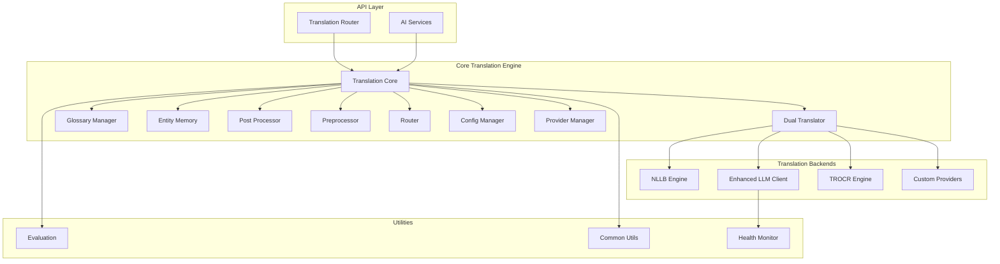
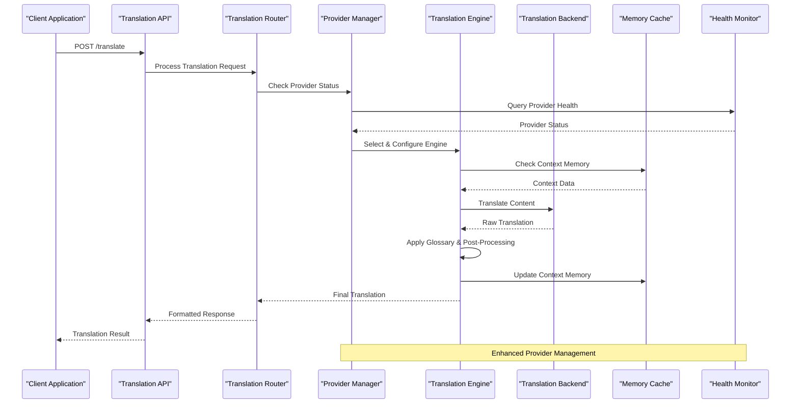
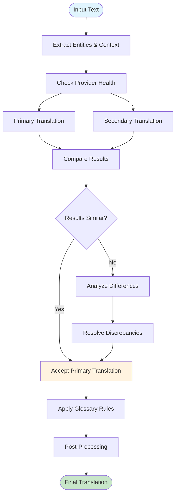
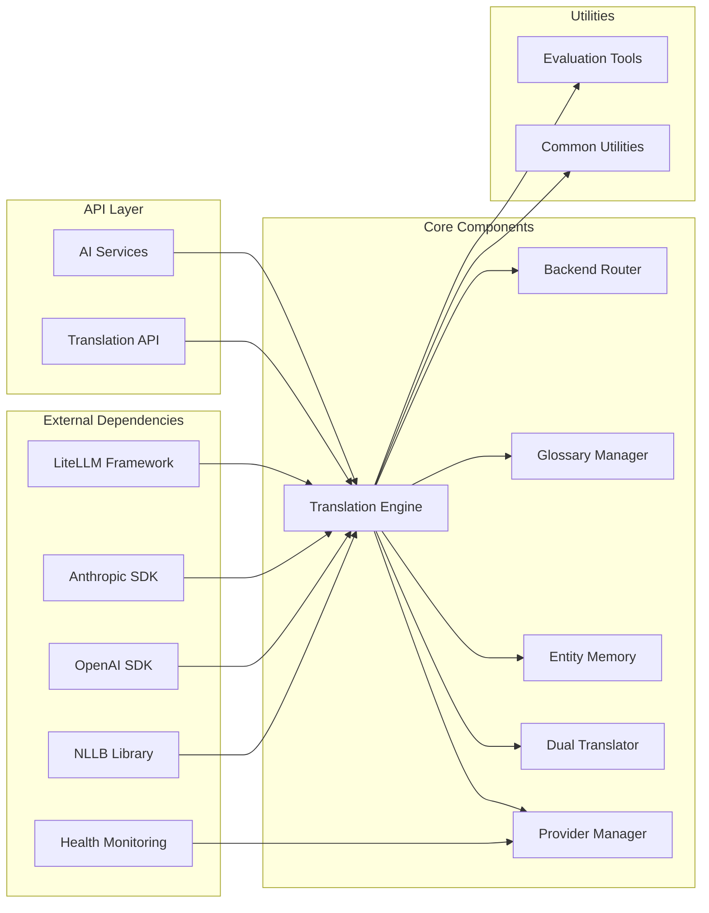

# Translation Services

<cite>
**Referenced Files in This Document**
- [translation.py](file://src/omniscribe/core/translation.py)
- [nllb_engine.py](file://src/omniscribe/core/nllb_engine.py)
- [dual_translator.py](file://src/omniscribe/core/dual_translator.py)
- [glossary.py](file://src/omniscribe/core/glossary.py)
- [entity_memory.py](file://src/omniscribe/core/entity_memory.py)
- [postprocess.py](file://src/omniscribe/core/postprocess.py)
- [preprocessing.py](file://src/omniscribe/core/preprocessing.py)
- [routing.py](file://src/omniscribe/core/routing.py)
- [translation_config.py](file://src/omniscribe/core/translation_config.py)
- [llm_client.py](file://src/omniscribe/core/llm_client.py)
- [trocr_engine.py](file://src/omniscribe/core/trocr_engine.py)
- [evaluation.py](file://src/omniscribe/core/evaluation.py)
- [providers.py](file://src/omniscribe/core/providers.py)
- [translation.py](file://src/omniscribe/api/routers/translation.py)
- [ai.py](file://src/omniscribe/api/services/ai.py)
</cite>

## Update Summary
**Changes Made**
- Enhanced LLM client implementation with improved provider management
- Updated provider abstraction layer for better extensibility
- Improved configuration management for multiple translation backends
- Enhanced error handling and fallback mechanisms
- Added comprehensive provider health monitoring

## Table of Contents
1. [Introduction](#introduction)
2. [Project Structure](#project-structure)
3. [Core Components](#core-components)
4. [Architecture Overview](#architecture-overview)
5. [Detailed Component Analysis](#detailed-component-analysis)
6. [Dependency Analysis](#dependency-analysis)
7. [Performance Considerations](#performance-considerations)
8. [Troubleshooting Guide](#troubleshooting-guide)
9. [Conclusion](#conclusion)
10. [Appendices](#appendices)

## Introduction

LocalDeepL is a comprehensive translation service that provides multilingual processing capabilities with advanced context preservation features. The system supports multiple translation backends including local NLLB models, OpenAI GPT, Anthropic Claude, and custom providers through a pluggable architecture. It implements sophisticated techniques for entity preservation, glossary integration, dual translation for quality assurance, and domain-specific customization.

The platform is designed to handle complex document workflows while maintaining high translation quality through context-aware processing, terminology management, and post-processing refinement. It supports cultural adaptation and domain-specific customization for various use cases ranging from technical documentation to creative content.

**Updated** Enhanced with new LLM client implementation and improved provider management for better scalability and reliability.

## Project Structure

The translation services are organized within a modular architecture that separates concerns between core translation logic, API interfaces, and utility functions. The main components are distributed across several key directories:



**Diagram sources**
- [translation.py](file://src/omniscribe/core/translation.py)
- [providers.py](file://src/omniscribe/core/providers.py)
- [llm_client.py](file://src/omniscribe/core/llm_client.py)

**Section sources**
- [translation.py](file://src/omniscribe/core/translation.py)
- [providers.py](file://src/omniscribe/core/providers.py)
- [llm_client.py](file://src/omniscribe/core/llm_client.py)

## Core Components

### Enhanced Pluggable Translation Architecture

The translation system implements a flexible architecture that supports multiple backend providers through a unified interface. This design enables seamless switching between different translation engines without modifying the core logic.

#### Key Features:
- **Backend Abstraction**: Unified interface for NLLB, OpenAI GPT, Anthropic Claude, and custom providers
- **Dynamic Routing**: Intelligent selection of appropriate translation engine based on configuration
- **Fallback Mechanisms**: Graceful degradation when primary backends fail
- **Configuration Management**: Centralized configuration for all translation backends
- **Health Monitoring**: Real-time provider status tracking and automatic failover

#### Supported Backends:
- **NLLB (No Language Left Behind)**: Meta's open-source multilingual model
- **OpenAI GPT**: Commercial LLM-based translation
- **Anthropic Claude**: Alternative commercial LLM provider
- **Custom Providers**: Extensible interface for additional translation services

### Context-Aware Translation Techniques

The system employs advanced techniques to preserve context throughout the translation process:

#### Entity Preservation:
- **Named Entity Recognition**: Automatic detection and protection of proper nouns, technical terms, and brand names
- **Contextual Memory**: Maintains consistency of translated entities across documents
- **Cross-Document Consistency**: Ensures uniform terminology usage in large projects

#### Glossary Integration:
- **Domain-Specific Terminology**: Custom dictionaries for industry-specific terms
- **Priority-Based Resolution**: Hierarchical glossary matching with fallback mechanisms
- **Dynamic Updates**: Runtime glossary updates without service restart

**Section sources**
- [glossary.py](file://src/omniscribe/core/glossary.py)
- [entity_memory.py](file://src/omniscribe/core/entity_memory.py)

## Architecture Overview

The translation architecture follows a layered approach with clear separation of concerns:



**Diagram sources**
- [translation.py](file://src/omniscribe/core/translation.py)
- [providers.py](file://src/omniscribe/core/providers.py)
- [llm_client.py](file://src/omniscribe/core/llm_client.py)

### Enhanced Dual Translation for Quality Assurance

The system implements a sophisticated dual translation mechanism to ensure high-quality output with improved provider management:



**Diagram sources**
- [dual_translator.py](file://src/omniscribe/core/dual_translator.py)
- [providers.py](file://src/omniscribe/core/providers.py)

## Detailed Component Analysis

### Enhanced Translation Engine Core

The core translation engine orchestrates the entire translation workflow, managing context, glossaries, and backend selection with improved provider management.

#### Key Responsibilities:
- **Workflow Orchestration**: Coordinates preprocessing, translation, and post-processing steps
- **Context Management**: Maintains translation memory and entity consistency
- **Quality Control**: Implements dual translation and result validation
- **Error Handling**: Provides robust error recovery and fallback mechanisms
- **Provider Management**: Handles dynamic provider selection and health monitoring

#### Processing Pipeline:
1. **Input Validation**: Validates input format and language pairs
2. **Context Extraction**: Identifies entities, terminology, and contextual elements
3. **Provider Selection**: Chooses optimal translation engine based on configuration and health
4. **Translation Execution**: Performs actual translation with quality checks
5. **Post-Processing**: Applies glossary rules and formatting adjustments
6. **Output Generation**: Formats results for client consumption

**Section sources**
- [translation.py](file://src/omniscribe/core/translation.py)
- [providers.py](file://src/omniscribe/core/providers.py)

### Enhanced LLM Client Implementation

The LLM client provides abstraction for commercial translation services including OpenAI GPT and Anthropic Claude with improved provider management.

#### Supported Providers:
- **OpenAI GPT**: Advanced neural machine translation
- **Anthropic Claude**: Alternative LLM-based translation
- **Custom Providers**: Extensible interface for additional services

#### Enhanced Features:
- **Rate Limiting**: Built-in request throttling and retry logic
- **Caching**: Response caching for improved performance
- **Fallback Support**: Automatic switching between providers
- **Cost Optimization**: Intelligent provider selection based on cost and quality
- **Health Monitoring**: Real-time provider status tracking
- **Connection Pooling**: Efficient resource utilization

**Section sources**
- [llm_client.py](file://src/omniscribe/core/llm_client.py)
- [providers.py](file://src/omniscribe/core/providers.py)

### Provider Management System

The enhanced provider management system ensures reliable operation through intelligent provider selection and health monitoring.

#### Capabilities:
- **Dynamic Provider Selection**: Automatic selection based on availability, cost, and quality metrics
- **Health Monitoring**: Real-time tracking of provider status and performance
- **Automatic Failover**: Seamless switching to backup providers when primary fails
- **Load Balancing**: Distribution of requests across multiple providers
- **Configuration Management**: Centralized provider configuration and updates

#### Provider Types:
- **Local Providers**: NLLB and other local models
- **Cloud Providers**: OpenAI, Anthropic, and other cloud services
- **Custom Providers**: User-defined translation services
- **Hybrid Providers**: Combination of local and cloud resources

**Section sources**
- [providers.py](file://src/omniscribe/core/providers.py)
- [llm_client.py](file://src/omniscribe/core/llm_client.py)

### NLLB Engine Implementation

The NLLB engine provides local translation capabilities using Meta's No Language Left Behind model.

#### Features:
- **Multilingual Support**: Handles 200+ language pairs
- **Local Processing**: Runs entirely on local hardware for privacy
- **Batch Processing**: Efficient handling of large document batches
- **Memory Optimization**: GPU-accelerated inference with memory management

#### Configuration Options:
- Model selection and quantization levels
- Batch size and parallel processing settings
- Hardware acceleration preferences
- Memory usage limits

**Section sources**
- [nllb_engine.py](file://src/omniscribe/core/nllb_engine.py)

### Glossary Management System

The glossary system ensures consistent terminology across translations through intelligent dictionary management.

#### Capabilities:
- **Hierarchical Dictionaries**: Multiple glossary layers with priority resolution
- **Pattern Matching**: Regular expression support for complex term patterns
- **Context-Aware Lookup**: Term selection based on surrounding text context
- **Dynamic Updates**: Runtime glossary modifications without service interruption

#### Dictionary Formats:
- JSON-based structured dictionaries
- CSV import/export functionality
- Version control integration
- Multi-language support

**Section sources**
- [glossary.py](file://src/omniscribe/core/glossary.py)

### Entity Memory System

The entity memory maintains translation consistency across documents and sessions.

#### Features:
- **Persistent Storage**: Long-term storage of translation decisions
- **Context Tracking**: Maintains relationships between related entities
- **Consensus Building**: Resolves conflicts between different translation choices
- **Learning Capability**: Improves accuracy over time through usage patterns

#### Memory Types:
- **Short-term Memory**: Session-based context retention
- **Long-term Memory**: Persistent entity translations
- **Cross-document Memory**: Shared terminology across projects

**Section sources**
- [entity_memory.py](file://src/omniscribe/core/entity_memory.py)

### Dual Translation Framework

The dual translation framework implements quality assurance through comparative analysis of multiple translation outputs.

#### Quality Metrics:
- **Similarity Scoring**: Measures semantic equivalence between translations
- **Confidence Estimation**: Calculates reliability scores for translation decisions
- **Divergence Detection**: Identifies significant differences requiring human review
- **Consistency Checking**: Validates adherence to glossary and style guidelines

#### Resolution Strategies:
- **Majority Voting**: When multiple backends are used
- **Quality Thresholds**: Automatic acceptance/rejection based on confidence scores
- **Human-in-the-loop**: Escalation to human reviewers for ambiguous cases

**Section sources**
- [dual_translator.py](file://src/omniscribe/core/dual_translator.py)

## Dependency Analysis

The translation system exhibits a well-structured dependency hierarchy with clear separation between core logic and external integrations:



**Diagram sources**
- [translation.py](file://src/omniscribe/core/translation.py)
- [providers.py](file://src/omniscribe/core/providers.py)
- [llm_client.py](file://src/omniscribe/core/llm_client.py)

### Coupling Analysis

The system demonstrates low coupling between components through well-defined interfaces:

- **Interface Segregation**: Each component exposes minimal, focused APIs
- **Dependency Injection**: Loose coupling through configurable dependencies
- **Event-Driven Communication**: Asynchronous communication between components
- **Plugin Architecture**: Extensible design for adding new translation backends

### External Dependencies

Key external libraries and their roles:

- **Transformers**: Hugging Face transformers for NLLB model loading
- **PyTorch/TensorFlow**: Deep learning framework for model inference
- **FastAPI**: High-performance web framework for API endpoints
- **Redis**: In-memory data store for caching and session management
- **SQLAlchemy**: Database ORM for persistent storage
- **Health Libraries**: Provider health monitoring and status tracking

**Section sources**
- [translation.py](file://src/omniscribe/core/translation.py)
- [providers.py](file://src/omniscribe/core/providers.py)

## Performance Considerations

### Optimization Strategies

#### Caching Mechanisms:
- **Response Caching**: Stores frequently requested translations
- **Context Caching**: Reuses extracted entities and context information
- **Model Caching**: Keeps loaded models in memory for faster inference
- **Database Query Caching**: Reduces database load for repeated lookups
- **Provider Response Caching**: Caches responses from external providers

#### Concurrency Control:
- **Async Processing**: Non-blocking I/O operations for better throughput
- **Connection Pooling**: Efficient resource utilization for external APIs
- **Batch Processing**: Groups similar requests for optimized execution
- **Load Balancing**: Distributes work across multiple worker processes
- **Provider Load Distribution**: Smart routing based on provider capacity

#### Memory Management:
- **Lazy Loading**: Defers resource-intensive operations until needed
- **Garbage Collection**: Aggressive cleanup of temporary objects
- **Streaming Processing**: Handles large documents without excessive memory usage
- **Resource Limits**: Prevents memory leaks through strict resource tracking
- **Provider Connection Management**: Efficient connection pooling for external services

### Scaling Considerations

#### Horizontal Scaling:
- **Stateless Design**: Enables easy horizontal scaling
- **Shared State**: Redis-backed state sharing across instances
- **Load Distribution**: Round-robin or weighted request distribution
- **Auto-scaling**: Dynamic resource allocation based on demand
- **Provider Pool Scaling**: Dynamic scaling of available providers

#### Vertical Scaling:
- **GPU Acceleration**: Leverages GPU resources for NLLB inference
- **CPU Optimization**: Multi-threaded processing for CPU-bound tasks
- **Memory Tuning**: Configurable memory limits per process
- **I/O Optimization**: Asynchronous I/O for better resource utilization
- **Provider Connection Tuning**: Optimized connection parameters for external services

## Troubleshooting Guide

### Common Issues and Solutions

#### Translation Quality Problems:
- **Symptom**: Poor translation quality for specific domains
- **Solution**: Add domain-specific glossary entries and adjust context window size
- **Diagnostic**: Check glossary coverage and entity recognition accuracy

#### Performance Bottlenecks:
- **Symptom**: Slow translation response times
- **Solution**: Enable caching, optimize batch sizes, and consider GPU acceleration
- **Diagnostic**: Monitor memory usage and API call latency

#### Provider Connectivity Issues:
- **Symptom**: Failed connections to external translation services
- **Solution**: Verify API keys, check rate limits, and implement retry logic
- **Diagnostic**: Review connection logs and error messages
- **Enhanced**: Check provider health status and automatic failover logs

#### Memory Exhaustion:
- **Symptom**: Out-of-memory errors during large document processing
- **Solution**: Reduce batch sizes, enable streaming, and optimize model loading
- **Diagnostic**: Monitor memory profiles and identify memory leaks

#### Provider Health Issues:
- **Symptom**: Intermittent failures with specific providers
- **Solution**: Check provider health monitoring and configure appropriate fallbacks
- **Diagnostic**: Review provider health logs and performance metrics

### Debugging Tools

#### Logging and Monitoring:
- **Structured Logging**: Comprehensive logging with correlation IDs
- **Performance Metrics**: Real-time monitoring of translation quality and speed
- **Error Tracking**: Centralized error collection and analysis
- **Health Checks**: Service health monitoring and alerting
- **Provider Health Dashboard**: Real-time provider status visualization

#### Diagnostic Utilities:
- **Translation Profiler**: Analyzes translation pipeline performance
- **Glossary Analyzer**: Evaluates glossary effectiveness and coverage
- **Quality Evaluator**: Automated testing of translation quality metrics
- **Memory Inspector**: Identifies memory usage patterns and potential leaks
- **Provider Health Checker**: Diagnoses provider connectivity and performance issues

**Section sources**
- [evaluation.py](file://src/omniscribe/core/evaluation.py)
- [providers.py](file://src/omniscribe/core/providers.py)

## Conclusion

LocalDeepL's translation services provide a comprehensive, enterprise-grade solution for multilingual processing with advanced context preservation capabilities. The enhanced pluggable architecture supports multiple translation backends while maintaining consistent quality through dual translation, glossary integration, and entity memory systems.

The system's modular design enables easy customization and extension, making it suitable for diverse use cases from technical documentation to creative content translation. With built-in performance optimizations, robust error handling, comprehensive monitoring capabilities, and enhanced provider management, it provides a reliable foundation for production translation workflows.

Key strengths include:
- **Flexibility**: Support for multiple translation backends and custom providers
- **Quality Assurance**: Dual translation with automated quality evaluation
- **Context Preservation**: Advanced entity and terminology management
- **Scalability**: Horizontal and vertical scaling capabilities
- **Extensibility**: Plugin architecture for custom requirements
- **Reliability**: Enhanced provider management with health monitoring and automatic failover

The system continues to evolve with ongoing improvements in model quality, performance optimization, feature enhancements, and provider management capabilities, ensuring it remains at the forefront of translation technology.

## Appendices

### Configuration Examples

#### Basic NLLB Configuration:
```yaml
translation:
  backend: nllb
  model: "facebook/nllb-200-distilled-600M"
  device: "cuda"
  batch_size: 4
  max_length: 512
```

#### Enhanced Multi-Provider Setup:
```yaml
translation:
  primary_backend: gpt
  fallback_backend: claude
  provider_management:
    health_check_interval: 30
    failover_threshold: 3
    load_balancing: round_robin
  nllb_config:
    model: "facebook/nllb-200-distilled-600M"
    device: "auto"
  llm_config:
    openai_api_key: "${OPENAI_API_KEY}"
    anthropic_api_key: "${ANTHROPIC_API_KEY}"
    default_model: "gpt-4"
    rate_limiting:
      requests_per_minute: 100
      timeout: 30
```

#### Glossary Configuration:
```yaml
glossary:
  enabled: true
  dictionaries:
    - name: "technical_terms"
      path: "/path/to/tech_glossary.json"
      priority: 1
    - name: "brand_names"
      path: "/path/to/brands.csv"
      priority: 2
```

### API Endpoints Reference

#### Translation Endpoint:
- **Method**: POST
- **Path**: `/api/v1/translate`
- **Content-Type**: `application/json`
- **Authentication**: Required

#### Provider Management:
- **Method**: GET
- **Path**: `/api/v1/providers/status`
- **Description**: Get current provider health status

#### Configuration Management:
- **Method**: GET/PUT
- **Path**: `/api/v1/config/translation`
- **Description**: Retrieve and update translation configuration

#### Quality Evaluation:
- **Method**: POST
- **Path**: `/api/v1/evaluate`
- **Description**: Evaluate translation quality against reference texts

**Section sources**
- [translation.py](file://src/omniscribe/api/routers/translation.py)
- [ai.py](file://src/omniscribe/api/services/ai.py)
- [providers.py](file://src/omniscribe/core/providers.py)