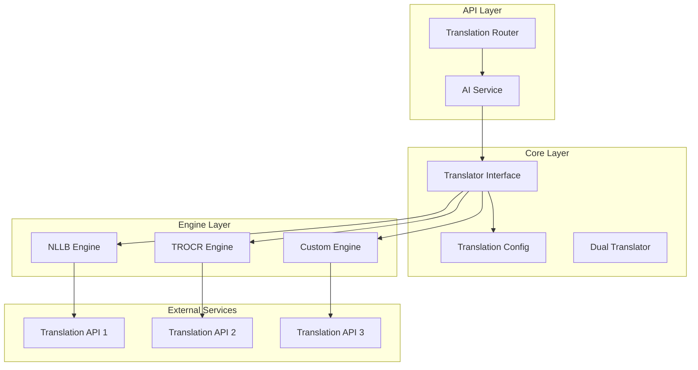
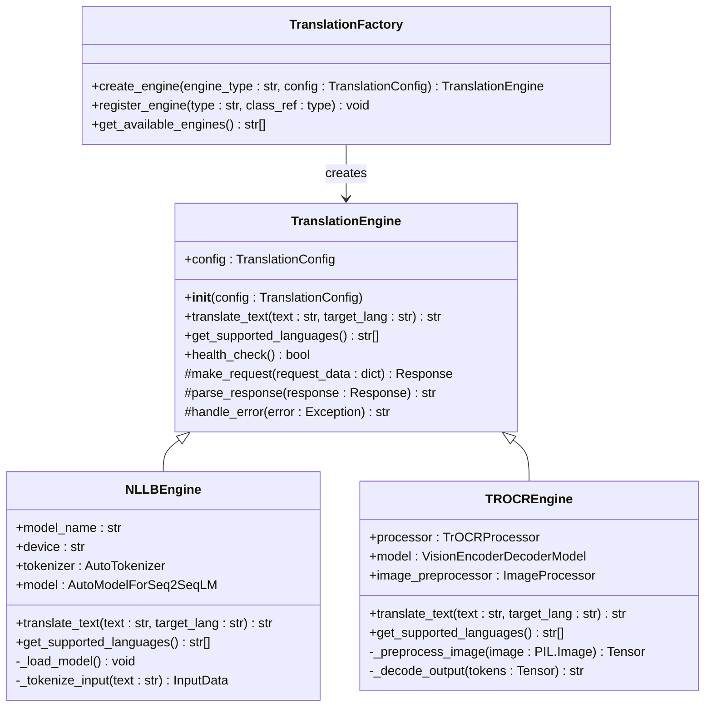
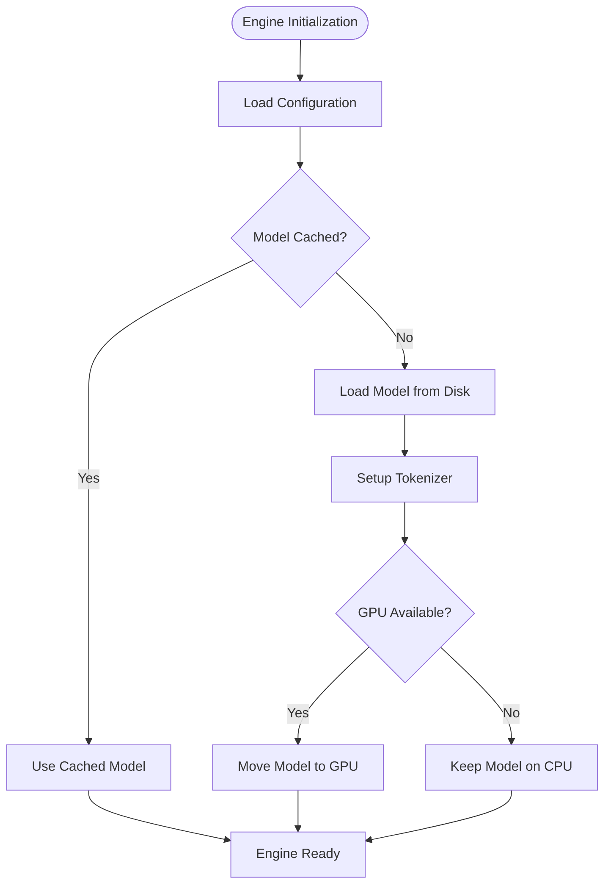
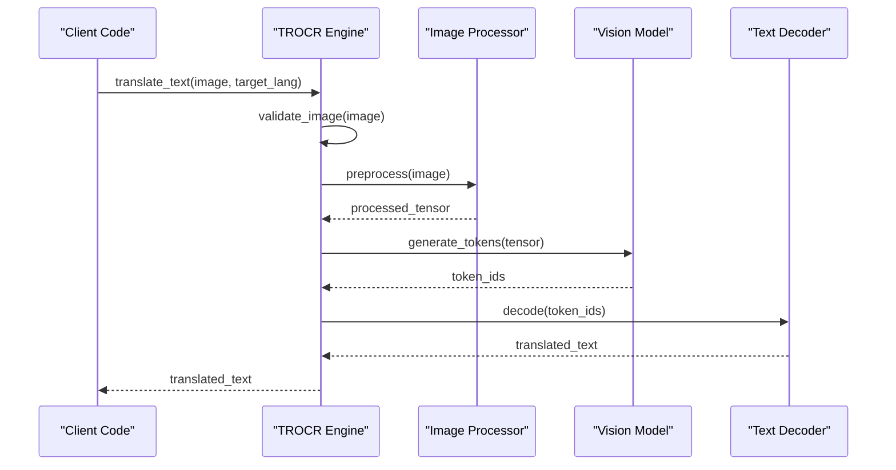
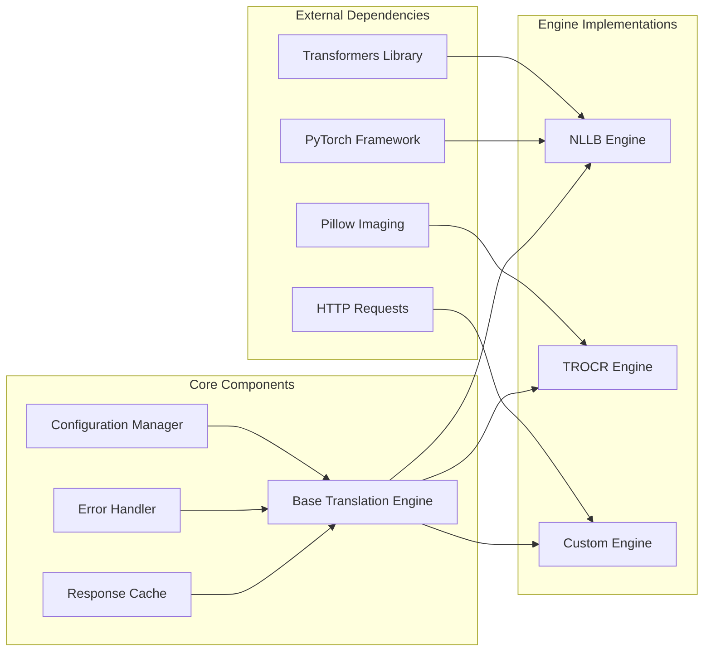

# Custom Engine Integration

<cite>
**Referenced Files in This Document**
- [nllb_engine.py](file://src/local_deepl/core/nllb_engine.py)
- [trocr_engine.py](file://src/local_deepl/core/trocr_engine.py)
- [translation.py](file://src/local_deepl/core/translation.py)
- [translation_config.py](file://src/local_deepl/core/translation_config.py)
- [dual_translator.py](file://src/local_deepl/core/dual_translator.py)
- [translation_router.py](file://src/local_deepl/api/routers/translation.py)
- [ai_service.py](file://src/local_deepl/api/services/ai.py)
</cite>

## Table of Contents
1. [Introduction](#introduction)
2. [Project Structure](#project-structure)
3. [Core Components](#core-components)
4. [Architecture Overview](#architecture-overview)
5. [Detailed Component Analysis](#detailed-component-analysis)
6. [Dependency Analysis](#dependency-analysis)
7. [Performance Considerations](#performance-considerations)
8. [Troubleshooting Guide](#troubleshooting-guide)
9. [Conclusion](#conclusion)
10. [Appendices](#appendices)

## Introduction

LocalDeepL is a comprehensive OCR and document processing framework that supports multiple translation backends through a modular engine architecture. The framework provides a standardized interface for integrating custom translation engines, allowing developers to extend the system with new translation providers while maintaining consistency in behavior and error handling.

This document explains how to integrate custom translation engines into LocalDeepL, covering the engine interface requirements, implementation patterns, registration mechanisms, and best practices for authentication, request formatting, response parsing, and error management.

## Project Structure

The LocalDeepL translation system follows a layered architecture with clear separation of concerns:

**Diagram sources**
- [translation_router.py:1-100](file://src/local_deepl/api/routers/translation.py#L1-L100)
- [ai_service.py:1-150](file://src/local_deepl/api/services/ai.py#L1-L150)
- [translation.py:1-200](file://src/local_deepl/core/translation.py#L1-L200)

**Section sources**
- [translation.py:1-200](file://src/local_deepl/core/translation.py#L1-L200)
- [translation_config.py:1-100](file://src/local_deepl/core/translation_config.py#L1-L100)

## Core Components

### Translation Engine Interface

The core translation system is built around a standardized interface that all engines must implement. This interface ensures consistent behavior across different translation providers.

#### Base Class Requirements

All custom translation engines must inherit from the base translation engine class and implement the following core methods:

- **`__init__`**: Initialize engine configuration and authentication
- **`translate_text`**: Core translation method accepting source text and target language
- **`get_supported_languages`**: Return list of supported language codes
- **`health_check`**: Verify engine connectivity and availability

#### Required Method Signatures

| Method | Parameters | Returns | Description |
|--------|------------|---------|-------------|
| `__init__` | `config: TranslationConfig` | `None` | Initialize with configuration object |
| `translate_text` | `text: str, target_lang: str` | `str` | Translate text to target language |
| `get_supported_languages` | None | `List[str]` | Return supported language codes |
| `health_check` | None | `bool` | Check engine health status |

#### Optional Enhancement Methods

Engines can optionally implement these methods for enhanced functionality:

- **`batch_translate`**: Process multiple texts in a single API call
- **`get_rate_limits`**: Return rate limiting information
- **`configure_retry`**: Set up retry logic for failed requests
- **`cache_response`**: Implement response caching strategy

**Section sources**
- [translation.py:50-150](file://src/local_deepl/core/translation.py#L50-L150)
- [translation_config.py:20-80](file://src/local_deepl/core/translation_config.py#L20-L80)

## Architecture Overview

The LocalDeepL translation architecture follows a factory pattern with dependency injection, enabling seamless integration of new engines without modifying core logic.

**Diagram sources**
- [translation.py:1-200](file://src/local_deepl/core/translation.py#L1-L200)
- [nllb_engine.py:1-150](file://src/local_deepl/core/nllb_engine.py#L1-L150)
- [trocr_engine.py:1-150](file://src/local_deepl/core/trocr_engine.py#L1-L150)

## Detailed Component Analysis

### NLLB Engine Implementation

The NLLB (No Language Left Behind) engine demonstrates a complete implementation of the translation interface using Facebook's multilingual translation model.

#### Key Implementation Patterns

1. **Model Loading and Caching**: Models are loaded once and cached for performance
2. **Tokenization Pipeline**: Text is tokenized using appropriate tokenizer for each language pair
3. **Device Management**: Automatic GPU/CPU device selection with memory optimization
4. **Error Handling**: Comprehensive error handling for model loading and inference failures

#### Authentication and Configuration

NLLB engine uses local model files, eliminating external authentication requirements:

**Diagram sources**
- [nllb_engine.py:1-100](file://src/local_deepl/core/nllb_engine.py#L1-L100)

**Section sources**
- [nllb_engine.py:1-200](file://src/local_deepl/core/nllb_engine.py#L1-L200)

### TROCR Engine Implementation

The TROCR (Transformer-based Optical Character Recognition) engine handles image-to-text translation with advanced preprocessing capabilities.

#### Image Processing Pipeline

TROCR implements a sophisticated image preprocessing pipeline:

1. **Image Validation**: Format and size validation
2. **Preprocessing**: Normalization and augmentation
3. **Model Inference**: Transformer-based text generation
4. **Post-processing**: Text cleanup and confidence scoring

#### Request Formatting and Response Parsing

**Diagram sources**
- [trocr_engine.py:1-150](file://src/local_deepl/core/trocr_engine.py#L1-L150)

**Section sources**
- [trocr_engine.py:1-200](file://src/local_deepl/core/trocr_engine.py#L1-L200)

### Translation Configuration System

The configuration system provides a unified way to manage settings across different translation engines.

#### Configuration Schema

| Parameter | Type | Default | Description |
|-----------|------|---------|-------------|
| `engine_type` | `str` | `"nllb"` | Type of translation engine |
| `model_path` | `str` | `""` | Path to model files |
| `device` | `str` | `"auto"` | Device for model execution |
| `batch_size` | `int` | `1` | Batch processing size |
| `timeout` | `int` | `30` | Request timeout in seconds |
| `retry_attempts` | `int` | `3` | Number of retry attempts |
| `api_key` | `str` | `""` | API key for external services |
| `base_url` | `str` | `""` | Base URL for API endpoints |

#### Configuration Validation

The system validates configurations at initialization time, providing clear error messages for missing or invalid parameters.

**Section sources**
- [translation_config.py:1-150](file://src/local_deepl/core/translation_config.py#L1-L150)

## Dependency Analysis

The translation system maintains loose coupling between components through well-defined interfaces and dependency injection patterns.

**Diagram sources**
- [translation.py:1-100](file://src/local_deepl/core/translation.py#L1-L100)
- [nllb_engine.py:1-50](file://src/local_deepl/core/nllb_engine.py#L1-L50)
- [trocr_engine.py:1-50](file://src/local_deepl/core/trocr_engine.py#L1-L50)

**Section sources**
- [dual_translator.py:1-100](file://src/local_deepl/core/dual_translator.py#L1-L100)

## Performance Considerations

### Memory Management

Translation engines should implement efficient memory management strategies:

- **Model Caching**: Load models once and reuse across requests
- **Batch Processing**: Process multiple texts when possible
- **Memory Cleanup**: Release unused resources promptly
- **GPU Optimization**: Utilize GPU memory efficiently with mixed precision

### Request Optimization

- **Connection Pooling**: Reuse HTTP connections for API-based engines
- **Request Batching**: Combine multiple translation requests
- **Caching Strategy**: Implement intelligent response caching
- **Timeout Configuration**: Set appropriate timeouts for different operations

### Concurrency Handling

- **Thread Safety**: Ensure thread-safe operation in multi-threaded environments
- **Async Support**: Provide async versions of blocking operations
- **Rate Limiting**: Respect API rate limits and implement backoff strategies

## Troubleshooting Guide

### Common Integration Issues

#### Engine Registration Failures

**Problem**: Custom engine not found during initialization
**Solution**: Ensure proper registration in the engine factory and verify import paths

#### Authentication Errors

**Problem**: API authentication failures
**Solution**: Validate API keys, check network connectivity, and verify endpoint URLs

#### Memory Issues

**Problem**: Out of memory errors during translation
**Solution**: Reduce batch size, enable model quantization, or switch to CPU processing

#### Performance Degradation

**Problem**: Slow translation speeds
**Solution**: Enable GPU acceleration, optimize batch sizes, and implement response caching

### Debugging Techniques

1. **Enable Verbose Logging**: Configure detailed logging for request/response cycles
2. **Health Checks**: Regularly monitor engine health and resource usage
3. **Performance Profiling**: Use profiling tools to identify bottlenecks
4. **Error Tracking**: Implement comprehensive error tracking and reporting

### Testing Strategies

#### Unit Testing

Create comprehensive unit tests for custom engines:

- Mock external API calls
- Test error handling scenarios
- Validate input/output formats
- Check configuration validation

#### Integration Testing

Test engines in realistic environments:

- End-to-end translation workflows
- Concurrent request handling
- Resource cleanup verification
- Performance benchmarking

**Section sources**
- [translation.py:150-300](file://src/local_deepl/core/translation.py#L150-L300)

## Conclusion

Integrating custom translation engines into LocalDeepL requires understanding the standardized interface, implementing required methods, and following established patterns for authentication, error handling, and performance optimization. The framework's modular architecture enables seamless integration while maintaining consistency across different translation providers.

Key success factors include:

- Proper implementation of the base engine interface
- Comprehensive error handling and logging
- Efficient resource management and caching strategies
- Thorough testing across various scenarios
- Clear documentation of configuration options and limitations

By following the patterns demonstrated in the NLLB and TROCR implementations, developers can create robust, high-performance translation engines that integrate seamlessly with the LocalDeepL ecosystem.

## Appendices

### Step-by-Step Integration Guide

1. **Create Engine Class**: Inherit from base translation engine
2. **Implement Required Methods**: Complete all mandatory interface methods
3. **Handle Authentication**: Implement secure credential management
4. **Add Error Handling**: Implement comprehensive error recovery
5. **Register Engine**: Add to the engine factory registry
6. **Write Tests**: Create unit and integration tests
7. **Document Configuration**: Provide clear configuration documentation
8. **Performance Testing**: Benchmark and optimize performance

### Best Practices Checklist

- [ ] Implement all required interface methods
- [ ] Handle all error scenarios gracefully
- [ ] Include comprehensive logging
- [ ] Support both sync and async operations
- [ ] Implement proper resource cleanup
- [ ] Add configuration validation
- [ ] Write comprehensive tests
- [ ] Document all configuration options
- [ ] Monitor performance metrics
- [ ] Handle rate limiting appropriately