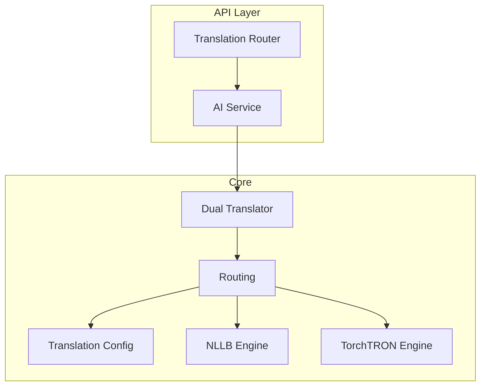
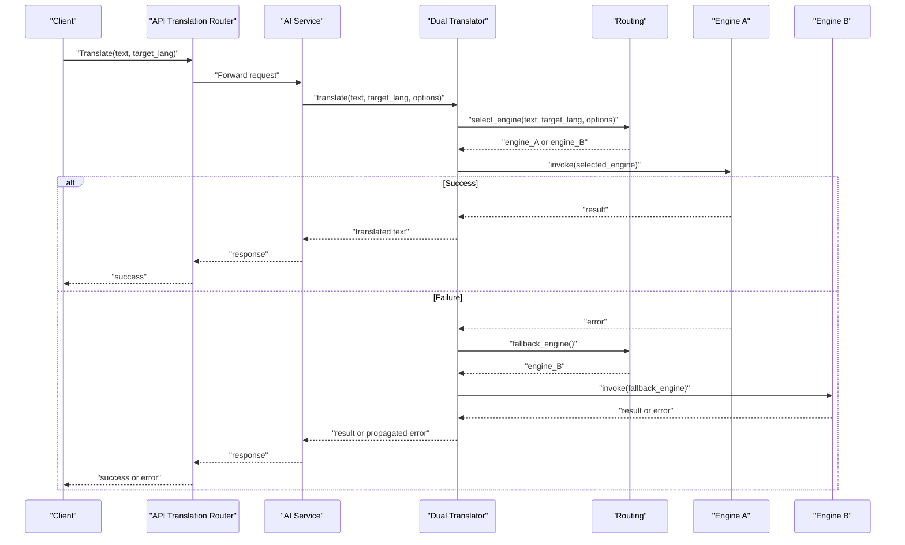
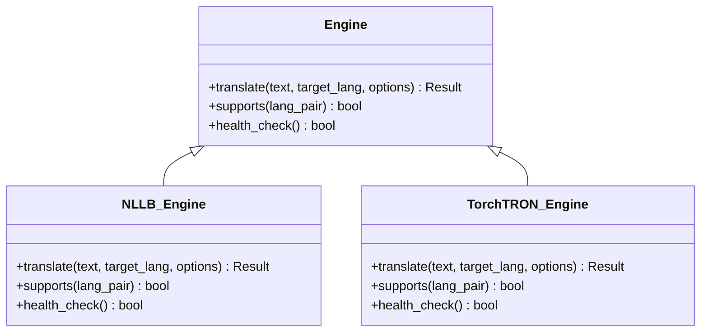
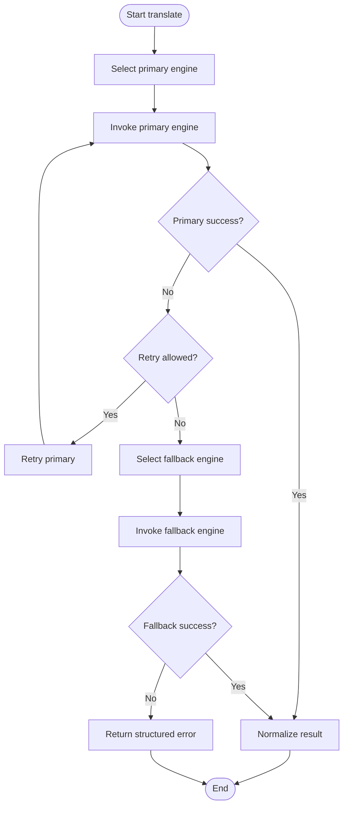
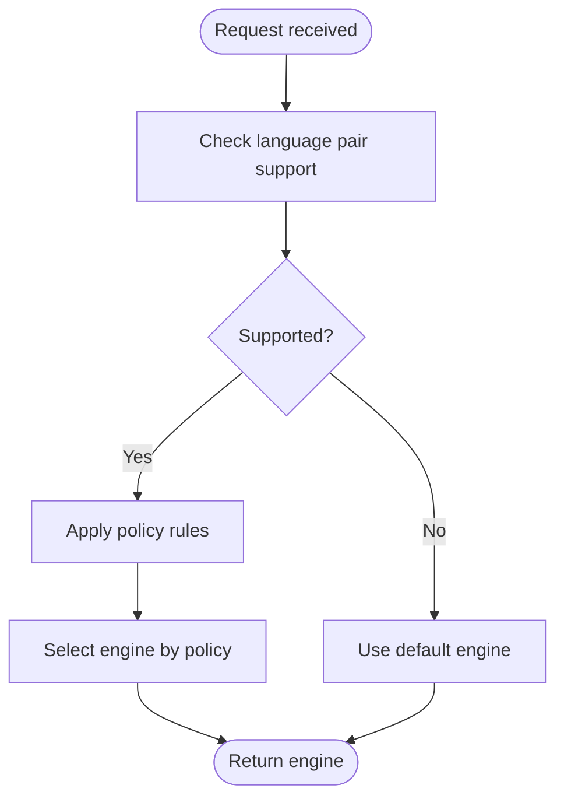
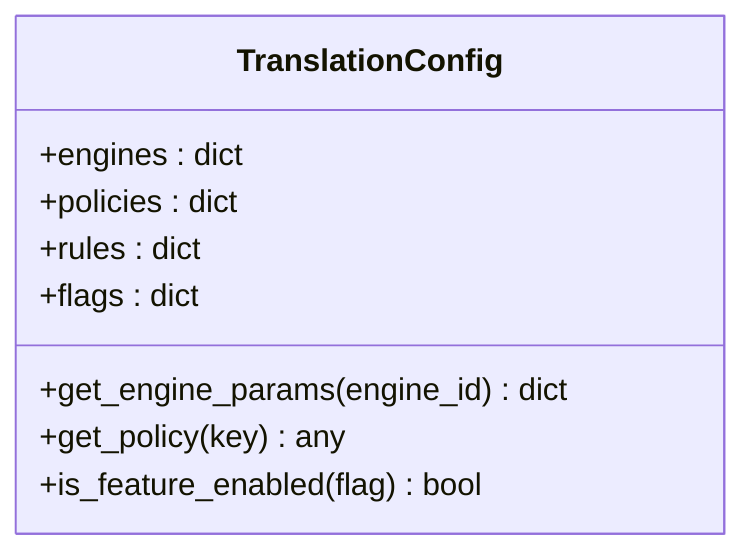
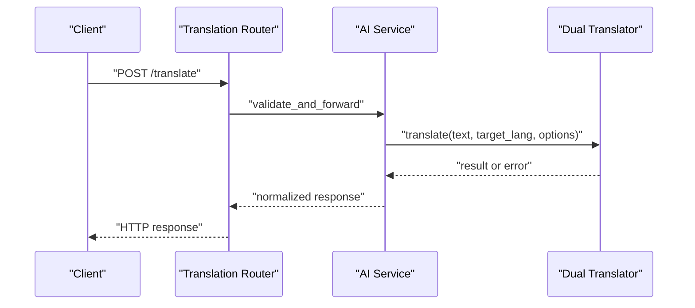
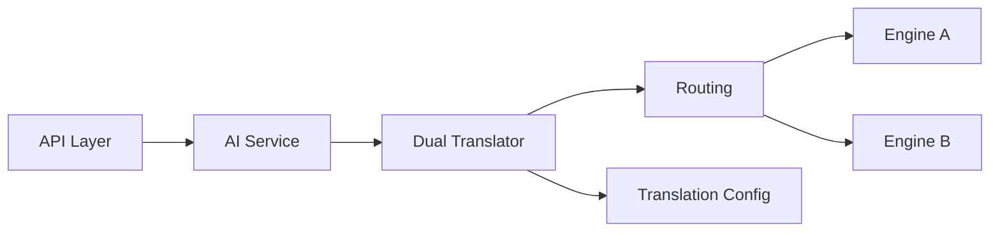

# Dual Translator Architecture

<cite>
**Referenced Files in This Document**
- [dual_translator.py](file://src/local_deepl/core/dual_translator.py)
- [nllb_engine.py](file://src/local_deepl/core/nllb_engine.py)
- [trocr_engine.py](file://src/local_deepl/core/trocr_engine.py)
- [translation_config.py](file://src/local_deepl/core/translation_config.py)
- [translation_tree.py](file://src/local_deepl/core/translation_tree.py)
- [entity_memory.py](file://src/local_deepl/core/entity_memory.py)
- [block_tree.py](file://src/local_deepl/core/block_tree.py)
- [routing.py](file://src/local_deepl/core/routing.py)
- [translation.py](file://src/local_deepl/core/translation.py)
- [api_routers_translation.py](file://src/local_deepl/api/routers/translation.py)
- [ai_service.py](file://src/local_deepl/api/services/ai.py)
</cite>

## Table of Contents
1. [Introduction](#introduction)
2. [Project Structure](#project-structure)
3. [Core Components](#core-components)
4. [Architecture Overview](#architecture-overview)
5. [Detailed Component Analysis](#detailed-component-analysis)
6. [Dependency Analysis](#dependency-analysis)
7. [Performance Considerations](#performance-considerations)
8. [Troubleshooting Guide](#troubleshooting-guide)
9. [Conclusion](#conclusion)
10. [Appendices](#appendices)

## Introduction
This document explains the dual translator architecture that enables switching between multiple translation engines with automatic fallback and robust error handling. It focuses on the engine abstraction layer, configuration management, request routing logic, and strategies for selecting engines based on criteria such as language pairs, latency, and availability. The goal is to provide a clear understanding of how different engines are integrated and orchestrated to deliver resilient translation services.

## Project Structure
The dual translator functionality spans several modules:
- Engine abstractions and implementations define a common interface for translation backends.
- Configuration defines engine-specific settings and global policies.
- Routing selects an engine per request and coordinates fallbacks.
- API layers expose endpoints that delegate to the orchestrator.

**Diagram sources**
- [api_routers_translation.py](file://src/local_deepl/api/routers/translation.py)
- [ai_service.py](file://src/local_deepl/api/services/ai.py)
- [dual_translator.py](file://src/local_deepl/core/dual_translator.py)
- [routing.py](file://src/local_deepl/core/routing.py)
- [translation_config.py](file://src/local_deepl/core/translation_config.py)
- [nllb_engine.py](file://src/local_deepl/core/nllb_engine.py)
- [trocr_engine.py](file://src/local_deepl/core/trocr_engine.py)

**Section sources**
- [dual_translator.py](file://src/local_deepl/core/dual_translator.py)
- [nllb_engine.py](file://src/local_deepl/core/nllb_engine.py)
- [trocr_engine.py](file://src/local_deepl/core/trocr_engine.py)
- [translation_config.py](file://src/local_deepl/core/translation_config.py)
- [routing.py](file://src/local_deepl/core/routing.py)
- [translation.py](file://src/local_deepl/core/translation.py)
- [api_routers_translation.py](file://src/local_deepl/api/routers/translation.py)
- [ai_service.py](file://src/local_deepl/api/services/ai.py)

## Core Components
- Engine Abstraction: A unified interface that all translation engines implement, ensuring consistent request/response shapes and error contracts.
- Dual Translator: Orchestrates engine selection, fallback, retries, and result aggregation.
- Translation Tree (`translation_tree.py`): Tree-aware translation that walks a `DocumentTree` (from `block_tree.py`), translates each text block preserving structure (headings stay headings, tables stay tables), and writes translations back into the tree. Uses a pluggable async `TranslatorFn` callable.
- Entity Memory (`entity_memory.py`): Tracks named entities across translation chunks for consistency (e.g., ensuring a person's name is transliterated the same way throughout the document).
- Block Tree (`block_tree.py`): Rich document IR carrying structural information (headings, tables, figures, sections, spans) needed for structure-preserving translation and structured export (DOCX, HTML, block-tree JSON).
- Routing: Encapsulates decision logic for choosing an engine based on configuration and runtime context.
- Translation Config: Centralizes engine parameters, policies (retries, timeouts), and feature flags.
- API Integration: Exposes endpoints that route requests through the AI service into the dual translator pipeline.

Key responsibilities:
- Normalize inputs across engines.
- Enforce policies like timeouts and retry limits.
- Provide deterministic or policy-driven engine selection.
- Aggregate metrics and errors for observability.

**Section sources**
- [dual_translator.py](file://src/local_deepl/core/dual_translator.py)
- [routing.py](file://src/local_deepl/core/routing.py)
- [translation_config.py](file://src/local_deepl/core/translation_config.py)
- [translation.py](file://src/local_deepl/core/translation.py)

## Architecture Overview
The dual translator uses a strategy pattern where engines are interchangeable implementations of a common interface. The orchestrator applies selection rules and fallback chains to ensure reliability and performance.

**Diagram sources**
- [api_routers_translation.py](file://src/local_deepl/api/routers/translation.py)
- [ai_service.py](file://src/local_deepl/api/services/ai.py)
- [dual_translator.py](file://src/local_deepl/core/dual_translator.py)
- [routing.py](file://src/local_deepl/core/routing.py)
- [nllb_engine.py](file://src/local_deepl/core/nllb_engine.py)
- [trocr_engine.py](file://src/local_deepl/core/trocr_engine.py)

## Detailed Component Analysis

### Engine Abstraction Layer
- Purpose: Define a stable contract for translation engines so they can be swapped without changing higher-level logic.
- Responsibilities:
  - Accept normalized input payloads.
  - Return standardized outputs.
  - Raise consistent exceptions on failures.
- Implementation examples:
  - NLLB Engine: Implements the interface for a local NLLB-based model.
  - TorchTRON Engine: Implements the interface for a TorchTRON-based model.

**Diagram sources**
- [nllb_engine.py](file://src/local_deepl/core/nllb_engine.py)
- [trocr_engine.py](file://src/local_deepl/core/trocr_engine.py)

**Section sources**
- [nllb_engine.py](file://src/local_deepl/core/nllb_engine.py)
- [trocr_engine.py](file://src/local_deepl/core/trocr_engine.py)

### Dual Translator Orchestration
- Purpose: Coordinate engine selection, fallback, retries, and result normalization.
- Key behaviors:
  - Select primary engine based on routing rules.
  - Execute with timeout and retry policies.
  - Fallback to secondary engine on failure.
  - Aggregate metrics and propagate structured errors.

**Diagram sources**
- [dual_translator.py](file://src/local_deepl/core/dual_translator.py)
- [routing.py](file://src/local_deepl/core/routing.py)

**Section sources**
- [dual_translator.py](file://src/local_deepl/core/dual_translator.py)

### Routing Logic
- Purpose: Determine which engine to use for a given request.
- Criteria:
  - Language pair support.
  - Engine capabilities and constraints.
  - Policy flags from configuration.
  - Health status and load signals.
- Behavior:
  - Returns a selected engine instance.
  - Provides fallback selection when primary fails.

**Diagram sources**
- [routing.py](file://src/local_deepl/core/routing.py)
- [translation_config.py](file://src/local_deepl/core/translation_config.py)

**Section sources**
- [routing.py](file://src/local_deepl/core/routing.py)
- [translation_config.py](file://src/local_deepl/core/translation_config.py)

### Configuration Management
- Purpose: Centralize engine parameters, policies, and feature toggles.
- Typical keys:
  - Engine-specific settings (model paths, device, batch size).
  - Global policies (timeout, max_retries, jitter).
  - Selection rules (language pair mappings, priority lists).
  - Feature flags (enable/disable engines, force fallback).
- Usage:
  - Loaded at startup and consumed by routing and dual translator.
  - Supports environment overrides for deployment flexibility.

**Diagram sources**
- [translation_config.py](file://src/local_deepl/core/translation_config.py)

**Section sources**
- [translation_config.py](file://src/local_deepl/core/translation_config.py)

### API Integration
- Purpose: Expose translation endpoints that delegate to the AI service and then to the dual translator.
- Flow:
  - HTTP router receives request.
  - AI service validates and forwards to dual translator.
  - Response is returned to client.

**Diagram sources**
- [api_routers_translation.py](file://src/local_deepl/api/routers/translation.py)
- [ai_service.py](file://src/local_deepl/api/services/ai.py)
- [dual_translator.py](file://src/local_deepl/core/dual_translator.py)

**Section sources**
- [api_routers_translation.py](file://src/local_deepl/api/routers/translation.py)
- [ai_service.py](file://src/local_deepl/api/services/ai.py)

## Dependency Analysis
- Coupling:
  - Dual translator depends on routing and configuration.
  - Engines depend only on the abstract interface.
  - API layer depends on AI service and dual translator.
- Cohesion:
  - Each module has a single responsibility (selection, orchestration, implementation, config, API).
- External dependencies:
  - Engine implementations may rely on external libraries (e.g., model runtimes).

**Diagram sources**
- [api_routers_translation.py](file://src/local_deepl/api/routers/translation.py)
- [ai_service.py](file://src/local_deepl/api/services/ai.py)
- [dual_translator.py](file://src/local_deepl/core/dual_translator.py)
- [routing.py](file://src/local_deepl/core/routing.py)
- [translation_config.py](file://src/local_deepl/core/translation_config.py)
- [nllb_engine.py](file://src/local_deepl/core/nllb_engine.py)
- [trocr_engine.py](file://src/local_deepl/core/trocr_engine.py)

**Section sources**
- [dual_translator.py](file://src/local_deepl/core/dual_translator.py)
- [routing.py](file://src/local_deepl/core/routing.py)
- [translation_config.py](file://src/local_deepl/core/translation_config.py)
- [nllb_engine.py](file://src/local_deepl/core/nllb_engine.py)
- [trocr_engine.py](file://src/local_deepl/core/trocr_engine.py)
- [api_routers_translation.py](file://src/local_deepl/api/routers/translation.py)
- [ai_service.py](file://src/local_deepl/api/services/ai.py)

## Performance Considerations
- Concurrency:
  - Use asynchronous calls for I/O-bound operations where applicable.
  - Limit concurrent invocations per engine to avoid resource exhaustion.
- Caching:
  - Cache frequent translations at segment or sentence level.
  - Implement cache invalidation based on content hash and versioning.
- Batching:
  - Batch small segments to reduce overhead when supported by engines.
- Resource Management:
  - Preload models and reuse instances.
  - Monitor memory and GPU usage; scale horizontally if needed.
- Timeouts and Retries:
  - Configure per-engine timeouts and exponential backoff with jitter.
  - Avoid thundering herds by randomizing retry delays.

[No sources needed since this section provides general guidance]

## Troubleshooting Guide
Common issues and resolutions:
- Engine selection failures:
  - Verify language pair support and policy rules.
  - Check health checks and availability flags.
- Timeout errors:
  - Increase timeouts or reduce payload sizes.
  - Investigate engine resource saturation.
- Retry storms:
  - Adjust retry limits and backoff strategies.
  - Add circuit breaker patterns to prevent cascading failures.
- Inconsistent results:
  - Normalize outputs consistently across engines.
  - Validate inputs before invoking engines.

**Section sources**
- [dual_translator.py](file://src/local_deepl/core/dual_translator.py)
- [routing.py](file://src/local_deepl/core/routing.py)
- [translation_config.py](file://src/local_deepl/core/translation_config.py)

## Conclusion
The dual translator architecture provides a flexible and resilient framework for multi-engine translation. By abstracting engines, centralizing configuration, and implementing robust routing and fallback mechanisms, it ensures high availability and performance. Proper monitoring, caching, and concurrency controls further enhance reliability in production environments.

[No sources needed since this section summarizes without analyzing specific files]

## Appendices

### Example: Configuring Different Engines
- Define engine entries with model paths, device, and batch size.
- Set global policies for timeouts and retries.
- Map language pairs to preferred engines.
- Enable feature flags to toggle engines or force fallback.

**Section sources**
- [translation_config.py](file://src/local_deepl/core/translation_config.py)

### Example: Handling Engine-Specific Parameters
- Pass engine-specific options via the unified options object.
- Validate parameters against engine capabilities.
- Apply defaults when optional parameters are missing.

**Section sources**
- [nllb_engine.py](file://src/local_deepl/core/nllb_engine.py)
- [trocr_engine.py](file://src/local_deepl/core/trocr_engine.py)

### Example: Implementing Custom Translation Strategies
- Extend the engine interface with new implementations.
- Register the engine in routing rules.
- Update configuration to include selection criteria.

**Section sources**
- [routing.py](file://src/local_deepl/core/routing.py)
- [translation_config.py](file://src/local_deepl/core/translation_config.py)

### Example: Error Handling Patterns and Retry Mechanisms
- Wrap engine calls with try/except blocks.
- Log structured errors with context.
- Implement retry with exponential backoff and jitter.
- Propagate meaningful error messages to clients.

**Section sources**
- [dual_translator.py](file://src/local_deepl/core/dual_translator.py)

### Example: Monitoring Approaches for Multi-Engine Deployments
- Emit metrics for latency, throughput, and error rates per engine.
- Track selection decisions and fallback occurrences.
- Integrate with centralized logging and alerting systems.

**Section sources**
- [dual_translator.py](file://src/local_deepl/core/dual_translator.py)
- [routing.py](file://src/local_deepl/core/routing.py)