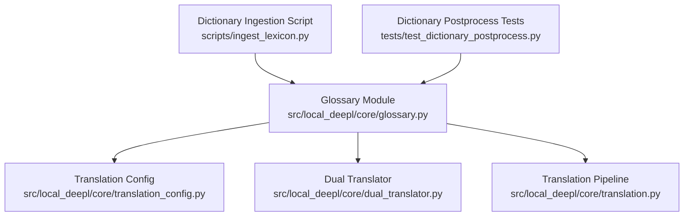
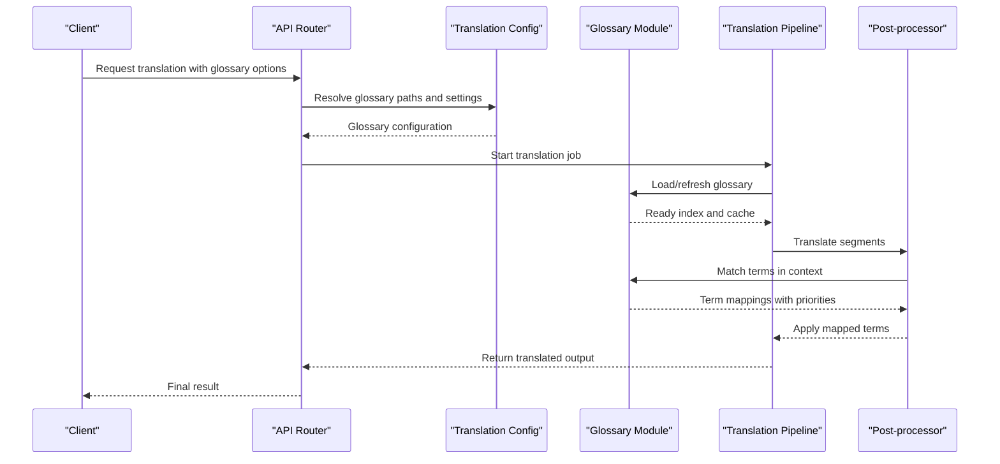
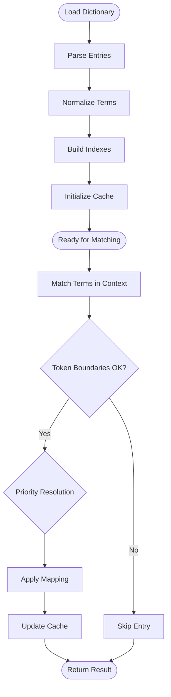
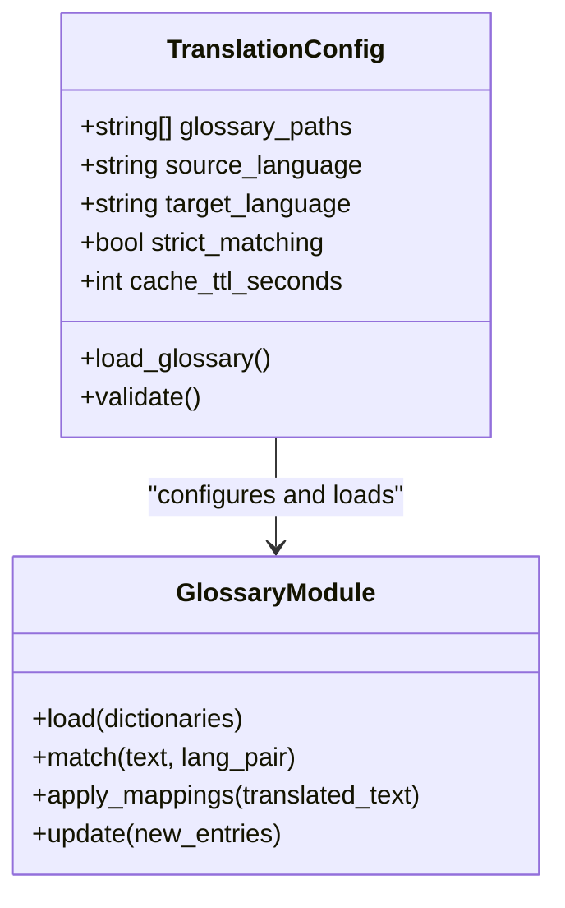
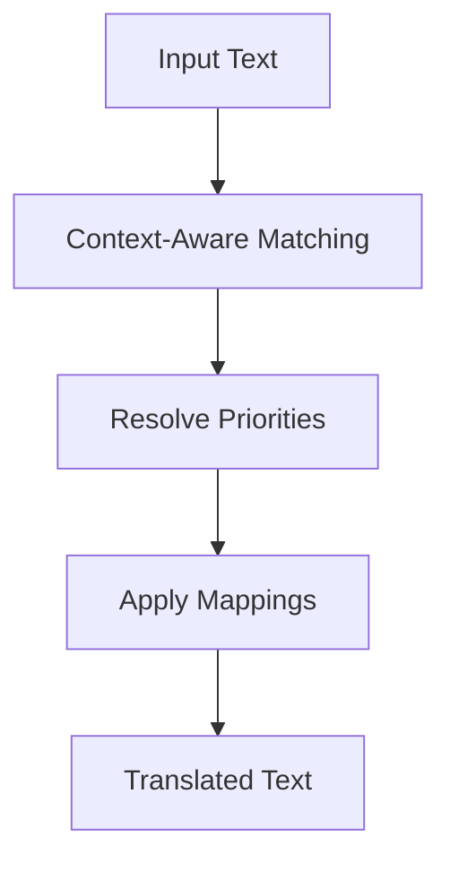
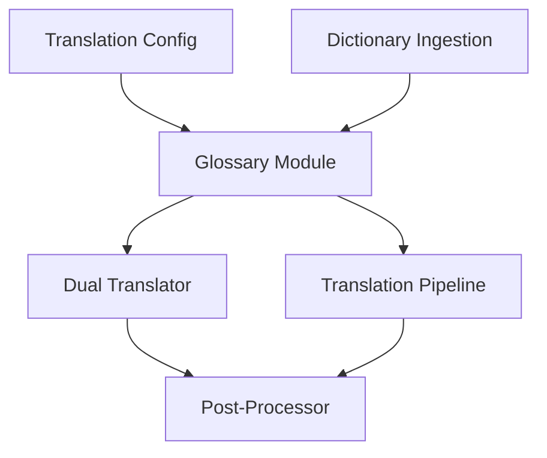

# Glossary and Terminology Management

<cite>
**Referenced Files in This Document**
- [glossary.py](file://src/local_deepl/core/glossary.py)
- [translation_config.py](file://src/local_deepl/core/translation_config.py)
- [ingest_lexicon.py](file://scripts/ingest_lexicon.py)
- [test_dictionary_postprocess.py](file://tests/test_dictionary_postprocess.py)
- [dual_translator.py](file://src/local_deepl/core/dual_translator.py)
- [translation.py](file://src/local_deepl/core/translation.py)
</cite>

## Table of Contents
1. [Introduction](#introduction)
2. [Project Structure](#project-structure)
3. [Core Components](#core-components)
4. [Architecture Overview](#architecture-overview)
5. [Detailed Component Analysis](#detailed-component-analysis)
6. [Dependency Analysis](#dependency-analysis)
7. [Performance Considerations](#performance-considerations)
8. [Troubleshooting Guide](#troubleshooting-guide)
9. [Conclusion](#conclusion)
10. [Appendices](#appendices)

## Introduction
This document explains the glossary and terminology management system used to manage domain-specific terms during translation. It covers how dictionaries are loaded, how terms are prioritized and matched, how they are applied in translation workflows, and how caching and dynamic updates work. It also provides guidance for creating custom dictionaries, handling term conflicts, language-specific formatting, and maintaining consistency across translations.

## Project Structure
The glossary functionality is implemented as a dedicated module and integrated into the translation pipeline via configuration and post-processing steps. Dictionary ingestion utilities and tests provide examples of dictionary formats and behavior expectations.

**Diagram sources**
- [glossary.py](file://src/local_deepl/core/glossary.py)
- [translation_config.py](file://src/local_deepl/core/translation_config.py)
- [dual_translator.py](file://src/local_deepl/core/dual_translator.py)
- [translation.py](file://src/local_deepl/core/translation.py)
- [ingest_lexicon.py](file://scripts/ingest_lexicon.py)
- [test_dictionary_postprocess.py](file://tests/test_dictionary_postprocess.py)

**Section sources**
- [glossary.py](file://src/local_deepl/core/glossary.py)
- [translation_config.py](file://src/local_deepl/core/translation_config.py)
- [dual_translator.py](file://src/local_deepl/core/dual_translator.py)
- [translation.py](file://src/local_deepl/core/translation.py)
- [ingest_lexicon.py](file://scripts/ingest_lexicon.py)
- [test_dictionary_postprocess.py](file://tests/test_dictionary_postprocess.py)

## Core Components
- Glossary loader and matcher: Responsible for loading dictionary files, building lookup structures, and performing context-aware matching with prioritization rules.
- Translation configuration integration: Exposes glossary settings (paths, languages, priority flags) to the translation pipeline.
- Post-processing application: Applies matched terms to translated text while preserving formatting and boundaries.
- Dictionary ingestion utility: Provides a script to convert or validate dictionary inputs into the expected format.
- Test suite: Validates dictionary behavior, conflict resolution, and post-processing outcomes.

Key responsibilities:
- Load dictionaries from supported file formats.
- Build efficient indexes for fast lookups.
- Apply term mappings with precedence rules.
- Maintain cache for repeated lookups.
- Support dynamic updates without full reloads where possible.

**Section sources**
- [glossary.py](file://src/local_deepl/core/glossary.py)
- [translation_config.py](file://src/local_deepl/core/translation_config.py)
- [ingest_lexicon.py](file://scripts/ingest_lexicon.py)
- [test_dictionary_postprocess.py](file://tests/test_dictionary_postprocess.py)

## Architecture Overview
The glossary system integrates into the translation workflow through configuration and post-processing stages. The glossary module exposes APIs that the translation pipeline calls to match and apply terms.

**Diagram sources**
- [translation_config.py](file://src/local_deepl/core/translation_config.py)
- [glossary.py](file://src/local_deepl/core/glossary.py)
- [translation.py](file://src/local_deepl/core/translation.py)
- [dual_translator.py](file://src/local_deepl/core/dual_translator.py)

## Detailed Component Analysis

### Glossary Module
Responsibilities:
- Parse dictionary files into normalized entries.
- Build multi-key indexes (source term, target term, language pairs).
- Implement context-aware matching using token boundaries and segment context.
- Enforce prioritization rules when multiple matches overlap.
- Provide caching for frequent lookups and large glossaries.
- Support incremental updates by merging new entries.

Matching algorithm highlights:
- Token boundary checks ensure terms are not split mid-word.
- Segment-level context reduces false positives.
- Priority resolution selects the most specific or highest-precedence mapping.

Caching strategy:
- In-memory cache keyed by source text and language pair.
- TTL-based invalidation for dynamic updates.
- Cache warming on startup for hot terms.

Dynamic updates:
- Merge new dictionary entries without full rebuild.
- Invalidate affected cache regions.
- Validate new entries before applying.

**Diagram sources**
- [glossary.py](file://src/local_deepl/core/glossary.py)

**Section sources**
- [glossary.py](file://src/local_deepl/core/glossary.py)

### Translation Configuration Integration
Responsibilities:
- Define glossary file paths per language pair.
- Configure priority flags and matching modes.
- Pass glossary settings to the translation pipeline.
- Validate configuration at startup.

Integration points:
- Loaded early to ensure glossary availability.
- Used by dual translator and post-processor to apply mappings.

**Diagram sources**
- [translation_config.py](file://src/local_deepl/core/translation_config.py)
- [glossary.py](file://src/local_deepl/core/glossary.py)

**Section sources**
- [translation_config.py](file://src/local_deepl/core/translation_config.py)

### Dictionary Ingestion Utility
Purpose:
- Convert external lexicons into the internal dictionary format.
- Validate entries for correctness and completeness.
- Generate sample dictionaries for testing and development.

Usage:
- Run the ingestion script with input files and output path.
- Review validation logs for errors or warnings.
- Integrate into CI pipelines for dictionary quality checks.

**Section sources**
- [ingest_lexicon.py](file://scripts/ingest_lexicon.py)

### Post-Processing and Application
Responsibilities:
- Apply glossary mappings to translated text.
- Preserve original formatting and structure.
- Handle overlapping matches with priority rules.
- Ensure consistent replacements across segments.

Behavior:
- Scans translated segments for matches.
- Replaces terms according to resolved priorities.
- Updates cache after successful applications.

**Section sources**
- [test_dictionary_postprocess.py](file://tests/test_dictionary_postprocess.py)
- [dual_translator.py](file://src/local_deepl/core/dual_translator.py)
- [translation.py](file://src/local_deepl/core/translation.py)

### Conceptual Overview
The glossary system ensures domain-specific terms are consistently translated by combining robust parsing, efficient indexing, context-aware matching, and priority-driven application. It supports dynamic updates and caching to handle large glossaries efficiently.

[No sources needed since this diagram shows conceptual workflow, not actual code structure]

## Dependency Analysis
The glossary module depends on configuration for paths and settings, and is consumed by the translation pipeline and post-processor. The ingestion script produces dictionaries consumed by the glossary module.

**Diagram sources**
- [translation_config.py](file://src/local_deepl/core/translation_config.py)
- [glossary.py](file://src/local_deepl/core/glossary.py)
- [dual_translator.py](file://src/local_deepl/core/dual_translator.py)
- [translation.py](file://src/local_deepl/core/translation.py)
- [ingest_lexicon.py](file://scripts/ingest_lexicon.py)

**Section sources**
- [translation_config.py](file://src/local_deepl/core/translation_config.py)
- [glossary.py](file://src/local_deepl/core/glossary.py)
- [dual_translator.py](file://src/local_deepl/core/dual_translator.py)
- [translation.py](file://src/local_deepl/core/translation.py)
- [ingest_lexicon.py](file://scripts/ingest_lexicon.py)

## Performance Considerations
- Index construction: Optimize for fast lookups using hash maps and multi-key indexes.
- Caching: Use TTL-based caches to reduce repeated computations; warm caches on startup for hot terms.
- Memory usage: Limit dictionary size and avoid redundant entries; use compact representations.
- Matching efficiency: Prefer token-boundary checks and segment-level filtering to minimize false positives.
- Dynamic updates: Merge incremental changes instead of full rebuilds; invalidate only affected cache regions.
- Large glossaries: Partition dictionaries by domain or language pair to reduce search space.

[No sources needed since this section provides general guidance]

## Troubleshooting Guide
Common issues:
- Term conflicts: Multiple mappings for the same source term; resolve by explicit priority or specificity rules.
- Language-specific formatting: Ensure normalization handles diacritics, punctuation, and case variations.
- Inconsistent translations: Verify glossary coverage and check for missing entries or outdated mappings.
- Performance degradation: Monitor cache hit rates and adjust TTL or partitioning strategies.

Debugging steps:
- Validate dictionary files using the ingestion script.
- Inspect glossary logs for parse errors or warnings.
- Check cache statistics and invalidation events.
- Run post-processing tests to confirm expected behavior.

**Section sources**
- [test_dictionary_postprocess.py](file://tests/test_dictionary_postprocess.py)
- [ingest_lexicon.py](file://scripts/ingest_lexicon.py)

## Conclusion
The glossary and terminology management system provides a robust foundation for domain-specific translation by integrating dictionary loading, context-aware matching, priority resolution, and efficient caching. Proper configuration, validation, and maintenance of dictionaries ensure consistent and high-quality translations across domains.

[No sources needed since this section summarizes without analyzing specific files]

## Appendices

### Creating Custom Dictionaries
Steps:
- Prepare source-target term pairs in a supported format.
- Use the ingestion script to validate and convert entries.
- Place the resulting dictionary files in the configured paths.
- Restart or refresh the glossary service to load new entries.

Best practices:
- Keep entries concise and unambiguous.
- Avoid overlapping terms unless necessary; define clear priorities.
- Regularly review and update dictionaries to reflect domain changes.

**Section sources**
- [ingest_lexicon.py](file://scripts/ingest_lexicon.py)

### Defining Term Mappings
Guidelines:
- Use exact source terms to minimize ambiguity.
- Specify target terms that preserve meaning and style.
- Include language pair information to avoid cross-language confusion.
- Document any special formatting or casing requirements.

**Section sources**
- [glossary.py](file://src/local_deepl/core/glossary.py)

### Integrating Specialized Terminology
Approach:
- Partition dictionaries by domain or project.
- Configure separate glossary paths per language pair.
- Apply domain-specific glossaries selectively in translation jobs.
- Monitor performance and accuracy metrics per domain.

**Section sources**
- [translation_config.py](file://src/local_deepl/core/translation_config.py)
- [dual_translator.py](file://src/local_deepl/core/dual_translator.py)
- [translation.py](file://src/local_deepl/core/translation.py)