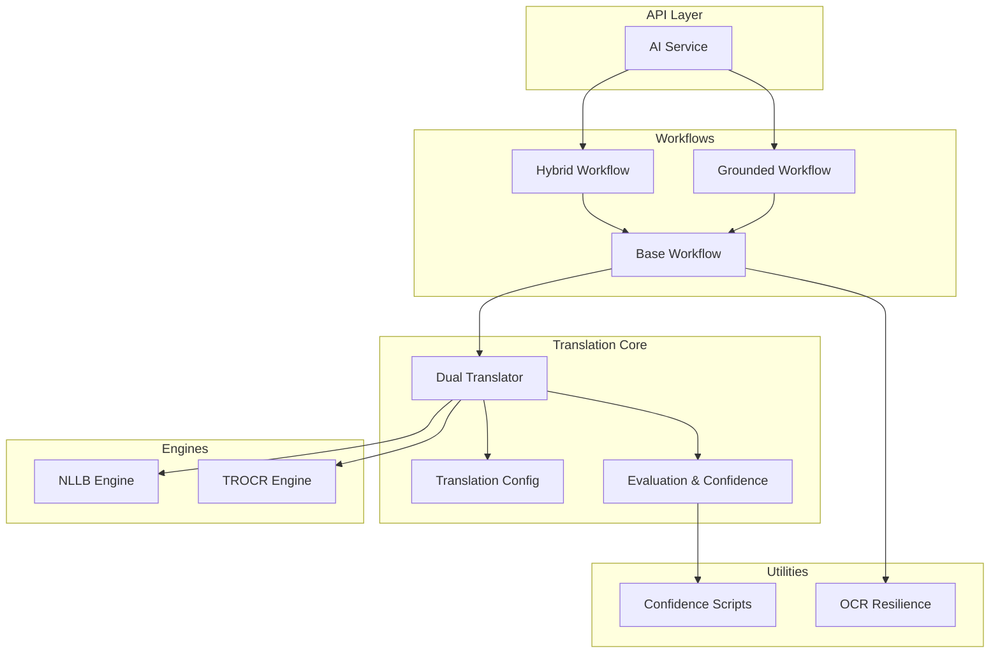
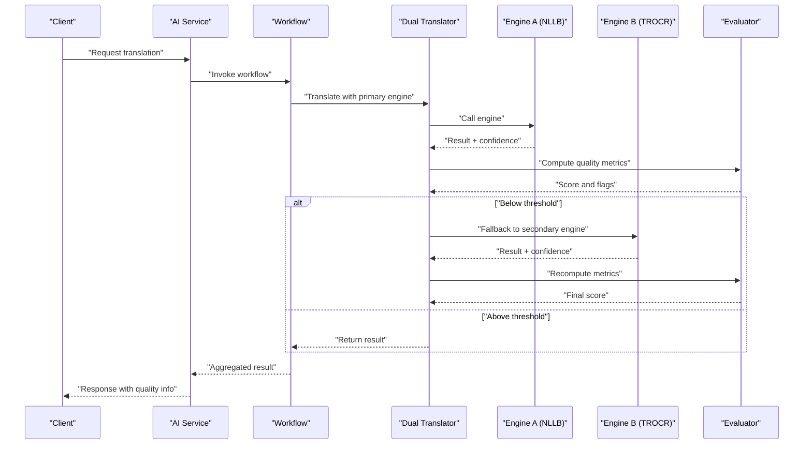
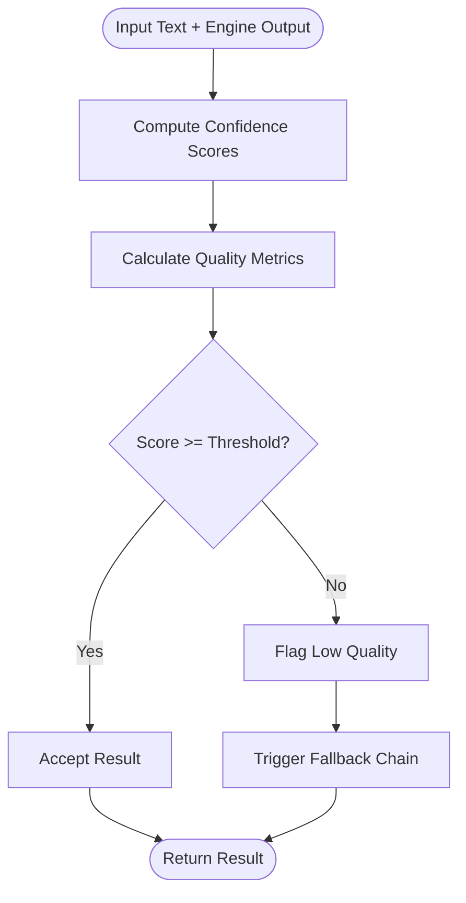
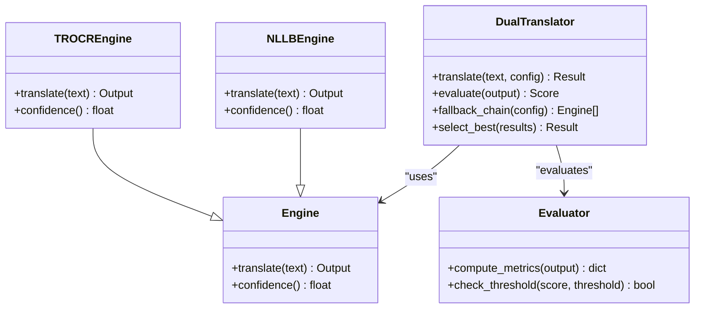
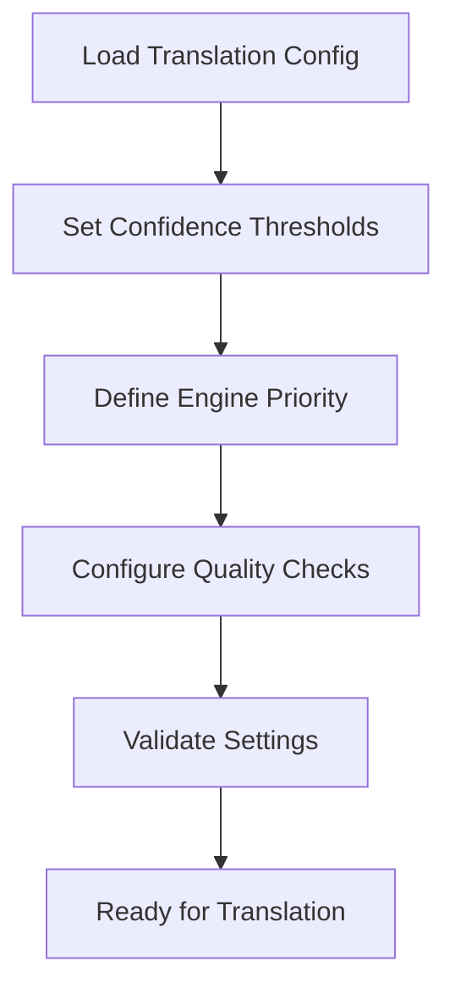
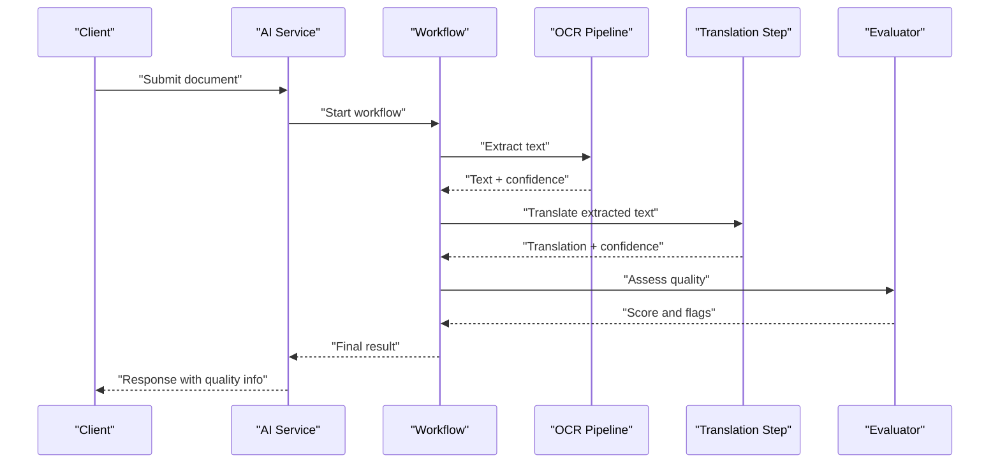
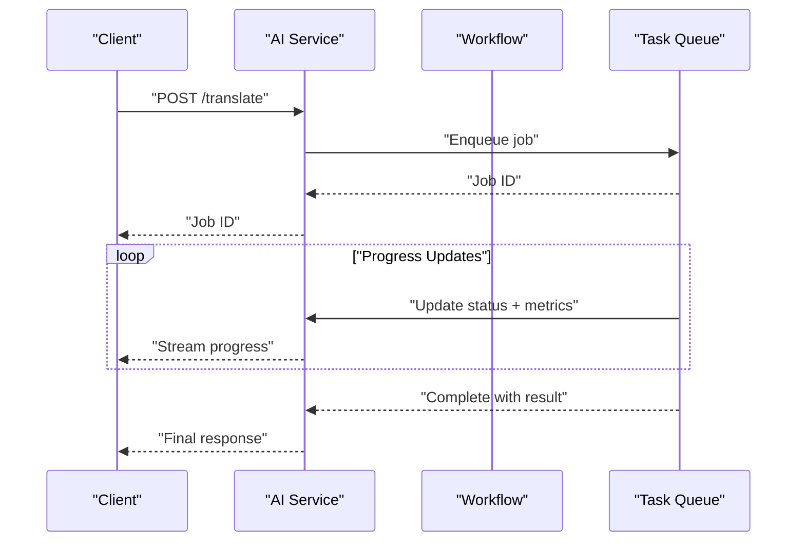
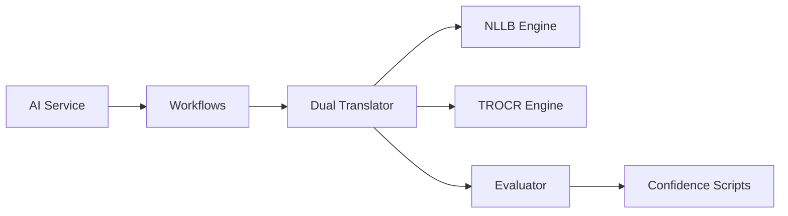

# Quality Assessment and Fallback Mechanisms

<cite>
**Referenced Files in This Document**
- [src/local_deepl/core/evaluation.py](file://src/local_deepl/core/evaluation.py)
- [src/local_deepl/core/dual_translator.py](file://src/local_deepl/core/dual_translator.py)
- [src/local_deepl/core/translation_config.py](file://src/local_deepl/core/translation_config.py)
- [src/local_deepl/core/translation.py](file://src/local_deepl/core/translation.py)
- [src/local_deepl/core/nllb_engine.py](file://src/local_deepl/core/nllb_engine.py)
- [src/local_deepl/core/trocr_engine.py](file://src/local_deepl/core/trocr_engine.py)
- [scripts/confidence_eval.py](file://scripts/confidence_eval.py)
- [scripts/confidence_image.py](file://scripts/confidence_image.py)
- [tests/test_translation_evaluator.py](file://tests/test_translation_evaluator.py)
- [src/local_deepl/api/services/ai.py](file://src/local_deepl/api/services/ai.py)
- [src/local_deepl/core/workflows/base.py](file://src/local_deepl/core/workflows/base.py)
- [src/local_deepl/core/workflows/hybrid.py](file://src/local_deepl/core/workflows/hybrid.py)
- [src/local_deepl/core/workflows/grounded.py](file://src/local_deepl/core/workflows/grounded.py)
- [src/local_deepl/core/ocr/resilience.py](file://src/local_deepl/core/ocr/resilience.py)
</cite>

## Table of Contents
1. [Introduction](#introduction)
2. [Project Structure](#project-structure)
3. [Core Components](#core-components)
4. [Architecture Overview](#architecture-overview)
5. [Detailed Component Analysis](#detailed-component-analysis)
6. [Dependency Analysis](#dependency-analysis)
7. [Performance Considerations](#performance-considerations)
8. [Troubleshooting Guide](#troubleshooting-guide)
9. [Conclusion](#conclusion)
10. [Appendices](#appendices)

## Introduction
This document explains how the translation subsystem evaluates quality, computes confidence scores, and triggers fallbacks when quality falls below configured thresholds. It covers evaluation algorithms, benchmarking approaches, continuous monitoring, configuration of thresholds and custom metrics, fallback chains across engines, and logging/reporting for tracking performance and identifying problematic language pairs or content types.

## Project Structure
Quality assessment and fallback mechanisms are implemented across core modules that orchestrate translation workflows, engine-specific adapters, evaluation utilities, and API services. Key areas include:
- Translation orchestration and dual-engine coordination
- Engine implementations (NLLB, TROCR)
- Evaluation and confidence scoring utilities
- Workflows that integrate OCR, grounding, and translation
- API services that expose translation endpoints and progress reporting
- Scripts for confidence evaluation and image-based checks
- Tests validating evaluator behavior

**Diagram sources**
- [src/local_deepl/api/services/ai.py](file://src/local_deepl/api/services/ai.py)
- [src/local_deepl/core/workflows/base.py](file://src/local_deepl/core/workflows/base.py)
- [src/local_deepl/core/workflows/hybrid.py](file://src/local_deepl/core/workflows/hybrid.py)
- [src/local_deepl/core/workflows/grounded.py](file://src/local_deepl/core/workflows/grounded.py)
- [src/local_deepl/core/dual_translator.py](file://src/local_deepl/core/dual_translator.py)
- [src/local_deepl/core/translation_config.py](file://src/local_deepl/core/translation_config.py)
- [src/local_deepl/core/evaluation.py](file://src/local_deepl/core/evaluation.py)
- [src/local_deepl/core/nllb_engine.py](file://src/local_deepl/core/nllb_engine.py)
- [src/local_deepl/core/trocr_engine.py](file://src/local_deepl/core/trocr_engine.py)
- [scripts/confidence_eval.py](file://scripts/confidence_eval.py)
- [scripts/confidence_image.py](file://scripts/confidence_image.py)
- [src/local_deepl/core/ocr/resilience.py](file://src/local_deepl/core/ocr/resilience.py)

**Section sources**
- [src/local_deepl/core/evaluation.py](file://src/local_deepl/core/evaluation.py)
- [src/local_deepl/core/dual_translator.py](file://src/local_deepl/core/dual_translator.py)
- [src/local_deepl/core/translation_config.py](file://src/local_deepl/core/translation_config.py)
- [src/local_deepl/core/translation.py](file://src/local_deepl/core/translation.py)
- [src/local_deepl/core/nllb_engine.py](file://src/local_deepl/core/nllb_engine.py)
- [src/local_deepl/core/trocr_engine.py](file://src/local_deepl/core/trocr_engine.py)
- [scripts/confidence_eval.py](file://scripts/confidence_eval.py)
- [scripts/confidence_image.py](file://scripts/confidence_image.py)
- [tests/test_translation_evaluator.py](file://tests/test_translation_evaluator.py)
- [src/local_deepl/api/services/ai.py](file://src/local_deepl/api/services/ai.py)
- [src/local_deepl/core/workflows/base.py](file://src/local_deepl/core/workflows/base.py)
- [src/local_deepl/core/workflows/hybrid.py](file://src/local_deepl/core/workflows/hybrid.py)
- [src/local_deepl/core/workflows/grounded.py](file://src/local_deepl/core/workflows/grounded.py)
- [src/local_deepl/core/ocr/resilience.py](file://src/local_deepl/core/ocr/resilience.py)

## Core Components
- Evaluation and Confidence Scoring: Centralized utilities compute quality metrics and confidence scores for translations, enabling threshold-based decisions and fallback triggers.
- Dual Translator: Orchestrates multiple translation engines, compares outputs, applies quality checks, and manages fallback chains based on configured thresholds.
- Translation Configuration: Defines thresholds, engine selection rules, and fallback policies.
- Engines: Concrete implementations for different translation backends (e.g., NLLB, TROCR), each providing translation results and optional confidence signals.
- Workflows: Higher-level pipelines integrating OCR, grounding, and translation with resilience and progress reporting.
- API Services: Expose translation endpoints, aggregate quality metrics, and report progress to clients.
- Scripts: Standalone tools for evaluating confidence and performing image-based checks to support benchmarking and continuous monitoring.

**Section sources**
- [src/local_deepl/core/evaluation.py](file://src/local_deepl/core/evaluation.py)
- [src/local_deepl/core/dual_translator.py](file://src/local_deepl/core/dual_translator.py)
- [src/local_deepl/core/translation_config.py](file://src/local_deepl/core/translation_config.py)
- [src/local_deepl/core/nllb_engine.py](file://src/local_deepl/core/nllb_engine.py)
- [src/local_deepl/core/trocr_engine.py](file://src/local_deepl/core/trocr_engine.py)
- [src/local_deepl/core/workflows/base.py](file://src/local_deepl/core/workflows/base.py)
- [src/local_deepl/core/workflows/hybrid.py](file://src/local_deepl/core/workflows/hybrid.py)
- [src/local_deepl/core/workflows/grounded.py](file://src/local_deepl/core/workflows/grounded.py)
- [src/local_deepl/api/services/ai.py](file://src/local_deepl/api/services/ai.py)
- [scripts/confidence_eval.py](file://scripts/confidence_eval.py)
- [scripts/confidence_image.py](file://scripts/confidence_image.py)

## Architecture Overview
The translation pipeline integrates multiple engines through a dual-translator mechanism. Quality assessment is performed at the output stage; if confidence falls below thresholds, fallback logic selects alternative engines or strategies. Workflows encapsulate end-to-end processing, while API services provide observable progress and results.

**Diagram sources**
- [src/local_deepl/api/services/ai.py](file://src/local_deepl/api/services/ai.py)
- [src/local_deepl/core/workflows/base.py](file://src/local_deepl/core/workflows/base.py)
- [src/local_deepl/core/dual_translator.py](file://src/local_deepl/core/dual_translator.py)
- [src/local_deepl/core/nllb_engine.py](file://src/local_deepl/core/nllb_engine.py)
- [src/local_deepl/core/trocr_engine.py](file://src/local_deepl/core/trocr_engine.py)
- [src/local_deepl/core/evaluation.py](file://src/local_deepl/core/evaluation.py)

## Detailed Component Analysis

### Evaluation and Confidence Scoring
- Purpose: Compute quality metrics and confidence scores for translation outputs to drive threshold-based decisions and fallback triggers.
- Key responsibilities:
  - Aggregate per-segment and global confidence scores
  - Apply configurable thresholds to determine pass/fail
  - Provide diagnostic flags for low-quality segments
  - Support benchmarking via scripts and tests

**Diagram sources**
- [src/local_deepl/core/evaluation.py](file://src/local_deepl/core/evaluation.py)
- [scripts/confidence_eval.py](file://scripts/confidence_eval.py)
- [scripts/confidence_image.py](file://scripts/confidence_image.py)

**Section sources**
- [src/local_deepl/core/evaluation.py](file://src/local_deepl/core/evaluation.py)
- [scripts/confidence_eval.py](file://scripts/confidence_eval.py)
- [scripts/confidence_image.py](file://scripts/confidence_image.py)
- [tests/test_translation_evaluator.py](file://tests/test_translation_evaluator.py)

### Dual Translator and Fallback Chains
- Purpose: Orchestrate multiple engines, compare outputs, apply quality checks, and manage fallback chains based on thresholds.
- Key responsibilities:
  - Select primary engine from configuration
  - Execute translation and collect confidence signals
  - Evaluate quality against thresholds
  - Trigger fallback to secondary engines if needed
  - Return best result with quality metadata

**Diagram sources**
- [src/local_deepl/core/dual_translator.py](file://src/local_deepl/core/dual_translator.py)
- [src/local_deepl/core/nllb_engine.py](file://src/local_deepl/core/nllb_engine.py)
- [src/local_deepl/core/trocr_engine.py](file://src/local_deepl/core/trocr_engine.py)
- [src/local_deepl/core/evaluation.py](file://src/local_deepl/core/evaluation.py)

**Section sources**
- [src/local_deepl/core/dual_translator.py](file://src/local_deepl/core/dual_translator.py)
- [src/local_deepl/core/nllb_engine.py](file://src/local_deepl/core/nllb_engine.py)
- [src/local_deepl/core/trocr_engine.py](file://src/local_deepl/core/trocr_engine.py)
- [src/local_deepl/core/evaluation.py](file://src/local_deepl/core/evaluation.py)

### Translation Configuration and Thresholds
- Purpose: Define thresholds, engine selection rules, and fallback policies.
- Key responsibilities:
  - Configure minimum confidence thresholds per language pair
  - Specify engine priority and fallback order
  - Enable/disable specific quality checks
  - Adjust sensitivity for different content types

**Diagram sources**
- [src/local_deepl/core/translation_config.py](file://src/local_deepl/core/translation_config.py)

**Section sources**
- [src/local_deepl/core/translation_config.py](file://src/local_deepl/core/translation_config.py)

### Workflows Integrating OCR and Translation
- Purpose: Combine OCR preprocessing, grounding, and translation within resilient workflows.
- Key responsibilities:
  - Manage OCR fallbacks and error handling
  - Integrate translation steps with quality checks
  - Report progress and artifacts
  - Support hybrid and grounded strategies

**Diagram sources**
- [src/local_deepl/core/workflows/base.py](file://src/local_deepl/core/workflows/base.py)
- [src/local_deepl/core/workflows/hybrid.py](file://src/local_deepl/core/workflows/hybrid.py)
- [src/local_deepl/core/workflows/grounded.py](file://src/local_deepl/core/workflows/grounded.py)
- [src/local_deepl/core/ocr/resilience.py](file://src/local_deepl/core/ocr/resilience.py)

**Section sources**
- [src/local_deepl/core/workflows/base.py](file://src/local_deepl/core/workflows/base.py)
- [src/local_deepl/core/workflows/hybrid.py](file://src/local_deepl/core/workflows/hybrid.py)
- [src/local_deepl/core/workflows/grounded.py](file://src/local_deepl/core/workflows/grounded.py)
- [src/local_deepl/core/ocr/resilience.py](file://src/local_deepl/core/ocr/resilience.py)

### API Services and Progress Reporting
- Purpose: Expose translation endpoints, aggregate quality metrics, and report progress to clients.
- Key responsibilities:
  - Handle incoming requests and dispatch to workflows
  - Collect and return quality metadata
  - Stream progress updates via websockets or polling
  - Log errors and performance metrics

**Diagram sources**
- [src/local_deepl/api/services/ai.py](file://src/local_deepl/api/services/ai.py)

**Section sources**
- [src/local_deepl/api/services/ai.py](file://src/local_deepl/api/services/ai.py)

## Dependency Analysis
The system exhibits clear separation between API, workflows, translation core, engines, and evaluation utilities. Dependencies flow downward from API to workflows to translation core and engines, with evaluation utilities used across layers for quality assessment.

**Diagram sources**
- [src/local_deepl/api/services/ai.py](file://src/local_deepl/api/services/ai.py)
- [src/local_deepl/core/workflows/base.py](file://src/local_deepl/core/workflows/base.py)
- [src/local_deepl/core/dual_translator.py](file://src/local_deepl/core/dual_translator.py)
- [src/local_deepl/core/nllb_engine.py](file://src/local_deepl/core/nllb_engine.py)
- [src/local_deepl/core/trocr_engine.py](file://src/local_deepl/core/trocr_engine.py)
- [src/local_deepl/core/evaluation.py](file://src/local_deepl/core/evaluation.py)
- [scripts/confidence_eval.py](file://scripts/confidence_eval.py)

**Section sources**
- [src/local_deepl/api/services/ai.py](file://src/local_deepl/api/services/ai.py)
- [src/local_deepl/core/workflows/base.py](file://src/local_deepl/core/workflows/base.py)
- [src/local_deepl/core/dual_translator.py](file://src/local_deepl/core/dual_translator.py)
- [src/local_deepl/core/nllb_engine.py](file://src/local_deepl/core/nllb_engine.py)
- [src/local_deepl/core/trocr_engine.py](file://src/local_deepl/core/trocr_engine.py)
- [src/local_deepl/core/evaluation.py](file://src/local_deepl/core/evaluation.py)
- [scripts/confidence_eval.py](file://scripts/confidence_eval.py)

## Performance Considerations
- Batch Processing: Group translation requests to reduce overhead and improve throughput.
- Engine Selection: Prefer faster engines for high-confidence scenarios; fall back to more accurate but slower engines only when necessary.
- Caching: Cache repeated translations and confidence scores to avoid redundant computation.
- Streaming: Use streaming responses for long-running jobs to keep clients responsive.
- Resource Limits: Implement timeouts and memory limits for engine calls to prevent resource exhaustion.

[No sources needed since this section provides general guidance]

## Troubleshooting Guide
Common issues and resolutions:
- Low Confidence Scores:
  - Check engine availability and health
  - Verify input text quality and formatting
  - Adjust thresholds for specific language pairs
- Fallback Failures:
  - Ensure fallback engines are configured and accessible
  - Review error logs for engine-specific failures
  - Validate configuration settings for fallback chains
- Performance Degradation:
  - Monitor resource usage and scale horizontally
  - Optimize batch sizes and concurrency limits
  - Profile slow segments and optimize preprocessing

**Section sources**
- [src/local_deepl/core/ocr/resilience.py](file://src/local_deepl/core/ocr/resilience.py)
- [tests/test_translation_evaluator.py](file://tests/test_translation_evaluator.py)

## Conclusion
The translation subsystem implements robust quality assessment and fallback mechanisms through centralized evaluation, dual-engine orchestration, and configurable thresholds. By leveraging workflows, API services, and dedicated scripts, the system supports continuous monitoring, benchmarking, and troubleshooting to maintain high translation quality across diverse language pairs and content types.

[No sources needed since this section summarizes without analyzing specific files]

## Appendices

### Practical Examples

#### Configuring Quality Thresholds
- Set minimum confidence thresholds per language pair in translation configuration
- Enable/disable specific quality checks based on content type
- Define fallback engine priority and conditions

**Section sources**
- [src/local_deepl/core/translation_config.py](file://src/local_deepl/core/translation_config.py)

#### Implementing Custom Quality Metrics
- Extend evaluation utilities to compute domain-specific metrics
- Integrate custom scoring functions into the dual translator
- Validate new metrics using existing test frameworks

**Section sources**
- [src/local_deepl/core/evaluation.py](file://src/local_deepl/core/evaluation.py)
- [tests/test_translation_evaluator.py](file://tests/test_translation_evaluator.py)

#### Setting Up Fallback Chains Between Engines
- Configure engine priority and fallback conditions
- Implement engine-specific confidence signals
- Test fallback scenarios with various input types

**Section sources**
- [src/local_deepl/core/dual_translator.py](file://src/local_deepl/core/dual_translator.py)
- [src/local_deepl/core/nllb_engine.py](file://src/local_deepl/core/nllb_engine.py)
- [src/local_deepl/core/trocr_engine.py](file://src/local_deepl/core/trocr_engine.py)

#### Logging and Reporting Capabilities
- Enable detailed logging for quality metrics and fallback decisions
- Export metrics for analysis and dashboard visualization
- Monitor performance trends and identify problematic patterns

**Section sources**
- [src/local_deepl/api/services/ai.py](file://src/local_deepl/api/services/ai.py)
- [scripts/confidence_eval.py](file://scripts/confidence_eval.py)
- [scripts/confidence_image.py](file://scripts/confidence_image.py)