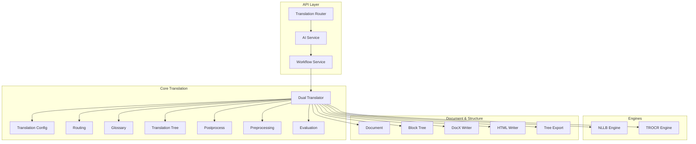
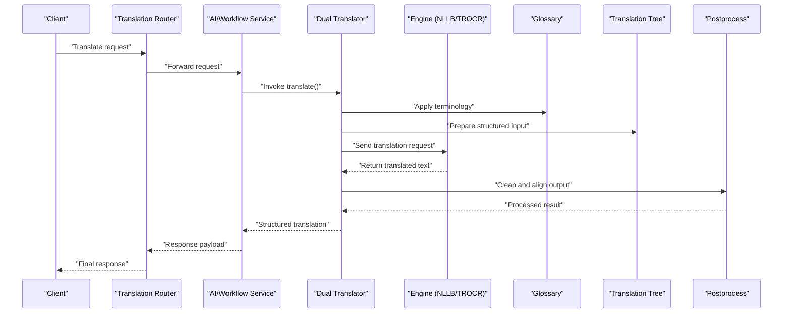
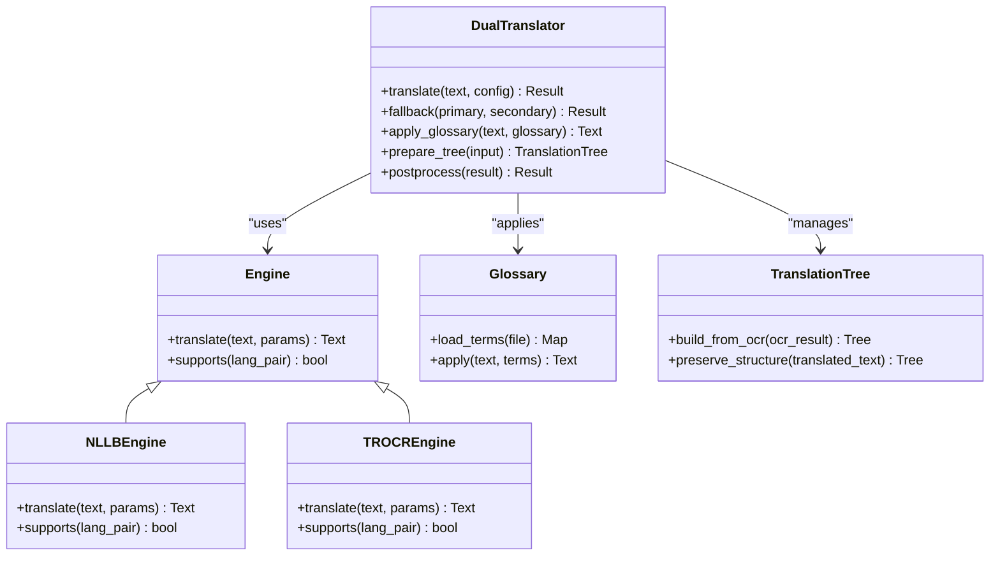
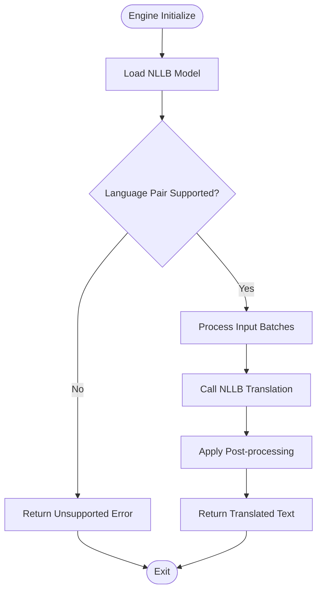
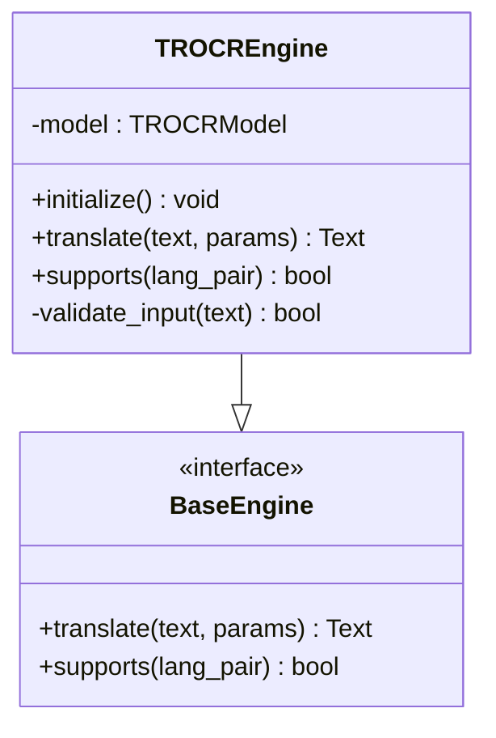
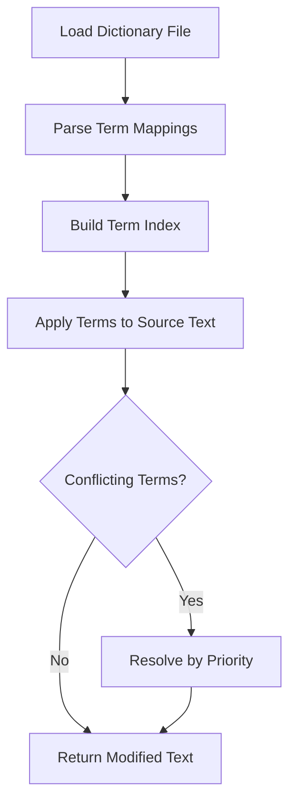
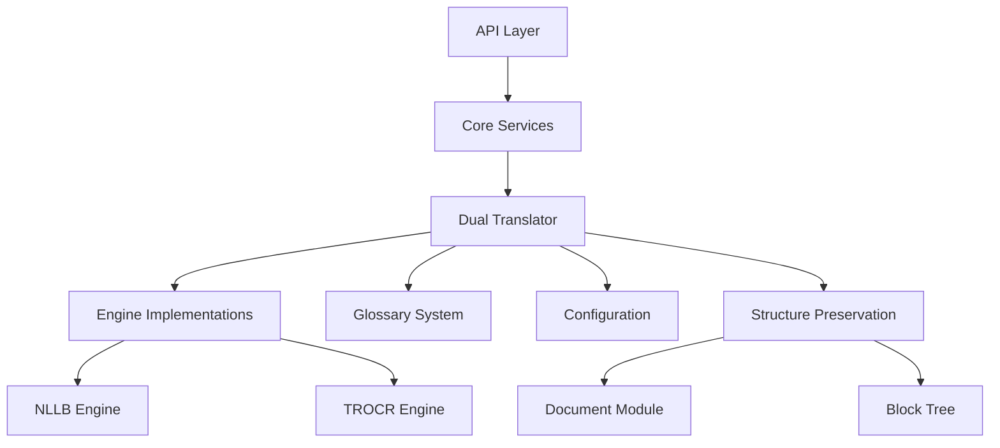

# Translation Services

<cite>
**Referenced Files in This Document**
- [dual_translator.py](file://src/local_deepl/core/dual_translator.py)
- [translation.py](file://src/local_deepl/core/translation.py)
- [nllb_engine.py](file://src/local_deepl/core/nllb_engine.py)
- [trocr_engine.py](file://src/local_deepl/core/trocr_engine.py)
- [glossary.py](file://src/local_deepl/core/glossary.py)
- [translation_config.py](file://src/local_deepl/core/translation_config.py)
- [translation_tree.py](file://src/local_deepl/core/translation_tree.py)
- [routing.py](file://src/local_deepl/core/routing.py)
- [postprocess.py](file://src/local_deepl/core/postprocess.py)
- [preprocessing.py](file://src/local_deepl/core/preprocessing.py)
- [document.py](file://src/local_deepl/core/document.py)
- [block_tree.py](file://src/local_deepl/core/block_tree.py)
- [docx_writer.py](file://src/local_deepl/core/docx_writer.py)
- [html_writer.py](file://src/local_deepl/core/html_writer.py)
- [tree_export.py](file://src/local_deepl/core/tree_export.py)
- [evaluation.py](file://src/local_deepl/core/evaluation.py)
- [translation_router.py](file://src/local_deepl/api/routers/translation.py)
- [ai_service.py](file://src/local_deepl/api/services/ai.py)
- [workflow_service.py](file://src/local_deepl/api/services/workflow.py)
- [ocr_pipeline_factory.py](file://src/local_deepl/api/services/ocr_pipeline_factory.py)
- [ingest_lexicon_script.py](file://scripts/ingest_lexicon.py)
</cite>

## Table of Contents
1. [Introduction](#introduction)
2. [Project Structure](#project-structure)
3. [Core Components](#core-components)
4. [Architecture Overview](#architecture-overview)
5. [Detailed Component Analysis](#detailed-component-analysis)
6. [Dependency Analysis](#dependency-analysis)
7. [Performance Considerations](#performance-considerations)
8. [Troubleshooting Guide](#troubleshooting-guide)
9. [Conclusion](#conclusion)
10. [Appendices](#appendices)

## Introduction
This document explains the translation services implemented in the project, focusing on the dual translator architecture that supports multiple translation engines (including DeepL and NLLB), fallback mechanisms, glossary and terminology management, and context-aware strategies. It also covers configuration options, quality assessment metrics, performance tuning, integration with OCR results, preservation of document structure, common accuracy issues, language pair limitations, batch processing optimization, and guidance for integrating custom engines and domain-specific terminology.

## Project Structure
The translation subsystem spans core modules under src/local_deepl/core and API endpoints under src/local_deepl/api. Key files include:
- Dual translator orchestration and engine abstraction
- Engine implementations for NLLB and TROCR-based translation
- Glossary and lexicon ingestion utilities
- Configuration models for providers and routing
- Tree-based translation structures to preserve document layout
- Post-processing and preprocessing utilities
- Evaluation utilities for quality metrics
- API routers and services exposing translation workflows

**Diagram sources**
- [translation_router.py:1-200](file://src/local_deepl/api/routers/translation.py#L1-L200)
- [ai_service.py:1-200](file://src/local_deepl/api/services/ai.py#L1-L200)
- [workflow_service.py:1-200](file://src/local_deepl/api/services/workflow.py#L1-L200)
- [dual_translator.py:1-200](file://src/local_deepl/core/dual_translator.py#L1-L200)
- [translation_config.py:1-200](file://src/local_deepl/core/translation_config.py#L1-L200)
- [routing.py:1-200](file://src/local_deepl/core/routing.py#L1-L200)
- [glossary.py:1-200](file://src/local_deepl/core/glossary.py#L1-L200)
- [translation_tree.py:1-200](file://src/local_deepl/core/translation_tree.py#L1-L200)
- [nllb_engine.py:1-200](file://src/local_deepl/core/nllb_engine.py#L1-L200)
- [trocr_engine.py:1-200](file://src/local_deepl/core/trocr_engine.py#L1-L200)
- [postprocess.py:1-200](file://src/local_deepl/core/postprocess.py#L1-L200)
- [preprocessing.py:1-200](file://src/local_deepl/core/preprocessing.py#L1-L200)
- [evaluation.py:1-200](file://src/local_deepl/core/evaluation.py#L1-L200)
- [document.py:1-200](file://src/local_deepl/core/document.py#L1-L200)
- [block_tree.py:1-200](file://src/local_deepl/core/block_tree.py#L1-L200)
- [docx_writer.py:1-200](file://src/local_deepl/core/docx_writer.py#L1-L200)
- [html_writer.py:1-200](file://src/local_deepl/core/html_writer.py#L1-L200)
- [tree_export.py:1-200](file://src/local_deepl/core/tree_export.py#L1-L200)

**Section sources**
- [dual_translator.py:1-200](file://src/local_deepl/core/dual_translator.py#L1-L200)
- [translation.py:1-200](file://src/local_deepl/core/translation.py#L1-L200)
- [nllb_engine.py:1-200](file://src/local_deepl/core/nllb_engine.py#L1-L200)
- [trocr_engine.py:1-200](file://src/local_deepl/core/trocr_engine.py#L1-L200)
- [glossary.py:1-200](file://src/local_deepl/core/glossary.py#L1-L200)
- [translation_config.py:1-200](file://src/local_deepl/core/translation_config.py#L1-L200)
- [translation_tree.py:1-200](file://src/local_deepl/core/translation_tree.py#L1-L200)
- [routing.py:1-200](file://src/local_deepl/core/routing.py#L1-L200)
- [postprocess.py:1-200](file://src/local_deepl/core/postprocess.py#L1-L200)
- [preprocessing.py:1-200](file://src/local_deepl/core/preprocessing.py#L1-L200)
- [evaluation.py:1-200](file://src/local_deepl/core/evaluation.py#L1-L200)
- [document.py:1-200](file://src/local_deepl/core/document.py#L1-L200)
- [block_tree.py:1-200](file://src/local_deepl/core/block_tree.py#L1-L200)
- [docx_writer.py:1-200](file://src/local_deepl/core/docx_writer.py#L1-L200)
- [html_writer.py:1-200](file://src/local_deepl/core/html_writer.py#L1-L200)
- [tree_export.py:1-200](file://src/local_deepl/core/tree_export.py#L1-L200)
- [translation_router.py:1-200](file://src/local_deepl/api/routers/translation.py#L1-L200)
- [ai_service.py:1-200](file://src/local_deepl/api/services/ai.py#L1-L200)
- [workflow_service.py:1-200](file://src/local_deepl/api/services/workflow.py#L1-L200)
- [ocr_pipeline_factory.py:1-200](file://src/local_deepl/api/services/ocr_pipeline_factory.py#L1-L200)
- [ingest_lexicon_script.py:1-200](file://scripts/ingest_lexicon.py#L1-L200)

## Core Components
- Dual Translator: Orchestrates translation across multiple engines, applies fallback logic, integrates glossaries, and preserves document structure via a translation tree.
- Engines: Concrete implementations for NLLB and TROCR-based translation; extensible design allows adding new engines.
- Glossary: Manages terminology mappings and integrates them into translation requests.
- Translation Config: Centralizes provider settings, model selection, and runtime parameters.
- Routing: Selects appropriate engines based on language pairs, capabilities, and policy.
- Translation Tree: Maintains hierarchical structure to preserve formatting and layout during translation.
- Pre/Post Processing: Normalizes inputs and cleans outputs, aligning with OCR results and document structure.
- Evaluation: Provides metrics to assess translation quality and guide tuning.

**Section sources**
- [dual_translator.py:1-200](file://src/local_deepl/core/dual_translator.py#L1-L200)
- [nllb_engine.py:1-200](file://src/local_deepl/core/nllb_engine.py#L1-L200)
- [trocr_engine.py:1-200](file://src/local_deepl/core/trocr_engine.py#L1-L200)
- [glossary.py:1-200](file://src/local_deepl/core/glossary.py#L1-L200)
- [translation_config.py:1-200](file://src/local_deepl/core/translation_config.py#L1-L200)
- [routing.py:1-200](file://src/local_deepl/core/routing.py#L1-L200)
- [translation_tree.py:1-200](file://src/local_deepl/core/translation_tree.py#L1-L200)
- [preprocessing.py:1-200](file://src/local_deepl/core/preprocessing.py#L1-L200)
- [postprocess.py:1-200](file://src/local_deepl/core/postprocess.py#L1-L200)
- [evaluation.py:1-200](file://src/local_deepl/core/evaluation.py#L1-L200)

## Architecture Overview
The translation pipeline is orchestrated by the Dual Translator, which coordinates engines, glossaries, and structural preservation. Requests flow from API routers through services to the core translation components, then back to the API layer for responses.

**Diagram sources**
- [translation_router.py:1-200](file://src/local_deepl/api/routers/translation.py#L1-L200)
- [ai_service.py:1-200](file://src/local_deepl/api/services/ai.py#L1-L200)
- [workflow_service.py:1-200](file://src/local_deepl/api/services/workflow.py#L1-L200)
- [dual_translator.py:1-200](file://src/local_deepl/core/dual_translator.py#L1-L200)
- [nllb_engine.py:1-200](file://src/local_deepl/core/nllb_engine.py#L1-L200)
- [trocr_engine.py:1-200](file://src/local_deepl/core/trocr_engine.py#L1-L200)
- [glossary.py:1-200](file://src/local_deepl/core/glossary.py#L1-L200)
- [translation_tree.py:1-200](file://src/local_deepl/core/translation_tree.py#L1-L200)
- [postprocess.py:1-200](file://src/local_deepl/core/postprocess.py#L1-L200)

## Detailed Component Analysis

### Dual Translator
The Dual Translator implements a robust orchestration layer that:
- Selects engines based on language pairs and capabilities
- Applies glossary terms before calling engines
- Uses a translation tree to maintain document structure
- Implements fallback logic when primary engines fail or produce low-quality results
- Integrates pre/post processing for normalization and alignment

**Diagram sources**
- [dual_translator.py:1-200](file://src/local_deepl/core/dual_translator.py#L1-L200)
- [nllb_engine.py:1-200](file://src/local_deepl/core/nllb_engine.py#L1-L200)
- [trocr_engine.py:1-200](file://src/local_deepl/core/trocr_engine.py#L1-L200)
- [glossary.py:1-200](file://src/local_deepl/core/glossary.py#L1-L200)
- [translation_tree.py:1-200](file://src/local_deepl/core/translation_tree.py#L1-L200)

**Section sources**
- [dual_translator.py:1-200](file://src/local_deepl/core/dual_translator.py#L1-L200)

### NLLB Engine
The NLLB engine provides neural machine translation using the NLLB model. It handles:
- Model loading and initialization
- Batch processing for efficiency
- Language pair validation
- Error handling and retries

**Diagram sources**
- [nllb_engine.py:1-200](file://src/local_deepl/core/nllb_engine.py#L1-L200)

**Section sources**
- [nllb_engine.py:1-200](file://src/local_deepl/core/nllb_engine.py#L1-L200)

### TROCR Engine
The TROCR engine leverages TROCR for translation tasks, particularly useful for specific use cases where OCR-like processing benefits translation accuracy.

**Diagram sources**
- [trocr_engine.py:1-200](file://src/local_deepl/core/trocr_engine.py#L1-L200)

**Section sources**
- [trocr_engine.py:1-200](file://src/local_deepl/core/trocr_engine.py#L1-L200)

### Glossary and Terminology Management
The glossary system manages domain-specific terminology:
- Loads term mappings from dictionaries
- Applies terms to source text before translation
- Supports weighted priority for conflicting terms
- Integrates with both NLLB and TROCR engines

**Diagram sources**
- [glossary.py:1-200](file://src/local_deepl/core/glossary.py#L1-200)
- [ingest_lexicon_script.py:1-200](file://scripts/ingest_lexicon.py#L1-200)

**Section sources**
- [glossary.py:1-200](file://src/local_deepl/core/glossary.py#L1-200)
- [ingest_lexicon_script.py:1-200](file://scripts/ingest_lexicon.py#L1-200)

### Translation Configuration
Configuration management includes:
- Provider-specific settings (API keys, endpoints, models)
- Runtime parameters (batch size, timeout, retry policies)
- Quality thresholds and fallback triggers
- Language pair restrictions and preferences

**Section sources**
- [translation_config.py:1-200](file://src/local_deepl/core/translation_config.py#L1-200)

### Translation Tree and Structure Preservation
The translation tree maintains document hierarchy:
- Builds structure from OCR results
- Preserves formatting during translation
- Exports to various formats (DOCX, HTML)
- Aligns translated content with original layout

**Section sources**
- [translation_tree.py:1-200](file://src/local_deepl/core/translation_tree.py#L1-200)
- [document.py:1-200](file://src/local_deepl/core/document.py#L1-200)
- [block_tree.py:1-200](file://src/local_deepl/core/block_tree.py#L1-200)
- [docx_writer.py:1-200](file://src/local_deepl/core/docx_writer.py#L1-200)
- [html_writer.py:1-200](file://src/local_deepl/core/html_writer.py#L1-200)
- [tree_export.py:1-200](file://src/local_deepl/core/tree_export.py#L1-200)

### Routing and Fallback Mechanisms
The routing system selects optimal engines based on:
- Language pair support
- Engine capabilities and performance
- Quality metrics and confidence scores
- Fallback chains when primary engines fail

**Section sources**
- [routing.py:1-200](file://src/local_deepl/core/routing.py#L1-200)
- [dual_translator.py:1-200](file://src/local_deepl/core/dual_translator.py#L1-200)

### Preprocessing and Postprocessing
Preprocessing normalizes input text:
- Handles OCR artifacts and errors
- Standardizes formatting
- Prepares text for engine consumption

Postprocessing cleans and aligns output:
- Removes artifacts from translation
- Restores document structure
- Validates output quality

**Section sources**
- [preprocessing.py:1-200](file://src/local_deepl/core/preprocessing.py#L1-200)
- [postprocess.py:1-200](file://src/local_deepl/core/postprocess.py#L1-200)

### Evaluation and Quality Assessment
The evaluation module provides:
- Quality metrics (BLEU, chrF, etc.)
- Confidence scoring for translations
- Performance benchmarking
- A/B testing between engines

**Section sources**
- [evaluation.py:1-200](file://src/local_deepl/core/evaluation.py#L1-200)

## Dependency Analysis
The translation system has clear dependency relationships:
- API layer depends on core translation services
- Core services depend on engine implementations
- All components depend on configuration and glossary systems
- Structure preservation depends on document and block tree modules

**Diagram sources**
- [translation_router.py:1-200](file://src/local_deepl/api/routers/translation.py#L1-200)
- [ai_service.py:1-200](file://src/local_deepl/api/services/ai.py#L1-200)
- [workflow_service.py:1-200](file://src/local_deepl/api/services/workflow.py#L1-200)
- [dual_translator.py:1-200](file://src/local_deepl/core/dual_translator.py#L1-200)
- [nllb_engine.py:1-200](file://src/local_deepl/core/nllb_engine.py#L1-200)
- [trocr_engine.py:1-200](file://src/local_deepl/core/trocr_engine.py#L1-200)
- [glossary.py:1-200](file://src/local_deepl/core/glossary.py#L1-200)
- [translation_config.py:1-200](file://src/local_deepl/core/translation_config.py#L1-200)
- [translation_tree.py:1-200](file://src/local_deepl/core/translation_tree.py#L1-200)
- [document.py:1-200](file://src/local_deepl/core/document.py#L1-200)
- [block_tree.py:1-200](file://src/local_deepl/core/block_tree.py#L1-200)

**Section sources**
- [translation_router.py:1-200](file://src/local_deepl/api/routers/translation.py#L1-200)
- [ai_service.py:1-200](file://src/local_deepl/api/services/ai.py#L1-200)
- [workflow_service.py:1-200](file://src/local_deepl/api/services/workflow.py#L1-200)
- [dual_translator.py:1-200](file://src/local_deepl/core/dual_translator.py#L1-200)

## Performance Considerations
Key performance optimization strategies:
- **Batch Processing**: Group multiple translation requests to reduce overhead
- **Caching**: Cache frequent translations and glossary terms
- **Memory Management**: Optimize model loading and memory usage
- **Concurrent Execution**: Use async processing for I/O operations
- **Resource Limits**: Configure timeouts and retry policies appropriately
- **Engine Selection**: Choose optimal engines based on language pair characteristics

[No sources needed since this section provides general guidance]

## Troubleshooting Guide
Common translation issues and solutions:
- **Language Pair Limitations**: Verify supported language combinations
- **Quality Issues**: Adjust glossary weights and preprocessing parameters
- **Performance Problems**: Tune batch sizes and concurrency limits
- **Memory Errors**: Reduce model size or increase available resources
- **Fallback Triggers**: Monitor confidence scores and adjust thresholds

**Section sources**
- [evaluation.py:1-200](file://src/local_deepl/core/evaluation.py#L1-200)
- [translation_config.py:1-200](file://src/local_deepl/core/translation_config.py#L1-200)
- [routing.py:1-200](file://src/local_deepl/core/routing.py#L1-200)

## Conclusion
The translation services provide a robust, extensible architecture supporting multiple engines with intelligent fallback mechanisms. The system effectively balances quality, performance, and structure preservation while offering comprehensive configuration options and evaluation tools. The modular design facilitates easy integration of custom engines and domain-specific terminology management.

[No sources needed since this section summarizes without analyzing specific files]

## Appendices

### Integration Guide for Custom Translation Engines
To integrate a new translation engine:
1. Implement the base engine interface
2. Add engine-specific configuration options
3. Update routing logic to support the new engine
4. Test with existing translation workflows
5. Add evaluation metrics for quality assessment

### Domain-Specific Terminology Management
Best practices for terminology management:
- Organize glossaries by domain and language pair
- Use consistent naming conventions for terms
- Regularly update and validate terminology accuracy
- Implement conflict resolution strategies
- Monitor terminology impact on translation quality

[No sources needed since this section provides general guidance]