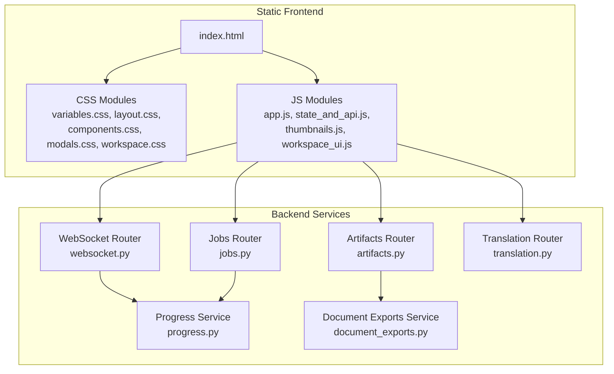
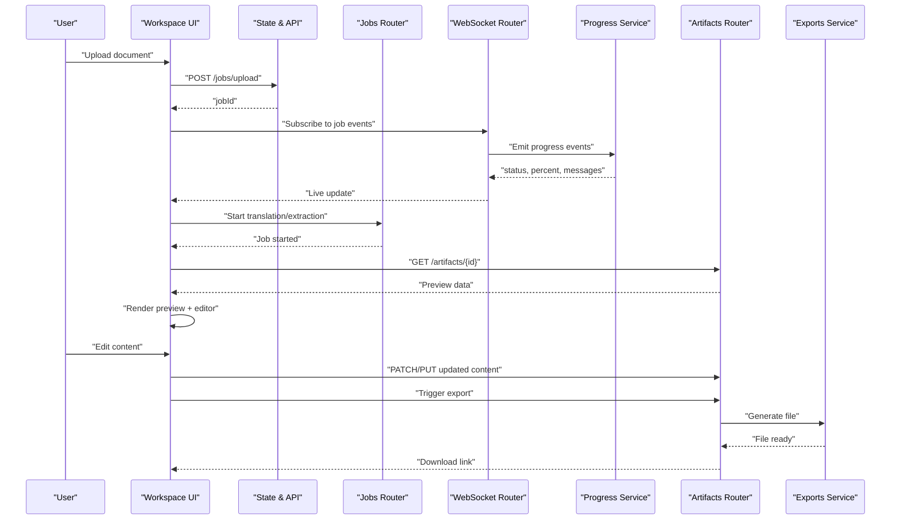
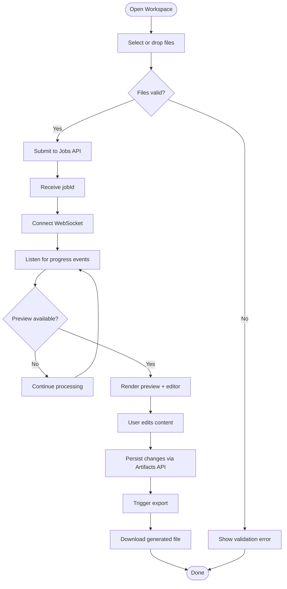
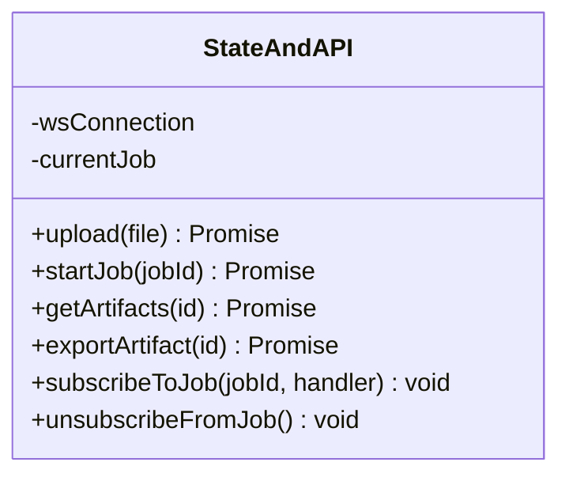
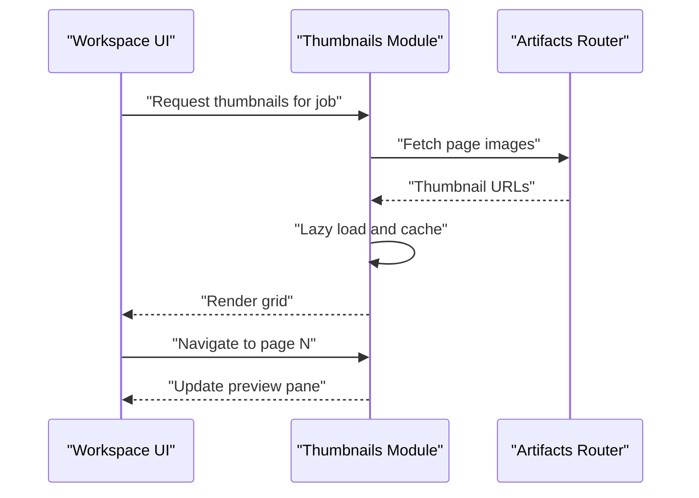
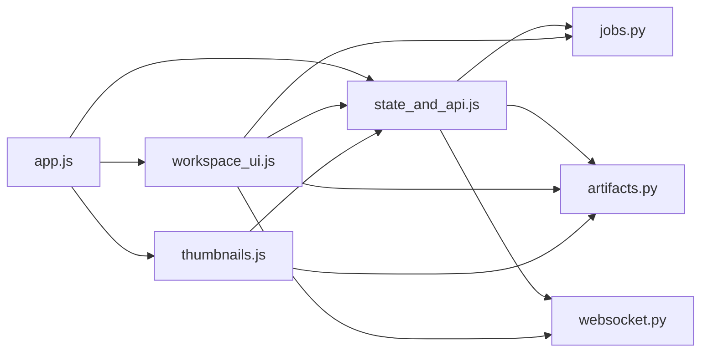

# Web Interface

<cite>
**Referenced Files in This Document**
- [index.html](file://src/local_deepl/static/index.html)
- [style.css](file://src/local_deepl/static/style.css)
- [components.css](file://src/local_deepl/static/css/components.css)
- [layout.css](file://src/local_deepl/static/css/layout.css)
- [modals.css](file://src/local_deepl/static/css/modals.css)
- [variables.css](file://src/local_deepl/static/css/variables.css)
- [workspace.css](file://src/local_deepl/static/css/workspace.css)
- [app.js](file://src/local_deepl/static/js/app.js)
- [state_and_api.js](file://src/local_deepl/static/js/state_and_api.js)
- [thumbnails.js](file://src/local_deepl/static/js/thumbnails.js)
- [workspace_ui.js](file://src/local_deepl/static/js/workspace_ui.js)
- [websocket.py](file://src/local_deepl/api/routers/websocket.py)
- [jobs.py](file://src/local_deepl/api/routers/jobs.py)
- [artifacts.py](file://src/local_deepl/api/routers/artifacts.py)
- [translation.py](file://src/local_deepl/api/routers/translation.py)
- [progress.py](file://src/local_deepl/api/services/progress.py)
- [document_exports.py](file://src/local_deepl/api/services/document_exports.py)
</cite>

## Table of Contents
1. [Introduction](#introduction)
2. [Project Structure](#project-structure)
3. [Core Components](#core-components)
4. [Architecture Overview](#architecture-overview)
5. [Detailed Component Analysis](#detailed-component-analysis)
6. [Dependency Analysis](#dependency-analysis)
7. [Performance Considerations](#performance-considerations)
8. [Troubleshooting Guide](#troubleshooting-guide)
9. [Conclusion](#conclusion)
10. [Appendices](#appendices)

## Introduction
This document describes the LocalDeepL web interface with a focus on user experience and frontend architecture. It explains how users upload documents, track progress in real time, preview and edit results, and export outputs. It also details the JavaScript application structure, state management patterns, WebSocket integration for live updates, UI customization and theming, responsive design considerations, extensibility guidance, accessibility compliance, and cross-browser compatibility.

## Project Structure
The web interface is implemented as a static site served by the backend. The frontend consists of:
- HTML entry point
- CSS modules for layout, components, modals, variables, and workspace-specific styles
- JavaScript modules for application bootstrap, state and API interactions, thumbnails handling, and workspace UI logic
- Backend routers and services that expose REST endpoints and WebSocket events consumed by the frontend

**Diagram sources**
- [index.html](file://src/local_deepl/static/index.html)
- [variables.css](file://src/local_deepl/static/css/variables.css)
- [layout.css](file://src/local_deepl/static/css/layout.css)
- [components.css](file://src/local_deepl/static/css/components.css)
- [modals.css](file://src/local_deepl/static/css/modals.css)
- [workspace.css](file://src/local_deepl/static/css/workspace.css)
- [app.js](file://src/local_deepl/static/js/app.js)
- [state_and_api.js](file://src/local_deepl/static/js/state_and_api.js)
- [thumbnails.js](file://src/local_deepl/static/js/thumbnails.js)
- [workspace_ui.js](file://src/local_deepl/static/js/workspace_ui.js)
- [websocket.py](file://src/local_deepl/api/routers/websocket.py)
- [jobs.py](file://src/local_deepl/api/routers/jobs.py)
- [artifacts.py](file://src/local_deepl/api/routers/artifacts.py)
- [translation.py](file://src/local_deepl/api/routers/translation.py)
- [progress.py](file://src/local_deepl/api/services/progress.py)
- [document_exports.py](file://src/local_deepl/api/services/document_exports.py)

**Section sources**
- [index.html](file://src/local_deepl/static/index.html)
- [style.css](file://src/local_deepl/static/style.css)
- [variables.css](file://src/local_deepl/static/css/variables.css)
- [layout.css](file://src/local_deepl/static/css/layout.css)
- [components.css](file://src/local_deepl/static/css/components.css)
- [modals.css](file://src/local_deepl/static/css/modals.css)
- [workspace.css](file://src/local_deepl/static/css/workspace.css)
- [app.js](file://src/local_deepl/static/js/app.js)
- [state_and_api.js](file://src/local_deepl/static/js/state_and_api.js)
- [thumbnails.js](file://src/local_deepl/static/js/thumbnails.js)
- [workspace_ui.js](file://src/local_deepl/static/js/workspace_ui.js)
- [websocket.py](file://src/local_deepl/api/routers/websocket.py)
- [jobs.py](file://src/local_deepl/api/routers/jobs.py)
- [artifacts.py](file://src/local_deepl/api/routers/artifacts.py)
- [translation.py](file://src/local_deepl/api/routers/translation.py)
- [progress.py](file://src/local_deepl/api/services/progress.py)
- [document_exports.py](file://src/local_deepl/api/services/document_exports.py)

## Core Components
- Workspace UI module orchestrates the main user flows: uploading documents, initiating jobs, tracking progress, previewing results, editing content, and exporting final artifacts.
- State and API module centralizes HTTP requests and WebSocket connections, exposing typed helpers to other modules.
- Thumbnails module manages page previews and interactive navigation within the workspace.
- Application bootstrap initializes modules, binds event listeners, and sets up global configuration.

Key responsibilities:
- Upload interface: drag-and-drop and file picker integration, validation, and submission to the jobs endpoint.
- Real-time progress: WebSocket subscription to job events; UI reacts to incremental updates without polling.
- Result preview and editing: rendering extracted content, enabling inline edits, and persisting changes via artifact APIs.
- Export functionality: triggering export tasks and downloading generated files through artifact endpoints.

**Section sources**
- [workspace_ui.js](file://src/local_deepl/static/js/workspace_ui.js)
- [state_and_api.js](file://src/local_deepl/static/js/state_and_api.js)
- [thumbnails.js](file://src/local_deepl/static/js/thumbnails.js)
- [app.js](file://src/local_deepl/static/js/app.js)
- [jobs.py](file://src/local_deepl/api/routers/jobs.py)
- [artifacts.py](file://src/local_deepl/api/routers/artifacts.py)
- [websocket.py](file://src/local_deepl/api/routers/websocket.py)
- [progress.py](file://src/local_deepl/api/services/progress.py)
- [document_exports.py](file://src/local_deepl/api/services/document_exports.py)

## Architecture Overview
The frontend follows a modular pattern with clear separation between UI orchestration, state/API access, and specialized features (thumbnails). The backend exposes REST endpoints for jobs and artifacts, and a WebSocket channel for live progress updates.

**Diagram sources**
- [workspace_ui.js](file://src/local_deepl/static/js/workspace_ui.js)
- [state_and_api.js](file://src/local_deepl/static/js/state_and_api.js)
- [jobs.py](file://src/local_deepl/api/routers/jobs.py)
- [websocket.py](file://src/local_deepl/api/routers/websocket.py)
- [progress.py](file://src/local_deepl/api/services/progress.py)
- [artifacts.py](file://src/local_deepl/api/routers/artifacts.py)
- [document_exports.py](file://src/local_deepl/api/services/document_exports.py)

## Detailed Component Analysis

### Workspace UI Module
Responsibilities:
- Manage upload flow with drag-and-drop and file input
- Initiate jobs and bind progress listeners
- Render result previews and enable inline editing
- Trigger exports and handle download responses
- Coordinate thumbnail navigation and synchronization

**Diagram sources**
- [workspace_ui.js](file://src/local_deepl/static/js/workspace_ui.js)
- [jobs.py](file://src/local_deepl/api/routers/jobs.py)
- [websocket.py](file://src/local_deepl/api/routers/websocket.py)
- [artifacts.py](file://src/local_deepl/api/routers/artifacts.py)
- [document_exports.py](file://src/local_deepl/api/services/document_exports.py)

**Section sources**
- [workspace_ui.js](file://src/local_deepl/static/js/workspace_ui.js)
- [jobs.py](file://src/local_deepl/api/routers/jobs.py)
- [websocket.py](file://src/local_deepl/api/routers/websocket.py)
- [artifacts.py](file://src/local_deepl/api/routers/artifacts.py)
- [document_exports.py](file://src/local_deepl/api/services/document_exports.py)

### State and API Module
Responsibilities:
- Centralize HTTP calls to jobs, artifacts, and translation endpoints
- Manage WebSocket lifecycle (connect, subscribe, unsubscribe)
- Provide typed helpers for common operations (upload, start job, get artifacts, export)
- Maintain minimal client-side state for current job and progress

**Diagram sources**
- [state_and_api.js](file://src/local_deepl/static/js/state_and_api.js)
- [jobs.py](file://src/local_deepl/api/routers/jobs.py)
- [artifacts.py](file://src/local_deepl/api/routers/artifacts.py)
- [websocket.py](file://src/local_deepl/api/routers/websocket.py)

**Section sources**
- [state_and_api.js](file://src/local_deepl/static/js/state_and_api.js)
- [jobs.py](file://src/local_deepl/api/routers/jobs.py)
- [artifacts.py](file://src/local_deepl/api/routers/artifacts.py)
- [websocket.py](file://src/local_deepl/api/routers/websocket.py)

### Thumbnails Module
Responsibilities:
- Generate and cache page thumbnails
- Render thumbnail grid with lazy loading
- Sync thumbnail selection with workspace preview pane
- Handle resizing and responsive layout adjustments

**Diagram sources**
- [thumbnails.js](file://src/local_deepl/static/js/thumbnails.js)
- [artifacts.py](file://src/local_deepl/api/routers/artifacts.py)

**Section sources**
- [thumbnails.js](file://src/local_deepl/static/js/thumbnails.js)
- [artifacts.py](file://src/local_deepl/api/routers/artifacts.py)

### Application Bootstrap
Responsibilities:
- Initialize modules and configure base paths
- Bind global event listeners (e.g., theme toggles, language preferences)
- Set up error boundaries and fallbacks
- Ensure consistent initialization order across pages

**Section sources**
- [app.js](file://src/local_deepl/static/js/app.js)
- [index.html](file://src/local_deepl/static/index.html)

## Dependency Analysis
Frontend dependencies are organized into cohesive modules with clear interfaces:
- app.js bootstraps and wires modules together
- state_and_api.js provides shared HTTP and WebSocket utilities
- workspace_ui.js depends on state_and_api.js and coordinates user workflows
- thumbnails.js depends on state_and_api.js for fetching image assets

**Diagram sources**
- [app.js](file://src/local_deepl/static/js/app.js)
- [state_and_api.js](file://src/local_deepl/static/js/state_and_api.js)
- [workspace_ui.js](file://src/local_deepl/static/js/workspace_ui.js)
- [thumbnails.js](file://src/local_deepl/static/js/thumbnails.js)
- [jobs.py](file://src/local_deepl/api/routers/jobs.py)
- [artifacts.py](file://src/local_deepl/api/routers/artifacts.py)
- [websocket.py](file://src/local_deepl/api/routers/websocket.py)

**Section sources**
- [app.js](file://src/local_deepl/static/js/app.js)
- [state_and_api.js](file://src/local_deepl/static/js/state_and_api.js)
- [workspace_ui.js](file://src/local_deepl/static/js/workspace_ui.js)
- [thumbnails.js](file://src/local_deepl/static/js/thumbnails.js)
- [jobs.py](file://src/local_deepl/api/routers/jobs.py)
- [artifacts.py](file://src/local_deepl/api/routers/artifacts.py)
- [websocket.py](file://src/local_deepl/api/routers/websocket.py)

## Performance Considerations
- Prefer WebSocket-based progress updates over polling to reduce network overhead and improve responsiveness.
- Lazy-load thumbnails and paginate large document previews to minimize initial payload.
- Debounce rapid UI updates during high-frequency progress events to avoid excessive reflows.
- Cache frequently accessed artifacts and thumbnails locally when appropriate.
- Use efficient DOM diffing strategies and batch updates where possible.

[No sources needed since this section provides general guidance]

## Troubleshooting Guide
Common issues and resolutions:
- WebSocket connection failures: verify server availability, check CORS settings, and ensure proper event subscriptions.
- Stalled progress: confirm backend progress service emits events and that the client unsubscribes/reconnects on errors.
- Missing thumbnails: validate artifact retrieval and image URL generation; implement retry logic for transient failures.
- Export not starting: check artifact permissions and export service readiness; surface actionable error messages to users.

**Section sources**
- [websocket.py](file://src/local_deepl/api/routers/websocket.py)
- [progress.py](file://src/local_deepl/api/services/progress.py)
- [artifacts.py](file://src/local_deepl/api/routers/artifacts.py)
- [document_exports.py](file://src/local_deepl/api/services/document_exports.py)

## Conclusion
The LocalDeepL web interface combines a modular frontend architecture with robust backend integrations to deliver a smooth user experience for document processing. Clear separation of concerns, real-time updates via WebSocket, and well-defined APIs enable extensibility and maintainability. Following the guidelines in this document will help you add new features, customize the UI, and ensure accessibility and cross-browser compatibility.

[No sources needed since this section summarizes without analyzing specific files]

## Appendices

### UI Customization and Theming
- Variables-driven styling: define color tokens, spacing, typography, and component variants in the variables stylesheet.
- Layout system: use the layout stylesheet for grid/flex patterns and responsive breakpoints.
- Component styles: encapsulate reusable UI elements in the components stylesheet.
- Modal overlays: manage dialogs and popups using the modals stylesheet.
- Workspace-specific themes: extend or override workspace styles to support different modes (light/dark).

**Section sources**
- [variables.css](file://src/local_deepl/static/css/variables.css)
- [layout.css](file://src/local_deepl/static/css/layout.css)
- [components.css](file://src/local_deepl/static/css/components.css)
- [modals.css](file://src/local_deepl/static/css/modals.css)
- [workspace.css](file://src/local_deepl/static/css/workspace.css)
- [style.css](file://src/local_deepl/static/style.css)

### Responsive Design Considerations
- Mobile-first approach: ensure core workflows (upload, preview, edit, export) function on small screens.
- Touch-friendly controls: increase tap targets and provide swipe gestures for thumbnail navigation.
- Adaptive layouts: leverage CSS grid/flex to reflow content based on viewport size.
- Performance on mobile: limit concurrent loads and defer non-critical resources.

**Section sources**
- [layout.css](file://src/local_deepl/static/css/layout.css)
- [workspace.css](file://src/local_deepl/static/css/workspace.css)

### Extending the Interface
- Add new endpoints: create backend routers and integrate with existing state_and_api helpers.
- Introduce new UI flows: extend workspace_ui to orchestrate new steps and bind event handlers.
- Implement custom widgets: follow the component style conventions and register them in the bootstrap phase.
- Enhance progress reporting: emit granular events from the progress service and consume them in the UI.

**Section sources**
- [state_and_api.js](file://src/local_deepl/static/js/state_and_api.js)
- [workspace_ui.js](file://src/local_deepl/static/js/workspace_ui.js)
- [app.js](file://src/local_deepl/static/js/app.js)
- [jobs.py](file://src/local_deepl/api/routers/jobs.py)
- [artifacts.py](file://src/local_deepl/api/routers/artifacts.py)
- [websocket.py](file://src/local_deepl/api/routers/websocket.py)
- [progress.py](file://src/local_deepl/api/services/progress.py)

### Accessibility Compliance
- Keyboard navigation: ensure all interactive elements are reachable and operable via keyboard.
- ARIA attributes: apply roles and labels to dynamic regions (progress bars, modal dialogs).
- Color contrast: adhere to WCAG contrast ratios for text and UI elements.
- Screen reader support: provide meaningful announcements for progress updates and errors.

**Section sources**
- [workspace_ui.js](file://src/local_deepl/static/js/workspace_ui.js)
- [modals.css](file://src/local_deepl/static/css/modals.css)
- [variables.css](file://src/local_deepl/static/css/variables.css)

### Cross-Browser Compatibility
- Polyfills and feature detection: include necessary polyfills for older browsers and detect unsupported features gracefully.
- CSS compatibility: avoid cutting-edge properties without fallbacks; test across major browsers.
- WebSocket behavior: handle reconnection and backoff consistently across environments.

**Section sources**
- [app.js](file://src/local_deepl/static/js/app.js)
- [state_and_api.js](file://src/local_deepl/static/js/state_and_api.js)
- [websocket.py](file://src/local_deepl/api/routers/websocket.py)