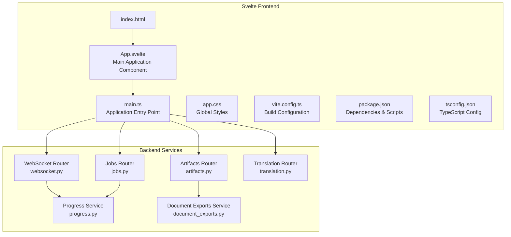
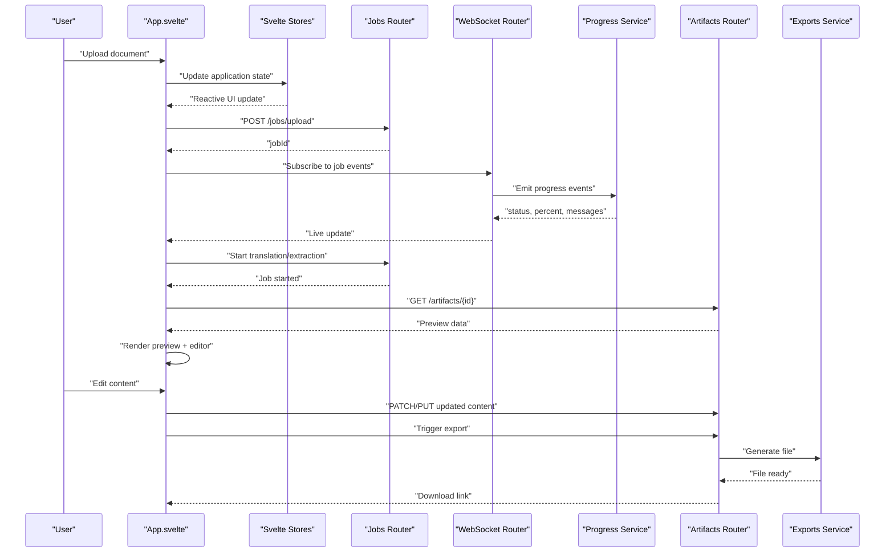
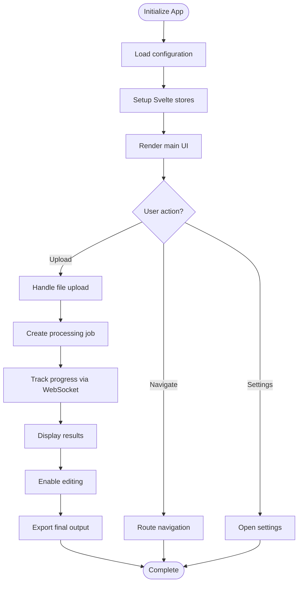
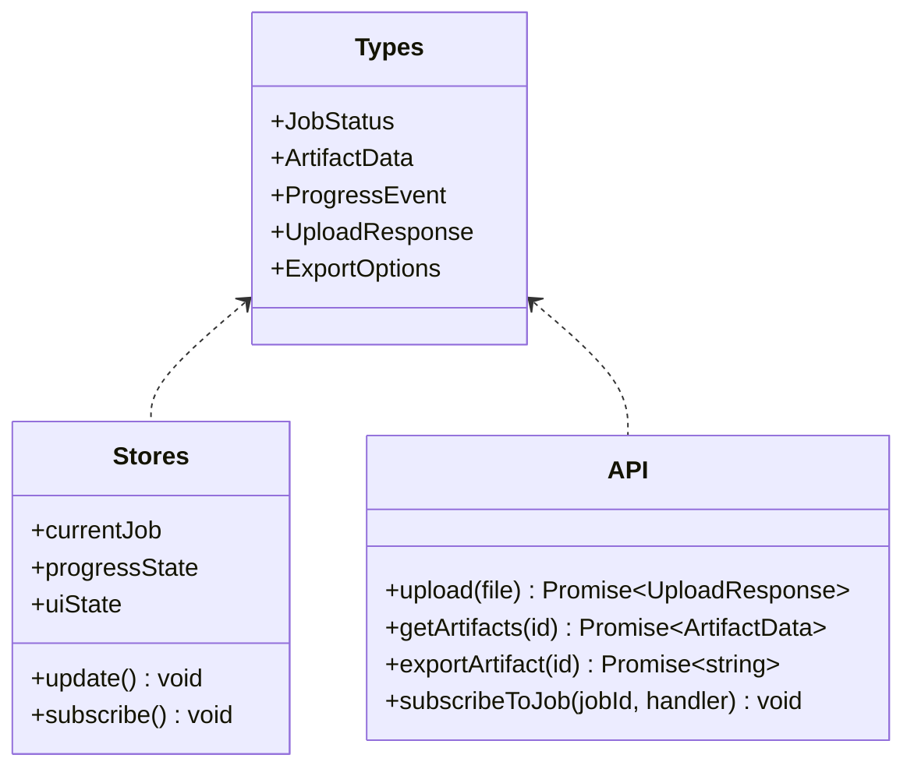
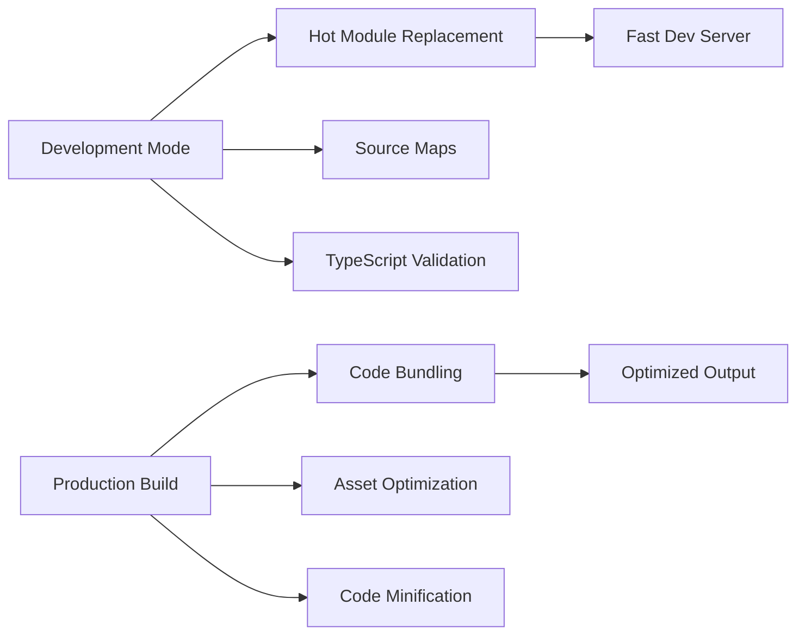
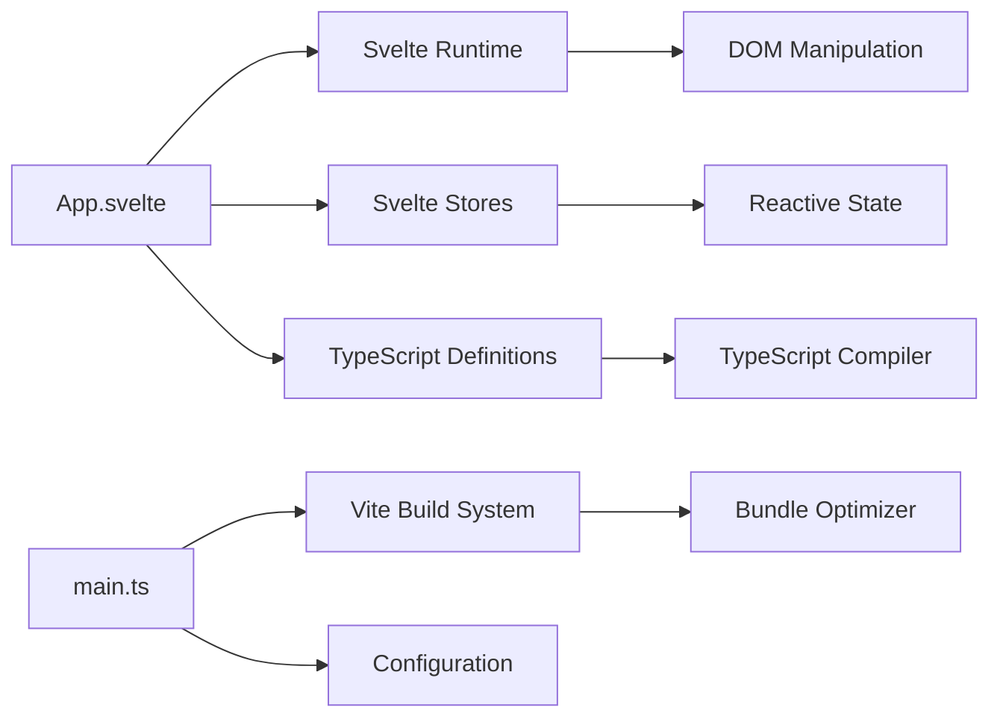

# Web Interface

<cite>
**Referenced Files in This Document**
- [App.svelte](file://frontend/src/App.svelte)
- [main.ts](file://frontend/src/main.ts)
- [vite.config.ts](file://frontend/vite.config.ts)
- [svelte.config.js](file://frontend/svelte.config.js)
- [package.json](file://frontend/package.json)
- [tsconfig.json](file://frontend/tsconfig.json)
- [index.html](file://frontend/index.html)
- [app.css](file://frontend/src/app.css)
- [websocket.py](file://src/omniscribe/api/routers/websocket.py)
- [jobs.py](file://src/omniscribe/api/routers/jobs.py)
- [artifacts.py](file://src/omniscribe/api/routers/artifacts.py)
- [translation.py](file://src/omniscribe/api/routers/translation.py)
- [progress.py](file://src/omniscribe/api/services/progress.py)
- [document_exports.py](file://src/omniscribe/api/services/document_exports.py)
</cite>

## Update Summary
**Changes Made**
- Complete migration from static HTML/CSS/JS to modern Svelte-based application architecture
- Added TypeScript support with comprehensive type safety
- Integrated Vite build system for enhanced development workflow
- Updated project structure to use Svelte components and modern frontend patterns
- Enhanced development experience with hot module replacement and optimized builds

## Table of Contents
1. [Introduction](#introduction)
2. [Project Structure](#project-structure)
3. [Core Components](#core-components)
4. [Architecture Overview](#architecture-overview)
5. [Detailed Component Analysis](#detailed-component-analysis)
6. [Dependency Analysis](#dependency-analysis)
7. [Performance Considerations](#performance-considerations)
8. [Troubleshooting Guide](#troubleshooting-guide)
9. [Conclusion](#conclusion)
10. [Appendices](#appendices)

## Introduction
This document describes the LocalDeepL web interface with a focus on user experience and frontend architecture. The interface has been completely migrated from static HTML/CSS/JS to a modern Svelte-based application with TypeScript support and Vite build system. It explains how users upload documents, track progress in real time, preview and edit results, and export outputs using the new component-based architecture.

## Project Structure
The web interface is now implemented as a modern Svelte application with TypeScript support. The frontend consists of:
- Svelte components for modular UI elements
- TypeScript configuration for type safety
- Vite build system for optimized development and production builds
- Modern package management with npm/yarn
- Backend routers and services that expose REST endpoints and WebSocket events consumed by the frontend

**Diagram sources**
- [index.html](file://frontend/index.html)
- [App.svelte](file://frontend/src/App.svelte)
- [main.ts](file://frontend/src/main.ts)
- [app.css](file://frontend/src/app.css)
- [vite.config.ts](file://frontend/vite.config.ts)
- [package.json](file://frontend/package.json)
- [tsconfig.json](file://frontend/tsconfig.json)
- [websocket.py](file://src/omniscribe/api/routers/websocket.py)
- [jobs.py](file://src/omniscribe/api/routers/jobs.py)
- [artifacts.py](file://src/omniscribe/api/routers/artifacts.py)
- [translation.py](file://src/omniscribe/api/routers/translation.py)
- [progress.py](file://src/omniscribe/api/services/progress.py)
- [document_exports.py](file://src/omniscribe/api/services/document_exports.py)

**Section sources**
- [index.html](file://frontend/index.html)
- [App.svelte](file://frontend/src/App.svelte)
- [main.ts](file://frontend/src/main.ts)
- [app.css](file://frontend/src/app.css)
- [vite.config.ts](file://frontend/vite.config.ts)
- [package.json](file://frontend/package.json)
- [tsconfig.json](file://frontend/tsconfig.json)

## Core Components
The new Svelte-based architecture provides a component-driven approach to building the user interface:
- **App.svelte**: Main application component that orchestrates the overall layout and state management
- **TypeScript Integration**: Full type safety for API responses, component props, and application state
- **Vite Build System**: Fast development server with hot module replacement and optimized production builds
- **Modern State Management**: Svelte stores for reactive state handling across components

Key responsibilities:
- **Component Composition**: Modular UI components that can be easily tested and reused
- **Type Safety**: Comprehensive TypeScript definitions for all API interactions and component interfaces
- **Reactive Updates**: Automatic UI updates when application state changes
- **Build Optimization**: Tree-shaking, code splitting, and asset optimization through Vite

**Section sources**
- [App.svelte](file://frontend/src/App.svelte)
- [main.ts](file://frontend/src/main.ts)
- [package.json](file://frontend/package.json)
- [tsconfig.json](file://frontend/tsconfig.json)

## Architecture Overview
The frontend follows a modern component-based architecture with clear separation between UI components, state management, and API integration. The backend exposes REST endpoints for jobs and artifacts, and a WebSocket channel for live progress updates.

**Diagram sources**
- [App.svelte](file://frontend/src/App.svelte)
- [main.ts](file://frontend/src/main.ts)
- [jobs.py](file://src/omniscribe/api/routers/jobs.py)
- [websocket.py](file://src/omniscribe/api/routers/websocket.py)
- [progress.py](file://src/omniscribe/api/services/progress.py)
- [artifacts.py](file://src/omniscribe/api/routers/artifacts.py)
- [document_exports.py](file://src/omniscribe/api/services/document_exports.py)

## Detailed Component Analysis

### Main Application Component (App.svelte)
Responsibilities:
- Orchestrate the main application layout and routing
- Manage global application state through Svelte stores
- Handle user interactions and coordinate between different features
- Provide context and shared state to child components
- Integrate with backend APIs for document processing workflows

**Diagram sources**
- [App.svelte](file://frontend/src/App.svelte)
- [main.ts](file://frontend/src/main.ts)

**Section sources**
- [App.svelte](file://frontend/src/App.svelte)
- [main.ts](file://frontend/src/main.ts)

### TypeScript Integration
Responsibilities:
- Define strict types for API responses and request payloads
- Provide type safety for component props and state management
- Enable better IDE support and error detection during development
- Ensure consistency between frontend and backend contracts

**Diagram sources**
- [tsconfig.json](file://frontend/tsconfig.json)
- [package.json](file://frontend/package.json)

**Section sources**
- [tsconfig.json](file://frontend/tsconfig.json)
- [package.json](file://frontend/package.json)

### Vite Build System
Responsibilities:
- Provide fast development server with hot module replacement
- Optimize production builds with tree-shaking and code splitting
- Handle asset bundling and caching strategies
- Support TypeScript compilation and validation
- Enable efficient debugging and development workflow

**Diagram sources**
- [vite.config.ts](file://frontend/vite.config.ts)
- [package.json](file://frontend/package.json)

**Section sources**
- [vite.config.ts](file://frontend/vite.config.ts)
- [package.json](file://frontend/package.json)

### Application Bootstrap
Responsibilities:
- Initialize Svelte application instance
- Configure global styles and theme providers
- Set up error boundaries and fallback handlers
- Establish WebSocket connections for real-time updates
- Load initial application state and configuration

**Section sources**
- [main.ts](file://frontend/src/main.ts)
- [index.html](file://frontend/index.html)

## Dependency Analysis
Frontend dependencies are organized using modern package management with clear separation between core framework, build tools, and runtime dependencies:
- **Core Framework**: Svelte for component-based UI development
- **Type Safety**: TypeScript for compile-time type checking
- **Build System**: Vite for fast development and optimized builds
- **Runtime Dependencies**: Minimal set of libraries for optimal performance

**Diagram sources**
- [App.svelte](file://frontend/src/App.svelte)
- [main.ts](file://frontend/src/main.ts)
- [package.json](file://frontend/package.json)
- [tsconfig.json](file://frontend/tsconfig.json)
- [vite.config.ts](file://frontend/vite.config.ts)

**Section sources**
- [package.json](file://frontend/package.json)
- [tsconfig.json](file://frontend/tsconfig.json)
- [vite.config.ts](file://frontend/vite.config.ts)

## Performance Considerations
- **Component Lazy Loading**: Use dynamic imports for large components to reduce initial bundle size
- **Reactive Updates**: Leverage Svelte's fine-grained reactivity for efficient DOM updates
- **Build Optimization**: Utilize Vite's tree-shaking and code splitting for optimal production bundles
- **Memory Management**: Proper cleanup of event listeners and WebSocket connections
- **Asset Optimization**: Efficient loading of images and other static assets with proper caching strategies

## Troubleshooting Guide
Common issues and resolutions:
- **Build failures**: Check TypeScript configuration and ensure all dependencies are properly installed
- **Runtime errors**: Verify WebSocket connection status and implement proper error handling
- **Performance issues**: Monitor bundle size and implement lazy loading for heavy components
- **Development server problems**: Clear cache and restart the development server if needed
- **TypeScript errors**: Ensure type definitions match the actual API response structures

**Section sources**
- [websocket.py](file://src/omniscribe/api/routers/websocket.py)
- [progress.py](file://src/omniscribe/api/services/progress.py)
- [artifacts.py](file://src/omniscribe/api/routers/artifacts.py)
- [document_exports.py](file://src/omniscribe/api/services/document_exports.py)

## Conclusion
The LocalDeepL web interface has been successfully migrated to a modern Svelte-based architecture with TypeScript support and Vite build system. This migration provides improved developer experience, better type safety, enhanced performance, and a more maintainable codebase. The component-based approach enables easier testing, reuse, and future extensibility while maintaining the same powerful functionality for document processing workflows.

## Appendices

### Development Workflow
- **Development Server**: Run `npm run dev` for hot-reloading development environment
- **Production Build**: Execute `npm run build` for optimized production bundles
- **Type Checking**: Use `npm run check` for TypeScript validation
- **Testing**: Implement unit tests using Svelte Testing Library
- **Deployment**: Deploy the generated static files from the `dist` directory

**Section sources**
- [package.json](file://frontend/package.json)
- [vite.config.ts](file://frontend/vite.config.ts)

### UI Customization and Theming
- **CSS Variables**: Define theme tokens in CSS custom properties for easy theming
- **Component Styling**: Use scoped styles within Svelte components for encapsulation
- **Responsive Design**: Implement mobile-first responsive layouts with CSS Grid and Flexbox
- **Accessibility**: Ensure proper ARIA attributes and keyboard navigation support

**Section sources**
- [app.css](file://frontend/src/app.css)
- [App.svelte](file://frontend/src/App.svelte)

### Extending the Interface
- **New Components**: Create reusable Svelte components following established patterns
- **API Integration**: Add new endpoints with proper TypeScript definitions
- **State Management**: Extend Svelte stores for complex application state
- **Build Configuration**: Customize Vite configuration for specific requirements

**Section sources**
- [App.svelte](file://frontend/src/App.svelte)
- [main.ts](file://frontend/src/main.ts)
- [vite.config.ts](file://frontend/vite.config.ts)
- [tsconfig.json](file://frontend/tsconfig.json)

### Accessibility Compliance
- **Semantic HTML**: Use proper semantic elements and ARIA attributes
- **Keyboard Navigation**: Ensure all interactive elements are accessible via keyboard
- **Screen Reader Support**: Provide meaningful labels and descriptions for dynamic content
- **Color Contrast**: Maintain WCAG compliance for color contrast ratios

**Section sources**
- [App.svelte](file://frontend/src/App.svelte)
- [app.css](file://frontend/src/app.css)

### Cross-Browser Compatibility
- **Browser Targets**: Configure appropriate browser targets in Vite configuration
- **Polyfills**: Include necessary polyfills for older browser support
- **Feature Detection**: Implement graceful degradation for unsupported features
- **Testing**: Test across target browsers and devices

**Section sources**
- [vite.config.ts](file://frontend/vite.config.ts)
- [tsconfig.json](file://frontend/tsconfig.json)