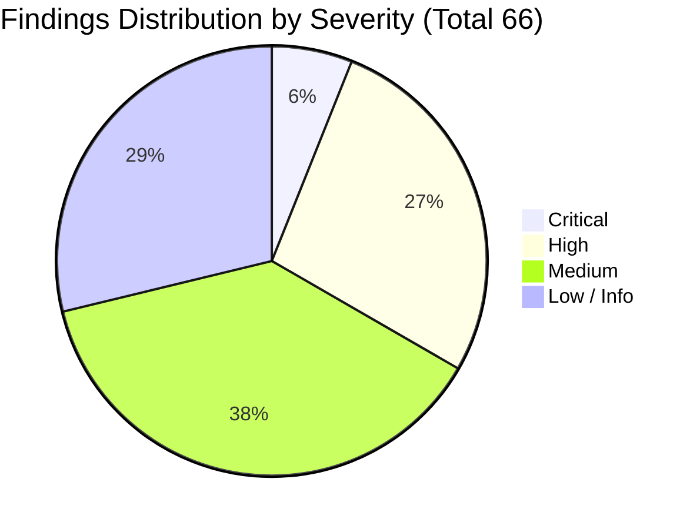

# OmniScribe Comprehensive 5-Domain Codebase Audit Report

**Audit Date**: August 18, 2026  
**Lead Architect & Orchestrator**: Antigravity Multi-Agent Orchestrator  
**Audit Domains**:
1. Core Pipeline & OCR Architecture (`core/`, `pipeline.py`, `config.py`, `evaluation.py`, `utils/`)
2. API, Security & Distributed State (`api/`, `server.py`, routers, services, middleware)
3. Frontend Architecture, Accessibility & UX (`frontend/src/`, Svelte 5, TypeScript, WCAG 2.1)
4. Testing & QA (`tests/`, CI workflows, pre-commit hooks, markers)
5. DevOps, Packaging & Environment Hardening (`Dockerfile`, `compose.yaml`, `.env*`, deployment scripts, packaging)

---

## 1. Executive Summary & Audit Scorecard

OmniScribe is a high-performance, multi-modal OCR and document intelligence platform designed to run locally or deployed at scale with Celery and Redis. The codebase exhibits sophisticated architectural foundations: strict domain boundaries between core OCR engines and the API surface, deterministic fallback mechanisms in recall boosters, a vectorized OCR trust layer, constant-time bearer authentication, and a modern Svelte 5 frontend with Tailwind CSS v4.

This comprehensive 5-domain audit identified **66 actionable findings** across the entire stack.

### Domain Scorecard & Finding Breakdown

| Domain | Scope | Critical | High | Medium | Low / Info | Domain Grade |
| :--- | :--- | :---: | :---: | :---: | :---: | :---: |
| **Domain 1: Core Pipeline** | OCR engines, DP aligner, recall passes, document processors, PDF rasterizer/embedder, OCR quality layer, translation tree | 0 | 3 | 4 | 3 | **A-** |
| **Domain 2: API & Security** | Auth middleware, SSRF guards, Redis/SQLite state backends, WebSockets, upload limits, rate limiting | 2 | 5 | 4 | 2 | **B+** |
| **Domain 3: Frontend & A11y** | Svelte 5 components, WCAG 2.1 AA/AAA compliance, runes reactivity, download lifecycle, API alignment | 1 | 5 | 7 | 4 | **B** |
| **Domain 4: Testing & QA** | Test coverage gaps, vacuous assertions, silent test skips, test tiers, CI workflows | 1 | 4 | 5 | 4 | **B+** |
| **Domain 5: DevOps & Config** | Container healthchecks, layer optimization, secret hygiene, release automation, extras packaging | 0 | 1 | 5 | 6 | **A-** |
| **Total Stack** | **Entire Codebase** | **4** | **18** | **25** | **19** | **B+** |

---

## 2. Cross-Domain Findings Matrix

---

## 3. Domain 1: Core Pipeline & OCR Architecture

### Architectural Status
- **Decoupling Verification**: 🟢 Clean. Zero imports of `fastapi`, `starlette`, or `omniscribe.api` inside `src/omniscribe/core/`.
- **Fail-Open Mechanics**: 🟢 Bounded per-page fallback in `text_recall.py` and `text_layer_recall.py`.
- **Circuit Breaker**: 🟢 3-state state machine guarding VLM API call sites.

### Finding Register

| ID | Severity | File & Location | Summary |
| :--- | :---: | :--- | :--- |
| **D1-01** | `HIGH` | [`src/omniscribe/core/processors/base.py:186-206`](file:///d:/OmniScribe/src/omniscribe/core/processors/base.py#L186-L206) | Strict aggregate count/text assertion fails when valid `MAY_DELETE` contract processors run. |
| **D1-02** | `HIGH` | [`src/omniscribe/core/docx_tree_writer.py:46-56, 117-132`](file:///d:/OmniScribe/src/omniscribe/core/docx_tree_writer.py#L46-L56) | `convert_tree_to_docx` raises `AttributeError: 'BlockNode' object has no attribute 'rows'` on `BlockNode(TABLE)` from `from_document_result` and duplicates rendered tables. |
| **D1-03** | `HIGH` | [`src/omniscribe/core/grounded/prompted.py:446-455`](file:///d:/OmniScribe/src/omniscribe/core/grounded/prompted.py#L446-L455) | Unmanaged background `asyncio.create_task` tasks leak and continue running on cancellation or `CircuitOpenError`. |
| **D1-04** | `MEDIUM` | [`src/omniscribe/core/translation_tree.py:110-141`](file:///d:/OmniScribe/src/omniscribe/core/translation_tree.py#L110-L141) | `translate_tree` bypasses all `TableNode` instances in `page.children`, leaving table cells untranslated. |
| **D1-05** | `MEDIUM` | [`src/omniscribe/core/translation.py:512-536`](file:///d:/OmniScribe/src/omniscribe/core/translation.py#L512-L536) | `_Chunker.add` delimiter overwrite scrambles formatting across multi-granularity (paragraph/line/word) chunk splits. |
| **D1-06** | `MEDIUM` | [`src/omniscribe/core/processors/table.py:75-125, 178-195`](file:///d:/OmniScribe/src/omniscribe/core/processors/table.py#L75-L125) | Dense enumeration in cell reconstruction shifts sparse columns and creates non-finite bounding boxes. |
| **D1-07** | `MEDIUM` | [`src/omniscribe/core/pdf/embedder.py:539-545`](file:///d:/OmniScribe/src/omniscribe/core/pdf/embedder.py#L539-L545) | `ThreadPoolExecutor` concurrently accesses shared PyMuPDF `fitz.Document` handle, risking data races. |
| **D1-08** | `LOW` | [`src/omniscribe/core/processors/reading_order.py:38`](file:///d:/OmniScribe/src/omniscribe/core/processors/reading_order.py#L38) | `ReadingOrderProcessor._sort_key` unpacks `block.bbox` without checking for `None`. |
| **D1-09** | `LOW` | [`src/omniscribe/core/trocr_engine.py:88`](file:///d:/OmniScribe/src/omniscribe/core/trocr_engine.py#L88), [`nllb_engine.py:109`](file:///d:/OmniScribe/src/omniscribe/core/nllb_engine.py#L109) | Deprecated `asyncio.get_event_loop()` usage instead of `asyncio.to_thread`. |
| **D1-10** | `LOW` | [`src/omniscribe/core/lexicon/lancedb_store.py:251, 481`](file:///d:/OmniScribe/src/omniscribe/core/lexicon/lancedb_store.py#L251) | Eager full-table `to_pandas()` load on every read query bypasses native vector search efficiency. |

---

## 4. Domain 2: API, Security & Distributed State

### Architectural Status
- **Authentication**: 🟢 Constant-time `secrets.compare_digest` in `BearerAuthMiddleware`.
- **SSRF Hardening**: 🟢 Strict IP literal validation and loopback/private range blocking in `_PinnedIPTransport`.
- **State Backends**: 🟡 SQLite / Redis implementations missing `text_artifact_id` in `JobHistory.record()`.

### Finding Register

| ID | Severity | File & Location | Summary |
| :--- | :---: | :--- | :--- |
| **D2-01** | `CRITICAL` | [`security_middleware.py:364-388`](file:///d:/OmniScribe/src/omniscribe/api/services/security_middleware.py#L364-L388) | Management route auth bypass: when `OMNISCRIBE_AUTH_TOKEN` is unset but subsystem tokens exist, `/api/config`, `/api/providers`, and `/api/jobs` are left completely unauthenticated. |
| **D2-02** | `CRITICAL` | [`jobs.py:105`](file:///d:/OmniScribe/src/omniscribe/api/services/jobs.py#L105), [`state_backend_sqlite.py:343`](file:///d:/OmniScribe/src/omniscribe/api/services/state_backend_sqlite.py#L343), [`state_backend_redis.py:204`](file:///d:/OmniScribe/src/omniscribe/api/services/state_backend_redis.py#L204), [`ocr.py:167`](file:///d:/OmniScribe/src/omniscribe/api/routers/ocr.py#L167) | `JobHistory.record()` signature mismatch: `SQLiteJobHistory` and `RedisJobHistory` omit `text_artifact_id`, crashing OCR pipeline completion when SQLite or Redis backend is enabled. |
| **D2-03** | `HIGH` | [`common.py:30-35`](file:///d:/OmniScribe/src/omniscribe/api/routers/common.py#L30-L35), [`artifacts.py:33`](file:///d:/OmniScribe/src/omniscribe/api/routers/artifacts.py#L33), [`jobs.py:85`](file:///d:/OmniScribe/src/omniscribe/api/routers/jobs.py#L85) | Secret token and artifact access token leakage in plaintext via URL query parameters (`?token=...`), violating RFC 6750. |
| **D2-04** | `HIGH` | [`security_middleware.py:737-750`](file:///d:/OmniScribe/src/omniscribe/api/services/security_middleware.py#L737-L750) | Inactive client IP entries are never pruned in `RateLimitMiddleware`; unbounded memory leak and O(N) dict scan on every request. |
| **D2-05** | `HIGH` | [`glossary_imports.py:162-190`](file:///d:/OmniScribe/src/omniscribe/api/routers/glossary_imports.py#L162-L190), [`sql_table.py:21-56`](file:///d:/OmniScribe/src/omniscribe/core/glossary_sources/sql_table.py#L21-L56) | Missing SSRF check on `sql_dsn` allows internal database port scanning and arbitrary local SQLite file reads. |
| **D2-06** | `HIGH` | [`http_fetch.py:49-185`](file:///d:/OmniScribe/src/omniscribe/api/services/http_fetch.py#L49-L185) | Hand-rolled HTTP parser in `_PinnedIPTransport` lacks chunked transfer decoding and gzip decompression, corrupting payloads. |
| **D2-07** | `HIGH` | [`tasks.py:68-82, 140-144, 203-209`](file:///d:/OmniScribe/src/omniscribe/api/tasks.py#L68-L82) | Celery background tasks fail under default in-memory backend and silently drop WebSocket progress frames across processes. |
| **D2-08** | `MEDIUM` | [`git_repo.py:44-58`](file:///d:/OmniScribe/src/omniscribe/core/glossary_sources/git_repo.py#L44-L58) | CLI option/flag injection via unvalidated `ref` in `parse_git_glossary` (`git archive`). |
| **D2-09** | `MEDIUM` | [`provider_manager.py:507-526`](file:///d:/OmniScribe/src/omniscribe/api/services/provider_manager.py#L507-L526) | Masked API key preview (`"sk-1...abcd"`) overwrites real provider API keys on update in `ProviderManager`. |
| **D2-10** | `MEDIUM` | [`state_backend_redis.py:43, 67-99, 162-188`](file:///d:/OmniScribe/src/omniscribe/api/services/state_backend_redis.py#L43) | `RedisTextArtifactStore` shares a single global `EXPIRATIONS_KEY` across all artifact stores, lacks max entries eviction, and returns hardcoded 0 for `len()`. |
| **D2-11** | `MEDIUM` | [`utils/security.py:32-46, 120-134`](file:///d:/OmniScribe/src/omniscribe/utils/security.py#L32-L46) | `ALLOW_SSRF_LOCAL=true` allows requests to AWS/Azure/GCP cloud instance metadata (`169.254.169.254`) and CGNAT (`100.64.0.0/10`). |
| **D2-12** | `LOW` | [`events.py:71-79`](file:///d:/OmniScribe/src/omniscribe/api/routers/events.py#L71-L79) | Unhandled `asyncio.QueueFull` exception thrown inside event loop threadsafe callback during bursty OCR block events. |
| **D2-13** | `LOW` | [`security.py:190-203`](file:///d:/OmniScribe/src/omniscribe/api/services/security.py#L190-L203) | `cleanup_files` skips unlinking temporary files when `OMNISCRIBE_ARTIFACT_DIR` is set to a custom path outside OS temp dir. |

---

## 5. Domain 3: Frontend Architecture, Accessibility & UX

### Architectural Status
- **Framework**: Svelte 5 Runes architecture (`$state`, `$derived`, `$effect`, `$props`).
- **Styling**: Tailwind CSS v4 design token enforcement, zero ad-hoc styling.
- **Security**: 🟢 Zero unescaped `{@html}` injection vulnerabilities; all markdown and text previews sanitized.

### Finding Register

| ID | Severity | File & Location | Summary |
| :--- | :---: | :--- | :--- |
| **D3-15** | `CRITICAL` | [`ExtractionView.svelte:55-76`](file:///d:/OmniScribe/frontend/src/lib/components/workstation/ExtractionView.svelte#L55-L76), [`src/omniscribe/api/services/ai.py:209`](file:///d:/OmniScribe/src/omniscribe/api/services/ai.py#L209) | Extraction view UI indicates bound document artifacts can be extracted without pasting text, but `/api/extract` does not accept artifact IDs and `handleExtract` does not load the text, resulting in empty/failed extractions. |
| **D3-01** | `HIGH` | [`SettingsView.svelte:162-177, 198, 283, 354, 400`](file:///d:/OmniScribe/frontend/src/lib/components/workstation/SettingsView.svelte#L162-L177) | Broken WAI-ARIA tabpanel pattern where tabs define `aria-controls` pointing to missing panel IDs and panels lack `role="tabpanel"` / `aria-labelledby`. |
| **D3-02** | `HIGH` | [`ExtractionView.svelte:167`](file:///d:/OmniScribe/frontend/src/lib/components/workstation/ExtractionView.svelte#L167), [`TranslationView.svelte:273`](file:///d:/OmniScribe/frontend/src/lib/components/workstation/TranslationView.svelte#L273), [`TranscriptionView.svelte:176, 189`](file:///d:/OmniScribe/frontend/src/lib/components/workstation/TranscriptionView.svelte#L176) | Unlabeled form textareas, file input, and audio player missing accessible names (`<label>` or `aria-label`). |
| **D3-08** | `HIGH` | [`TranscriptionView.svelte:98-125`](file:///d:/OmniScribe/frontend/src/lib/components/workstation/TranscriptionView.svelte#L98-L125), [`ExportModal.svelte:58-67`](file:///d:/OmniScribe/frontend/src/lib/components/workstation/ExportModal.svelte#L58-L67), [`ExtractionView.svelte:43-52`](file:///d:/OmniScribe/frontend/src/lib/components/workstation/ExtractionView.svelte#L43-L52) | Detached anchor `.click()` in Firefox/strict environments and synchronous `URL.revokeObjectURL` on the same microtask tick, leading to aborted 0-byte downloads. |
| **D3-11** | `HIGH` | [`pdfPreview.ts:117-120, 174-218`](file:///d:/OmniScribe/frontend/src/lib/utils/pdfPreview.ts#L117-L120), [`PdfMiniViewer.svelte:117-120, 150-154`](file:///d:/OmniScribe/frontend/src/lib/components/workstation/PdfMiniViewer.svelte#L117-L120) | `pdfDoc` reset without calling `pdfDoc?.destroy()` and missing `page.cleanup()`, leaking Web Workers and canvas context buffers across multi-document sessions. |
| **D3-16** | `HIGH` | [`TranslationView.svelte:70-120`](file:///d:/OmniScribe/frontend/src/lib/components/workstation/TranslationView.svelte#L70-L120), [`src/omniscribe/api/services/ai.py:130`](file:///d:/OmniScribe/src/omniscribe/api/services/ai.py#L130) | Synchronous translation (`/api/translate`) silently returns an empty translation `""` when invoked with a bound artifact and empty source text because the backend does not resolve text artifacts on the synchronous endpoint. |
| **D3-03** | `MEDIUM` | [`GlossaryView.svelte:209-236`](file:///d:/OmniScribe/frontend/src/lib/components/workstation/GlossaryView.svelte#L209-L236), [`JobHistoryView.svelte:169`](file:///d:/OmniScribe/frontend/src/lib/components/workstation/JobHistoryView.svelte#L169) | Repetitive table action buttons ("View entries", "Delete", "Cancel") lack item-specific contextual accessible names. |
| **D3-04** | `MEDIUM` | [`SettingsView.svelte:256-276`](file:///d:/OmniScribe/frontend/src/lib/components/workstation/SettingsView.svelte#L256-L276) | Document processor chips lack `aria-pressed` toggle state. |
| **D3-05** | `MEDIUM` | [`ExtractionView.svelte:211`](file:///d:/OmniScribe/frontend/src/lib/components/workstation/ExtractionView.svelte#L211), [`TranscriptionView.svelte:262`](file:///d:/OmniScribe/frontend/src/lib/components/workstation/TranscriptionView.svelte#L262) | Dynamic loading/processing state containers lack `role="status"` / `aria-live="polite"`. |
| **D3-09** | `MEDIUM` | [`ExportModal.svelte:78-123`](file:///d:/OmniScribe/frontend/src/lib/components/workstation/ExportModal.svelte#L78-L123), [`ExtractionView.svelte:107-123`](file:///d:/OmniScribe/frontend/src/lib/components/workstation/ExtractionView.svelte#L107-L123), [`TranscriptionView.svelte:104, 121`](file:///d:/OmniScribe/frontend/src/lib/components/workstation/TranscriptionView.svelte#L104) | Raw document filenames concatenated into download links without sanitizing path traversal or special characters. |
| **D3-12** | `MEDIUM` | [`ProcessSettings.svelte:126-170`](file:///d:/OmniScribe/frontend/src/lib/components/workstation/ProcessSettings.svelte#L126-L170), [`Toggle.svelte:20-53`](file:///d:/OmniScribe/frontend/src/lib/components/ui/Toggle.svelte#L20-L53) | Click event bubbling from `<label for>` + `<input>` triggers double-toggle race conditions. |
| **D3-13** | `MEDIUM` | [`WorkstationView.svelte:127-148`](file:///d:/OmniScribe/frontend/src/lib/components/workstation/WorkstationView.svelte#L127-L148), [`workstationService.ts:322-345`](file:///d:/OmniScribe/frontend/src/lib/services/workstationService.ts#L322-L345) | Missing `AbortSignal` propagation in workstation async OCR polling loop. |
| **D3-17** | `MEDIUM` | [`SettingsView.svelte:70-115`](file:///d:/OmniScribe/frontend/src/lib/components/workstation/SettingsView.svelte#L70-L115), [`src/omniscribe/api/routers/config.py:449`](file:///d:/OmniScribe/src/omniscribe/api/routers/config.py#L449) | In-memory default backend returns 503 on config persistence, causing uninformative "Save failed" toasts without indicating settings remain active in-memory. |
| **D3-06** | `LOW` | [`PageCanvas.svelte:153-169`](file:///d:/OmniScribe/frontend/src/lib/components/workstation/PageCanvas.svelte#L153-L169) | Recognized bounding box tooltips are hover-only and inaccessible via keyboard navigation. |
| **D3-07** | `LOW` | [`Toggle.svelte:48-52`](file:///d:/OmniScribe/frontend/src/lib/components/ui/Toggle.svelte#L48-L52) | `focus-visible:opacity-100` makes the native checkbox visibly render on top of the custom toggle track during keyboard navigation. |
| **D3-10** | `LOW` | [`endpoints.ts:117-119`](file:///d:/OmniScribe/frontend/src/lib/api/endpoints.ts#L117-L119) | Job artifact token passed in query parameter `/jobs/{jobId}/result?token=...` instead of header. |
| **D3-14** | `LOW` | [`GlossaryView.svelte:3, 104`](file:///d:/OmniScribe/frontend/src/lib/components/workstation/GlossaryView.svelte#L3) | Misplaced `SvelteURLSearchParams` rune inside one-shot async handler. |

---

## 6. Domain 4: Testing & QA

### Architectural Status
- **Test Suite Volume**: 142 test files, 2,014 passing unit tests.
- **Fast-Gate Coverage**: 🟢 Fast tier executes in ~2 minutes with zero network dependency.
- **Surya Model Isolation**: 🟢 Heavy model weights gated behind `@pytest.mark.slow`.

### Finding Register

| ID | Severity | File & Location | Summary |
| :--- | :---: | :--- | :--- |
| **D4-01** | `CRITICAL` | [`tests/test_pipeline_recall.py:147-160`](file:///d:/OmniScribe/tests/test_pipeline_recall.py#L147-L160), [`tests/test_integration.py:194-196, 219-221, 258-260`](file:///d:/OmniScribe/tests/test_integration.py#L194-L196) | `pytest.skip` invoked when 0 boxes are emitted or `DocumentResult` is `None`, silently passing total pipeline or Surya detection regressions. |
| **D4-02** | `HIGH` | [`tests/test_state_backend_redis.py`](file:///d:/OmniScribe/tests/test_state_backend_redis.py) | `RedisStateBackend` runtime connection outages/disconnect handling during `put`, `get`, `record`, and `list` operations are completely untested. |
| **D4-03** | `HIGH` | [`tests/test_pdf.py`](file:///d:/OmniScribe/tests/test_pdf.py), [`tests/test_workflows_hybrid.py`](file:///d:/OmniScribe/tests/test_workflows_hybrid.py) | Corrupt/truncated PDF and image streams that pass magic byte checks but fail during decoding/rendering in pipeline engines are untested. |
| **D4-11** | `HIGH` | [`.pre-commit-config.yaml:18`](file:///d:/OmniScribe/.pre-commit-config.yaml#L18), [`.github/workflows/test.yml:45`](file:///d:/OmniScribe/.github/workflows/test.yml#L45) | `mypy` type-checks only `src`, leaving all 140+ test files in `tests/` completely unchecked in pre-commit and CI. |
| **D4-12** | `HIGH` | [`.github/workflows/test.yml:119`](file:///d:/OmniScribe/.github/workflows/test.yml#L119) | Test workflow runs `pytest-cov` without `--cov-fail-under`, allowing silent regressions in code coverage. |
| **D4-04** | `MEDIUM` | [`tests/test_state_backend_sqlite.py`](file:///d:/OmniScribe/tests/test_state_backend_sqlite.py) | SQLite lock contention under concurrent multi-threaded worker access in `SQLiteStateBackend` is untested. |
| **D4-05** | `MEDIUM` | [`tests/test_live_llm.py:95-96`](file:///d:/OmniScribe/tests/test_live_llm.py#L95-L96) | Live VLM integration test asserts only `len(result.strip()) > 0` with no semantic verification or keyword assertions against the sample image. |
| **D4-06** | `MEDIUM` | [`tests/test_ocr_job_queue.py:213, 234`](file:///d:/OmniScribe/tests/test_ocr_job_queue.py#L213) | Fixed sleep timeout (`asyncio.sleep(0.55)` vs `0.5`) creates CI runner scheduling race conditions. |
| **D4-07** | `MEDIUM` | [`tests/test_separate_config.py:100-109`](file:///d:/OmniScribe/tests/test_separate_config.py#L100-L109) | `autouse=True` mock for `is_ssrf_target` globally disables SSRF security checks across all tests in that module. |
| **D4-13** | `MEDIUM` | [`.github/workflows/nightly.yml:25`](file:///d:/OmniScribe/.github/workflows/nightly.yml#L25) | Nightly slow and calibration regression tiers run strictly on `ubuntu-latest`, leaving Windows-specific PyMuPDF/Torch regressions untested. |
| **D4-14** | `MEDIUM` | [`.github/workflows/test.yml:85`](file:///d:/OmniScribe/.github/workflows/test.yml#L85) | Frontend lacks automated accessibility (`axe-core`/`vitest-axe`/Playwright a11y) regression checks in CI. |
| **D4-08** | `LOW` | [`tests/test_artifact_ttl_cleanup.py:75, 109`](file:///d:/OmniScribe/tests/test_artifact_ttl_cleanup.py#L75) | Background cleanup sweeper tests rely on arbitrary `asyncio.sleep(0.05)` rather than deterministic event synchronization. |
| **D4-09** | `LOW` | [`tests/test_scripts_smoke.py:40`](file:///d:/OmniScribe/tests/test_scripts_smoke.py#L40) | References deprecated `chromadb` optional extra for `scripts/ingest_lexicon.py` instead of the LanceDB-based store. |
| **D4-10** | `LOW` | [`tests/conftest.py`](file:///d:/OmniScribe/tests/conftest.py) | Optional extras (`trocr`, `nllb`, `glossary`, `quality`) lack explicit fast-gate mock suites and rely entirely on `pytest.importorskip`. |

---

## 7. Domain 5: DevOps, Packaging & Environment Hardening

### Architectural Status
- **Containerization**: Python 3.12/3.14 slim base, non-root user `app:app`, multi-stage builds.
- **Orchestration**: `compose.yaml` with Redis + Celery worker async profile.
- **Windows Integration**: 🟢 VBScript hidden launcher with CSPRNG password generation.

### Finding Register

| ID | Severity | File & Location | Summary |
| :--- | :---: | :--- | :--- |
| **D5-01** | `HIGH` | [`compose.yaml:101-124`](file:///d:/OmniScribe/compose.yaml#L101-L124), [`Dockerfile:103-104`](file:///d:/OmniScribe/Dockerfile#L103-L104) | Celery worker container inherits the Dockerfile's HTTP `/health` probe (testing port 8000), which systematically fails with `ConnectionRefusedError` and causes healthcheck restart loops under orchestrators. |
| **D5-02** | `MEDIUM` | [`Dockerfile:81-88`](file:///d:/OmniScribe/Dockerfile#L81-L88) | `RUN chown -R app:app /app` runs after copying `.venv`, creating a duplicate OverlayFS layer that inflates the runtime Docker image by 1.5–2.0 GB. Use `COPY --chown=app:app` instead. |
| **D5-03** | `MEDIUM` | [`compose.yaml:146`](file:///d:/OmniScribe/compose.yaml#L146), [`start_app.vbs:152, 160, 170`](file:///d:/OmniScribe/start_app.vbs#L152) | Passwords and connection strings are passed via CLI flags (`-a`, `--requirepass`, `set "REDIS_URL=..."`), exposing them in `docker inspect`, container logs, and process tables (`Win32_Process`). |
| **D5-04** | `MEDIUM` | [`.github/workflows/release.yml:101`](file:///d:/OmniScribe/.github/workflows/release.yml#L101) | The README version-pin update step uses an obsolete regex matching `local-deepl.git` instead of `OmniScribe.git`, causing release workflows to silently fail to update the install instructions. |
| **D5-05** | `MEDIUM` | [`install.sh:48`](file:///d:/OmniScribe/install.sh#L48) vs [`install.ps1:50-63`](file:///d:/OmniScribe/install.ps1#L50-L63) | `install.sh` pipes unverified curl output directly to `sh`, whereas `install.ps1` verifies the SHA-256 sidecar hash before execution. |
| **D5-06** | `MEDIUM` | [`Dockerfile:58, 62`](file:///d:/OmniScribe/Dockerfile#L58), [`install.ps1:95`](file:///d:/OmniScribe/install.ps1#L95), [`install.sh:65`](file:///d:/OmniScribe/install.sh#L65) | The LanceDB `lexicon` extra is omitted from the default sync commands, causing async translation to silently degrade to empty glossary RAG context. |
| **D5-07** | `LOW` | [`Makefile:10`](file:///d:/OmniScribe/Makefile#L10) | `make setup` invokes `npm install` rather than deterministic `npm ci`. |
| **D5-08** | `LOW` | [`start_app.vbs:81, 101-103`](file:///d:/OmniScribe/start_app.vbs#L81) | Modulo bias in PowerShell CSPRNG token generation (`256 % 62 = 8`) and unrestricted default NTFS permissions on `redis-password.txt`. |
| **D5-09** | `LOW` | [`compose.yaml:18-151`](file:///d:/OmniScribe/compose.yaml#L18-L151) | Missing `cap_drop: [ALL]`, `no-new-privileges: true`, and read-only rootfs configurations. |
| **D5-10** | `LOW` | [`compose.yaml:152-155`](file:///d:/OmniScribe/compose.yaml#L152-L155), [`.dockerignore`](file:///d:/OmniScribe/.dockerignore), [`.gitignore`](file:///d:/OmniScribe/.gitignore) | Missing persistent volume definitions for SQLite state / LanceDB and missing `.gitignore` / `.dockerignore` rules for `*.sqlite`, `*.db`, and `lancedb/`. |
| **D5-11** | `LOW` | [`.env.example:189-193`](file:///d:/OmniScribe/.env.example#L189-L193), [`pyproject.toml:51`](file:///d:/OmniScribe/pyproject.toml#L51) | Stale ChromaDB references in `.env.example` and obsolete numpy comment in `pyproject.toml`. |
| **D5-12** | `INFO` | [`.gitattributes:21-34`](file:///d:/OmniScribe/.gitattributes#L21-L34) | Missing explicit `*.sh text eol=lf` and `Makefile text eol=lf` rules. |

---

## 8. Prioritized Remediation Action Plan

### Phase 0: Immediate Blocker Fixes (P0)
1. **[D2-02] State Backend Parity Fix**: Add `text_artifact_id: str | None = None` keyword argument to `record()` across `SQLiteJobHistory` and `RedisJobHistory`.
2. **[D2-01] Subsystem Auth Hardening**: Update `BearerAuthMiddleware` dispatch logic to ensure `/api/config`, `/api/providers`, and `/api/jobs` require authentication whenever any subsystem token (`OMNISCRIBE_OCR_AUTH_TOKEN` / `OMNISCRIBE_TRANSLATION_AUTH_TOKEN`) is configured.
3. **[D3-15] Extraction Contract Alignment**: Update `ExtractionView.svelte` to load text from the artifact before sending, or update `POST /api/extract` to resolve bound `text_artifact_id`.
4. **[D4-01] Eliminate Silent Test Skips**: Replace `pytest.skip` calls on empty pipeline outputs with strict assertions in `test_pipeline_recall.py` and `test_integration.py`.
5. **[D5-01] Celery Healthcheck Override**: Add `healthcheck: test: ["CMD", "celery", "-A", "omniscribe.api.celery_app", "inspect", "ping"]` to the `worker` service in `compose.yaml`.

### Phase 1: High-Priority Reliability & Security (P1)
1. **[D1-01] Processor Strict Pipeline Fix**: Update `run_document_processors` aggregate assertion to honor `MAY_DELETE` / `MUTATE_TEXT` contracts.
2. **[D1-02] DOCX Tree Writer Fix**: Fix `convert_tree_to_docx` to correctly handle `BlockNode(TABLE)` instances.
3. **[D2-03] Remove Query-Param Tokens**: Deprecate query-param token extraction in `/api/artifacts/*` and enforce standard `Authorization: Bearer` headers.
4. **[D2-04] Bounded Rate Limiting**: Cap `RateLimitMiddleware` IP tracking table to 10,000 entries with LRU/windowed eviction.
5. **[D2-05] SSRF Validation on SQL DSN**: Add hostname resolution and private IP checks to `sql_table.py`.
6. **[D3-01 & D3-02] Accessibility Compliance**: Fix WAI-ARIA tabpanel hierarchy in `SettingsView.svelte` and add explicit `<label>`/`aria-label` to all inputs in `ExtractionView`, `TranslationView`, and `TranscriptionView`.
7. **[D3-08] Robust File Download**: Ensure blob download anchors are attached to `document.body` and delay `URL.revokeObjectURL` via `setTimeout(..., 1000)`.
8. **[D3-11] PDF.js Resource Cleanup**: Call `pdfDoc.destroy()` and `page.cleanup()` in `pdfPreview.ts` to prevent worker memory leaks.
9. **[D4-11 & D4-12] CI QA Gates**: Add `tests/` to mypy typechecking and enforce `--cov-fail-under` in `test.yml`.
10. **[D5-02] Docker Image Optimization**: Replace `RUN chown` with `COPY --chown=app:app` in `Dockerfile` to save 1.5–2.0 GB.

### Phase 2: Medium/Low Polish & Maintainability (P2)
1. **[D1-04] Translate Tree Table Node Support**: Traverse `TableNode.rows.cells` in `translate_tree`.
2. **[D1-05] Translation Chunker Delimiter Preservation**: Fix delimiter preservation in `_Chunker.add`.
3. **[D2-08] Git Archive Flag Injection Guard**: Sanitize `ref` arguments in `git_repo.py`.
4. **[D2-09] Masked API Key Protection**: Prevent masked preview strings (`sk-...`) from overwriting real secrets in `ProviderManager`.
5. **[D4-14] Frontend A11y Specs**: Add `@axe-core/playwright` or `vitest-axe` tests to CI pipeline.
6. **[D5-06] Default Lexicon Sync**: Include `lexicon` in default `uv sync` commands in `Dockerfile`, `install.ps1`, and `install.sh`.
